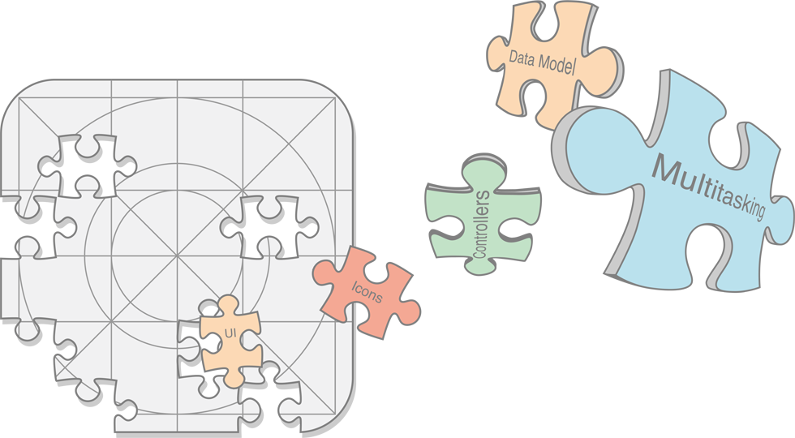

App Programming Guide for iOS (0) ---- About iOS App Architecture

原文链接：[https://developer.apple.com/library/archive/documentation/iPhone/Conceptual/iPhoneOSProgrammingGuide/Introduction/Introduction.html#//apple_ref/doc/uid/TP40007072-CH1-SW1](https://developer.apple.com/library/archive/documentation/iPhone/Conceptual/iPhoneOSProgrammingGuide/Introduction/Introduction.html#//apple_ref/doc/uid/TP40007072-CH1-SW1)

#0 About iOS App Architecture - 关于iOS APP结构

Apps need to work with the iOS to ensure that they deliver a great user experience. Beyond just a good design for your app’s design and user interface, a great user experience encompasses many other factors. Users expect iOS apps to be fast and responsive while expecting the app to use as little power as possible. Apps need to support all of the latest iOS devices while still appearing as if the app was tailored for the current device. Implementing all of these behaviors can seem daunting at first but iOS provides the help you need to make it happen.

App 需要与 iOS 一起工作，以确保它们可以提供丰富的用户体验。除了为你的 APP 视觉和用户界面做一个好的设计之外，一个杰出的用户体验还包含了许多其他因素。用户期望 iOS 应用都能快速响应，并且尽可能少的使用电量。App 需要支持所有最新的 iOS 设备，就仿佛它就是为当前设备量身定做的。实现所有这些行为似乎是令人怯步的，但 iOS 会帮助你把它变成现实。

This document highlights the core behaviors that make your app work well on iOS. You might not implement every feature described in this document but you should consider these features for every project you create.

本文强调了让你的 APP 在 iOS 上工作良好的核心行为。你可能无法实现本文描述的每一个功能，但是你应该为你创建的每个工程考虑这些特性。

>**Note:** Development of iOS apps requires an Intel-based Macintosh computer with the iOS SDK installed. For information about how to get the iOS SDK, go to the [iOS Dev Center](https://developer.apple.com/devcenter/ios/).
>
>**注意：** iOS 应用的开发需要一台安装了 iOS SDK 的基于 Intel 的 Macintosh 计算机。关于如何获得 iOS SDK 的信息，请移步 [iOS Dev Center](https://developer.apple.com/devcenter/ios/)。

##0.1 At a Glance - 概述

When you are ready to take your ideas and turn them into an app, you need to understand the interactions that occur between the system and your app.

当你准备把你的想法变成一个 APP 时，你需要了解发生在系统和你的 APP 之间的交互。

###0.1.1 Apps Are Expected to Support Key Features - App应该支持关键功能

The system expects every app to have some specific resources and configuration data, such as an app icon and information about the capabilities of the app. Xcode provides some information with every new project but you must supply resource files and you must make sure the information in your project is correct before submitting your app.

系统期望每个App有一些特别的资源和配置数据，例如app icon和关于该应用能力的信息。Xcode已经给每个新工程提供了一些信息，但是你必须提供资源文件，并且必须在提交App之前确保你工程中的信息是正确的。

>**Relevant Chapter:**  [Expected App Behaviors](https://developer.apple.com/library/content/documentation/iPhone/Conceptual/iPhoneOSProgrammingGuide/ExpectedAppBehaviors/ExpectedAppBehaviors.html#//apple_ref/doc/uid/TP40007072-CH3-SW2)

###0.1.2 Apps Follow Well-Defined Execution Paths - App 遵循已定义好的执行路径

From the time the user launches an app to the time it quits, apps follow a well-defined execution path. During the life of an app, it can transition between foreground and background execution, it can be terminated and relaunched, and it can go to sleep temporarily. Each time it transitions to a new state, the expectations for the app change. A foreground app can do almost anything but background apps must do as little as possible. You use the state transitions to adjust your app’s behaviors accordingly.

从用户启动app到退出，app会按着妥善定义的执行路径走。在app的生命中，它可以在前台和后台执行之间转换，它可以终止并重启动，它也可以暂时进入休眠。每当它转换到一个新的状态，对app的预期就会改变。前台app可以做几乎所有事情，但是后台app必须做尽可能少的事情。你可以使用状态转换相应的调整app的行为。

>**Relevant Chapter:** [The App Life Cycle](https://developer.apple.com/library/content/documentation/iPhone/Conceptual/iPhoneOSProgrammingGuide/TheAppLifeCycle/TheAppLifeCycle.html#//apple_ref/doc/uid/TP40007072-CH2-SW1), [Strategies for Handling App State Transitions](https://developer.apple.com/library/content/documentation/iPhone/Conceptual/iPhoneOSProgrammingGuide/StrategiesforHandlingAppStateTransitions/StrategiesforHandlingAppStateTransitions.html#//apple_ref/doc/uid/TP40007072-CH8-SW1)

###0.1.3 Apps Must Run Efficiently in a Multitasking Environment - App必须高效地运行在多任务环境中

Battery life is important for users, as is performance, responsiveness, and a great user experience. Minimizing your app’s usage of the battery ensures that the user can run your app all day without having to recharge the device, but launching and being ready to run quickly are also important. The iOS multitasking implementation offers good battery life without sacrificing the responsiveness and user experience that users expect, but the implementation requires apps to adopt system-provided behaviors.

电池寿命对用户非常重要，跟性能、响应速度和良好的用户体验一样重要。最小化你的app的电池使用，确保用户可以一整天都在运行你的app而不会不得不换个设备，同时快速的启动和准备运行也是非常重要的。iOS多任务实现提供了良好的电池寿命，而不需要降低用户期望的响应速度和用户体验，但这些实现需要app采用系统提供的行为。

>**Relevant Chapters:** [Background Execution](https://developer.apple.com/library/content/documentation/iPhone/Conceptual/iPhoneOSProgrammingGuide/BackgroundExecution/BackgroundExecution.html#//apple_ref/doc/uid/TP40007072-CH4-SW1), [Strategies for Handling App State Transitions](https://developer.apple.com/library/content/documentation/iPhone/Conceptual/iPhoneOSProgrammingGuide/StrategiesforHandlingAppStateTransitions/StrategiesforHandlingAppStateTransitions.html#//apple_ref/doc/uid/TP40007072-CH8-SW1)

###0.1.4 Communication Between Apps Follows Specific Pathways - App之间通过特殊的渠道通信

For security, iOS apps run in a sandbox and have limited interactions with other apps. When you want to communicate with other apps on the system, there are specific ways to do so.

在安全方面，iOS app在沙盒中运行，并且只能有限的于其他app交互。当你想要与系统中其他app通信，只有通过一些特殊的方法才能实现。

>**Relevant Chapter:** [Inter-App Communication](https://developer.apple.com/library/content/documentation/iPhone/Conceptual/iPhoneOSProgrammingGuide/Inter-AppCommunication/Inter-AppCommunication.html#//apple_ref/doc/uid/TP40007072-CH6-SW2)

###0.1.5 Performance Tuning is Important for Apps - 性能调优对App非常重要

Every task performed by an app has a power cost associated with it. Apps that drain the user’s battery create a negative user experience and are more likely to be deleted than those that appear to run for days on a single charge. So be aware of the cost of different operations and take advantage of power-saving measures offered by the system.

App执行的每个人物都有相应的能量消耗。耗尽用户电池的app给用户带来不好的体验，并且比那些一次充电就可以跑几天的app更可能被删除。因此，请注意不同操作的消耗，并利用系统提供的省电模式。

>**Relevant Chapter:** [Performance Tips](https://developer.apple.com/library/content/documentation/iPhone/Conceptual/iPhoneOSProgrammingGuide/PerformanceTips/PerformanceTips.html#//apple_ref/doc/uid/TP40007072-CH7-SW1)

##0.2 How to Use This Document - 如何使用本文

This document is not a beginner’s guide to creating iOS apps. It is for developers who are ready to polish their app before putting it in the App Store. Use this document as a guide to understanding how your app interacts with the system and what it must do to make those interactions happen smoothly.

本文并不是创建 iOS APP 的新手指南。这是为那些已经准备好发布 APP 的人在提交到 App Store 之前使用的。使用本文来理解你的 APP 如何与系统交互，以及如何使这些交互顺利进行。

##0.3 Prerequisites - 先决条件

This document provides detailed information about iOS app architecture and shows you how to implement many app-level features. This book assumes that you have already installed the iOS SDK, configured your development environment, and understand the basics of creating and implementing an app in Xcode.

本文提供了关于 iOS 应用程序架构的详细信息，并向你展示了如何实现许多应用级的功能。本书假定你已经安装了 iOS SDK，配置好了开发环境，并懂得在 Xcode 中创建和实现一个 APP 的基础。

If you are new to iOS app development, read [Start Developing iOS Apps (Swift)](https://developer.apple.com/library/archive/referencelibrary/GettingStarted/DevelopiOSAppsSwift/index.html#//apple_ref/doc/uid/TP40015214). That document offers a step-by-step introduction to the development process to help you get up to speed quickly. It also includes a hands-on tutorial that walks you through the app-creation process from start to finish, showing you how to create a simple app and get it running quickly.

如果你是 iOS 应用开发新手，请阅读 [Start Developing iOS Apps (Swift)](https://developer.apple.com/library/archive/referencelibrary/GettingStarted/DevelopiOSAppsSwift/index.html#//apple_ref/doc/uid/TP40015214)。该文章一步一步的提供了开发过程的介绍，帮助你快速的成长。它还包括一个动手教程，让你从开始到完成完整的经历 APP 创建的过程，向你展示如何创建一个简单的 APP 并快速让其运行起来。

##0.4 See Also - 其他参考

If you are learning about iOS, read _iOS Technology Overview_ to learn about the technologies and features you can incorporate into your iOS apps.

如果你正在学习 iOS，阅读  _iOS Technology Overview_ 学习你
可以合并到你的 iOS APP 中的技术和功能。