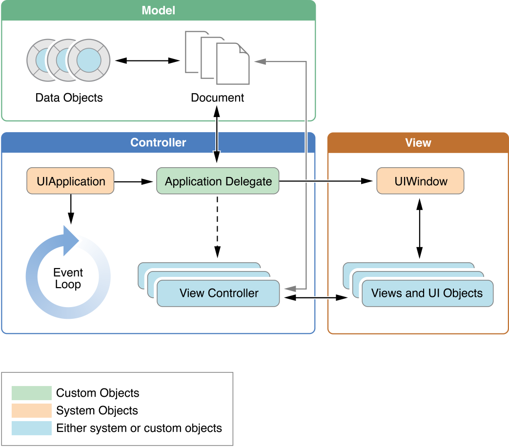

App Programming Guide for iOS (2) ---- The App Life Cycle

原文链接：[https://developer.apple.com/library/archive/documentation/iPhone/Conceptual/iPhoneOSProgrammingGuide/TheAppLifeCycle/TheAppLifeCycle.html#//apple_ref/doc/uid/TP40007072-CH2-SW1](https://developer.apple.com/library/archive/documentation/iPhone/Conceptual/iPhoneOSProgrammingGuide/TheAppLifeCycle/TheAppLifeCycle.html#//apple_ref/doc/uid/TP40007072-CH2-SW1)

#2 The App Life Cycle App的生命周期

Apps are a sophisticated interplay between your custom code and the system frameworks. The system frameworks provide the basic infrastructure that all apps need to run, and you provide the code required to customize that infrastructure and give the app the look and feel you want. To do that effectively, it helps to understand a little bit about the iOS infrastructure and how it works.

应用程序是自定义代码和系统框架之间复杂的相互作用。系统框架提供了所有 APP 需要运行的基本基础设施，而你提供定制基础结构所需的代码，并向 APP 提供所需的外观和感觉。对 iOS 基础结构及其如何工作有一点了解，有助于有效的做到这一点。

iOS frameworks rely on design patterns such as model-view-controller and delegation in their implementation. Understanding those design patterns is crucial to the successful creation of an app. It also helps to be familiar with the Objective-C language and its features. If you are new to iOS programming, read [Start Developing iOS Apps (Swift)](https://developer.apple.com/library/content/referencelibrary/GettingStarted/DevelopiOSAppsSwift/index.html#//apple_ref/doc/uid/TP40015214) for an introduction to iOS apps and the Objective-C language.

iOS 框架依赖于如 模型-视图-控制器 和 它们实现中的代理 等设计模式。理解那些设计模式对 APP 的成功创建非常重要。熟悉 Objective-C 语言及其特性也是有帮助的。如果你是 iOS 编程新手，阅读 [Start Developing iOS Apps (Swift)](https://developer.apple.com/library/content/referencelibrary/GettingStarted/DevelopiOSAppsSwift/index.html#//apple_ref/doc/uid/TP40015214) 中有关 iOS APP 和 Objective-C 语言的介绍。

##2.1 The Main Function - Main函数

The entry point for every C-based app is the *main* function and iOS apps are no different. What is different is that for iOS apps you do not write the *main* function yourself. Instead, Xcode creates this function as part of your basic project. Listing 2-1 shows an example of this function. With few exceptions, you should never change the implementation of the *main* function that Xcode provides.

每个基于 C 的app的入口都是 *main* 函数，iOS app也不例外。对 iOS app 来说不同之处仅在于你不要自己写 *main* 函数。相应的，Xcode 将其作为基础工程的一部分创建了这个函数。表 2-1 展示了这个函数的例子。无一例外的，你永远不能修改Xcode提供的 *main* 函数的实现。

**Listing 2-1**  The *main* function of an iOS app

	#import <UIKit/UIKit.h>
	#import "AppDelegate.h"
	 
	int main(int argc, char * argv[])
	{
	    @autoreleasepool {
	        return UIApplicationMain(argc, argv, nil, NSStringFromClass([AppDelegate class]));
	    }
	}

The only thing to mention about the *main* function is that its job is to hand control off to the UIKit framework. The [UIApplicationMain](https://developer.apple.com/reference/uikit/1622933-uiapplicationmain) function handles this process by creating the core objects of your app, loading your app’s user interface from the available storyboard files, calling your custom code so that you have a chance to do some initial setup, and putting the app’s run loop in motion. The only pieces that you have to provide are the storyboard files and the custom initialization code.

关于 *main* 函数唯一值得一提的是，它的工作就是单方面控制 UIKit 框架。[UIApplicationMain](https://developer.apple.com/reference/uikit/1622933-uiapplicationmain) 函数控制了这个过程，通过创建 app 的核心对象、从可用的 *storyboard* 文件加载用户界面、调用你的自定义代码（这让你有机会在初次安装时完成一些工作），以及设置 app 运行中的 run loop。你唯一必须提供的内容只是 *storyboard* 文件和自定义的初始化代码。

##2.2 The Structure of an App - App的结构

During startup, the [UIApplicationMain](https://developer.apple.com/reference/uikit/1622933-uiapplicationmain) function sets up several key objects and starts the app running. At the heart of every iOS app is the [UIApplication](https://developer.apple.com/reference/uikit/uiapplication) object, whose job is to facilitate the interactions between the system and other objects in the app. Figure 2-1 shows the objects commonly found in most apps, while Table 2-1 lists the roles each of those objects plays. The first thing to notice is that iOS apps use a model-view-controller architecture. This pattern separates the app’s data and business logic from the visual presentation of that data. This architecture is crucial to creating apps that can run on different devices with different screen sizes.

在启动过程中，[UIApplicationMain](https://developer.apple.com/reference/uikit/1622933-uiapplicationmain) 函数设置了若干关键对象，并让 app 开始运行。在每个 iOS app 的核心位置是 [UIApplication](https://developer.apple.com/reference/uikit/uiapplication) 对象，它的工作是帮助系统与 app 中的其他对象的交互。图 2-1 展示了大部分 app 中一般可以找到的对象，而表 2-1 列出了每个对象扮演的角色。要注意的第一件事是 iOS app 使用 MVC 架构。这个模式将 app 数据和业务逻辑与数据的可视化展示分离开来了。这个架构对于创建可以运行在不同屏幕大小的不同设备上的 app 至关重要。

**Figure 2-1**  Key objects in an iOS app - iOS app 中的关键对象 

**Table 2-1**  The role of objects in an iOS app - iOS app 中的对象的角色

| **Object**                               | **Description**                          |
| ---------------------------------------- | ---------------------------------------- |
| [UIApplication](https://developer.apple.com/reference/uikit/uiapplication) object   `UIApplication` 对象 | The `UIApplication` object manages the event loop and other high-level app behaviors. It also reports key app transitions and some special events (such as incoming push notifications) to its delegate, which is a custom object you define. Use the `UIApplication` object as is—that is, without subclassing.    `UIApplication` 对象管理了事件循环和其他高级 app 行为。它也会报告 app 关键变化和一些特殊事件（例如收到推送通知）到其代理，代理是你自定义的对象。使用 `UIApplication` 对象不能子类化，它本身也没有子类。 |
| App delegate object   APP 代理对象                    | The app delegate is the heart of your custom code. This object works in tandem with the `UIApplication` object to handle app initialization, state transitions, and many high-level app events. This object is also the only one guaranteed to be present in every app, so it is often used to set up the app’s initial data structures.   App代理是你的自定义代码的心脏。这个对象随着 `UIApplication` 对象一起工作，控制 app 的初始化、状态变化以及许多高级 app 事件。这个对象也是唯一一个在每个 app 中都一定有的对象，因此它通常用于建立 app 的初始化数据结构。 |
| Documents and data model objects   文档和数据模型对象        | Data model objects store your app’s content and are specific to your app. For example, a banking app might store a database containing financial transactions, whereas a painting app might store an image object or even the sequence of drawing commands that led to the creation of that image. (In the latter case, an image object is still a data object because it is just a container for the image data.)   Apps can also use document objects (custom subclasses of [UIDocument](https://developer.apple.com/reference/uikit/uidocument)) to manage some or all of their data model objects. Document objects are not required but offer a convenient way to group data that belongs in a single file or file package. For more information about documents, see [Document-Based App Programming Guide for iOS](https://developer.apple.com/library/content/documentation/DataManagement/Conceptual/DocumentBasedAppPGiOS/Introduction/Introduction.html#//apple_ref/doc/uid/TP40011149).   数据模型对象储存了 app 的内容，它对每个 app 都是特别的。例如，一款银行类 app 可能储存一个包含金融交易的数据库，然而一个绘画 app 可能储存一个图像对象或者甚至是一串可以创建这个图像的绘图命令。（在后一种情况中，图像对象仍然是一个数据对象，因为它只是图像数据的容器。）  App 也可以使用文档对象（[UIDocument](https://developer.apple.com/reference/uikit/uidocument) 的自定义子类）管理某些或者所有数据模型对象。文档对象不是必须的，但提供了一个方便的途径将所属的数据分组到一个文件或文件夹中。关于文档的更多信息参见 [Document-Based App Programming Guide for iOS](https://developer.apple.com/library/content/documentation/DataManagement/Conceptual/DocumentBasedAppPGiOS/Introduction/Introduction.html#//apple_ref/doc/uid/TP40011149)。 |
| View controller objects   视图控制器对象                 | View controller objects manage the presentation of your app’s content on screen. A view controller manages a single view and its collection of subviews. When presented, the view controller makes its views visible by installing them in the app’s window.   The [UIViewController](https://developer.apple.com/reference/uikit/uiviewcontroller) class is the base class for all view controller objects. It provides default functionality for loading views, presenting them, rotating them in response to device rotations, and several other standard system behaviors. UIKit and other frameworks define additional view controller classes to implement standard system interfaces such as the image picker, tab bar interface, and navigation interface.   For detailed information about how to use view controllers, see [View Controller Programming Guide for iOS](https://developer.apple.com/library/content/featuredarticles/ViewControllerPGforiPhoneOS/index.html#//apple_ref/doc/uid/TP40007457).    视图控制器对象管理了 app 内容在屏幕上的展示。每个视图控制器管理了一个视图及其子视图集合。当展示时，视图控制器通过将它的视图安装到app的窗口让视图可见。   [UIViewController](https://developer.apple.com/reference/uikit/uiviewcontroller)类是所有视图控制器对象的基类。它提供一些默认功能，加载视图、展示视图、设备旋转时相应的旋转视图，以及若干其他标准系统行为。UIKit和其他框架定义了额外的视图控制起类已实现标准系统接口，如图像选择器、tab bar接口和导航接口。   关于如何使用视图控制器的详细信息，参见[View Controller Programming Guide for iOS](https://developer.apple.com/library/content/featuredarticles/ViewControllerPGforiPhoneOS/index.html#//apple_ref/doc/uid/TP40007457)。 |
| [UIWindow](https://developer.apple.com/reference/uikit/uiwindow) object    `UIWindow` 对象 | A [UIWindow](https://developer.apple.com/reference/uikit/uiwindow) object coordinates the presentation of one or more views on a screen. Most apps have only one window, which presents content on the main screen, but apps may have an additional window for content displayed on an external display.   To change the content of your app, you use a view controller to change the views displayed in the corresponding window. You never replace the window itself.   In addition to hosting views, windows work with the UIApplication object to deliver events to your views and view controllers.    [UIWindow](https://developer.apple.com/reference/uikit/uiwindow) 对象将屏幕上的一个或多个视图的展示坐标化。大部分app只有一个窗口，展示了主屏幕的内容，而 app 可能有额外的窗口，显示在外置显示器上的内容。   要改变 app 的内容，你需要使用视图控制器改变显示在相应窗口里的视图。你永远不能替换掉窗口自身。   除了主视图，窗口也与IUApplication对象一起工作发送消息到视图和视图控制器。 |
| View objects, control objects, and layer objects   视图对象、控件对象和图层对象 | Views and controls provide the visual representation of your app’s content. A view is an object that draws content in a designated rectangular area and responds to events within that area. Controls are a specialized type of view responsible for implementing familiar interface objects such as buttons, text fields, and toggle switches.   The UIKit framework provides standard views for presenting many different types of content. You can also define your own custom views by subclassing [UIView](https://developer.apple.com/reference/uikit/uiview) (or its descendants) directly.   In addition to incorporating views and controls, apps can also incorporate Core Animation layers into their view and control hierarchies. Layer objects are actually data objects that represent visual content. Views use layer objects intensively behind the scenes to render their content. You can also add custom layer objects to your interface to implement complex animations and other types of sophisticated visual effects.   视图和控制提供 app 内容的可视化展示。视图是一个在指定举行区域内绘制内容并响应这个区域内的事件的对象。控件是特种的视图，负责实现常用的界面对象，如按钮、输入框和开关等。  UIKit框架提供了标准视图展示多种不同类型的内容。你也可以直接通过子类化 [UIView](https://developer.apple.com/reference/uikit/uiview)（或它的子类）定义你自己的自定义视图。   除了包含视图和控件之外，APP 也可以包含视图和控件层级的核心动画层。图层对象实际上是表现视觉内容的数据对象。视图在场景背后密集地使用图层对象来呈现它们的内容。您还可以将自定义层对象添加到界面中，以实现复杂的动画和其他类型的复杂视觉效果。 |

What distinguishes one iOS app from another is the data it manages (and the corresponding business logic) and how it presents that data to the user. Most interactions with UIKit objects do not define your app but help you to refine its behavior. For example, the methods of your app delegate let you know when the app is changing states so that your custom code can respond appropriately.

将 iOS app 与其他 app 区分开的重要特征是它管理的数据（和相应的业务逻辑）以及它如何将这些数据展示给用户。大部分使用 UIKit 对象的交互不会定义你的 app 而只是帮助你改进 app 的行为。例如，app 代理的方法让你知道什么时候 app 改变了状态，以便你的自定义代码可以正确的响应。

##2.3 The Main Run Loop - 主运行循环

An app’s main run loop processes all user-related events. The [UIApplication](https://developer.apple.com/reference/uikit/uiapplication) object sets up the main run loop at launch time and uses it to process events and handle updates to view-based interfaces. As the name suggests, the main run loop executes on the app’s main thread. This behavior ensures that user-related events are processed serially in the order in which they were received.

App 的 main run loop 处理了所有用户相关的事件。[UIApplication](https://developer.apple.com/reference/uikit/uiapplication) 对象在启动时就会建立 main run loop，并用其处理事件和控制基于视图的接口的更新。正如其名，main run loop 运行在 app 的主线程上。这个行为可以确保用户相关的事件可以按照收到的顺序依次处理。

Figure 2-2 shows the architecture of the main run loop and how user events result in actions taken by your app. As the user interacts with a device, events related to those interactions are generated by the system and delivered to the app via a special port set up by UIKit. Events are queued internally by the app and dispatched one-by-one to the main run loop for execution. The `UIApplication` object is the first object to receive the event and make the decision about what needs to be done. A touch event is usually dispatched to the main window object, which in turn dispatches it to the view in which the touch occurred. Other events might take slightly different paths through various app objects.

图2-2 展示了 main run loop 的架构以及用户事件如何最终变为 app 的动作。当用户与设备交互时，系统会生成与这些交互相关的事件并通过由 UIKit 建立的一个特殊端口发送到 app。这些事件由 app 在内部排好队，一个接一个的发送到 main run loop 执行。`UIApplication` 对象是第一个收到事件的对象，决定需要做什么。触摸事件通常分发给 main window 对象，然后转而分发给触摸发生的视图。其他事件可能通过略有不同的路径穿过各种各样的 app 对象。

**Figure 2-2**  Processing events in the main run loop - main run loop 中的处理事件

Many types of events can be delivered in an iOS app. The most common ones are listed in Table 2-2. Many of these event types are delivered using the main run loop of your app, but some are not. Some events are sent to a delegate object or are passed to a block that you provide. For information about how to handle most types of events—including touch, remote control, motion, accelerometer, and gyroscopic events—see [Event Handling Guide for iOS](https://developer.apple.com/library/content/documentation/EventHandling/Conceptual/EventHandlingiPhoneOS/Introduction/Introduction.html#//apple_ref/doc/uid/TP40009541).

各种事件都可以在 iOS app 内传送。最常用的事件列在了表 2-2 中。这些事件类型中有许多使用 app 的 main run loop 传送，但有一些不是。有一些事件被发送到某个代理对象或者传给一个提供的 block。关于如何控制大多数类型的事件——包括触摸、远程控制、运动、加速、陀螺仪事件——参见 [Event Handling Guide for iOS](https://developer.apple.com/library/content/documentation/EventHandling/Conceptual/EventHandlingiPhoneOS/Introduction/Introduction.html#//apple_ref/doc/uid/TP40009541)。

**Table 2-2**  Common types of events for iOS apps - 通用 iOS APP 事件类型

| **Event type**                     | **Delivered to…**                        | **Notes**                                |
| ------------------------------- | ---------------------------------------- | ---------------------------------------- |
| Touch    触摸                            | The view object in which the event occurred  事件发生所在的视图对象 | Views are responder objects. Any touch events not handled by the view are forwarded down the responder chain for processing.   视图是响应对象。任何没有被视图控制的触摸事件会沿着响应链向下转发以处理。 |
| Remote control   远程控制   Shake motion events   摇动事件 | First responder object   首响应者对象                 | Remote control events are for controlling media playback and are generated by headphones and other accessories.    远程控制事件用于控制多媒体播放，通常由耳机和其他配件产生。 |
| Accelerometer   加速计   Magnetometer   磁力计   Gyroscope   陀螺仪 | The object you designate   你指定的对象                | Events related to the accelerometer, magnetometer, and gyroscope hardware are delivered to the object you designate.    与加速器、磁力计和陀螺仪等硬件相关的事件被发送到你指定的对象。|
| Location   定位                          | The object you designate    你指定的对象               | You register to receive location events using the Core Location framework. For more information about using Core Location, see [Location and Maps Programming Guide](https://developer.apple.com/library/content/documentation/UserExperience/Conceptual/LocationAwarenessPG/Introduction/Introduction.html#//apple_ref/doc/uid/TP40009497).    使用Core Location框架注册以接收定位事件。关于Core Location的更多信息，参见《[Location and Maps Programming Guide](https://developer.apple.com/library/content/documentation/UserExperience/Conceptual/LocationAwarenessPG/Introduction/Introduction.html#//apple_ref/doc/uid/TP40009497)》。|
| Redraw   重绘                            | The view that needs the update     需要更新的视图        | Redraw events do not involve an event object but are simply calls to the view to draw itself. The drawing architecture for iOS is described in [Drawing and Printing Guide for iOS](https://developer.apple.com/library/content/documentation/2DDrawing/Conceptual/DrawingPrintingiOS/Introduction/Introduction.html#//apple_ref/doc/uid/TP40010156).    重绘事件不需要事件对象，只是简单的调用视图绘制它自己。iOS的绘制架构介绍见《[Drawing and Printing Guide for iOS](https://developer.apple.com/library/content/documentation/2DDrawing/Conceptual/DrawingPrintingiOS/Introduction/Introduction.html#//apple_ref/doc/uid/TP40010156)》。|

Some events, such as touch and remote control events, are handled by your app’s responder objects. Responder objects are everywhere in your app. (The [UIApplication](https://developer.apple.com/reference/uikit/uiapplication) object, your view objects, and your view controller objects are all examples of responder objects.) Most events target a specific responder object but can be passed to other responder objects (via the responder chain) if needed to handle an event. For example, a view that does not handle an event can pass the event to its superview or to a view controller.

某些事件，如触摸和远程控制事件，是由app的响应者对象控制的。响应者对象在app中随处可见。（[UIApplication](https://developer.apple.com/reference/uikit/uiapplication) 对象、你的视图对象、你的视图控制器对象都是响应者对象的例子。）大部分事件都指向一个具体的响应者对象，但是如果需要可以传给其他响应者对象（通过响应链）。例如，不处理事件的视图可以传递事件给它的父视图或者给视图控制器。

Touch events occurring in controls (such as buttons) are handled differently than touch events occurring in many other types of views. There are typically only a limited number of interactions possible with a control, and so those interactions are repackaged into action messages and delivered to an appropriate target object. This target-action design pattern makes it easy to use controls to trigger the execution of custom code in your app.

发生在控件（如按钮）中的触摸事件与发生在其他类型的视图中的触摸事件的处理不同。通常一个控件只可能有有限的交互，因此这些交互被重新封装成动作消息发送给合适的目标对象。这种目标-动作（target-action）设计模式让在app中使用控件触发自定义代码的执行变得非常容易。

##2.4 Execution States for Apps - App的执行状态

At any given moment, your app is in one of the states listed in Table 2-3. The system moves your app from state to state in response to actions happening throughout the system. For example, when the user presses the Home button, a phone call comes in, or any of several other interruptions occurs, the currently running apps change state in response. Figure 2-3 shows the paths that an app takes when moving from state to state.

在任意给定时刻，app 一定处在表 2-3 中所列的其中一种状态。系统让 app 从一个状态到另一个状态变化以响应系统级的动作。例如，当用户按下 Home 键，或者有电话打进来，或者发生任何其他中断，当前运行的 app 都要改变状态以响应。图 2-3 展示了 app 的状态变化路径。

**Table 2-3**  App states

| **State**   | **Description**                          |
| ----------- | ---------------------------------------- |
| Not running  未运行 | The app has not been launched or was running but was terminated by the system.  App没有启动或曾经运行过但被系统终止了。|
| Inactive  失活   | The app is running in the foreground but is currently not receiving events. (It may be executing other code though.) An app usually stays in this state only briefly as it transitions to a different state.  App在前台运行但是当前不能接收事件。（可能由于正在执行其他代码。）App通常只会短暂的处在这个状态，随后过渡到不同的状态。|
| Active  活跃     | The app is running in the foreground and is receiving events. This is the normal mode for foreground apps.  App正在前台运行并正在接收事件。这是前台app的正常模式。 |
| Background  后台 | The app is in the background and executing code. Most apps enter this state briefly on their way to being suspended. However, an app that requests extra execution time may remain in this state for a period of time. In addition, an app being launched directly into the background enters this state instead of the inactive state. For information about how to execute code while in the background, see [Background Execution](https://developer.apple.com/library/content/documentation/iPhone/Conceptual/iPhoneOSProgrammingGuide/BackgroundExecution/BackgroundExecution.html#//apple_ref/doc/uid/TP40007072-CH4-SW1).  App在后台并且正在执行代码。大部分app在变成挂起之前会暂时进入这个状态。然而，请求额外执行时间的app可能保持在这个状态一段时间。另外，启动直接进入后台的app会进入这个状态而不是失活状态。关于如何在后台执行代码的更多信息，参见《[Background Execution](https://developer.apple.com/library/content/documentation/iPhone/Conceptual/iPhoneOSProgrammingGuide/BackgroundExecution/BackgroundExecution.html#//apple_ref/doc/uid/TP40007072-CH4-SW1)》。|
| Suspended  挂起  | The app is in the background but is not executing code. The system moves apps to this state automatically and does not notify them before doing so. While suspended, an app remains in memory but does not execute any code.When a low-memory condition occurs, the system may purge suspended apps without notice to make more space for the foreground app.  App在后台但不在执行代码。系统会自动将app移入该状态而在这之前不作任何通知。当挂起时，app仍然在内存中，但是不执行任何代码。当低内存条件发生时，系统可能不作通知就清除挂起的app，从而为前台app创造更多的空间。 |

**Figure 2-3**  State changes in an iOS app - iOS app 中的状态变化

Most state transitions are accompanied by a corresponding call to the methods of your app delegate object. These methods are your chance to respond to state changes in an appropriate way. These methods are listed below, along with a summary of how you might use them.

大部分状态转换都会伴随着相应的app的delegate对象的方法调用。这些方法是让你以适当的方式回应状态改变的机会。这些方法被列在了下面，以及你应该如何使用它们的概要。

- [application:willFinishLaunchingWithOptions:](https://developer.apple.com/reference/uikit/uiapplicationdelegate/1623032-application)—This method is your app’s first chance to execute code at launch time.
- [application:didFinishLaunchingWithOptions:](https://developer.apple.com/reference/uikit/uiapplicationdelegate/1622921-application)—This method allows you to perform any final initialization before your app is displayed to the user.
- [applicationDidBecomeActive:](https://developer.apple.com/reference/uikit/uiapplicationdelegate/1622956-applicationdidbecomeactive)—Lets your app know that it is about to become the foreground app. Use this method for any last minute preparation.
- [applicationWillResignActive:](https://developer.apple.com/reference/uikit/uiapplicationdelegate/1622950-applicationwillresignactive)—Lets you know that your app is transitioning away from being the foreground app. Use this method to put your app into a quiescent state.
- [applicationDidEnterBackground:](https://developer.apple.com/reference/uikit/uiapplicationdelegate/1622997-applicationdidenterbackground)—Lets you know that your app is now running in the background and may be suspended at any time.
- [applicationWillEnterForeground:](https://developer.apple.com/reference/uikit/uiapplicationdelegate/1623076-applicationwillenterforeground)—Lets you know that your app is moving out of the background and back into the foreground, but that it is not yet active.
- [applicationWillTerminate:](https://developer.apple.com/reference/uikit/uiapplicationdelegate/1623111-applicationwillterminate)—Lets you know that your app is being terminated. This method is not called if your app is suspended.

- [application:willFinishLaunchingWithOptions:](https://developer.apple.com/reference/uikit/uiapplicationdelegate/1623032-application)—这个方法是你的app在启动时执行代码的第一个机会。 
- [application:didFinishLaunchingWithOptions:](https://developer.apple.com/reference/uikit/uiapplicationdelegate/1622921-application)—这个方法允许你在app显示给用户之前进行任何最后的初始化操作。
- [applicationDidBecomeActive:](https://developer.apple.com/reference/uikit/uiapplicationdelegate/1622956-applicationdidbecomeactive)—L让你的app知道它即将变成前台app。使用此方法做任意最后一分钟的准备。
- [applicationWillResignActive:](https://developer.apple.com/reference/uikit/uiapplicationdelegate/1622950-applicationwillresignactive)—让你知道你的app即将不再是前台app。使用这个方法把你的app放进沉默状态。
- [applicationDidEnterBackground:](https://developer.apple.com/reference/uikit/uiapplicationdelegate/1622997-applicationdidenterbackground)—让你知道你的app正在后台运行，并且可能在任何时候被挂起。
- [applicationWillEnterForeground:](https://developer.apple.com/reference/uikit/uiapplicationdelegate/1623076-applicationwillenterforeground)—让你知道你的app正离开后台回到前台，但是仍然不是活跃的。
- [applicationWillTerminate:](https://developer.apple.com/reference/uikit/uiapplicationdelegate/1623111-applicationwillterminate)—让你知道你的app正被终止。如果你的app被挂起了，这个方法不会被调用。

##2.5 App Termination App终止

Apps must be prepared for termination to happen at any time and should not wait to save user data or perform other critical tasks. System-initiated termination is a normal part of an app’s life cycle. The system usually terminates apps so that it can reclaim memory and make room for other apps being launched by the user, but the system may also terminate apps that are misbehaving or not responding to events in a timely manner.

App 必须准备随时发生终止，不应该等着保存用户数据或执行其他重要任务。系统发起的终止是 app 生命周期的正常部分。系统通常终止 app 以回收内存并让其他正被用户启动的 app 有空间，而系统也会终止发生故障或没有及时响应事件的 app。

Suspended apps receive no notification when they are terminated; the system kills the process and reclaims the corresponding memory. If an app is currently running in the background and not suspended, the system calls the [applicationWillTerminate:](https://developer.apple.com/reference/uikit/uiapplicationdelegate/1623111-applicationwillterminate) of its app delegate prior to termination. The system does not call this method when the device reboots.

挂起的 app 在被终止时不会收到通知；系统杀死进程回收相应的内存。如果 app 当前正在后台运行而不是挂起，系统会在终止之前调用 app delegate 的 [applicationWillTerminate:](https://developer.apple.com/reference/uikit/uiapplicationdelegate/1623111-applicationwillterminate) 方法。当设备重启时系统不会调用这个方法。

In addition to the system terminating your app, the user can terminate your app explicitly using the multitasking UI. User-initiated termination has the same effect as terminating a suspended app. The app’s process is killed and no notification is sent to the app.

除了系统终止 app，用户也可以明确的使用多任务 UI 终止你的 app。用户发起的终止与终止挂起的 app 有相同的效果。App 的进程被杀死，没有任何消息发送到 app。

##2.6 Threads and Concurrency - 线程和并发

The system creates your app’s main thread and you can create additional threads, as needed, to perform other tasks. For iOS apps, the preferred technique is to use Grand Central Dispatch (GCD), operation objects, and other asynchronous programming interfaces rather than creating and managing threads yourself. Technologies such as GCD let you define the work you want to do and the order you want to do it in, but let the system decide how best to execute that work on the available CPUs. Letting the system handle the thread management simplifies the code you must write, makes it easier to ensure the correctness of that code, and offers better overall performance.

系统创建 app 的主线程，如果需要你可以创建附加线程执行其他任务。对于 iOS app，推荐的技术是使用 Grand Central Dispatch (GCD)，操作对象，以及其他异步编程接口，而不是自己管理线程。如 GCD 这样的技术让你定义想要做的工作和想要做的顺序，而让系统决定如何最好的在可用的 CPU 上执行这项工作。让系统处理线程管理简化了你必须写的代码，让你更容易确保代码的正确性，并提供更好的整体性能。

When thinking about threads and concurrency, consider the following:

- Work involving views, Core Animation, and many other UIKit classes usually must occur on the app’s main thread. There are some exceptions to this rule—for example, image-based manipulations can often occur on background threads—but when in doubt, assume that work needs to happen on the main thread.
- Lengthy tasks (or potentially length tasks) should always be performed on a background thread. Any tasks involving network access, file access, or large amounts of data processing should all be performed asynchronously using GCD or operation objects.
- At launch time, move tasks off the main thread whenever possible. At launch time, your app should use the available time to set up its user interface as quickly as possible. Only tasks that contribute to setting up the user interface should be performed on the main thread. All other tasks should be executed asynchronously, with the results displayed to the user as soon as they are ready.

在思考线程和并发的时候，请考虑到以下内容：

- 涉及视图、Core Animation 和其他 UIKit 类的工作通常必须在 app 的主线程完成。这个规则有一些例外——例如，基于图像的操作通常可以在后台线程完成——但是当有疑问时，就假定工作需要发生在主线程吧。
- 长任务（或潜在的长任务）应该总是放到后台线程执行。涉及网络访问、文件访问或大量数据处理的任务应该全部使用 GCD 或操作对象异步执行。
- 在启动时，尽可能的将任务移出主线程。在启动时，app 应该使用有效时间尽快建立其用户界面。只有对建立用户界面有贡献的任务才应该被放在主线程做。所有其他任务应该异步执行，并在结果准备好以后立即显示给用户。

For more information about using GCD and operation objects to execute tasks, see [Concurrency Programming Guide](https://developer.apple.com/library/content/documentation/General/Conceptual/ConcurrencyProgrammingGuide/Introduction/Introduction.html#//apple_ref/doc/uid/TP40008091).

关于使用 GCD 和操作对象执行任务的更多信息，参见 [Concurrency Programming Guide](https://developer.apple.com/library/content/documentation/General/Conceptual/ConcurrencyProgrammingGuide/Introduction/Introduction.html#//apple_ref/doc/uid/TP40008091)。