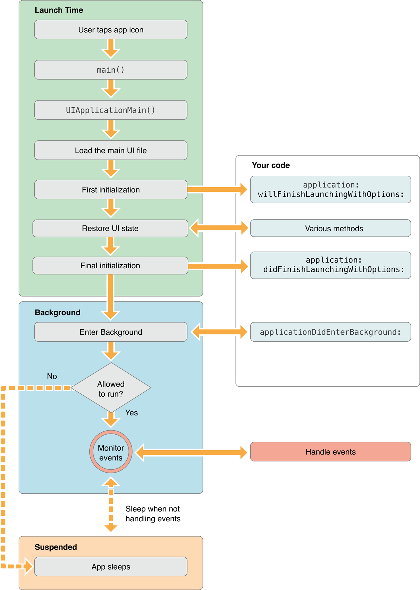

App Programming Guide for iOS (4) ---- Strategies for Handling App State Transitions

原文链接：[https://developer.apple.com/library/archive/documentation/iPhone/Conceptual/iPhoneOSProgrammingGuide/StrategiesforHandlingAppStateTransitions/StrategiesforHandlingAppStateTransitions.html#//apple_ref/doc/uid/TP40007072-CH8-SW1](https://developer.apple.com/library/archive/documentation/iPhone/Conceptual/iPhoneOSProgrammingGuide/StrategiesforHandlingAppStateTransitions/StrategiesforHandlingAppStateTransitions.html#//apple_ref/doc/uid/TP40007072-CH8-SW1)

#4 Strategies for Handling App State Transitions - 控制App状态转换的策略

For each of the possible runtime states of an app, the system has different expectations while your app is in that state. When state transitions occur, the system notifies the app object, which in turn notifies its app delegate. You can use the state transition methods of the [UIApplicationDelegate](https://developer.apple.com/reference/uikit/uiapplicationdelegate) protocol to detect these state changes and respond appropriately. For example, when transitioning from the foreground to the background, you might write out any unsaved data and stop any ongoing tasks. The following sections offer tips and guidance for how to implement your state transition code.

对于 APP 的每一个可能的运行时状态，当你的 APP 在该状态时系统有不同的期望。当状态转换发生时，系统通知 APP 对象，APP 对象接着通知它的 APP 代理。你可以使用 [UIApplicationDelegate](https://developer.apple.com/reference/uikit/uiapplicationdelegate) 协议的状态转换方法检测这些状态变化并适当的响应。例如，当从前台转换到后台时，你可以卸下任何未保存的数据并停止任何正在进行的任务。以下部分提供了如何实现你的状态转换代码的提示和指南。

## 4.1 What to Do at Launch Time - 启动时做什么

When your app is launched (either into the foreground or background), use your app delegate’s [application:willFinishLaunchingWithOptions:](https://developer.apple.com/reference/uikit/uiapplicationdelegate/1623032-application) and [application:didFinishLaunchingWithOptions:](https://developer.apple.com/reference/uikit/uiapplicationdelegate/1622921-application) methods to do the following:

当你的 APP 启动时（无论进入前台或后台），使用你的 APP 代理的 [application:willFinishLaunchingWithOptions:](https://developer.apple.com/reference/uikit/uiapplicationdelegate/1623032-application) 和 [application:didFinishLaunchingWithOptions:](https://developer.apple.com/reference/uikit/uiapplicationdelegate/1622921-application) 方法做以下事情：

- Check the contents of the launch options dictionary for information about why the app was launched, and respond appropriately.

- Initialize your app’s critical data structures.

- Prepare your app’s window and views for display:

  - Apps that use OpenGL ES for drawing must not use these methods to prepare their drawing environment. Instead, defer any OpenGL ES drawing calls to the [applicationDidBecomeActive:](https://developer.apple.com/reference/uikit/uiapplicationdelegate/1622956-applicationdidbecomeactive) method.
  - Show your app window from your [application:willFinishLaunchingWithOptions:](https://developer.apple.com/reference/uikit/uiapplicationdelegate/1623032-application) method. UIKit delays making the window visible until after the [application:didFinishLaunchingWithOptions:](https://developer.apple.com/reference/uikit/uiapplicationdelegate/1622921-application) method returns.

- 检查启动选项字典的内容查看关于 APP 为什么被启动的信息，并适当的响应。
- 初始化你的 APP 的关键数据结构。
- 准备你的 APP 的显示窗口和视图：
  - 使用 OpenGL ES 来绘图的 APP 一定不能使用这些方法来准备它们的绘图环境。相反，将任何 OpenGL ES 绘图调用推迟到 [applicationDidBecomeActive:](https://developer.apple.com/reference/uikit/uiapplicationdelegate/1622956-applicationdidbecomeactive) 方法。
  - 从你的 [application:willFinishLaunchingWithOptions:](https://developer.apple.com/reference/uikit/uiapplicationdelegate/1623032-application) 方法开始展示你的 APP 的窗口。UIKit 延迟让窗口可见，直到 [application:didFinishLaunchingWithOptions:](https://developer.apple.com/reference/uikit/uiapplicationdelegate/1622921-application) 方法返回之后。

At launch time, the system automatically loads your app’s main storyboard file and loads the initial view controller. For apps that support state restoration, the state restoration machinery restores your interface to its previous state between calls to the [application:willFinishLaunchingWithOptions:](https://developer.apple.com/reference/uikit/uiapplicationdelegate/1623032-application) and [application:didFinishLaunchingWithOptions:](https://developer.apple.com/reference/uikit/uiapplicationdelegate/1622921-application) methods. Use the [application:willFinishLaunchingWithOptions:](https://developer.apple.com/reference/uikit/uiapplicationdelegate/1623032-application) method to show your app window and to determine if state restoration should happen at all. Use the [application:didFinishLaunchingWithOptions:](https://developer.apple.com/reference/uikit/uiapplicationdelegate/1622921-application) method to make any final adjustments to your app’s user interface.

在启动时，系统自动加载你的 APP 的 main storyboard 文件并加载初始视图控制器。对于支持状态恢复的 APP，状态恢复机制会在调用 [application:willFinishLaunchingWithOptions:](https://developer.apple.com/reference/uikit/uiapplicationdelegate/1623032-application) 和 [application:willFinishLaunchingWithOptions:](https://developer.apple.com/reference/uikit/uiapplicationdelegate/1623032-application) 方法之间把你的界面恢复到先前的状态。 使用 [application:willFinishLaunchingWithOptions:](https://developer.apple.com/reference/uikit/uiapplicationdelegate/1623032-application) 方法展示你的 APP 的窗口并决定是否要恢复状态。使用 [application:didFinishLaunchingWithOptions:](https://developer.apple.com/reference/uikit/uiapplicationdelegate/1622921-application) 方法对你的 APP 的用户界面做任何最终的调整。

Your [application:willFinishLaunchingWithOptions:](https://developer.apple.com/reference/uikit/uiapplicationdelegate/1623032-application) and [application:didFinishLaunchingWithOptions:](https://developer.apple.com/reference/uikit/uiapplicationdelegate/1622921-application) methods should always be as lightweight as possible to reduce your app’s launch time. Apps are expected to launch, initialize themselves, and start handling events in less than 5 seconds. If an app does not finish its launch cycle in a timely manner, the system kills it for being unresponsive. Thus, any tasks that might slow down your launch (such as accessing the network) should be scheduled performed on a secondary thread.

你的 [application:willFinishLaunchingWithOptions:](https://developer.apple.com/reference/uikit/uiapplicationdelegate/1623032-application) 和 [application:didFinishLaunchingWithOptions:](https://developer.apple.com/reference/uikit/uiapplicationdelegate/1622921-application) 方法应该总是尽可能轻量以减少你的 APP 的启动时间。期望 APP 在 5 秒钟以内就可以启动、初始化并开始处理事件。如果 APP 没有即使完成它的启动周期，系统会由于没有响应而杀死它。因此，任何可能减慢你的启动的任务（比如访问网络）都应该被调度到辅助线程上执行。

### 4.1.1 The Launch Cycle - 启动周期

When your app is launched, it moves from the not running state to the active or background state, transitioning briefly through the inactive state. As part of the launch cycle, the system creates a process and main thread for your app and calls your app’s `main` function on that main thread. The default `main` function that comes with your Xcode project promptly hands control over to the UIKit framework, which does most of the work in initializing your app and preparing it to run.

当你的 APP 被启动，它将从未运行状态移到活跃或后台状态，短暂的从不活跃状态过渡。作为启动周期的一部分，系统为你的 APP 创建一个进程和主线程，并在该主线程调用你的 APP 的 `main` 函数。Xcode 工程的默认 `main` 函数迅速将控制权交给 UIKit 框架，由它来完成大部分 APP 初始化工作并准备运行。 

Figure 4-1 shows the sequence of events that occurs when an app is launched into the foreground, including the app delegate methods that are called.

图 4-1 展示了当 APP 启动到前台时发生的事件顺序，包括被调用的 APP 代理方法。

**Figure 4-1**  Launching an app into the foreground - 启动 APP 到前台

When your app is launched into the background—usually to handle some type of background event—the launch cycle changes slightly to the one shown in Figure 4-2. The main difference is that instead of your app being made active, it enters the background state to handle the event and may be suspended at some point after that. When launching into the background, the system still loads your app’s user interface files but it does not display the app’s window.

当你的 APP 被启动到后台 —— 通常为了处理某些类型的后台事件 —— 启动周期稍微变化为图 4-2 中所示。主要的不同在于你的 APP 不再变成活跃的，它进入后台状态处理事件，并且在之后的某个时间可能被挂起。当启动进入后台时，系统仍然加载你的 APP 的用户界面文件，但它不会显示到 APP 的窗口上。

**Figure 4-2**  Launching an app into the background - 启动 APP 进入后台

To determine whether your app is launching into the foreground or background, check the [applicationState](https://developer.apple.com/reference/uikit/uiapplication/1623003-applicationstate) property of the shared `UIApplication` object in your `application:willFinishLaunchingWithOptions:` or `application:didFinishLaunchingWithOptions:` delegate method. When the app is launched into the foreground, this property contains the value [UIApplicationStateInactive](https://developer.apple.com/reference/uikit/uiapplicationstate/1623000-inactive). When the app is launched into the background, the property contains the value [UIApplicationStateBackground](https://developer.apple.com/reference/uikit/uiapplicationstate/uiapplicationstatebackground) instead. You can use this difference to adjust the launch-time behavior of your delegate methods accordingly.

要觉得你的 APP 是启动进入前台还是后台，在你的 `application:willFinishLaunchingWithOptions:` 或 `application:didFinishLaunchingWithOptions:` 代理方法中检查共享的 `UIApplication` 对象的 [applicationState](https://developer.apple.com/reference/uikit/uiapplication/1623003-applicationstate) 属性。当 APP 被启动进入前台，这个属性的值为 [UIApplicationStateInactive](https://developer.apple.com/reference/uikit/uiapplicationstate/1623000-inactive)。当 APP 被启动进入后台，这个属性的值则是 [UIApplicationStateBackground](https://developer.apple.com/reference/uikit/uiapplicationstate/uiapplicationstatebackground)。你可以使用该区别来相应的调整你的代理方法的启动时行为。

> **Note:** When an app is launched so that it can open a URL, the sequence of startup events is slightly different from those shown in Figure 4-1 and Figure 4-2. For information about the startup sequences that occur when opening a URL, see [Handling URL Requests](https://developer.apple.com/library/content/documentation/iPhone/Conceptual/iPhoneOSProgrammingGuide/Inter-AppCommunication/Inter-AppCommunication.html#//apple_ref/doc/uid/TP40007072-CH6-SW13).
> 
> **注意：** 当 APP 被启动以打开一个 URL，启动事件的顺序与图 4-1 和图 4-2 中展示的都有轻微的不同。关于打开 URL 时发生的启动顺序，参见 [Handling URL Requests](https://developer.apple.com/library/content/documentation/iPhone/Conceptual/iPhoneOSProgrammingGuide/Inter-AppCommunication/Inter-AppCommunication.html#//apple_ref/doc/uid/TP40007072-CH6-SW13)。

### 4.1.2 Launching in Landscape Mode - 横屏模式启动

Apps that uses only landscape orientations for their interface must explicitly ask the system to launch the app in that orientation. Normally, apps launch in portrait mode and rotate their interface to match the device orientation as needed. For apps that support both portrait and landscape orientations, always configure your views for portrait mode and then let your view controllers handle any rotations. If, however, your app supports landscape but not portrait orientations, perform the following tasks to make it launch in landscape mode initially:

界面只使用横屏方向的 APP 必须准确的告诉系统以该方向启动 APP。正常情况下，APP 都以竖屏方向启动，并按需要旋转它们的界面以匹配设备方向。对于既支持横屏方向又支持竖屏方向的 APP，总是配置视图到竖屏方向，然后让你的视图控制器处理任意旋转。然而，如果你的 APP 支持横屏，但并不支持竖屏方向，执行下列操作让它初始以横屏模式启动：

- Add the `UIInterfaceOrientation` key to your app’s *Info.plist* file and set the value of this key to either [UIInterfaceOrientationLandscapeLeft](https://developer.apple.com/reference/uikit/uiinterfaceorientation/uiinterfaceorientationlandscapeleft) or [UIInterfaceOrientationLandscapeRight](https://developer.apple.com/reference/uikit/uiinterfaceorientation/uiinterfaceorientationlandscaperight).
- Lay out your views in landscape mode and make sure that their layout or autosizing options are set correctly.
- Override your view controller’s [shouldAutorotateToInterfaceOrientation:](https://developer.apple.com/reference/uikit/uiviewcontroller/1621459-shouldautorotatetointerfaceorien) method and return a `YES` for the left or right landscape orientations and a `NO` for portrait orientations.
- 添加 `UIInterfaceOrientation` key 到你的 APP 的 *Info.plist* 文件，并设置这个 key 的值为 [UIInterfaceOrientationLandscapeLeft](https://developer.apple.com/reference/uikit/uiinterfaceorientation/uiinterfaceorientationlandscapeleft) 或 [UIInterfaceOrientationLandscapeRight](https://developer.apple.com/reference/uikit/uiinterfaceorientation/uiinterfaceorientationlandscaperight)。
- 以横屏模式布局你的视图，并确保它们的布局或自动大小选项被正确设置。
- 重载你的视图控制器的 [shouldAutorotateToInterfaceOrientation:](https://developer.apple.com/reference/uikit/uiviewcontroller/1621459-shouldautorotatetointerfaceorien) 方法，并对左或右横屏方向返回 `YES` 且对竖屏方向返回 `NO`。

> **Important:** Apps should always use view controllers to manage their window-based content.
> 
> **重要：** APP 应该总是使用视图控制器管理它们基于窗口的内容。

The `UIInterfaceOrientation` key in the *Info.plist* file tells iOS that it should configure the orientation of the app status bar (if one is displayed) as well as the orientation of views managed by any view controllers at launch time. View controllers respect this key and set their view’s initial orientation to match. Using this key is equivalent to calling the [setStatusBarOrientation:animated:](https://developer.apple.com/reference/uikit/uiapplication/1622939-setstatusbarorientation) method of `UIApplication` early in the execution of your `applicationDidFinishLaunching:` method.

在 *Info.plist* 文件中的 `UIInterfaceOrientation` key 告诉 iOS 它在启动时应该配置的 APP 状态栏的方向（如果要显示）以及被视图控制器管理的视图的方向。视图控制器关心这个 key，并设置它们的视图的初始方向以匹配。使用这个 key 相当于早在你的 `applicationDidFinishLaunching:` 方法执行的时候就调用了 `UIApplication` 的 [setStatusBarOrientation:animated:](https://developer.apple.com/reference/uikit/uiapplication/1622939-setstatusbarorientation) 方法。

### 4.1.3 Installing App-Specific Data Files at First Launch - 在首次启动时安装 APP 特定的数据文件

You can use your app’s first launch cycle to set up any data or configuration files required to run. App-specific data files should be created in the *Library/Application Support/<bundleID>/* directory of your app sandbox, where *<bundleID>* is your app’s bundle identifier. You can further subdivide this directory to organize your data files as needed. You can also create files in other directories, such as to your app’s iCloud container directory or to the local Documents directory, depending on your needs.

你可以使用你的 APP 的首次启动周期设置运行所需的任何数据或配置文件。APP 特定的数据文件应该在你的 APP 沙盒的 *Library/Application Support/<bundleID>/* 目录中被创建，此处 *<bundleID>* 就是你的 APP 的 bundle 标识符。你可以按需要进一步细分该目录以组织你的数据文件。你也可以在其他目录下创建文件，比如到你 APP 的 iCloud 容器目录或到本地 Documents 目录，取决于你的需要。

If your app’s bundle contains data files that you plan to modify, copy those files out of the app bundle and modify the copies. You must not modify any files inside your app bundle. Because iOS apps are code signed, modifying files inside your app bundle invalidates your app’s signature and will prevent your app from launching in the future. Copying those files to the `Application Support` directory (or another writable directory in your sandbox) and modifying them there is the only way to use such files safely.

如果你的 APP bundle 包含你想要修改的数据文件，从 APP bundle 中把那些文件拷贝出来并修改拷贝。你一定不能在你的 APP bundle 里面修改任何文件。因为 iOS APP 是被代码签名的，在你的 APP bundle 内部修改文件意味着你的 APP 签名将在未来阻止你的 APP 启动。拷贝那些文件到 `Application Support` 目录（或你的沙盒中其他可写的目录）并修改它们是安全使用这些文件的唯一途径。

For more information about where to put app-related data files, see [File System Programming Guide](https://developer.apple.com/library/content/documentation/FileManagement/Conceptual/FileSystemProgrammingGuide/Introduction/Introduction.html#//apple_ref/doc/uid/TP40010672).

关于放置 APP 相关的数据文件的更多信息，参见 [File System Programming Guide](https://developer.apple.com/library/content/documentation/FileManagement/Conceptual/FileSystemProgrammingGuide/Introduction/Introduction.html#//apple_ref/doc/uid/TP40010672)。

## 4.2 What to Do When Your App Is Interrupted Temporarily 当App被暂时中断时做什么

Alert-based interruptions result in a temporary loss of control by your app. Your app continues to run in the foreground, but it does not receive touch events from the system. (It does continue to receive notifications and other types of events, such as accelerometer events, though.) In response to this change, your app should do the following in its [applicationWillResignActive:](https://developer.apple.com/reference/uikit/uiapplicationdelegate/1622950-applicationwillresignactive) method:

- Save data and any relevant state information.
- Stop timers and other periodic tasks.
- Stop any running metadata queries.
- Do not initiate any new tasks.
- Pause movie playback (except when playing back over AirPlay).
- Enter into a pause state if your app is a game.
- Throttle back OpenGL ES frame rates.
- Suspend any dispatch queues or operation queues executing non-critical code. (You can continue processing network requests and other time-sensitive background tasks while inactive.)

When your app is moved back to the active state, its [applicationDidBecomeActive:](https://developer.apple.com/reference/uikit/uiapplicationdelegate/1622956-applicationdidbecomeactive) method should reverse any of the steps taken in the applicationWillResignActive: method. Thus, upon reactivation, your app should restart timers, resume dispatch queues, and throttle up OpenGL ES frame rates again. However, games should not resume automatically; they should remain paused until the user chooses to resume them.

When the user presses the Sleep/Wake button, apps with files protected by the [NSFileProtectionComplete](https://developer.apple.com/reference/foundation/fileprotectiontype/1616200-complete) protection option must close any references to those files. For devices configured with an appropriate password, pressing the Sleep/Wake button locks the screen and forces the system to throw away the decryption keys for files with complete protection enabled. While the screen is locked, any attempts to access the corresponding files will fail. So if you have such files, you should close any references to them in your applicationWillResignActive: method and open new references in your applicationDidBecomeActive: method.

> **Important:** Always save user data at appropriate checkpoints in your app. Although you can use app state transitions to force objects to write unsaved changes to disk, never wait for an app state transition to save data. For example, a view controller that manages user data should save its data when it is dismissed.

### 4.2.1 Responding to Temporary Interruptions 响应暂时中断

When an alert-based interruption occurs, such as an incoming phone call, the app moves temporarily to the inactive state so that the system can prompt the user about how to proceed. The app remains in this state until the user dismisses the alert. At this point, the app either returns to the active state or moves to the background state. Figure 4-3 shows the flow of events through your app when an alert-based interruption occurs.

**Figure 4-3**  Handling alert-based interruptions

Notifications that display a banner do not deactivate your app in the way that alert-based notifications do. Instead, the banner is laid along the top edge of your app window and your app continues receive touch events as before. However, if the user pulls down the banner to reveal the notification center, your app moves to the inactive state just as if an alert-based interruption had occurred. Your app remains in the inactive state until the user dismisses the notification center or launches another app. At this point, your app moves to the appropriate active or background state. The user can use the Settings app to configure which notifications display a banner and which display an alert.

Pressing the Sleep/Wake button is another type of interruption that causes your app to be deactivated temporarily. When the user presses this button, the system disables touch events, moves the app to the background, sets the value of the app’s [applicationState](https://developer.apple.com/reference/uikit/uiapplication/1623003-applicationstate) property to [UIApplicationStateBackground](https://developer.apple.com/reference/uikit/uiapplicationstate/uiapplicationstatebackground), and locks the screen. A locked screen has additional consequences for apps that use data protection to encrypt files. Those consequences are described in What to Do When Your App Is Interrupted Temporarily.

## 4.3 What to Do When Your App Enters the Foreground 当App进入前台时做什么

Returning to the foreground is your app’s chance to restart the tasks that it stopped when it moved to the background. The steps that occur when moving to the foreground are shown in Figure 4-4. The [applicationWillEnterForeground:](https://developer.apple.com/reference/uikit/uiapplicationdelegate/1623076-applicationwillenterforeground) method should undo anything that was done in your applicationDidEnterBackground: method, and the [applicationDidBecomeActive:](https://developer.apple.com/reference/uikit/uiapplicationdelegate/1622956-applicationdidbecomeactive) method should continue to perform the same activation tasks that it would at launch time.

**Figure 4-4**  Transitioning from the background to the foreground

> **Note:** The [UIApplicationWillEnterForegroundNotification](https://developer.apple.com/reference/uikit/uiapplicationwillenterforegroundnotification) notification is also available for tracking when your app reenters the foreground. Objects in your app can use the default notification center to register for this notification.

### 4.3.1 Be Prepared to Process Queued Notifications 准备处理排好队的通知

An app in the suspended state must be ready to handle any queued notifications when it returns to a foreground or background execution state. A suspended app does not execute any code and therefore cannot process notifications related to orientation changes, time changes, preferences changes, and many others that would affect the app’s appearance or state. To make sure these changes are not lost, the system queues many relevant notifications and delivers them to the app as soon as it starts executing code again (either in the foreground or background). To prevent your app from becoming overloaded with notifications when it resumes, the system coalesces events and delivers a single notification (of each relevant type) that reflects the net change since your app was suspended.

Table 4-1 lists the notifications that can be coalesced and delivered to your app. Most of these notifications are delivered directly to the registered observers. Some, like those related to device orientation changes, are typically intercepted by a system framework and delivered to your app in another way.

**Table 4-1**  Notifications delivered to waking apps

| **Event**                                | **Notifications**                        |
| ---------------------------------------- | ---------------------------------------- |
| An accessory is connected or disconnected. | [EAAccessoryDidConnectNotification](https://developer.apple.com/reference/externalaccessory/eaaccessorydidconnectnotification)[EAAccessoryDidDisconnectNotification](https://developer.apple.com/reference/foundation/nsnotification.name/1613901-eaaccessorydiddisconnect) |
| The device orientation changes.          | [UIDeviceOrientationDidChangeNotification](https://developer.apple.com/reference/foundation/nsnotification.name/1620025-uideviceorientationdidchange)In addition to this notification, view controllers update their interface orientations automatically. |
| There is a significant time change.      | [UIApplicationSignificantTimeChangeNotification](https://developer.apple.com/reference/foundation/nsnotification.name/1623059-uiapplicationsignificanttimechan) |
| The battery level or battery state changes. | [UIDeviceBatteryLevelDidChangeNotification](https://developer.apple.com/reference/uikit/uidevicebatteryleveldidchangenotification)[UIDeviceBatteryStateDidChangeNotification](https://developer.apple.com/reference/foundation/nsnotification.name/1620052-uidevicebatterystatedidchange) |
| The proximity state changes.             | [UIDeviceProximityStateDidChangeNotification](https://developer.apple.com/reference/foundation/nsnotification.name/1620046-uideviceproximitystatedidchange) |
| The status of protected files changes.   | [UIApplicationProtectedDataWillBecomeUnavailable](https://developer.apple.com/reference/foundation/nsnotification.name/1623058-uiapplicationprotecteddatawillbe)[UIApplicationProtectedDataDidBecomeAvailable](https://developer.apple.com/reference/foundation/nsnotification.name/1623039-uiapplicationprotecteddatadidbec) |
| An external display is connected or disconnected. | [UIScreenDidConnectNotification](https://developer.apple.com/reference/foundation/nsnotification.name/1617826-uiscreendidconnect)[UIScreenDidDisconnectNotification](https://developer.apple.com/reference/uikit/uiscreendiddisconnectnotification) |
| The screen mode of a display changes.    | [UIScreenModeDidChangeNotification](https://developer.apple.com/reference/uikit/uiscreenmodedidchangenotification) |
| Preferences that your app exposes through the Settings app changed. | [NSUserDefaultsDidChangeNotification](https://developer.apple.com/reference/foundation/userdefaults/1408206-didchangenotification) |
| The current language or locale settings changed. | [NSCurrentLocaleDidChangeNotification](https://developer.apple.com/reference/foundation/nslocale/1418141-currentlocaledidchangenotificati) |
| The status of the user’s iCloud account changed. | [NSUbiquityIdentityDidChangeNotification](https://developer.apple.com/reference/foundation/nsnotification.name/1407629-nsubiquityidentitydidchange) |

Queued notifications are delivered on your app’s main run loop and are typically delivered before any touch events or other user input. Most apps should be able to handle these events quickly enough that they would not cause any noticeable lag when resumed. However, if your app appears sluggish when it returns from the background state, use Instruments to determine whether your notification handler code is causing the delay.

An app returning to the foreground also receives view-update notifications for any views that were marked dirty since the last update. An app running in the background can still call the [setNeedsDisplay](https://developer.apple.com/reference/uikit/uiview/1622437-setneedsdisplay) or [setNeedsDisplayInRect:](https://developer.apple.com/reference/uikit/uiview/1622587-setneedsdisplayinrect) methods to request an update for its views. However, because the views are not visible, the system coalesces the requests and updates the views only after the app returns to the foreground.

### 4.3.2 Handle iCloud Changes 处理iCloud变更

If the status of iCloud changes for any reason, the system delivers a [NSUbiquityIdentityDidChangeNotification](https://developer.apple.com/reference/foundation/nsnotification.name/1407629-nsubiquityidentitydidchange) notification to your app. The state of iCloud changes when the user logs into or out of an iCloud account or enables or disables the syncing of documents and data. This notification is your app’s cue to update caches and any iCloud-related user interface elements to accommodate the change. For example, when the user logs out of iCloud, you should remove references to all iCloud–based files or data.

If your app has already prompted the user about whether to store files in iCloud, do not prompt again when the status of iCloud changes. After prompting the user the first time, store the user’s choice in your app’s local preferences. You might then want to expose that preference using a Settings bundle or as an option in your app. But do not repeat the prompt again unless that preference is not currently in the user defaults database.

### 4.3.3 Handle Locale Changes 处理定位变更

If a user changes the current locale while your app is suspended, you can use the [NSCurrentLocaleDidChangeNotification](https://developer.apple.com/reference/foundation/nslocale/1418141-currentlocaledidchangenotificati) notification to force updates to any views containing locale-sensitive information, such as dates, times, and numbers when your app returns to the foreground. Of course, the best way to avoid locale-related issues is to write your code in ways that make it easy to update views. For example:

- Use the [autoupdatingCurrentLocale](https://developer.apple.com/reference/foundation/nslocale/1414388-autoupdatingcurrent) class method when retrieving NSLocale objects. This method returns a locale object that updates itself automatically in response to changes, so you never need to recreate it. However, when the locale changes, you still need to refresh views that contain content derived from the current locale.
- Re-create any cached date and number formatter objects whenever the current locale information changes.

For more information about internationalizing your code to handle locale changes, see [Internationalization and Localization Guide](https://developer.apple.com/library/content/documentation/MacOSX/Conceptual/BPInternational/Introduction/Introduction.html#//apple_ref/doc/uid/10000171i).

### 4.3.4 Handle Changes to Your App’s Settings 处理App设置的变更

If your app has settings that are managed by the Settings app, it should observe the [NSUserDefaultsDidChangeNotification](https://developer.apple.com/reference/foundation/userdefaults/1408206-didchangenotification) notification. Because the user can modify settings while your app is suspended or in the background, you can use this notification to respond to any important changes in those settings. In some cases, responding to this notification can help close a potential security hole. For example, an email program should respond to changes in the user’s account information. Failure to monitor these changes could cause privacy or security issues. Specifically, the current user might be able to send email using the old account information, even if the account no longer belongs to that person.

Upon receiving the NSUserDefaultsDidChangeNotification notification, your app should reload any relevant settings and, if necessary, reset its user interface appropriately. In cases where passwords or other security-related information has changed, you should also hide any previously displayed information and force the user to enter the new password.

## 4.4 What to Do When Your App Enters the Background 当App进入后台时做什么

When moving from foreground to background execution, use the [applicationDidEnterBackground:](https://developer.apple.com/reference/uikit/uiapplicationdelegate/1622997-applicationdidenterbackground) method of your app delegate to do the following:

- **Prepare to have your app’s picture taken.** When your applicationDidEnterBackground: method returns, the system takes a picture of your app’s user interface and uses the resulting image for transition animations. If any views in your interface contain sensitive information, you should hide or modify those views before the applicationDidEnterBackground: method returns. If you add new views to your view hierarchy as part of this process, you must force those views to draw themselves, as described in Prepare for the App Snapshot.
- **Save any relevant app state information.** Prior to entering the background, your app should already have saved all critical user data. Use the transition to the background to save any last minute changes to your app’s state.
- **Free up memory as needed.** Release any cached data that you do not need and do any simple cleanup that might reduce your app’s memory footprint. Apps with large memory footprints are the first to be terminated by the system, so release image resources, data caches, and any other objects that you no longer need. For more information, see Reduce Your Memory Footprint.

Your app delegate’s applicationDidEnterBackground: method has approximately 5 seconds to finish any tasks and return. In practice, this method should return as quickly as possible. If the method does not return before time runs out, your app is killed and purged from memory. If you still need more time to perform tasks, call the beginBackgroundTaskWithExpirationHandler: method to request background execution time and then start any long-running tasks in a secondary thread. Regardless of whether you start any background tasks, the applicationDidEnterBackground: method must still exit within 5 seconds.

> **Note:** The system sends the [UIApplicationDidEnterBackgroundNotification](https://developer.apple.com/reference/uikit/uiapplicationdidenterbackgroundnotification) notification in addition to calling the applicationDidEnterBackground: method. You can use that notification to distribute cleanup tasks to other objects of your app.

Depending on the features of your app, there are other things your app should do when moving to the background. For example, any active Bonjour services should be suspended and the app should stop calling OpenGL ES functions. For a list of things your app should do when moving to the background, see [Being a Responsible Background App](https://developer.apple.com/library/content/documentation/iPhone/Conceptual/iPhoneOSProgrammingGuide/BackgroundExecution/BackgroundExecution.html#//apple_ref/doc/uid/TP40007072-CH4-SW8).

### 4.4.1 The Background Transition Cycle 后台转换循环

When the user presses the Home button, presses the Sleep/Wake button, or the system launches another app, the foreground app transitions to the inactive state and then to the background state. These transitions result in calls to the app delegate’s [applicationWillResignActive:](https://developer.apple.com/reference/uikit/uiapplicationdelegate/1622950-applicationwillresignactive) and [applicationDidEnterBackground:](https://developer.apple.com/reference/uikit/uiapplicationdelegate/1622997-applicationdidenterbackground) methods, as shown in Figure 4-5. After returning from the applicationDidEnterBackground: method, most apps move to the suspended state shortly afterward. Apps that request specific background tasks (such as playing music) or that request a little extra execution time from the system may continue to run for a while longer.

**Figure 4-5**  Moving from the foreground to the background

### 4.4.2 Prepare for the App Snapshot 准备App快照

Shortly after an app delegate’s [applicationDidEnterBackground:](https://developer.apple.com/reference/uikit/uiapplicationdelegate/1622997-applicationdidenterbackground) method returns, the system takes a snapshot of the app’s windows. Similarly, when an app is woken up to perform background tasks, the system may take a new snapshot to reflect any relevant changes. For example, when an app is woken to process downloaded items, the system takes a new snapshot so that can reflect any changes caused by the incorporation of the items. The system uses these snapshot images in the multitasking UI to show the state of your app.

If you make changes to your views upon entering the background, you can call the [snapshotViewAfterScreenUpdates:](https://developer.apple.com/reference/uikit/uiview/1622531-snapshotviewafterscreenupdates) method of your main view to force those changes to be rendered. Calling the setNeedsDisplay method on a view is ineffective for snapshots because the snapshot is taken before the next drawing cycle, thus preventing any changes from being rendered. Calling the snapshotViewAfterScreenUpdates: method with a value of a YES/a forces an immediate update to the underlying buffers that the snapshot machinery uses.

### 4.4.3 Reduce Your Memory Footprint 减少内存占用

Every app should free up as much memory as is practical upon entering the background. The system tries to keep as many apps in memory at the same time as it can, but when memory runs low it terminates suspended apps to reclaim that memory. Apps that consume large amounts of memory while in the background are the first apps to be terminated.

Practically speaking, your app should remove strong references to objects as soon as they are no longer needed. Removing strong references gives the compiler the ability to release the objects right away so that the corresponding memory can be reclaimed. However, if you want to cache some objects to improve performance, you can wait until the app transitions to the background before removing references to them.

Some examples of objects that you should remove strong references to as soon as possible include:

- Image objects you created. (Some methods of UIImage return images whose underlying image data is purged automatically by the system. For more information, see the discussion in the overview of [UIImage Class Reference](https://developer.apple.com/reference/uikit/uiimage). )
- Large media or data files that you can load again from disk
- Any other objects that your app does not need and can recreate easily later

To help reduce your app’s memory footprint, the system automatically purges some data allocated on behalf of your app when your app moves to the background.

- The system purges the backing store for all Core Animation layers. This effort does not remove your app’s layer objects from memory, nor does it change the current layer properties. It simply prevents the contents of those layers from appearing onscreen, which given that the app is in the background should not happen anyway.
- It removes any system references to cached images.
- It removes strong references to some other system-managed data caches.