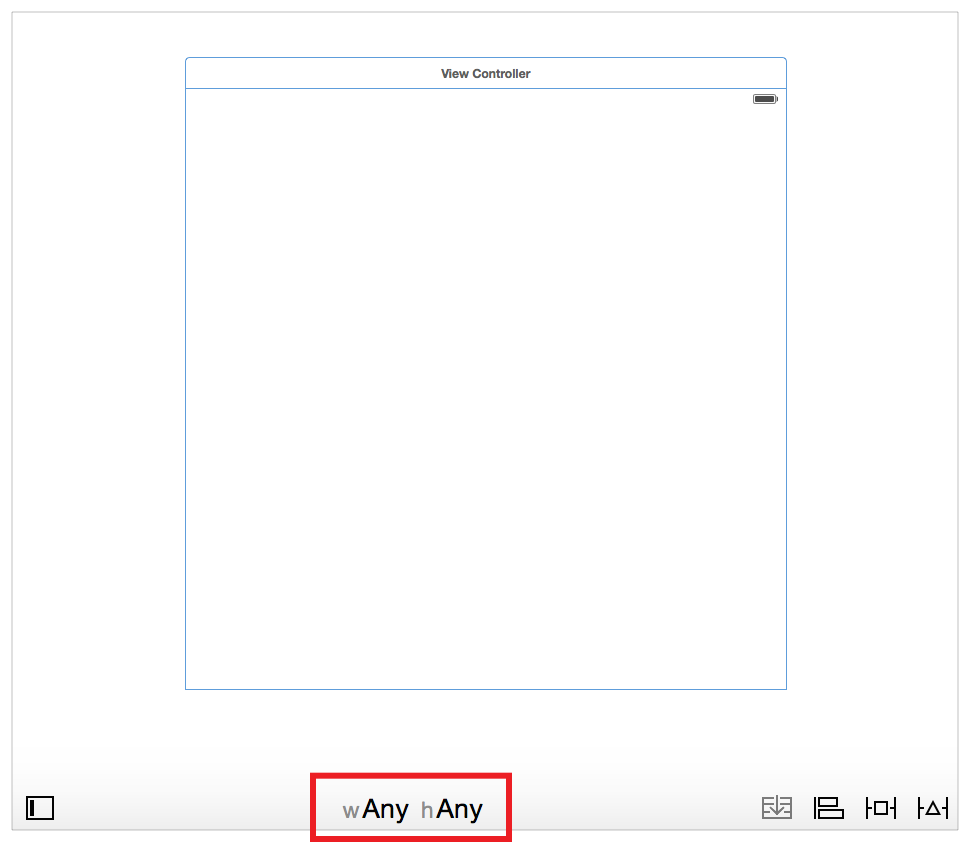
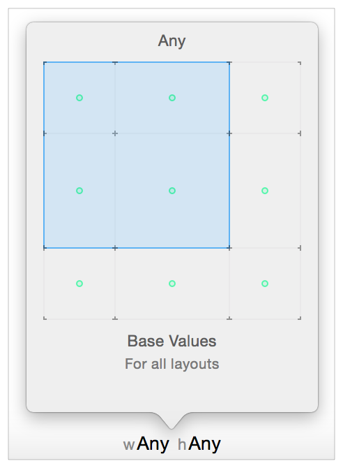
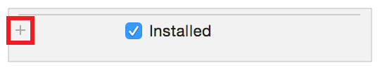
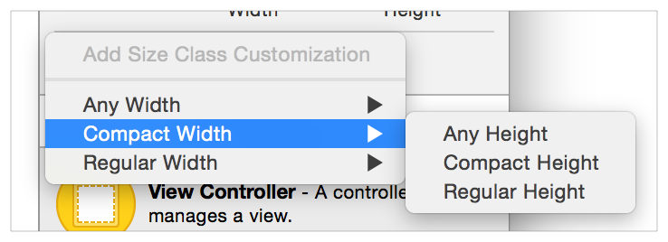
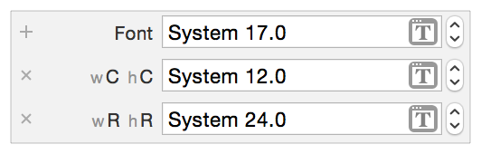

# Size-Class-Specific Layout 基于 Size-Class 的布局

原文地址：
[https://developer.apple.com/library/archive/documentation/UserExperience/Conceptual/AutolayoutPG/Size-ClassSpecificLayout.html#//apple_ref/doc/uid/TP40010853-CH26-SW1](https://developer.apple.com/library/archive/documentation/UserExperience/Conceptual/AutolayoutPG/Size-ClassSpecificLayout.html#//apple_ref/doc/uid/TP40010853-CH26-SW1)

Storyboards in Interface Builder by default use size classes. Size classes are traits assigned to user interface elements, like scenes or views. They provide a rough indication of the element’s size. Interface Builder lets you customize many of your layout’s features based on the current size class. The layout then automatically adapts as the size class changes. Specifically, you can set the following features on a per-size-class basis:

- Install or uninstall a view or control.
- Install or uninstall a constraint.
- Set the value of select attributes (for example, fonts and layout margin settings).

Interface Builder 中的故事板默认使用 size classes。Size classes 是赋予用户界面元素（例如场景或视图）的特征，用于大致表示元素的尺寸。Interface Builder 允许你根据当前的 size class 自定义布局的许多特性，布局随后会在 size class 发生变化时自动适配。具体来说，你可以针对每个 size class 设置以下特性：

- 安装或卸载视图或控件。
- 安装或卸载约束。
- 设置部分属性的值（例如字体和布局边距设置）。

When the system loads a scene, it instantiates all the views, controls, and constraints, and assigns these items to the appropriate outlet in the view controller (if any). You can access any of these items through their outlets, regardless of the scene’s current size class. However, the system adds these items to the view hierarchy only if they are installed for the current size class.

系统加载场景时，会实例化所有视图、控件和约束，并将这些对象关联到视图控制器中对应的输出口（如果存在）。无论场景当前的 size class 是什么，你都可以通过输出口访问这些对象。但是，只有当这些对象是针对当前 size class 安装的时，系统才会将它们添加到视图层级中。

As the view’s size class changes (for example, when you rotate an iPhone or switch an iPad app between full-screen and Split View), the system automatically adds items to or removes them from the view hierarchy. The system also animates any changes to the view’s layout.

当视图的 size class 发生变化时（例如旋转 iPhone 设备，或将 iPad 应用在全屏与分屏模式之间切换），系统会自动在视图层级中添加或移除相应对象，并对布局的所有变化执行动画过渡。

> **Note** **注意**
>
> The system keeps a reference to the uninstalled items, so they are not deallocated when they are removed from the view hierarchy.
> 
> 系统会保留对未安装对象的引用，因此它们从视图层级中移除时不会被释放。

## 1 Final and Base Size Classes 最终尺寸类别与基础尺寸类别

Interface Builder recognizes nine different size classes.

Interface Builder 能够识别九种不同的 size classes。

Four of these are the Final size classes: Compact-Compact, Compact-Regular, Regular-Compact, and Regular-Regular. The Final classes represent actual size classes displayed on devices.

其中四种是 **最终** size classes：紧凑-紧凑、紧凑-常规、常规-紧凑 和 常规-常规。最终类别代表在设备上实际显示的 size classes。

The remaining five are Base size classes: Compact-Any, Regular-Any, Any-Compact, Any-Regular, and Any-Any. These are abstract size classes that represent two or more Final size classes. For example, items installed in the Compact-Any size class appear in both the Compact-Compact and Compact-Regular size views.

其余五种是 **基础** size classes：紧凑-任意、常规-任意、任意-紧凑、任意-常规 和 任意-任意。这些是抽象的 size classes，代表两个或多个 **最终** size classes。例如，在 紧凑-任意 size class 中设置为 “安装” 的元素，会同时出现在 紧凑-紧凑 和 紧凑-常规 尺寸的视图中。

Anything set in a more specific size class always overrides the more general size classes. Additionally, you must provide a nonambiguous, satisfiable layout for all nine size classes, even the Base size classes. Therefore, it is typically easiest to work from the most general size class to the most specific. Select the default layout for your app, and design this layout in the Any-Any size class. Then modify the other Base or Final size classes as needed.

在更具体的 size class 中设置的任何内容，总会覆盖更通用的 size classes。此外，你必须为全部九种 size classes（包括**基础** size classes）提供无歧义、可满足的布局。因此，通常最简单的做法是：从最通用的 size class 开始，再到最具体的。选择你的应用的默认布局，并在 任意-任意 size class 中设计该布局。然后根据需要修改其他 **基础** 或 **最终** size classes。

## 2 Using the Size Class Tool 使用 Size Class 工具

Select the size class that you are currently editing using Interface Builder’s Size Class tool. This tool is displayed at the bottom center of the Editor window. By default, Interface Builder starts with the Any-Any size class selected.

通过 Interface Builder 的 Size Class 工具选择当前正在编辑的 size class。该工具显示在编辑器窗口底部中央。默认情况下，Interface Builder 启动时选中的是 任意-任意 size class。

To switch to a new size class, click the Size Class tool. Interface Builder presents a popover view containing a 3 x 3 grid of size classes. Move your mouse over the grid to change the size class. The grid shows the selected size class’s name at the top and a description of the size class (including the devices and orientations it affects) at the bottom. It also displays a green dot in each size class affected by the current size class.

要切换到新的 size class，请点击 Size Class 工具。Interface Builder 会弹出一个包含 3×3 网格 size classes 的视图。将鼠标移到网格上即可切换 size class。网格顶部会显示所选 size class 的名称，底部会显示该 size class 的描述（包括它所影响的设备与屏幕方向）。同时，网格中会在受当前 size class 影响的每个 size class 位置显示一个绿色圆点。

Any views or constraints added to the canvas are installed only in the current size class. When deleting items, the behavior varies depending on where and how the items are deleted.

- Deleting an item from the canvas or document outline removes it from the project entirely.
- Command-Deleting an item from the canvas or document outline only uninstalls the item from the current size class.
- When a scene has more than one size class, deleting items from anywhere other than the canvas or document outline (for example, selecting and deleting constraints from the Size inspector) uninstalls the item only from the current size class.
- If you have edited only the Any-Any size class, then deleting an item always removes it from the project.

添加到画布中的任何视图或约束，都只会在当前 size class 中被安装。删除元素时，行为会根据删除的位置和方式有所不同：

- 从画布或文档大纲中删除元素，会将其从项目中完全移除。
- 在画布或文档大纲中使用 Command+Delete 删除元素，仅会将该元素从当前 size class 中卸载。
- 当一个场景包含多个 size class 时，从画布或文档大纲以外的位置删除元素（例如在 Size 检查器中选中并删除约束），仅会将该元素从当前 size class 中卸载。
- 如果你只编辑过 Any‑Any size class，那么删除元素始终会将其从项目中移除。

If you are editing any size class other than the Any-Any size class, Interface Builder highlights the toolbar at the bottom of the editor window in blue. This makes it obvious when you’re working on a more specific size class.

如果你正在编辑 Any‑Any 以外的任意 size class，Interface Builder 会将编辑器窗口底部的工具栏以蓝色高亮显示。这样可以很明显地看出你正在编辑更具体的 size class。

## Using the Inspectors 使用检查器

You can also modify the size-class-specific settings in the inspectors. Anything that supports size-class-specific settings appears in the inspector with a small plus icon beside it.

你也可以在检查器中修改与 size-class-specific 相关的设置。检查器中所有支持 size-class-specific 设置的项，旁边都会显示一个小型的加号图标。

By default, the inspector sets the value for the Any-Any size class. To set a different value for a more specific size class, click the plus icon to add a new size class. Select the width, and then the height, for the size class you want to add.

默认情况下，检查器会为 Any-Any size class 设置对应的值。若要为更具体的 size class 设置不同的值，请点击加号图标以添加新的 size class。依次选择你要添加的 size class 的宽度和高度。

The inspector now shows each size class on its own line—the Any-Any setting is the top line, with the more-specific size classes listed below. You can edit the value of each line independently of the others.

此时，检查器会将每个 size class 单独显示为一行 —— Any-Any 设置位于最上方一行，更具体的 size classes 列在下方。你可以独立编辑每一行的值，互不影响。

To remove a custom size class, click the x icon at the beginning of the line.

若要移除自定义的 size class，点击该行开头的 × 图标即可。

For more information on working with size classes in Interface Builder, see Size Classes Design Help.

有关在 Interface Builder 中使用 size classes 的更多信息，请参阅《Size Classes Design Help》。

