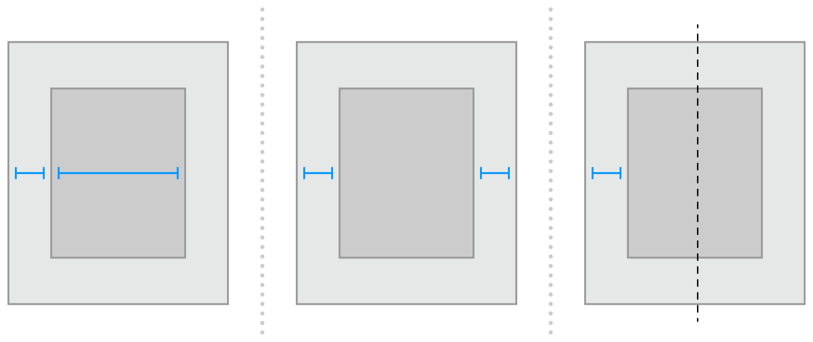
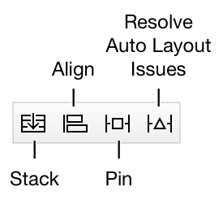
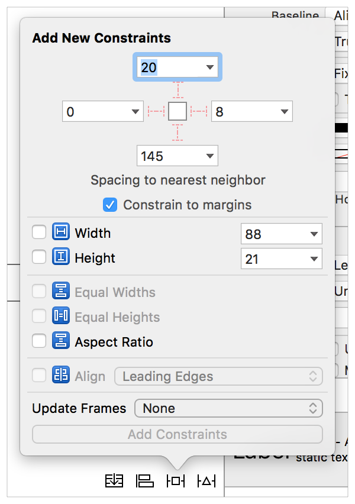

Auto Layout Guide (0) ---- Getting Started

原文链接：[https://developer.apple.com/library/content/documentation/UserExperience/Conceptual/AutolayoutPG/index.html#//apple_ref/doc/uid/TP40010853-CH7-SW1](https://developer.apple.com/library/content/documentation/UserExperience/Conceptual/AutolayoutPG/index.html#//apple_ref/doc/uid/TP40010853-CH7-SW1)

# 0 Getting Started - 开始

## 0.1 Understanding Auto Layout - 理解自动布局

Auto Layout dynamically calculates the size and position of all the views in your view hierarchy, based on constraints placed on those views. For example, you can constrain a button so that it is horizontally centered with an Image view and so that the button’s top edge always remains 8 points below the image’s bottom. If the image view’s size or position changes, the button’s position automatically adjusts to match.

自动布局自动的计算你的视图层级中的所有视图的尺寸和位置，基于放置在那些视图上的约束。例如，你可以约束一个按钮，让它与一个图像视图水平居中，并让这个按钮的顶部边沿始终少于这个按钮的底部8个点。如果图像视图的尺寸或位置改变，按钮的位置也自动的调节以匹配。

This constraint-based approach to design allows you to build user interfaces that dynamically respond to both internal and external changes.

这种基于约束的设计方法让你可以建立动态响应内部和外部变化的用户界面。

### 0.1.1 External Changes - 外部变化

External changes occur when the size or shape of your superview changes. With each change, you must update the layout of your view hierarchy to best use the available space. Here are some common sources of external change:

当父视图的尺寸或形状改变时，外部变化就发生了。每一次变更，你都必须更新你的视图层级的布局以最好的使用可用空间。这里是一些外部变化的普通来源：

- The user resizes the window (OS X). 
- The user enters or leaves Split View on an iPad (iOS). 
- The device rotates (iOS). 
- The active call and audio recording bars appear or disappear (iOS). 
- You want to support different size classes. 
- You want to support different screen sizes. 
- 用户改变了窗口的尺寸（OS X）。
- 用户在iPad上进入或离开Split View（iOS）。
- 设备旋转（iOS）。
- 电话通话中和音频录音中的提示栏出现或消失（iOS）。
- 你想要支持不同的尺寸类型。
- 你想要支持不同的屏幕尺寸。

Most of these changes can occur at runtime, and they require a dynamic response from your app. Others, like support for different screen sizes, represent the app adapting to different environments. Even through the screen size won’t typically change at runtime, creating an adaptive interface lets your app run equally well on an iPhone 4S, an iPhone 6 Plus, or even an iPad. Auto Layout is also a key component for supporting Slide Over and Split Views on the iPad.

这些变化大部分发生在运行时，它们需要一个来自你的app的动态响应。另外，就像要支持不同的屏幕尺寸一样，也要让app适应不同的环境。即使屏幕尺寸在运行时通常也不会改变，但创建一个有适应性的界面可以让你的app在iPhone 4S、iPhone 6 Plus、甚至iPad上运行得一样好。自动布局也是在iPad上支持Slide Over和Split Views的关键组件。

### 0.1.2 Internal Changes - 内部变化

Internal changes occur when the size of the views or controls in your user interface change.

当你的用户界面里的视图或控件的尺寸变化时，内部变化就发生了。

Here are some common sources of internal change:

这是一些内部变化的普通来源：

- The content displayed by the app changes. 
- The app supports internationalization. 
- The app supports Dynamic Type (iOS). 
- 内容显示被app修改。
- App支持国际化。
- App支持动态类型（iOS）。

When your app’s content changes, the new content may require a different layout than the old. This commonly occurs in apps that display text or images. For example, a news app needs to adjust its layout based on the size of the individual news articles. Similarly, a photo collage must handle a wide range of image sizes and aspect ratios.

当你的app的内容变化，新的内容可能需要一个与之前不同的布局。这通常会发生在显示文本或图片的app中。例如，一个新闻app需要基于单个新闻文章的尺寸调整其布局。类似的，照片拼贴类app必须处理大范围的图像尺寸和高宽比。

Internationalization is the process of making your app able to adapt to different languages, regions, and cultures. The layout of an internationalized app must take these differences into account and appear correctly in all the languages and regions that the app supports.

国际化就是让你的app能够适配不同的语言、地域和文化的过程。国际化的app的布局必须把这些不同放到账户里，并在app支持的所有的语言和地域都正确的显示。

Internationalization has three main effects on layout. First, when you translate your user interface into a different language, the labels require a different amount of space. German, for example, typically requires considerably more space than English. Japanese frequently requires much less.

国际化有三个主要的与布局有关的影响。首先，当你翻译你的用户界面到不同的语言时，标签需要不同大小的空间。德语，例如，通常需要比英语多得多的空间。日语则经常需要很少的空间。

Second, the format used to represent dates and numbers can change from region to region, even if the language does not change. Although these changes are typically more subtle than the language changes, the user interface still needs to adapt to the slight variation in size.

第二，用于展示日期和数字的格式可能随着地域不同而变化，即使语言并没有改变。尽管这些变化比语言的变化通常更微小，但是用户界面仍然需要在尺寸上适应这些细微的差异。

Third, changing the language can affect not just the size of the text, but the organization of the layout as well. Different languages use different layout directions. English, for example, uses a left-to-right layout direction, and Arabic and Hebrew use a right-to-left layout direction. In general, the order of the user interface elements should match the layout direction. If a button is in the bottom-right corner of the view in English, it should be in the bottom left in Arabic.

第三，变更语言影响的不仅仅是文本的尺寸，布局的组织也会有影响。不同的语言使用不同的布局方向。英语，例如，使用从左到右的布局方向，而阿拉伯语和希伯来语使用从右到左的布局方向。通常，用户界面元素的顺序应该匹配布局方向。如果一个按钮在英语中是在视图的右下角，那么它在阿拉伯语中应该是在左下角。

Finally, if your iOS app supports dynamic type, the user can change the font size used in your app. This can change both the height and the width of any textual elements in your user interface. If the user changes the font size while your app is running, both the fonts and the layout must adapt.

最后，如果你的iOS app支持动态类型，用户可以修改用在你的app中的字体大小。这就会改变你的用户界面上所有文本元素的高和宽。如果用户在你的app正在运行时改变字体大小，那么字体和布局都必须适配。

### 0.1.3 Auto Layout Versus Frame-Based Layout - 自动布局与基于框架的布局

There are three main approaches to laying out a user interface. You can programmatically lay out the user interface, you can use autoresizing masks to automate some of the responses to external change, or you can use Auto Layout.

有三种主要的方法可以布局用户界面。你可以编程布局用户界面，可以使用autoresizing masks自动化响应一些外部变化，或者你可以使用Auto Layout。

Traditionally, apps laid out their user interface by programmatically setting the frame for each view in a view hierarchy. The frame defined the view’s origin, height, and width in the superview’s coordinate system.

传统的方式是，app通过编程在视图层级中设置每一个视图的frame来布局它们的用户界面。这个frame地应为视图在其父视图坐标系统中的起始点、高度和宽度。

To lay out your user interface, you had to calculate the size and position for every view in your view hierarchy. Then, if a change occurred, you had to recalculate the frame for all the effected views.

要布局你的用户界面，你不得不计算视图层级中每个视图的尺寸和位置。然后，如果发生变化，你不得不重新计算所有影响到的视图的frame。

In many ways, programmatically defining a view’s frame provides the most flexibility and power. When a change occurs, you can literally make any change you want. Yet because you must also manage all the changes yourself, laying out a simple user interface requires a considerable amount of effort to design, debug, and maintain. Creating a truly adaptive user interface increases the difficulty by an order of magnitude.

在许多方法中，编程定义视图的frame提供了最大的灵活度和能力。当发生变化，你可以逐一做出任何想要的改变。但也正因为你必须自己管理所有的修改，布局一个简单的用户界面都需要花费相当打的精力来设计、调试和管理。创建一个真正自适应的用户界面会增加一个数量级的难度。

You can use autoresizing masks to help alleviate some of this effort. An autoresizing mask defines how a view’s frame changes when its superview’s frame changes. This simplifies the creation of layouts that adapt to external changes.

你可以使用autoresizing masks帮助减轻一些努力工作。Autoresizing masks定义了当父视图的frame变化时子视图的frame如何变化。这简化了适应外部变化的布局的创建工作。

However, autoresizing masks support a relatively small subset of possible layouts. For complex user interfaces, you typically need to augment the autoresizing masks with your own programmatic changes. Additionally, autoresizing masks adapt only to external changes. They do not support internal changes.

然而，autoresizing masks只支持可能的布局的一个相对小的子集。对于复杂的用户界面，你通常需要在autoresizing masks之外增加你自己的程序化的改变。另外，autoresizing masks只能适配外部变化。它们不支持内部变化。

Although autoresizing masks are just an iterative improvement on programmatic layouts, Auto Layout represents an entirely new paradigm. Instead of thinking about a view’s frame, you think about its relationships.

尽管autoresizing masks只是逐渐改善了程序化布局，Auto Layout则展示了一个全新的样式。不再考虑视图的frame，而是考虑视图的关系。

Auto Layout defines your user interface using a series of constraints. Constraints typically represent a relationship between two views. Auto Layout then calculates the size and location of each view based on these constraints. This produces layouts that dynamically respond to both internal and external changes.

Auto Layout使用一系列约束定义你的用户界面。约束通常表示两个视图之间的关系。然后Auto Layout基于这些约束计算每个视图的尺寸和定位。这会产生能动态响应内部和外部变化的布局。

The logic used to design a set of constraints to create specific behaviors is very different from the logic used to write procedural or object-oriented code. Fortunately, mastering Auto Layout is no different from mastering any other programming task. There are two basic steps: First you need to understand the logic behind constraint-based layouts, and then you need to learn the API. You’ve successfully performed these steps when learning other programming tasks. Auto Layout is no exception.

用于设计一些约束以创建具体行为的逻辑，与用于编写程序上的或面向对象的代码的逻辑，是非常的不同的。幸运的是，掌握Auto Layout与掌握任何其他编程任务并没有不同。有两个基本的步骤：首先你需要理解基于约束的布局背后的逻辑，然后你需要学习API。在学习其他编程任务时你已经成功的执行了这些步骤。那么Auto Layout没有例外。

The rest of this guide is designed to help ease your transition to Auto Layout. The [Auto Layout Without Constraints](https://developer.apple.com/library/content/documentation/UserExperience/Conceptual/AutolayoutPG/AutoLayoutWithoutConstraints.html#//apple_ref/doc/uid/TP40010853-CH8-SW1) chapter describes a high-level abstraction that simplifies the creation of Auto Layout backed user interfaces. The [Anatomy of a Constraint](https://developer.apple.com/library/content/documentation/UserExperience/Conceptual/AutolayoutPG/AnatomyofaConstraint.html#//apple_ref/doc/uid/TP40010853-CH9-SW1) chapter provides the background theory you need to understand to successfully interact with Auto Layout on your own. [Working with Constraints in Interface Builder](https://developer.apple.com/library/content/documentation/UserExperience/Conceptual/AutolayoutPG/WorkingwithConstraintsinInterfaceBuidler.html#//apple_ref/doc/uid/TP40010853-CH10-SW1) describes the tools for designing Auto Layout, and the [Programmatically Creating Constraints](https://developer.apple.com/library/content/documentation/UserExperience/Conceptual/AutolayoutPG/ProgrammaticallyCreatingConstraints.html#//apple_ref/doc/uid/TP40010853-CH16-SW1) and [Auto Layout Cookbook](https://developer.apple.com/library/content/documentation/UserExperience/Conceptual/AutolayoutPG/LayoutUsingStackViews.html#//apple_ref/doc/uid/TP40010853-CH3-SW1) chapters describe the API in detail. Finally, the [Auto Layout Cookbook](https://developer.apple.com/library/content/documentation/UserExperience/Conceptual/AutolayoutPG/LayoutUsingStackViews.html#//apple_ref/doc/uid/TP40010853-CH3-SW1) presents a wide range of sample layouts of varying levels of complexity, you can study and use in your own projects, and [Debugging Auto Layout](https://developer.apple.com/library/content/documentation/UserExperience/Conceptual/AutolayoutPG/TypesofErrors.html#//apple_ref/doc/uid/TP40010853-CH22-SW1) offers advice and tools for fixing things if anything goes wrong.

本指南的其余部分旨在帮助你轻松的过渡到Auto Layout。[Auto Layout Without Constraints](https://developer.apple.com/library/content/documentation/UserExperience/Conceptual/AutolayoutPG/AutoLayoutWithoutConstraints.html#//apple_ref/doc/uid/TP40010853-CH8-SW1)章节高度抽象的介绍了简化支持用户界面的Auto Layout的创建。[Anatomy of a Constraint](https://developer.apple.com/library/content/documentation/UserExperience/Conceptual/AutolayoutPG/AnatomyofaConstraint.html#//apple_ref/doc/uid/TP40010853-CH9-SW1)章节提供了你需要理解的背景理论，才能成功的自己与Auto Layout交互。[Working with Constraints in Interface Builder](https://developer.apple.com/library/content/documentation/UserExperience/Conceptual/AutolayoutPG/WorkingwithConstraintsinInterfaceBuidler.html#//apple_ref/doc/uid/TP40010853-CH10-SW1)介绍了设计Auto Layout的工具，而[Programmatically Creating Constraints](https://developer.apple.com/library/content/documentation/UserExperience/Conceptual/AutolayoutPG/ProgrammaticallyCreatingConstraints.html#//apple_ref/doc/uid/TP40010853-CH16-SW1)和[Auto Layout Cookbook](https://developer.apple.com/library/content/documentation/UserExperience/Conceptual/AutolayoutPG/LayoutUsingStackViews.html#//apple_ref/doc/uid/TP40010853-CH3-SW1)章节详细的介绍了API。最后[Auto Layout Cookbook](https://developer.apple.com/library/content/documentation/UserExperience/Conceptual/AutolayoutPG/LayoutUsingStackViews.html#//apple_ref/doc/uid/TP40010853-CH3-SW1)提供了广泛的不同复杂度的样例布局，你可以在你自己的工程中学习和使用，[Debugging Auto Layout](https://developer.apple.com/library/content/documentation/UserExperience/Conceptual/AutolayoutPG/TypesofErrors.html#//apple_ref/doc/uid/TP40010853-CH22-SW1)提供一些发生问题时进行修复的建议和工具。

## 0.2 Auto Layout Without Constraints - 不带约束的自动布局

Stack views provide an easy way to leverage the power of Auto Layout without introducing the complexity of constraints. A single stack view defines a row or column of user interface elements. The stack view arranges these elements based on its properties.

堆栈视图（Stack views）提供了一种简单的方法不用移入复杂的约束就可以影响自动布局的能力。一个简单的堆栈视图定义了一行或一列用户界面元素。堆栈视图按照这些元素的属性对它们进行排列。

- [axis](https://developer.apple.com/reference/uikit/uistackview/1616223-axis): ([UIStackView](https://developer.apple.com/reference/uikit/uistackview) only) defines the stack view’s orientation, either vertical or horizontal. 
- [orientation](https://developer.apple.com/reference/appkit/nsstackview/1488950-orientation): ([NSStackView](https://developer.apple.com/reference/appkit/nsstackview) only) defines the stack view’s orientation, either vertical or horizontal. 
- [distribution](https://developer.apple.com/reference/uikit/uistackview/1616233-distribution): defines the layout of the views along the axis. 
- [alignment](https://developer.apple.com/reference/uikit/uistackview/1616243-alignment): defines the layout of the views perpendicular to the stack view’s axis. 
- [spacing](https://developer.apple.com/reference/uikit/uistackview/1616225-spacing): defines the space between adjacent views. 
- [轴（axis）](https://developer.apple.com/reference/uikit/uistackview/1616223-axis)：（仅[UIStackView](https://developer.apple.com/reference/uikit/uistackview)）定义了堆栈视图的方向，垂直或水平。
- [方向（orientation）](https://developer.apple.com/reference/appkit/nsstackview/1488950-orientation)：（仅[NSStackView](https://developer.apple.com/reference/appkit/nsstackview)）定义了堆栈视图的方向，垂直或水平。
- [分布（distribution）](https://developer.apple.com/reference/uikit/uistackview/1616233-distribution)：定义了沿着轴的方向的视图的布局。 
- [准线（alignment）](https://developer.apple.com/reference/uikit/uistackview/1616243-alignment)：定义了视图布局到堆栈视图轴的垂直距离。
- [间距（spacing）](https://developer.apple.com/reference/uikit/uistackview/1616225-spacing)：定义了两个相邻视图之间的间隔。 

To use a stack view, in Interface Builder drag either a vertical or horizontal stack view onto the canvas. Then drag out the content and drop it into the stack.

要使用堆栈视图，在Interface Builder中拖动一个垂直或水平的堆栈视图到画布上。然后拖出内容将其丢入堆栈。

If an object has an intrinsic content size, it appears in the stack at that size. If it does not have an intrinsic content size, Interface Builder provides a default size. You can resize the object, and Interface Builder adds constraints to maintain its size.

如果一个对象有其固有的内容尺寸，它在堆栈中就会以该尺寸展示。如果没有固有内容尺寸，Interface Builder会提供一个默认尺寸。你可以重新确定该对象的大小，Interface Builder会添加约束控制其大小。

To further fine-tune the layout, you can modify the stack view’s properties using the Attributes inspector. For example, the following example uses an 8-point spacing and a Fills Equally distribution.

要进一步微调布局，你可以使用Attributes检查器修改堆栈视图的属性。例如，下面的例子使用8个点的间距和Fills Equally分布。

The stack view also bases its layout on the arranged views’ content-hugging and compression-resistance priorities. You can modify these using the Size inspector.

堆栈视图也会基于已排列视图的内容紧靠和压缩阻力属性设置其布局。你可以使用Size检查器修改它们。

>NOTE
>
>You can further modify the layout by adding constraints directly to the arranged views; however, you want to avoid any possible conflicts: As a general rule of thumb, if a view’s size defaults back to its intrinsic content size for a given dimension, you can safely add a constraint for that dimension. For more information on conflicting constraints, see [Unsatisfiable Layouts](https://developer.apple.com/library/content/documentation/UserExperience/Conceptual/AutolayoutPG/ConflictingLayouts.html#//apple_ref/doc/uid/TP40010853-CH19-SW1).
>
>注意
>
>你可以通过直接在以排列的视图上添加约束来进一步修改布局；然而，你必须避免任何可能的冲突：作为一个概述的通用规则，如果一个视图的尺寸默认会回到给定范围的固有内容尺寸，你可以安全的添加一个该范围的约束。关于有冲突的约束的更多信息，参见[Unsatisfiable Layouts](https://developer.apple.com/library/content/documentation/UserExperience/Conceptual/AutolayoutPG/ConflictingLayouts.html#//apple_ref/doc/uid/TP40010853-CH19-SW1)。

Additionally, you can nest stack views inside other stack views to build more complex layouts.

另外，你可以将一个堆栈视图嵌入另一个堆栈视图，以创建更加复杂的布局。

In general, use stack views to manage as much of your layout as possible. Resort to creating constraints only when you cannot achieve your goals with stack views alone.

通常，应该尽可能多的使用堆栈视图管理你的布局。只有当你无法单独通过堆栈视图达到目的时才使用创造约束的招数。

For more information on using stack views, see [*UIStackView Class Reference*](https://developer.apple.com/reference/uikit/uistackview) or [*NSStackView Class Reference*](https://developer.apple.com/reference/appkit/nsstackview).

关于使用堆栈视图的更多信息，参见[*UIStackView Class Reference*](https://developer.apple.com/reference/uikit/uistackview)或[*NSStackView Class Reference*](https://developer.apple.com/reference/appkit/nsstackview)。

>NOTE
>
>Although the creative use of nested stack views can produce complex user interfaces, you cannot completely escape the need for constraints. At a bare minimum, you always need constraints to define the position (and possibly the size) of the outermost stack.
>
>注意
>
>尽管创造性的使用嵌入的堆栈视图可以制作复杂用户界面，但是你无法完全避开约束的需求。最低限度的情况下，你也总是需要约束来确定最外层堆栈视图的位置（可能还有大小）。

## 0.3 Anatomy of a Constraint - 约束剖析

The layout of your view hierarchy is defined as a series of linear equations. Each constraint represents a single equation. Your goal is to declare a series of equations that has one and only one possible solution.

你的视图层级被定义为一系列线性方程。每一个约束表示了一个方程。你的目标是声明一系列有且只有一个可能的解决方案的方程。

A sample equation is shown below.

下面是一个方程样例。

This constraint states that the red view’s leading edge must be 8.0 points after the blue view’s trailing edge. Its equation has a number of parts:

这个约束说明了红色的视图的前部边沿必须在蓝色视图的尾部边沿8个点之后。这个方程由以下部分组成：

- **Item 1**. The first item in the equation—in this case, the red view. The item must be either a view or a layout guide. 
- **Attribute 1**. The attribute to be constrained on the first item—in this case, the red view’s leading edge. 
- **Relationship**. The relationship between the left and right sides. The relationship can have one of three values: equal, greater than or equal, or less than or equal. In this case, the left and right side are equal. 
- **Multiplier**. The value of attribute 2 is multiplied by this floating point number. In this case, the multiplier is 1.0. 
- **Item 2**. The second item in the equation—in this case, the blue view. Unlike the first item, this can be left blank. 
- **Attribute 2**. The attribute to be constrained on the second item—in this case, the blue view’s trailing edge. If the second item is left blank, this must be Not an Attribute. 
- **Constant**. A constant, floating-point offset—in this case, 8.0. This value is added to the value of attribute 2. 
- **Item 1**。方程中的第一个项目——这个例子中，就是红色的视图。这个项目必须是一个视图或者一个布局引导。 
- **Attribute 1**。第一个项目中被约束的属性——在这个例子中，就是红色视图的前部边沿。 
- **Relationship**。左边和右边之间的关系。这个关系可以是下面三种情况之一：等于，大于等于，或小于等于。在这个例子中，左边和右边是相等的。 
- **Multiplier**。属性2的值需要乘以这个浮点数。在这个例子中，这个乘数是1.0。 
- **Item 2**。方程中的第二个项目——在这个例子中，就是蓝色的视图。与第一项不同，它可以留空。
- **Attribute 2**。第二个项目中被约束的视图——在这个例子总，就是蓝色视图的尾部边沿。如果第二个项目留空，那这里必须是 Not An Attribute。 
- **Constant**。 一个固定的，浮点型的偏移量——在这个例子中，是8.0。这个值会被添加到属性2的值。

Most constraints define a relationship between two items in our user interface. These items can represent either views or layout guides. Constraints can also define the relationship between two different attributes of a single item, for example, setting an aspect ratio between an item’s height and width. You can also assign constant values to an item’s height or width. When working with constant values, the second item is left blank, the second attribute is set to Not An Attribute, and the multiplier is set to 0.0.

大部分约束定义了我们的用户界面上的两个项目的关系。这些项目可以表示视图或布局引导。约束也可以定义一个单独项目的两个不同属性之间的关系，例如，设置一个项目的高和宽之间的纵横比。你也可以把一个项目的高或库看设置成固定的值。当采用固定值时，第二个项目被留空，第二个属性被设置成 Not An Attribute，乘数被设置成 0.0。

### 0.3.1 Auto Layout Attributes - 自动布局属性

In Auto Layout, the attributes define a feature that can be constrained. In general, this includes the four edges (leading, trailing, top, and bottom), as well as the height, width, and vertical and horizontal centers. Text items also have one or more baseline attributes.

在自动布局中，属性定义了可以被约束的特性。通常，包括四个边沿（前部、尾部、顶部和底部），以及高、宽、垂直中心和水平中心。文本项目也有一个或多个基本属性。

For the complete list of attributes, see the [NSLayoutAttribute](https://developer.apple.com/reference/appkit/nslayoutattribute) enum.

关于属性的完整列表，参见[NSLayoutAttribute](https://developer.apple.com/reference/appkit/nslayoutattribute)枚举。

>NOTE
>
>Although both OS X and iOS use the `NSLayoutAttribute` enum, they define slightly different sets of values. To see the full list of attributes, be sure you are looking at the correct platform’s documentation.
>
>注意
>
>尽管 OS X 和 iOS 都使用`NSLayoutAttribute`枚举，它们对值的定义略有不同。要查看属性的完整列表，确保你正在查看正确平台的文档。

### 0.3.2 Sample Equations - 样本方程

The wide range of parameters and attributes available to these equations lets you create many different types of constraints. You can define the space between views, align the edge of views, define the relative size of two views, or even define a view’s aspect ratio. However, not all attributes are compatible.

可用于这些方程的参数和属性的范围很大，可以创建许多不同类型的约束。你可以定义视图之间的间隔，对齐视图的边沿，定义两个视图的相关尺寸，或者甚至定义一个视图的宽高比。然而，并不是所有的属性都是兼容的。

There are two basic types of attributes. Size attributes (for example, Height and Width) and location attributes (for example, Leading, Left, and Top). Size attributes are used to specify how large an item is, without any indication of its location. Location attributes are used to specify the location of an item relative to something else. However, they carry no indication of the item’s size.

有两种基本属性类型。尺寸属性（例如，Height和Width）和位置属性（例如，Leading、Left和Top）。尺寸属性用于指明一个项目有多大，并不暗含其位置。位置属性用于指明一个项目区其他东西之间的位置关系。但是，它们会暗含项目的大小。

With these differences in mind, the following rules apply:

考虑到这些差异，可以应用以下规则：

- You cannot constrain a size attribute to a location attribute. 
- You cannot assign constant values to location attributes. 
- You cannot use a nonidentity multiplier (a value other than 1.0) with location attributes. 
- For location attributes, you cannot constrain vertical attributes to horizontal attributes. 
- For location attributes, you cannot constrain Leading or Trailing attributes to Left or Right attributes. 
- 你不能约束一个尺寸属性到位置属性。
- 你不能设置一个固定值到位置属性。
- 你不能对位置属性使用一个非同一性乘数（不等于1.0的值）。
- 对于位置属性，你不能约束垂直属性到水平属性。
- 对于位置属性，你不能约束 Leading 或 Trailing 属性到 Left 或 Right 属性。

For example, setting an item’s Top to the constant value 20.0 has no meaning without additional context. You must always define an item’s location attributes in relation to other items, for example, 20.0 points below the superview’s Top. However, setting an item’s Height to 20.0 is perfectly valid. For more information, see [Interpreting Values](https://developer.apple.com/library/content/documentation/UserExperience/Conceptual/AutolayoutPG/AnatomyofaConstraint.html#//apple_ref/doc/uid/TP40010853-CH9-SW22).

例如，设置一个项目的 Top 到固定值 20.0 而没有其他上下文是没有意义的。你必须总是定义一个项目与其他项目关系的位置属性，例如，在父视图的 Top 以下 20.0 点。然而，设置一个项目的 Height 为 20.0 就非常完美。更多信息，参见[Interpreting Values](https://developer.apple.com/library/content/documentation/UserExperience/Conceptual/AutolayoutPG/AnatomyofaConstraint.html#//apple_ref/doc/uid/TP40010853-CH9-SW22)。

Listing 3-1 shows sample equations for a variety of common constraints.

表3-1展示了一些常见类型的约束的样例方程。

>NOTE
>
>All the example equations in this chapter are presented using pseudocode. To see real constraints using real code, see [Programmatically Creating Constraints](https://developer.apple.com/library/content/documentation/UserExperience/Conceptual/AutolayoutPG/ProgrammaticallyCreatingConstraints.html#//apple_ref/doc/uid/TP40010853-CH16-SW1) or [Auto Layout Cookbook](https://developer.apple.com/library/content/documentation/UserExperience/Conceptual/AutolayoutPG/LayoutUsingStackViews.html#//apple_ref/doc/uid/TP40010853-CH3-SW1).
>
>注意
>
>本章中所有的例子方程都是用伪代码表示的。要使用真实代码查看真正的约束，参见[Programmatically Creating Constraints](https://developer.apple.com/library/content/documentation/UserExperience/Conceptual/AutolayoutPG/ProgrammaticallyCreatingConstraints.html#//apple_ref/doc/uid/TP40010853-CH16-SW1) or [Auto Layout Cookbook](https://developer.apple.com/library/content/documentation/UserExperience/Conceptual/AutolayoutPG/LayoutUsingStackViews.html#//apple_ref/doc/uid/TP40010853-CH3-SW1)。

**Listing 3-1**Sample equations for common constraints 常见约束的样例方程

- // Setting a constant height 设置固定高度
- View.height = 0.0 * NotAnAttribute + 40.0
- ​
- // Setting a fixed distance between two buttons 在两个按钮中设置一个固定的距离
- Button_2.leading = 1.0 * Button_1.trailing + 8.0
- ​
- // Aligning the leading edge of two buttons 对齐两个按钮的前部边沿
- Button_1.leading = 1.0 * Button_2.leading + 0.0
- ​
- // Give two buttons the same width 把两个按钮设置成相同的宽度
- Button_1.width = 1.0 * Button_2.width + 0.0
- ​
- // Center a view in its superview 把一个视图放在其父视图的中心
- View.centerX = 1.0 * Superview.centerX + 0.0
- View.centerY = 1.0 * Superview.centerY + 0.0
- ​
- // Give a view a constant aspect ratio 给一个视图固定宽高比
- View.height = 2.0 * View.width + 0.0

### 0.3.3 Equality, Not Assignment - 相等，而不是赋值

It’s important to note that the equations shown in Note represent equality, not assignment.

需要特别注意的是，在Note中展示的方程表示相等，而不是赋值。

When Auto Layout solves these equations, it does not just assign the value of the right side to the left. Instead, it calculates the value for both attribute 1 and attribute 2 that makes the relationship true. This means we can often freely reorder the items in the equation. For example, the equations in Listing 3-2 are identical to their counterparts in Note.

当 Auto Layout 处理这些方程时，它不是仅仅将右边的值赋给左边。相反，它计算属性1和属性2的值让这个关系成立。这意味着我们通常可以自由的调整方程中项目的顺序。例如，表3-2中的方程与注释中对应的方程相同。

**Listing 3-2**Inverted equations 倒置的方程

- // Setting a fixed distance between two buttons 在两个按钮中设置一个固定的距离
- Button_1.trailing = 1.0 * Button_2.leading - 8.0
- ​
- // Aligning the leading edge of two buttons 对齐两个按钮的前部边沿
- Button_2.leading = 1.0 * Button_1.leading + 0.0
- ​
- // Give two buttons the same width 把两个按钮设置成相同的宽度
- Button_2.width = 1.0 * Button.width + 0.0
- ​
- // Center a view in its superview 把一个视图放在其父视图的中心
- Superview.centerX = 1.0 * View.centerX + 0.0
- Superview.centerY = 1.0 * View.centerY + 0.0
- ​
- // Give a view a constant aspect ratio 给一个视图固定宽高比
- View.width = 0.5 * View.height + 0.0

>NOTE
>
>When reordering the items, make sure you invert the multiplier and the constant. For example, a constant of 8.0 becomes -8.0. A multiplier of 2.0 becomes 0.5. Constants of 0.0 and multipliers of 1.0 remain unchanged.
>
>注意
>
>当你调整项目的顺序时，确保你将乘数和常量倒置了。例如，常量 8.0 变成了 -8.0。乘数 2.0 变成了 0.5。常量 0.0 和乘数 1.0 保持不变。

You will find that Auto Layout frequently provides multiple ways to solve the same problem. Ideally, you should choose the solution that most clearly describes your intent. However, different developers will undoubtedly disagree about which solution is best. Here, being consistent is better than being right. You will experience fewer problems in the long run if you choose an approach and always stick with it. For example, this guide uses the following rules of thumb:

你会发现 Auto Layout 经常提供乘法解决相同的问题。理想的情况下，你应该选择能最清楚的描述你的意图的解决方案。然而，不同的开发者毫无疑问的会不同意哪个解决方案才是最好的。在这里，保持一致比保持正确要更好。如果你选择一个方法，并且总是粘贴它，在长时间运行中你会遇到更少的问题。例如，本指南使用下面的缩略规则：

1. Whole number multipliers are favored over fractional multipliers. 
2. Positive constants are favored over negative constants. 
3. Wherever possible, views should appear in layout order: leading to trailing, top to bottom. 

>

1. 整数乘数优于分数乘数。
2. 正数乘数优于负数乘数。
3. 无论是否可能，视图都会按照布局顺序展示：从前部到尾部，从顶部到底部。

### 0.3.4 Creating Nonambiguous, Satisfiable Layouts - 创建无歧义的，可满足的布局

When using Auto Layout, the goal is to provide a series of equations that have one and only one possible solution. Ambiguous constraints have more than one possible solution. Unsatisfiable constraints don’t have valid solutions.

当使用 Auto Layout 时，目标是提供一系列有且只有一种可能解决方案的方程。有歧义的约束会导致有布置一种可能解决方案。无法满足的约束将没有可用的解决方案。

In general, the constraints must define both the size and the position of each view. Assuming the superview’s size is already set (for example, the root view of a scene in iOS), a nonambiguous, satisfiable layout requires two constraints per view per dimension (not counting the superview). However, you have a wide range of options when it comes to choosing which constraints you want to use. For example, the following three layouts all produce nonambiguous, satisfiable layouts (only the horizontal constraints are shown):

通常，约束必须定义每个视图的尺寸和位置。假如父视图的尺寸已经设置好（例如，iOS中一个场景的根视图），无歧义的、可满足的布局需要对每个视图每个维度有两条约束（不算父视图的）。但是，在选择要使用哪个约束时，你有广泛的选择权。例如，下面三个布局都做出了无歧义、可满足的布局（只展示了水平的约束）：

- The first layout constrains the view’s leading edge relative to its superview’s leading edge. It also gives the view a fixed width. The position of the trailing edge can then be calculated based on the superview’s size and the other constraints. 
- The second layout constrains the view’s leading edge relative to its superview’s leading edge. It also constrains the view’s trailing edge relative to the superview’s trailing edge. The view’s width can then be calculated based on the superview’s size and the other constraints. 
- The third layout constrains the view’s leading edge relative to its superview’s leading edge. It also center aligns the view and superview. Both the width and trailing edge’s position can then be calculated based on the superview’s size and the other constraints. 
- 第一个布局约束了视图的前部边沿与其父视图的前部边沿的关系。并给了视图一个固定的宽度。然后尾部边沿的位置就可以基于父视图的尺寸和其他约束计算出来。
- 第二个布局约束了视图的前部边沿与其父视图的前部边沿的关系。并约束了该视图的尾部边沿与其父视图的尾部边沿的关系。然后视图的宽度就可以基于父视图的尺寸和其他约束计算出来。
- 第三个布局约束了视图的前部边沿与其父视图的前部边沿的关系。并将该视图与父视图中心对齐。那么宽度和尾部边沿的位置都可以基于父视图的尺寸和其他约束计算出来。

Notice that each layout has one view and two horizontal constraints. In each case, the constraints fully define both the width and the horizontal position of the view. That means all of the layouts produce a nonambiguous, satisfiable layout along the horizontal axis. However, these layouts are not equally useful. Consider what happens when the superview’s width changes.

注意，每个布局有一个视图和两个水平的约束。在每个例子中，约束完全的定义出了该视图的宽度和水平位置。这意味着所有这些布局都在水平轴上做出了无歧义的、可满足的布局。但是这些布局并不是同样有用。可以设想当父视图的宽度变化时会发生什么。

In the first layout, the view’s width does not change. Most of the time, this is not what you want. In fact, as a general rule, you should avoid assigning constant sizes to views. Auto Layout is designed to create layouts that dynamically adapt to their environment. Whenever you give a view a fixed size, you short circuiting that ability.

在第一个布局中，视图的宽度不会变化。大部分时候，这不是你想要的。实际上，作为一个通用的规则，你应该避免给视图设置常量尺寸。Auto Layout被设计出来就是用于创建可以动态适配它们的环境的布局。无论何时你把一个视图定成固定的尺寸，你都会丧失这个能力。

It may not be obvious, but the second and third layouts produce identical behaviors: They both maintain a fixed margin between the view and its superview as the superview’s width changes. However, they are not necessarily equal. In general, the second example is easier to understand, but the third example may be more useful, especially when you are center aligning a number of items. As always, choose the best approach for your particular layout.

这可能并不明显，但是第二个和第三个布局就会产生相同的行为：在父视图的宽度变化时，它们在视图和它的父视图之间都保持了固定的缩进。但是它们也并非必定相等。通常，第二个例子更容易理解，但是第三个例子可能更有用，特别是当你将多个项目中心对齐时。一如既往，希望你为你的特殊的布局选择最好的方法。

Now consider something a little more complicated. Imagine you want to display two views, side by side, on an iPhone. You want to make sure that they have a nice margin on all sides and that they always have the same width. They should also correctly resize as the device rotates.

现在假设更复杂一点的情况。想象你要显示两个视图，一个接一个，在iPhone上。你想要确保它们在所有的边都有一个良好的缩进，并且它们有相同的宽度。当设备旋转时它们也应该正确的调整大小。

The following illustrations show the views, in portrait and landscape orientation:

下面的插图展示了在横向和竖向时的视图：

So what should these constraints look like? The following illustration shows one straightforward solution:

那么这些约束应该像什么样呢？下面的插图展示了一个简单的解决方案：

The above solution uses the following constraints:

上面的解决方案使用了下面的约束：

- // Vertical Constraints 垂直约束
- Red.top = 1.0 * Superview.top + 20.0
- Superview.bottom = 1.0 * Red.bottom + 20.0
- Blue.top = 1.0 * Superview.top + 20.0
- Superview.bottom = 1.0 * Blue.bottom + 20.0
- ​
- // Horizontal Constraints 垂直约束
- Red.leading = 1.0 * Superview.leading + 20.0
- Blue.leading = 1.0 * Red.trailing + 8.0
- Superview.trailing = 1.0 * Blue.trailing + 20.0
- Red.width = 1.0 * Blue.width + 0.0

Following the earlier rule of thumb, this layout has two views, four horizontal constraints, and four vertical constraints. While this isn’t an infallible guide, it is a quick indication that you’re on the right track. More importantly, the constraints uniquely specify both the size and the location of both of the views, producing a nonambiguous, satisfiable layout. Remove any of these constraints, and the layout becomes ambiguous. Add additional constraints, and you risk introducing conflicts.

按照前面的简略规则，这个布局有两个视图，四条水平约束和四条垂直约束。虽然这不是一个可靠的指南，但它可以快速的引导你到正确的轨道上。更重要的是，这些约束唯一的指定了这两个视图的尺寸和位置，产生了无歧义的、可满足的布局。移除这些约束的任意一个，这个布局就会变得有歧义。添加额外的约束，你就会有引入冲突的风险。

Still, this is not the only possible solution. Here is an equally valid approach:

不过，这仍不是唯一的解决方案。这也有一个同样的可用方法：

Instead of pinning the top and bottom of the blue box to its superview, you align the top of the blue box with the top of the red box. Similarly, you align the bottom of the blue box with the bottom of the red box. The constraints are shown below.

不再关注蓝色盒子到其父视图的顶部和底部，而是将蓝色盒子的顶部与红色盒子的顶部对齐。类似的，你可以将蓝色盒子和底部与红色盒子的底部对齐。下面是约束的展示。

- // Vertical Constraints 垂直约束
- Red.top = 1.0 * Superview.top + 20.0
- Superview.bottom = 1.0 * Red.bottom + 20.0
- Red.top = 1.0 * Blue.top + 0.0
- Red.bottom = 1.0 * Blue.bottom + 0.0
- ​
- //Horizontal Constraints 水平约束
- Red.leading = 1.0 * Superview.leading + 20.0
- Blue.leading = 1.0 * Red.trailing + 8.0
- Superview.trailing = 1.0 * Blue.trailing + 20.0
- Red.width = 1.0 * Blue.width + 0.0

The example still has two views, four horizontal constraints, and four vertical constraints. It still produces a nonambiguous, satisfiable layout.

这个例子仍然有两个视图，四条水平约束，以及四条垂直约束。这仍然产生了一个无歧义的、可满足的布局。

>BUT WHICH IS BETTER?
>
>哪个更好？
>
>These solutions both produce valid layouts. So which is better?
>
>这些解决方案都产生了可用的布局。那么哪个更好呢？
>
>Unfortunately, it is virtually impossible to objectively prove that one approach is strictly superior to the other. Each has its own strengths and weaknesses.
>
>很不幸的是，实际上不可能客观的证明一种方法严格的优于另一种方法。每个方法都有它的的长处和弱点。
>
>The first solution is more robust when a view is removed. Removing a view from the view hierarchy also removes all the constraints that reference that view. So, if you remove the red view, the blue view is left with three constraints holding it in place. You need to add only a single constraint and you have a valid layout again. In the second solution, removing the red view would leave the blue view with only a single constraint.
>
>第一个解决方案当视图被移动是会更强强壮。从视图层级移除一个视图也会移除关联到这个视图的所有约束。那么，如果你移除红色的视图，蓝色的视图会被三条约束控制保持在那个位置上。你只需要添加一条约束，你就再次有了一个可用的布局。在第二个解决方案中，移除红色视图将导致蓝色视图只有一个约束。
>
>On the other hand, in the first solution, If you want the top and bottom of the views to align, you must make sure their top and bottom constraints use the same constant value. If you change one constant, you must remember to change the other as well.
>
>从另一个方案面，在第一个解决方案中，如果你想要视图的顶部和底部对齐，你必须确保它们的顶部和底部使用相同的常量值。如果你修改了一个常量，你不许记得也去改其他代码。

### 0.3.5 Constraint Inequalities - 约束不等式

So far, all of the samples have shown constraints as equalities, but this is only part of the story. Constraints can represent inequalities as well. Specifically, the constraint’s relationship can be equal to, greater than or equal to, or less than or equal to.

到现在为止，所有的样例展示的约束都是等式，但是这只是冰山一角。约束也可以代表不等式。特别的，约束的关系可以是相等，大于等于，或者小于等于。

For example, you can use constraints to define the minimum or maximum size for a view (Listing 3-3).

例如，你可以使用约束定义视图的最大或最小尺寸（表3-3）。

**Listing 3-3**Assigning a minimum and maximum size

- // Setting the minimum width 设置最小宽度
- View.width >= 0.0 * NotAnAttribute + 40.0
- ​
- // Setting the maximum width 设置最大宽度
- View.width <= 0.0 * NotAnAttribute + 280.0

As soon as you start using inequalities, the two constraints per view per dimension rule breaks down. You can always replace a single equality relationship with two inequalities. In Listing 3-4, the single equal relationship and the pair of inequalities produce the same behavior.

当你开始使用不等式，每个视图每个维度两条约束的规则就被打破了。你可以将一个相等关系替换成两个不等式。在表3-4中，单个相等关系和那一对不等式产生了相同的行为。

**Listing 3-4**Replacing a single equal relationship with two inequalities

- // A single equal relationship 一个相等关系
- Blue.leading = 1.0 * Red.trailing + 8.0
- ​
- // Can be replaced with two inequality relationships 可以替换成两个不等关系
- Blue.leading >= 1.0 * Red.trailing + 8.0
- Blue.leading <= 1.0 * Red.trailing + 8.0

The inverse is not always true, because two inequalities are not always equivalent to a single equals relationship. For example, the inequalities in Listing 3-3 limit the range of possible values for the view’s width—but by themselves, they do not define the width. You still need additional horizontal constraints to define the view’s position and size within this range.

反过来则总是不能成立，因为两个不等式并不是总是等价于一个相等关系。例如，在表3-3中的不等式限制了视图宽度的可能值范围——但是仅靠它们自己，它们并没有定义宽度。你仍然需要附加水平约束以定义视图的位置和在这个范围内的尺寸。

### 0.3.6 Constraint Priorities - 约束优先级

By default, all constraints are required. Auto Layout must calculate a solution that satisfies all the constraints. If it cannot, there is an error. Auto Layout prints information about the unsatisfiable constraints to the console, and chooses one of the constraints to break. It then recalculates the solution without the broken constraint. For more information, see [Unsatisfiable Layouts](https://developer.apple.com/library/content/documentation/UserExperience/Conceptual/AutolayoutPG/ConflictingLayouts.html#//apple_ref/doc/uid/TP40010853-CH19-SW1).

默认情况下，所有的约束都是必须的。Auto Layout必须计算满足所有约束的解决方案。如果不能实现，那就有错了。Auto Layout会在控制台打印出无法满足的约束的相关信息，并且选择其中一条约束断开它。然后重新计算没有已断开约束的解决方案。更多信息，参见[Unsatisfiable Layouts](https://developer.apple.com/library/content/documentation/UserExperience/Conceptual/AutolayoutPG/ConflictingLayouts.html#//apple_ref/doc/uid/TP40010853-CH19-SW1)。

You can also create optional constraints. All constraints have a priority between 1 and 1000. Constraints with a priority of 1000 are required. All other constraints are optional.

你也可以创建可选的约束。所有约束有一个1-1000之间的权重。权重为1000的约束是必须的。所有其他约束都是可选的。

When calculating solutions, Auto Layout attempts to satisfy all the constraints in priority order from highest to lowest. If it cannot satisfy an optional constraint, that constraint is skipped and it continues on to the next constraint.

当计算解决方案时，Auto Layout试图按照权重从高到低的顺序满足所有约束。如果不能满足一条可选约束，这个约束就会被跳过，并从下一条约束继续。

Even if an optional constraint cannot be satisfied, it can still influence the layout. If there is any ambiguity in the layout after skipping the constraint, the system selects the solution that comes closest to the constraint. In this way, unsatisfied optional constraints act as a force pulling views towards them.

即使一条可选约束不能被满足，它仍然可以影响布局。如果在跳过该约束之后布局中有任何歧义，系统都会选择最接近约束的方案。以这种方式，无法满足的可选约束会强制将视图拉向它们。

Optional constraints and inequalities often work hand-in-hand. For example, in Listing 3-4 you can provide different priorities for the two inequalities. The greater-than-or-equal relationship could be required (priority of 1000), and the less-than-or-equal relationship has a lower priority (priority 250). This means that the blue view cannot be closer than 8.0 points from the red. However, other constraints could pull it farther away. Still, the optional constraint pulls the blue view towards the red view, ensuring that it is as close as possible to the 8.0-point spacing, given the other constraints in the layout.

可选约束和不等式通常一起工作。例如，在表3-4中你可以给两个不等式提供不同的权重。大于等于的关系可以是必须的（权重为1000），而小于等于的关系有一个更低的权重（权重为250）。这意味着蓝色的视图与红色的距离不能小于8.0。但是，其他约束可能将其拉得更远。不过可选约束仍然会将蓝色的视图拉向红色的视图，在给定布局中其他约束时，确保它尽可能的靠近8.0个点的距离。

>NOTE
>
>Don’t feel obligated to use all 1000 priority values. In fact, priorities should general cluster around the system-defined low (250), medium (500), high (750), and required (1000) priorities. You may need to make constraints that are one or two points higher or lower than these values, to help prevent ties. If you’re going much beyond that, you probably want to reexamine your layout’s logic.
>
>For a list of the predefined constraint constants on iOS, see the [UILayoutPriority](https://developer.apple.com/reference/uikit/uilayoutpriority) enum. For OS X, see the Layout Priorities constants.
>
>注意
>
>不要觉得应该全部都使用1000权重值。事实上，权重通常应该是系统定义的集合：低（250），中（500），高（750），以及必须（1000）。你可能需要让约束比这些值高或低一两个点，以避免纠结。如果你要做的不止于此，那么你可能要重新检查你的布局逻辑了。
>
>关于在iOS上预定义的约束常量列表，参见[UILayoutPriority](https://developer.apple.com/reference/uikit/uilayoutpriority)枚举。在OS X上，参见 Layout Priorities 常量。

### 0.3.7 Intrinsic Content Size - 固有的内容尺寸

So far, all of the examples have used constraints to define both the view’s position and its size. However, some views have a natural size given their current content. This is referred to as their *intrinsic content size*. For example, a button’s intrinsic content size is the size of its title plus a small margin.

到目前为止，所有的例子都使用了约束定义视图的位置和尺寸。然而，某些视图由它们的当前内容给出一个自然尺寸。这被称之为它们的*固有内容尺寸*。例如，一个按钮的固有内容尺寸是它的标题的尺寸加上一个小的页边留白。

Not all views have an intrinsic content size. For views that do, the intrinsic content size can define the view’s height, its width, or both. Some examples are listed in Table 3-1.

并不是所有的视图都有固有内容尺寸。对于有固有内容尺寸的视图，这个尺寸可以定义视图的高，宽，或者高和宽。表3-1中列出了一些例子。

**Table 3-1**Intrinsic content size for common controls 常见控件的固有内容尺寸

| View                                     | Intrinsic content size                   |
| ---------------------------------------- | ---------------------------------------- |
| UIView and NSView                        | No intrinsic content size.               |
| Sliders                                  | Defines only the width (iOS).Defines the width, the height, or both—depending on the slider’s type (OS X). |
| Labels, buttons, switches, and text fields | Defines both the height and the width.   |
| Text views and image views               | Intrinsic content size can vary.         |

| 视图                                      | 固有内容尺寸                   |
| ---------------------------------------- | ---------------------------------------- |
| UIView and NSView                        | 没有固有内容尺寸。             |
| Sliders                                  | 只定义了宽度（iOS）。定义了宽度、高度、或两者都有——取决于滑块的类型（OS X）。|
| Labels, buttons, switches, and text fields | 定义了宽度和高度。   |
| Text views and image views               | 固有内容大小可变化。        |

The intrinsic content size is based on the view’s current content. A label or button’s intrinsic content size is based on the amount of text shown and the font used. For other views, the intrinsic content size is even more complex. For example, an empty image view does not have an intrinsic content size. As soon as you add an image, though, its intrinsic content size is set to the image’s size.

固有内容尺寸是基于视图的当前内容的。标签或按钮的固有内容尺寸基于展示的文本的数量和使用的字体。对于其他视图，固有内容尺寸甚至更加复杂。例如，空的图像视图并没有固有内容尺寸。当你添加图像的时候，它的固有内容尺寸就被设置成了图像的尺寸。

A text view’s intrinsic content size varies depending on the content, on whether or not it has scrolling enabled, and on the other constraints applied to the view. For example, with scrolling enabled, the view does not have an intrinsic content size. With scrolling disabled, by default the view’s intrinsic content size is calculated based on the size of the text without any line wrapping. For example, if there are no returns in the text, it calculates the height and width needed to layout the content as a single line of text. If you add constraints to specify the view’s width, the intrinsic content size defines the height required to display the text given its width.

文本视图的固有内容尺寸可以变化，取决于内容、是否启用滚动以及其他应用在视图上的约束。例如，当启用滚动时，视图就没有固有内容尺寸。当禁用滚动时，视图的固有内容尺寸默认基于不含任何换行的文本尺寸计算。例如，如果在文本中没有回车，它会按照单行文本布局内容计算所需的宽度和高度。如果你添加约束指定视图的宽度，固有内容尺寸仅定义了按照给定宽度显示文本所需的高度。

Auto Layout represents a view’s intrinsic content size using a pair of constraints for each dimension. The content hugging pulls the view inward so that it fits snugly around the content. The compression resistance pushes the view outward so that it does not clip the content.

Auto Layout 为每个尺寸使用一对约束表示视图的固有内容尺寸。内容紧靠会将视图拉近，以致于它会紧紧的贴着内容。压缩阻力会将视图推远，以致于它不会裁剪内容。

These constraints are defined using the inequalities shown in Listing 3-5. Here, the `IntrinsicHeight` and `IntrinsicWidth` constants represent the height and width values from the view’s intrinsic content size.

这些约束使用表3-5中展示的不等式定义。这里，`IntrinsicHeight`和`IntrinsicWidth`常量表示来自于视图的固有内容尺寸的高度和宽度值。

**Listing 3-5**Compression-Resistance and Content-Hugging equations 压缩阻力和内容紧靠

- // Compression Resistance 压缩阻力
- View.height >= 0.0 * NotAnAttribute + IntrinsicHeight
- View.width >= 0.0 * NotAnAttribute + IntrinsicWidth
- ​
- // Content Hugging 内容紧靠
- View.height <= 0.0 * NotAnAttribute + IntrinsicHeight
- View.width <= 0.0 * NotAnAttribute + IntrinsicWidth

Each of these constraints can have its own priority. By default, views use a 250 priority for their content hugging, and a 750 priority for their compression resistance. Therefore, it’s easier to stretch a view than it is to shrink it. For most controls, this is the desired behavior. For example, you can safely stretch a button larger than its intrinsic content size; however, if you shrink it, its content may become clipped. Note that Interface Builder may occasionally modify these priorities to help prevent ties. For more information, see [Setting Content-Hugging and Compression-Resistance Priorities](https://developer.apple.com/library/content/documentation/UserExperience/Conceptual/AutolayoutPG/WorkingwithConstraintsinInterfaceBuidler.html#//apple_ref/doc/uid/TP40010853-CH10-SW2).

这些约束的每一个都可以有它自己的优先级。默认情况下，视图对它们的内容紧靠使用250优先级，对它们的压缩阻力使用750优先级。因此，拉伸视图比压缩它更容易。对于大部分的控件，这是希望的行为。例如，你可以安全的将一个按钮拉到比它的固有内容尺寸更大；但是，如果你压缩它，它的内容就可能被裁剪。注意 Interface Builder 可能偶尔修改这些优先级以帮助防止打结。更多信息，参见[Setting Content-Hugging and Compression-Resistance Priorities](https://developer.apple.com/library/content/documentation/UserExperience/Conceptual/AutolayoutPG/WorkingwithConstraintsinInterfaceBuidler.html#//apple_ref/doc/uid/TP40010853-CH10-SW2)。

Whenever possible, use the view’s intrinsic content size in your layout. It lets your layout dynamically adapt as the view’s content changes. It also reduces the number of constraints you need to create a nonambiguous, nonconflicting layout, but you will need to manage the view’s content-hugging and compression-resistance (CHCR) priorities. Here are some guidelines for handling intrinsic content sizes:

无论何时尽可能在你的布局中使用视图的固有内容尺寸。它让你的布局动态的适应视图的内容变化。它也会减少你创建的无歧义、无冲突的布局所需的约束的条数，不过你将要管理视图的内容紧靠和压缩阻力（CHCR）优先级。这里是处理固有内容尺寸的一些指南：

- When stretching a series of views to fill a space, if all the views have an identical content-hugging priority, the layout is ambiguous. Auto Layout doesn’t know which view should be stretched. 

  A common example is a label and text field pair. Typically, you want the text field to stretch to fill the extra space while the label remains at its intrinsic content size. To ensure this, make sure the text field’s horizontal content-hugging priority is lower than the label’s. 
  
  In fact, this example is so common that Interface Builder automatically handles it for you, setting the content-hugging priority for all labels to 251. If you are programmatically creating the layout, you need to modify the content-hugging priority yourself. 
  
- 当拉伸一系列视图以填满空间时，如果所有视图都有相同的内容紧靠优先级，布局就是有歧义的。Auto Layout 不知道该拉伸哪个视图。

  常见的例子是标签和文本框的组合。通常，你想要文本框被拉伸以填满额外的空间，而标签保留在它的固定内容尺寸。要保证这个，请确保文本框的水平内容紧靠优先级比标签的要低。
  
  实际上，这个例子是如此常见，以致于 Interface Builder 自动的帮你处理了，将所有的标签的内容紧靠优先级设置成251。如果你编程创建布局，你就需要自己修改内容紧靠优先级。
  
- Odd and unexpected layouts often occur when views with invisible backgrounds (like buttons or labels) are accidentally stretched beyond their intrinsic content size. The actual problem may not be obvious, because the text simply appears in the wrong location. To prevent unwanted stretching, increase the content-hugging priority. 

- 当有不可见背景的视图（如按钮或标签）偶然拉伸超过它们的固有内容尺寸时，往往会出现奇怪和意外的布局。实际问题通常不会很明显，因为文本会简单的显示在错误的位置上。为了避免不想要的拉伸，可以增加内容紧靠优先级。

- Baseline constraints work only with views that are at their intrinsic content height. If a view is vertically stretched or compressed, the baseline constraints no longer align properly. 

- 基线约束只适用于正处在于它们的固有内容高度上的视图。如果视图被垂直拉伸或压缩，基线约束就不再正确对齐了。

- Some views, like switches, should always be displayed at their intrinsic content size. Increase their CHCR priorities as needed to prevent stretching or compressing. 

- 某些视图，如开关，将总是显示在它们的固有内容尺寸上。要避免拉伸或压缩，需要增加它们的CHCR。

- Avoid giving views required CHCR priorities. It’s usually better for a view to be the wrong size than for it to accidentally create a conflict. If a view should always be its intrinsic content size, consider using a very high priority (999) instead. This approach generally keeps the view from being stretched or compressed but still provides an emergency pressure valve, just in case your view is displayed in an environment that is bigger or smaller than you expected. 

- 避免将视图CHCR优先级设成必需的。通常对于视图来说错误的尺寸比偶然发生冲突要更好。如果视图需要总是在它的固有内容尺寸上，那么可以考虑使用一个非常高的优先级（999）代替。这个方法通常让视图避免拉伸或压缩，但仍然提供了一个紧急压力阀，以防万一你的视图被显示在了一个比你预期更大或更小的环境中。

#### 0.3.7.1 Intrinsic Content Size Versus Fitting Size - 固定内容尺寸与适应尺寸

The intrinsic content size acts as an input to Auto Layout. When a view has an intrinsic content size, the system generates constraints to represent that size and the constraints are used to calculate the layout.

固有内容尺寸作为Auto Layout的一个输入发生作用。当视图有了一个固有内容尺寸，系统会产生约束来表达该尺寸，并且这些约束将用于计算布局。

The fitting size, on the other hand, is an output from the Auto Layout engine. It is the size calculated for a view based on the view’s constraints. If the view lays out its subviews using Auto Layout, then the system may be able to calculate a fitting size for the view based on its content.

另一方面，适应尺寸，是来自于Auto Layout引擎的一个输出。这是基于视图的约束为视图计算出的尺寸。如果视图使用Auto Layout布局其子视图，那么系统可能可以基于其内容为该视图计算一个适应尺寸。

The stack view is a good example. Barring any other constraints, the system calculates the stack view’s size based on its content and attributes. In many ways, the stack view acts as if it had an intrinsic content size: You can create a valid layout using only a single vertical and a single horizontal constraint to define its position. But its size is calculated by Auto Layout—it is not an input into Auto Layout. Setting the stack view’s CHCR priorities has no effect, because the stack view does not have an intrinsic content size.

堆栈视图是一个很好的例子。不包括任何其他约束，系统基于堆栈视图的内容和属性计算其尺寸。在许多方面，堆栈视图的行为都仿佛它有一个固有内容尺寸：你只使用一个垂直的和一个水平的约束来定义它的位置，就可以创建一个可用的布局。而它的尺寸则由Auto Layout计算出来——它不是Auto Layout的输入。设置堆栈视图的CHCR优先级没有效果，因为堆栈视图实际并没有固有内容尺寸。

If you need to adjust the stack view’s fitting size relative to items outside the stack view, either create explicit constraints to capture those relationships or modify the CHCR priorities of the stack’s contents relative to the items outside the stack.

如果你需要调整堆栈视图相对于堆栈视图之外的项目的适应尺寸，可以创建明确的约束来捕获那些关系，或者修改堆栈的内容相对于堆栈之外的项目的CHCR优先级。

### 0.3.8 Interpreting Values - 值的解释

Values in Auto Layout are always in points. However, the exact meaning of these measurements can vary depending on the attributes involved and the view’s layout direction.

在自动布局中的值总是一个要点。但是，这些测量标准的准确含义可以根据涉及的属性和视图的布局方向而变化。

| Auto Layout Attributes | Value                                    | Notes                                    |
| ---------------------- | ---------------------------------------- | ---------------------------------------- |
| Height Width            | The size of the view.   视图的尺寸。                  | These attributes can be assigned constant values or combined with other Height and Width attributes. These values cannot be negative. 这些属性可以被设成常量或者与其他Height和Width属性相结合。这些值不能是负数。 |
| Top Bottom Baseline      | The values increase as you move down the screen.  这些值随着你向下移动屏幕而增加。| These attributes can be combined only with Center Y, Top, Bottom, and Baseline attributes.   这些值只能与Center Y，Top，Bottom和Baseline属性相结合。|
| Leading Trailing        | The values increase as you move towards the trailing edge. For a left-to-right layout directions, the values increase as you move to the right. For a right-to-left layout direction, the values increase as you move left. 这些值随着你移向尾部边沿而增加。对于从左到右的布局方向，这些值当你移到右边时增加。对于从右到左的布局防线个，这些值当你移到左边时增加。 | These attributes can be combined only with Leading, Trailing, or Center X attributes. 这些属性只能与Leading，Trailing，或者Center X属性相结合。 |
| Left Right              | The values increase as you move to the right.  这些值随着你移到右边而增加。 | These attributes can be combined only with Left, Right, and Center X attributes.Avoid using Left and Right attributes. Use Leading and Trailing instead. This allows the layout to adapt to the view’s reading direction.By default the reading direction is determined based on the current language set by the user. However, you can override this where necessary. In iOS, set the [semanticContentAttribute](https://developer.apple.com/reference/uikit/uiview/1622461-semanticcontentattribute) property on the view holding the constraint (the nearest common ancestor of all views affected by the constraint) to specify whether the content’s layout should be flipped when switching between left-to-right and right-to-left languages.  这些属性只可以与Left，Right和Center X属性相结合。避免使用Left和Right属性。使用Leading和Trailing代替。这允许布局适应视图的阅读方向。默认阅读方向基于用户当前设置的语言来决定。然而，在必要的地方，你可以重写它。在iOS中，在带有约束的视图（受约束影响的所有视图的最近共同祖先）上设置[semanticContentAttribute](https://developer.apple.com/reference/uikit/uiview/1622461-semanticcontentattribute)属性，以指明当在从左到右和从右到左之间切换时内容的布局是否应该被抛弃。 |
| Center X Center Y       | The interpretation is based on the other attribute in the equation. 它的理解基于方程中的另一个属性。 | Center X can be combined with Center X, Leading, Trailing, Right, and Left attributes.Center Y can be combined with Center Y, Top, Bottom, and Baseline attributes.  Center X可以与Center X，Leading，Trailing，Right和Left属性相结合。Center Y可以与Center Y，Top，Bottom和Baseline属性相结合。|

## 0.4 Working with Constraints in Interface Builder - 在Interface Builder中用约束工作

There are three main options for setting up Auto Layout constraints in Interface Builder: You can control-drag between views, you can use the Pin and Align tools, and you can let Interface Builder set up the constraints for you and then edit or modify the results. Each of these approaches has its own set of strengths and weaknesses. Most developers find that they prefer one approach over the others; however, being familiar with all three approaches lets you quickly switch between tools based on the task at hand.

For all three options, start by dragging your views and controls from the Object library onto the scene. Resize and position them as needed. When you place a view on the canvas, Interface Builder automatically creates a set of prototyping constraints that define the view’s current size and position relative to the upper left corner.

The app can build and run with the prototyping constraints. Use these constraints to quickly visualize and test a user interface, but then replace the implicit constraints with your own explicit constraints. Never ship an app with prototyping constraints.

As soon as you create your first constraint, the system removes all the prototyping constraints from the views referred to by the constraint. Without the prototyping constraints, your layout no longer has enough constraints to uniquely size and position all the views. It becomes an ambiguous layout. The affected constraints suddenly appear in red, and Xcode generates a number of warnings.

Don’t panic. Just keep adding your constraints until your layout is complete. As soon as you add one constraint, you are responsible for adding all the constraints needed to create a nonambiguous, satisfiable layout.

For more information on fixing layout warnings and errors, see [Debugging Auto Layout](https://developer.apple.com/library/content/documentation/UserExperience/Conceptual/AutolayoutPG/TypesofErrors.html#//apple_ref/doc/uid/TP40010853-CH22-SW1).

## 0.4.1 Control-Dragging Constraints - Control-拖动约束

To create a constraint between two views, Control-click one of the views and drag to the other.

When you release the mouse, Interface Builder displays a HUD menu with a list of possible constraints.

Interface Builder intelligently selects the set of constraints based on the items you are constraining and the direction of your drag gesture. If you drag more or less horizontally, you get options to set the horizontal spacing between the views, and options to vertically align the views. If you drag more or less vertically, you get options to set the vertical spacing, and options to align the views horizontally. Both gestures may include other options (such as setting the view’s relative size).

>NOTE
>
>You can use the Control-drag gesture both on items in the canvas and on icons in the scene’s document outline. This is often useful when trying to draw constraints to hard-to-find items, like the top or bottom layout guides. When dragging to or from the document outline, Interface Builder does not filter the list of possible constraints based on the gesture’s direction.

Interface Builder creates the constraints based on the views’ current frames. Therefore, you need to position the views carefully before you draw the constraints. If you line up the views based on Interface Builder’s guidelines, you should end up with a reasonable set of constraints. If necessary, you can always edit the constraints afterward.

Control-dragging provides a very quick way to set a constraint; however, because the constraint’s values are inferred from the scene’s current layout, it is easy to end up off by a point. If you want finer control, review and edit the constraints after you create them, or use the Pin and Align tools.

For more information on Control-dragging constraints, see Adding Layout Constraints by Control-Dragging in Auto Layout Help.

### 0.4.2 Using the Stack, Align, Pin and Resolve Tools - 使用叠放、对齐、偏移和处理问题工具

Interface Builder provides four Auto Layout tools in the bottom-right corner of the Editor window. These are the Stack, Align, Pin, and Resolve Auto Layout Issues tools.

Use the Pin and Align tools when you want fine control when making constraints or when you want to make multiple constraints at once. As an added advantage, when you use these tools, you don’t need to precisely place your views before creating the constraint. Instead, you can roughly set the relative position of the views, add your constraints, and then update the frames. This lets Auto Layout calculate the correct positions for you.

#### 0.4.2.1 Stack Tool - 叠放工具

The Stack tool allows you to quickly create a stack view. Select one or more items in your layout, and then click on the Stack tool. Interface Builder embeds the selected items in a stack view and resizes the stack to its current fitting size based on its contents.

>NOTE
>
>The system infers the stack’s axis and alignment from the initial relative position of the views. You can modify the axis and alignment (and set the distribution and spacing) using the Attributes inspector.

#### 0.4.2.2 Align Tool - 对齐工具

The Align tool lets you quickly align items in your layout. Select the items you want to align, and then click the Align tool. Interface Builder presents a popover view containing a number of possible alignments.

Select the options for aligning the selected views, and click the Add Constraints button. Interface Builder creates the constraints needed to ensure those alignments. By default, the constraints do not have any offset (the edges or centers are aligned with each other) and none of the frames are updated when the constraints are added. You can change any of these settings before creating the constraints.

You typically select two or more views before using the Align tool. However, the Horizontally in Container or Vertically in Container constraints can be added to a single view. You can use the popover to create any number of constraints at once—though it rarely makes sense to create more than one or two at a time.

For more information, see Adding Auto Layout Constraints with the Pin and Align Tools in Auto Layout Help .

#### 0.4.2.3 Pin Tool - 偏移工具

The Pin tool lets you quickly define a view’s position relative to its neighbors or quickly define its size. Select the item whose position or size you want to pin, and click the Pin tool. Interface Builder presents a popover view containing a number of options.

The top portion of the popover lets you pin the selected item’s Leading, Top, Trailing, or Bottom edge to its nearest neighbor. The associated number indicates the current spacing between the items in the canvas. You can type in a custom spacing, or you can click the disclosure triangle to set which view it should be constrained to or to select the standard spacing. The “Constrain to margins” checkbox determines whether constraints to the superview use the superview’s margins or its edges.

The lower portion of the popover lets you set the item’s width or height. The Width and Height constraints default to the current canvas size, though you can type in different values. The Aspect Ratio constraint also uses the item’s current aspect ratio; however, if you want to change this ratio, you need to review and edit the constraint after creating it.

Typically, you select a single view to pin; however, you can select two or more views and give them equal widths or equal heights. You can also create multiple constraints at once, or you can update the frames as you add the constraints. After you’ve set the options you want, click the Add Constraints button to create your constraints.

For more information, see Adding Auto Layout Constraints with the Pin and Align Tools in Auto Layout Help.

#### 0.4.2.4 Resolve Auto Layout Issues Tool - 解决自动布局问题的工具

The Resolve Auto Layout Issues tool provides a number of options for fixing common Auto Layout issues. The options in the upper half of the menu affect only the currently selected views. The options in the bottom half affect all views in the scene.

You can use this tool to update the views’ frames based on the current constraints, or you can update the constraints based on the views’ current location in the canvas. You can also add missing constraints, clear constraints, or reset the views to a set of constraints recommended by Interface Builder.

The commands to add or reset constraints are discussed in greater detail in Letting Interface Builder Create Constraints.

### 0.4.3 Letting Interface Builder Create Constraints - 让Interface Builder创建约束

Interface Builder can create some or all of the constraints for you. When using this approach, Interface Builder attempts to infer the best constraints given the view’s current size and position in the canvas. Be sure to position your views carefully—small differences in spacing can result in significantly different layouts.

To let Interface Builder create all the constraints, click Resolve Auto Layout Issues tool > Reset to Suggested Constraints. Interface Builder creates all the required constraints for the selected views (or for all the views in the scene).

Alternatively, you can add a few constraints yourself, and then click the Resolve Auto Layout Issues tool > Add Missing Constraints. This option adds the constraints needed to have a nonambiguous layout. Again, you can add constraints either to the selected view or to all the views in the scene.

This approach lets you rapidly build a nonambiguous, satisfiable layout, but unless the user interface is straightforward, the resulting layout may not behave the way you want. Always test the user interface and modify the constraints until you get the intended results.

### 0.4.4 Finding and Editing Constraints - 查找和编辑约束

After you’ve added a constraint, you need to be able to find it, view it, and edit it. There are a number of options for accessing the constraints. Each option offers a unique method of organizing and presenting the constraints.

#### 0.4.4.1 Viewing Constraints in the Canvas - 在幕布中查看约束

The editor displays all the constraints affecting the currently selected view as colored lines on the canvas. The shape, stroke type, and line color can tell you a lot about the current state of the constraint.

- **I-bars (lines with T-shaped end-caps).** I-bars show the size of a space. This space can be either the distance between two items, or the height or width of an item. 
- **Plain lines (straight lines with no end-caps).** Plain lines show where edges align. For example, Interface Builder uses simple lines when aligning the leading edge of two or more views. These lines can also be used to connect items that have a 0-point space between them. 
- **Solid Lines.** Solid lines represent required constraints (priority = 1000). 
- **Dashed Lines.** Dashed lines represent optional constraints (priority < 1000). 
- **Red Lines.** One of the items affected by this constraint has an error. Either the item has an ambiguous layout, or its layout is not satisfiable. For more information, see the issues navigator or the disclosure arrow in Interface Builder’s outline view. 
- **Orange Lines.** Orange lines indicate that the frame of one of the items affected by this constraint is not in the correct position based on the current set of constraints. Interface Builder also shows the calculated position for the frame as a dashed outline. You can move the item to its calculated position using the Resolve Auto Layout Issues tool > Update Frames command. 
- **Blue Lines.** The items affected by the constraint have a nonambiguous, satisfiable layout, and the item’s frame is in the correct position as calculated by the Auto Layout engine. 
- **Equal Badges.** Interface Builder shows constraints that give two items an equal width or an equal height as a separate bar for each item. Both bars are tagged with a blue badge containing an equal (=) sign inside. 
- **Greater-than-or-equal and less-than-or-equal badges.** Interface Builder marks all constraints representing greater-than-or-equal-to and less-than-or-equal-to relationships with a small blue badge with a >= or <= symbol inside. 

#### 0.4.4.2 Listing Constraints in the Document Outline - 在文档结构中列出约束

Interface Builder lists all the constraints in the document outline, grouping them under the view that holds them. Constraints are held by the closest view that contains both items in the constraint. For this calculation, each view contains itself and all its subviews, and the top and bottom layout guides are contained by the scene’s root view.

Even though constraints could be spread around the outline, most constraints end up under the scene’s root view. If you want to make sure you’ve found all the constraints, expand the entire view hierarchy.

The constraints are listed using pseudocode. These listings are often long, and they frequently start with a similar set of views, so you may have to increase the width of the outline before you can see meaningful information. Selecting a constraint in the outline highlights that constraint in the canvas. Use this feature to help you quickly identify the constraint you want to examine.

For simple scenes, the outline is a great place to glance over all the scene’s constraints. However, as the layout becomes more complex, it quickly becomes hard to find specific constraints. You are often better off examining the constraints one view at a time—either by selecting the view in the canvas or by examining the view in the Size inspector.

#### 0.4.4.3 Finding Constraints in the Size Inspector - 在尺寸检视板中查找约束

The Size inspector lists all the constraints affecting the currently selected view. Required constraints appear with a solid outline, and optional constraints appear with a dashed outline. The description lists important information about the constraint. It always includes the affected attribute and the other item in the constraint. It may also include the relationship, the constant value, and the multiplier or ratio.

The diagram at the top of the above screenshot shows which attributes are affected by constraints. You can filter the list of constraints by selecting one or more of the diagram’s attributes. The list then shows only those constraints affecting the selected attributes.

For more information, see Viewing the Complete List of Layout Constraints for an Item in Auto Layout Help .

#### 0.4.4.4 Examining and Editing Constraints - 检查和编辑约束

When you select a constraint either in the canvas or in the document outline, the Attribute inspector shows all of the constraint’s attributes. This includes all the values from the constraint equation: the first item, the relation, the second item, the constant, and the multiplier. The Attribute inspector also shows the constraint’s priority and its identifier.

>NOTE
>
>The constraint’s identifier property lets you provide a descriptive name so that you can more easily identify the constraint in console logs and other debugging tasks.

You can also mark the constraint as a placeholder. These constraints exist only at design time. They are not included in the layout when the app runs. You typically add placeholder constraints when you plan to dynamically add constraints at runtime. By temporarily adding the constraints needed to create a nonambiguous, satisfiable layout, you clear out any warnings or errors in Interface Builder.

You can freely modify the Constant, Priority, Multiplier, Relation, Identifier, and Placeholder attributes. For the first and second item, however, your options are more limited. You can swap the first and second item (inverting the multiplier and constant, as needed). You can also change the item’s attribute, but you cannot change the item itself. If you need to move the constraint to a completely different item, delete the constraint and replace it with a new constraint.

Some editing is also possible directly from the Size inspector. Clicking the Edit button in any of the constraints brings up a popover where you can change the constraint’s relationship, constant, priority, or multiplier. To make additional changes, double-click the constraint to select it and open it in the Attribute inspector.

For more information, see Editing Auto Layout Constraints in Auto Layout Help .

### 0.4.5 Setting Content-Hugging and Compression-Resistance Priorities - 设置内容紧靠优先级和压缩阻力优先级

To set a view’s content-hugging and compression-resistance priorities (CHCR priorities), select the view either in the canvas or in the document outline. Open the Size inspector, and scroll down until you find the Content Hugging Priority and Compression Resistance Priority settings.

You can also set the view’s intrinsic size in Interface Builder. By default, Interface Builder uses the size returned from the view’s [intrinsicContentSize](https://developer.apple.com/reference/uikit/uiview/1622600-intrinsiccontentsize) method. However, if you need a different size at design time, you can set a placeholder intrinsic content size. This placeholder affects the size of the view only in Interface Builder. It does not have any effect on the view at runtime.

For more information, see Setting the Placeholder Intrinsic Size for a Custom View in Auto Layout Help .

### 0.4.6 iOS-Only Features - 仅iOS才有的特性

iOS adds a few unique features that interact with Auto Layout. These include the top and bottom layout guides, a view’s layout margins, a view’s readable content guides, and a view’s semantic content.

#### 0.4.6.1 Top and Bottom Layout Guides - 顶部和底部布局指南

The top and bottom layout guides represent the upper and lower edge of the visible content area for the currently active view controller. If you don’t want your content to extend under transparent or translucent UIKit bars (for example, a status bar, navigation bar, or tab bar), use Auto Layout to pin your content to the respective layout guide.

The layout guides adopt the [UILayoutSupport](https://developer.apple.com/reference/uikit/uilayoutsupport) protocol, giving the guide a `length` property, which measures the distance between the guide and the respective edge of the view. Specifically:

- For the top layout guide, `length` indicates the distance, in points, between the top of a view controller’s view and the bottom of the bottommost bar that overlays the view. 
- For the bottom layout guide, `length` indicates the distance, in points, between the bottom of a view controller’s view and the top the bar (such as a tab bar) that overlays the view. 

These guides can also act as items in a constraint, supporting the top, bottom, and height attributes. Typically, you constrain views to the top layout guide’s bottom attribute or to the bottom layout guide’s top attribute. The guides also provide `topAnchor`, `bottomAnchor`, and `heightAnchor` properties, to simplify the programmatic creation of constraints.

Interface Builder automatically offers the top and bottom layout guides as options when creating constraints to the root view’s top or bottom edge as appropriate. If the layout guide is the view’s nearest neighbor, Interface Builder uses the guide by default. When using the Pin tool you can switch between the layout guide and the root view’s edge, as needed. Just click on the disclosure triangle.

#### 0.4.6.2 Layout Margins - 布局留边

Auto Layout defines margins for each view. These margins describe the preferred spacing between the edge of the view and its subviews. You can access the view’s margins using either the [layoutMargins](https://developer.apple.com/reference/uikit/uiview/1622566-layoutmargins) or [layoutMarginsGuide](https://developer.apple.com/reference/uikit/uiview/1622651-layoutmarginsguide) property. The layoutMargins property lets you get and set the margins as a [UIEdgeInsets](https://developer.apple.com/reference/uikit/uiedgeinsets) structure. The layoutMarginsGuide property provides read-only access to the margins as a [UILayoutGuide](https://developer.apple.com/reference/uikit/uilayoutguide) object. Additionally, use the [preservesSuperviewLayoutMargins](https://developer.apple.com/reference/uikit/uiview/1622653-preservessuperviewlayoutmargins) property to determine how the view’s margins interact with its superview’s margins.

The default margins are 8 points on each side. You can modify these margins based on your app’s needs.

>NOTE
>
>The system sets and manages the margins of a view controller’s root view. The top and bottom margins are set to zero points, making it easy to extend content under the bars (if any). The side margins vary depending on how and where the controller is presented, but can be either 16 or 20 points. You cannot change these margins.

When constraining a view to its superview, you typically use the layout margins instead of the view’s edge. In UIKit, the [NSLayoutAttribute](https://developer.apple.com/reference/appkit/nslayoutattribute) enumeration defines a number of attributes to represent top, bottom, leading, trailing, left, and right margins. It also includes attributes for the center X and center Y relative to the margins.

In Interface Builder, Control-dragging a constraint between a view and its superview uses the margin attributes by default. When using the Pin tool, you can toggle the “Constrain to margins” checkbox. If it’s checked, the resulting constraints use the superview’s margin attributes. If it’s unchecked, they use the superview’s edges. Similarly, when editing a constraint in the Attribute inspector, the First Item and Second Item’s pop-down menus include a “Relative to margin” option. Select this item to use the margin attribute. Deselect it to use the edge.

Finally, when programmatically creating constraints to the superview’s margins, use the layoutMarginsGuide property and create constraints to the layout guide directly. This lets you use the guide’s layout anchors to create your constraints, providing a streamlined API that is easier to read.

#### 0.4.6.3 Readable Content Guides - 可读内容指南

The view’s [readableContentGuide](https://developer.apple.com/reference/uikit/uiview/1622644-readablecontentguide) property contains a layout guide that defines the maximum optimal width for text objects inside the view. Ideally, the content is narrow enough that users can read it without having to move their head.

This guide is always centered inside the view’s layout margin and never extends beyond those margins. The size of the guide also varies depending on the size of the system’s dynamic type. The system creates wider guides when the user selects larger fonts, because users typically hold the device farther from them while reading.

In Interface Builder, you can set whether the view’s margins represent the layout margins or the readable content guide. Select the view (typically the view controller’s root view), and open the Size inspector. If you select the Follow Readable Width checkbox, any constraints drawn to the view’s margins use the readable content guide instead.

>NOTE
>
>For most devices there is little or no difference between the readable content guides and the layout margins. The difference becomes obvious only when working on an iPad in landscape orientation.

#### 0.4.6.4 Semantic Content - 语义内容

If you lay out your views using leading and trailing constraints, the views automatically flip positions when switching between left-to-right languages (like English) and right-to-left languages (like Arabic). However, some interface elements should not change their position based on the reading direction. For example, buttons that are based on physical directions (up, down, left, and right) should always stay in the same relative orientation.

The view’s [semanticContentAttribute](https://developer.apple.com/reference/uikit/uiview/1622461-semanticcontentattribute) property determines whether the view’s content should flip when switching between left-to-right and right-to-left languages.

In Interface Builder, set the Semantic option in the Attribute inspector. If the value is Unspecified, the view’s content flips with the reading direction. If it is set to Spatial, Playback, or Force Left-to-Right, the content is always laid out with the leading edges to the left and trailing edges to the right. Force Right-to-Left always lays out the content with the leading edges to the right and the trailing edges to the left.

### 0.4.7 Rules of Thumb - 缩略规则

The following guidelines will help you succeed with Auto Layout. There are undoubtedly a number of legitimate exceptions for each of these rules. However, if you decide to veer from them, pause and carefully consider your approach before proceeding.

- Never specify a view’s geometry using its frame, bounds, or center properties. 

- Use stack views wherever possible 
  Stack views manage the layout of their content, greatly simplifying the constraint logic needed for the rest of the layout. Resort to custom constraints only when a stack view doesn’t provide the behavior you need. 

- Create constraints between a view and its nearest neighbor. 
  If you have two buttons next to each other, constrain the leading edge of the second button to the trailing edge of the first. The second button generally should not have a constraint that reaches across the first button to the view’s edge. 

- Avoid giving views a fixed height or width. 
  The whole point of Auto Layout is to dynamically respond to changes. Setting a fixed size removes the view’s ability to adapt. However, you may want to set a minimum or maximum size for the view. 

- If you are having trouble setting constraints, try using the Pin and Align tools. Although these tools can be somewhat slower than Control-dragging, they do let you verify the exact values and items involved before creating the constraint. This extra sanity check can be helpful, especially when you are first starting out. 

- Be careful when automatically updating an item’s frame. If the item does not have enough constraints to fully specify its size and position, the update’s behavior is undefined. Views often disappear either because their height or width gets set to zero or because they are accidentally positioned off screen. 
  You can always try to update an item’s frame, and then undo the change, if necessary. 

- Make sure all the views in your layout have meaningful names. This makes it much easier to identify your views when using the tools. 
  The system automatically names labels and buttons based on their text or title. For other views, you may need to set an Xcode specific label in the Identity inspector (or by double-clicking and editing the view’s name in the document outline). 

- Always use leading and trailing constraints instead of right and left. 
  You can always adjust how the view interprets its leading and trailing edges using its [semanticContentAttribute](https://developer.apple.com/reference/uikit/uiview/1622461-semanticcontentattribute) property (iOS) or its [userInterfaceLayoutDirection](https://developer.apple.com/reference/appkit/nsview/1483254-userinterfacelayoutdirection) property (OS X). 

- In iOS, when constraining an item to the edge of the view controller’s root view, use the following constraints: 

  - **Horizontal constraints**. For most controls, use a zero-point constraint to the layout margins. The system automatically provides the correct spacing based on what the device is and how the app presents the view controller. 
    For text objects that fill the root view from margin to margin, use the readable content guides instead of the layout margins. 
    For items that need to fill the root view from edge to edge (for example, background images), use the view’s leading and trailing edges. 
  - **Vertical constraints**. If the view extends under the bars, use the top and bottom margins. This is particularly common for scroll views, allowing the content to scroll under the bars. Note, however, that you may need to modify the scroll view’s [contentInset](https://developer.apple.com/reference/uikit/uiscrollview/1619406-contentinset) and [scrollIndicatorInsets](https://developer.apple.com/reference/uikit/uiscrollview/1619427-scrollindicatorinsets) properties to correctly set the content’s initial position. 
    If the view does not extend under the bars, constrain the view to the top and bottom layout guides instead. 

- When programmatically instantiating views, be sure to set their [translatesAutoresizingMaskIntoConstraints](https://developer.apple.com/reference/uikit/uiview/1622572-translatesautoresizingmaskintoco) property to NO. By default, the system automatically creates a set of constraints based on the view’s frame and its autoresizing mask. When you add your own constraints, they inevitably conflict with the autogenerated constraints. This creates an unsatisfiable layout. 

- Be aware that OS X and iOS calculate their layouts differently. 
  In OS X, Auto Layout can modify both the contents of a window and the window’s size. 
  In iOS, the system provides the size and layout of the scene. Auto Layout can modify only the contents of the scene. 
  These differences seem relatively minor, but they can have a profound impact on how you design your layout, especially on how you use priorities.