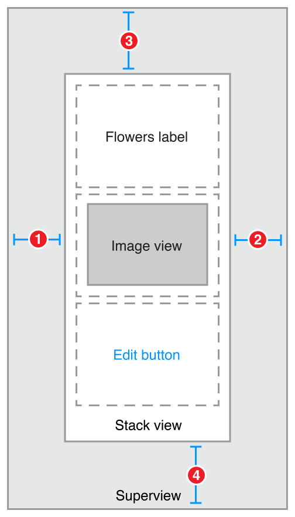

Auto Layout Guide (1) ---- Auto Layout Cookbook

原文地址：
[https://developer.apple.com/library/content/documentation/UserExperience/Conceptual/AutolayoutPG/LayoutUsingStackViews.html#//apple_ref/doc/uid/TP40010853-CH11-SW1](https://developer.apple.com/library/content/documentation/UserExperience/Conceptual/AutolayoutPG/LayoutUsingStackViews.html#//apple_ref/doc/uid/TP40010853-CH11-SW1)

# 1 Auto Layout Cookbook - 自动布局的菜谱

## 1.1 Stack Views - 堆栈视图

The following recipes show how you can use stack views to create layouts of increasing complexity. Stack views are a powerful tool for quickly and easily designing your user interfaces. Their attributes allow a high degree of control over how they lay out their arranged views. You can augment these settings with additional, custom constraints; however, this increases the layout’s complexity.

下面的食谱展示了你如何能使用堆栈视图创建越来越复杂的布局。堆栈视图是快速且简单的设计你的用户界面的有力工具。它们的属性可以高度控制如何布局它们排列的视图。你可以使用附加的自定义的约束来增加这些设置；不过，这会增加布局的复杂度。

To view the source code for these recipes, see the [Auto Layout Cookbook](https://developer.apple.com/sample-code/xcode/downloads/Auto-Layout-Cookbook.zip) project.

要查看这些食谱的源码，参见 [Auto Layout Cookbook](https://developer.apple.com/sample-code/xcode/downloads/Auto-Layout-Cookbook.zip) 工程。

### 1.1.1 Simple Stack View - 简单堆栈视图

This recipe uses a single, vertical stack view to lay out a label, image view, and button.

这个菜谱使用了一个单独的纵向的堆栈视图布局了一个标签、一个图片和一个按钮。

#### 1.1.1.1 Views and Constraints - 视图和约束

In Interface Builder, start by dragging out a vertical stack view, and add the flowers label, image view, and edit button. Then set up the constraints as shown.

在 Interface Builder 中，从拖出一个纵向的堆栈视图开始，然后添加 flowers 标签、图片和 edit 按钮。然后按下图所示设置约束。

1. `Stack View.Leading = Superview.LeadingMargin`
2. `Stack View.Trailing = Superview.TrailingMargin`
3. `Stack View.Top = Top Layout Guide.Bottom + Standard`
4. `Bottom Layout Guide.Top = Stack View.Bottom + Standard`

#### 1.1.1.2 Attributes - 属性

In the Attributes inspector, set the following stack view attributes:

在 Attributes 检视板中，设置下列堆栈视图属性：

|Stack|Axis|Alignment|Distribution|Spacing|
|:-:|:-:|:-:|:-:|:-:|
|Stack View|Vertical|Fill|Fill|8|

Next, set the following attributes on the Image View:

然后，在图像视图中设置下列属性：

|View|Attribute|Value|
|:-:|:-:|:-:|
|Image View|Image|(an image of flowers)|
|Image View|Mode|Aspect Fit|

Finally, in the Size inspector, set the Image View’s content-hugging and compression-resistance (CHCR) priorities.

最后，在 Size 检视板中，设置图像视图的内容紧靠和压缩阻力（CHCR）属性。

|Name|Horizontal hugging|Vertical hugging|Horizontal resistance|Vertical resistance|
|:-:|:-:|:-:|:-:|:-:|
|Image View|250|249|750|749|

#### 1.1.1.3 Discussion - 讨论

You must pin the stack view to the superview, but otherwise, the stack view manages the entire layout without any other explicit constraints.

你必须将堆栈视图拼到父视图上，否则，堆栈视图管理的整个视图就没有任何其他准确的约束。

In this recipe, the stack view fills its superview, with a small, standard margin. The arranged views are resized to fill the stack view’s bounds. Horizontally, each view is stretched to match the stack view’s width. Vertically, the views are stretched based on their CHCR priorities. The image view should always shrink and grow to fill the available space. Therefore, its vertical content hugging and compression resistance priorities must be lower than the label and button’s default priorities.

在这个菜谱中，堆栈视图填满了它的父视图，只有很小的标准的留白。排列的视图被重新计算大小以填满堆栈视图的区域。水平方向上，每个视图都被拉伸到匹配堆栈视图的宽度。垂直方向上，视图基于它们的CHCR属性拉伸。图像视图应该总是压缩或放大到填满可用空间。所以，它的垂直内容紧靠和压缩阻力属性值必须必标签和按钮的默认值要更低。

Finally, set the image view’s mode to Aspect Fit. This setting forces the image view to resize the image so that it fits within the image view’s bounds, while maintaining the image’s aspect ratio. This lets the stack view arbitrarily resize the image view without distorting the image.

最后，这是视图的模式到 Aspect Fit（保持宽高比而不超出父视图）。这个设置强制图像视图重新计算图像大小以填充图像视图的内界，而保持图像的宽高比。这使堆栈视图可以任意调整图像视图，而不会扭曲图像。

For more information on pinning a view to fill its superview, see [Attributes](https://developer.apple.com/library/content/documentation/UserExperience/Conceptual/AutolayoutPG/WorkingwithSimpleConstraints.html#//apple_ref/doc/uid/TP40010853-CH12-SW5) and [Adaptive Single View](https://developer.apple.com/library/content/documentation/UserExperience/Conceptual/AutolayoutPG/WorkingwithSimpleConstraints.html#//apple_ref/doc/uid/TP40010853-CH12-SW4).

关于让视图填充其父视图的更多信息，参见 [Attributes](https://developer.apple.com/library/content/documentation/UserExperience/Conceptual/AutolayoutPG/WorkingwithSimpleConstraints.html#//apple_ref/doc/uid/TP40010853-CH12-SW5) 和 [Adaptive Single View](https://developer.apple.com/library/content/documentation/UserExperience/Conceptual/AutolayoutPG/WorkingwithSimpleConstraints.html#//apple_ref/doc/uid/TP40010853-CH12-SW4)。

### 1.1.2 Nested Stack Views - 嵌套堆栈视图

This recipe shows a complex layout built from multiple layers of nested stack views. However, in this example, the stack views cannot create the wanted behaviors alone. Instead, additional constraints are needed to further refine the layout.

这个菜谱展示了由多层嵌套堆栈视图建立的复杂布局。但是，在这个例子中，堆栈式图不能独自创建想要的行为。而是需要更多的约束以进一步细化布局。

After the view hierarchy is built, add the constraints shown in the next section, Views and Constraints.

在建立视图层级之后，添加在下一节 [Views and Constraints](https://developer.apple.com/library/content/documentation/UserExperience/Conceptual/AutolayoutPG/LayoutUsingStackViews.html#//apple_ref/doc/uid/TP40010853-CH11-SW12) 中展示的约束。

#### 1.1.2.1 Views and Constraints - 视图和约束

When working with nested stack views, it is easiest to work from the inside out. Begin by laying out the name rows in Interface Builder. Position the label and text field in their correct relative positions, select them both, and then click the Editor > Embed In > Stack View menu item. This creates a horizontal stack view for the row.

当使用嵌套堆栈视图工作时，最简单的方式是从内向外。从布局 Interface Builder 中的 name 行开始。将 label 和 text field 放在正确的相对位置，选中它们，然后点击菜单项，Editor > Embed In > Stack View。这会为这一行创建一个水平的堆栈视图。

Next, position these rows horizontally, select them, and click the Editor > Embed In > Stack View menu item again. This creates a horizontal stack of rows. Continue to build the interface as shown.

然后，将这些行水平的放置，选中它们，然后再次点击菜单项，Editor > Embed In > Stack View。这会创建一个行的水平堆栈。继续按照如下所示建立界面。

1. Root Stack View.Leading = Superview.LeadingMargin
2. Root Stack View.Trailing = Superview.TrailingMargin
3. Root Stack View.Top = Top Layout Guide.Bottom + 20.0
4. Bottom Layout Guide.Top = Root Stack View.Bottom + 20.0
5. Image View.Height = Image View.Width
6. First Name Text Field.Width = Middle Name Text Field.Width
7. First Name Text Field.Width = Last Name Text Field.Width

#### 1.1.2.2 Attributes - 属性

Each stack has its own set of attributes. These define how the stack lays out its contents. In the Attribute inspector, set the following attributes:

每个堆栈有它自己的一组属性。这些属性定义了堆栈如何布局其内容。在 Attribute 检视板中，设置下列属性：

|Stack|Axis|Alignment|Distribution|Spacing|
|:-:|:-:|:-:|:-:|:-:|
|First Name|Horizontal|First Baseline|Fill|8|
|Middle Name|Horizontal|First Baseline|Fill|8|
|Last Name|Horizontal|First Baseline|Fill|8|
|Name Rows|Vertical|Fill|Fill|8|
|Upper|Horizontal|Fill|Fill|8|
|Button|Horizontal|First Baseline|Fill Equally|8|
|Root|Vertical|Fill|Fill|8|

Additionally, give the text view a light gray background color. This makes it easier to see how the text view is resized when the orientation changes.

另外，给 text view 一个浅灰色的背景色。这会更容易看出方向变化时 text view 的大小变化。

|View|Attribute|Value|
|:-:|:-:|:-:|
|Text View|Background|Light Gray Color|

Finally, the CHCR priorities define which views should stretch to fill the available space. In the Size inspector, set the following CHCR priorities:

最后，CHCR 属性定义了哪个视图将拉伸以填满可用的空间。在 Size 检视板中，设置下列 CHCR 属性：

|Name|Horizontal hugging|Vertical hugging|Horizontal resistance|Vertical resistance|
|:-:|:-:|:-:|:-:|:-:|
|Image View|250|250|48|48|
|Text View|250|249|250|250|
|First, Middle, and Last Name Labels|251|251|750|750|
|First, Middle, and Last Name Text Fields|48|250|749|750|

#### 1.1.2.3 Discussion - 讨论

In this recipe, the stack views work together to manage most of the layout. However, they cannot—by themselves—create all of the wanted behaviors. For example, the image should maintain its aspect ratio as the image view is resized. Unfortunately, the technique used in Simple Stack View won’t work here. The layout needs to fit close to both the trailing and bottom edge of the image, and using the Aspect Fit mode would add extra white space to one of those dimensions. Fortunately, in this example, the image’s aspect ratio is always square, so you can let the image completely fill the image view’s bounds, and constrain the image view to a 1:1 aspect ratio.

在这个菜谱中，堆栈视图一起工作管理了大部分布局。但是，它们不能——靠它们自己——创建所有想要的行为。例如，图像应该在图像视图改变大小时保持其高宽比。不幸的是，在 [Simple Stack View](https://developer.apple.com/library/content/documentation/UserExperience/Conceptual/AutolayoutPG/LayoutUsingStackViews.html#//apple_ref/doc/uid/TP40010853-CH11-SW2) 中使用的技术在这里没用。布局需要与图像的尾部和底部都相贴合，而使用 Aspect Fit 模式将添加额外的空白到其中一个维度。幸运的是，在这个例子中，图像的高宽比始终是正方形，所以你可以让图像完全填满图像视图的内界，并约束图像视图到 1:1 高宽比。

>NOTE
>
>In Interface Builder, an aspect ratio constraint is simply a constraint between a view’s height and its width. Interface Builder can also show the multiplier for constraints in a number of ways. Typically, for aspect ratio constraints, it shows them as a ratio. So, a View.Width = View.Height constraint may appear as a 1:1 aspect ratio.
>
>注意
>
>在 Interface Builder 中，高宽比约束只是简单的在视图的高和宽之间建立约束。Interface Builder 也可以以一些方法展示复杂的约束。典型的，对于高宽比约束，也可以展示成一个比例。因此，一个 `View.Width = View.Height constraint` 约束也可以看起来是 1:1 高宽比。

Additionally, all the text fields should be the same width. Unfortunately, they are all in separate stack views, so the stacks cannot manage this. Instead, you must explicitly add equal width constraints.

另外，所有的 text field 都应该是相同的宽度。不幸的是，他们都在不同的堆栈视图中，因此堆栈无法管理这一点。相反，你必须准确的添加相等宽度的约束。

Like the simple stack view, you must also modify some of the CHCR priorities. These define how the views shrink and grow as the superclass’s bounds change.

就像简单堆栈视图一样，你必须修改一些 CHCR 属性。这些定义了当父视图的内部边界改变时，视图如何压缩和拉伸。

Vertically, you want the text view to expand to fill the space between the upper stack and the button stack. Therefore, the text view’s vertical content hugging must be lower than any other vertical content hugging priority.

在竖直方向上，你想要 text view 扩展以填满上部堆栈和按钮堆栈之间的空间。因此，text view 的竖直内容紧靠必须比任何其他竖直内容紧靠属性要低。

Horizontally, the labels should appear at their intrinsic content size, while the text fields resize to fill any extra space. The default CHCR priorities work well for the labels. Interface Builder already sets the content hugging at 251, making it higher than the text fields; however, you still need to lower both the horizontal content hugging and the horizontal compression resistance of the text fields.

在水平方向上，label 应该按照它们的固有内容尺寸展示，而 text field 要改变大小以填满任何额外的空间。默认的 CHCR 属性对于 label 就非常有用。Interface Builder 已经将内容紧靠设置成了251，比 text field 要更高；不过，你仍然需要降低 text field 的水平内容紧靠和水平压缩阻力。

The image view should shrink so that it is the same height as the stack containing the name rows. However, stack views only loosely hug their content. This means that the image view’s vertical compression resistance must be very low, so the image view shrinks instead of having the stack view expand. Additionally, the image view’s aspect ratio constraint complicates the layout, because it allows the vertical and horizontal constraints to interact. This means that the text fields’ horizontal content hugging must also be very low, or they will prevent the image view from shrinking. In both cases, set the priority to a value of 48 or lower.

图像视图应该压缩，以致于它的高度跟包含 name 行的堆栈相同。但是，堆栈视图只是弱弱的压缩它们的内容。这意味着，图像视图的竖直压缩阻力必须非常低，这样图像视图才会压缩，而不是让堆栈视图扩张。另外，图像视图的高宽比约束使布局复杂化，因为它允许竖直和水平约束交互。这意味着 text field 的水平内容紧靠也必须非常低，否则它们将组织图像视图压缩。在这两种情况中，要将这个优先级的值设置成48或更低。

### 1.1.3 Dynamic Stack View - 动态堆栈视图

This recipe demonstrates dynamically adding and removing items from a stack at runtime. All changes to the stack are animated. Additionally, the stack view is placed inside a scroll view, letting you scroll through the list if it is too long to fit on the screen.

image: ../Art/Dynamic_Stack_View_Screenshot_2x.png
NOTE

This recipe is only intended to demonstrate working dynamically with stack views, and working with stack views inside scroll views. In a real-world app, this recipe’s behaviors should be implemented using the UITableView class instead. In general, you should not use dynamic stack views to simply implement a scratch-built table view clone. Instead, use them to create dynamic user interfaces that you cannot easily build using any other technology.

Views and Constraints

The initial user interface is quite simple. Place a scroll view on your scene, and size it so that it fills the scene. Then, place a stack view inside the scroll view, and place the add item button inside the stack view. As soon as everything’s in place, set the following constraints:

image: ../Art/dynamic_stack_view_2x.png
Scroll View.Leading = Superview.LeadingMargin
Scroll View.Trailing = Superview.TrailingMargin
Scroll View.Top = Superview.TopMargin
Bottom Layout Guide.Top = Scroll View.Bottom + 20.0
Stack View.Leading = Scroll View.Leading
Stack View.Trailing = Scroll View.Trailing
Stack View.Top = Scroll View.Top
Stack View.Bottom = Scroll View.Bottom
Stack View.Width = Scroll View.Width
Attributes

In the Attributes inspector, set the following stack view attributes:

Stack
Axis
Alignment
Distribution
Spacing
Stack View
Vertical
Fill
Equal Spacing
0
Code

This recipe requires a bit of code to add items to and remove them from the stack view. Create a custom view controller for your scene with outlets for both the scroll view and stack view.

class DynamicStackViewController: UIViewController {
    
    @IBOutlet weak private var scrollView: UIScrollView!
    @IBOutlet weak private var stackView: UIStackView!
    
    // Method implementations will go here...
    
}
Next, override the viewDidLoad method to set the scroll view’s initial position. You want the scroll view’s content to start below the status bar.

override func viewDidLoad() {
    super.viewDidLoad()
    
    // setup scrollview
    let insets = UIEdgeInsetsMake(20.0, 0.0, 0.0, 0.0)
    scrollView.contentInset = insets
    scrollView.scrollIndicatorInsets = insets
    
}
Now, add an action method for the add item button.

// MARK: Action Methods
 
@IBAction func addEntry(sender: AnyObject) {
    
    let stack = stackView
    let index = stack.arrangedSubviews.count - 1
    let addView = stack.arrangedSubviews[index]
    
    let scroll = scrollView
    let offset = CGPoint(x: scroll.contentOffset.x,
                         y: scroll.contentOffset.y + addView.frame.size.height)
    
    let newView = createEntry()
    newView.hidden = true
    stack.insertArrangedSubview(newView, atIndex: index)
    
    UIView.animateWithDuration(0.25) { () -> Void in
        newView.hidden = false
        scroll.contentOffset = offset
    }
}
This method calculates a new offset for the scroll view, then creates a new entry view. The entry view is hidden, and added to the stack. Hidden views do not affect the appearance or layout of a stack—so the stack’s appearance remains unchanged. Then, in an animation block, the view is revealed and the scroll offset is updated, animating the view’s appearance.

Add a similar method to delete entries; however, unlike the addEntry method, this method is not linked to any controls in Interface Builder. Instead, the app will programmatically link each entry view to this method when the view is created.

func deleteStackView(sender: UIButton) {
    if let view = sender.superview {
        UIView.animateWithDuration(0.25, animations: { () -> Void in
            view.hidden = true
        }, completion: { (success) -> Void in
            view.removeFromSuperview()
        })
    }
}
This method hides the view in an animation block. After the animation completes, it removes the view from the view hierarchy. This automatically removes the view from the stack’s list of arranged views.

Although the entry view could be any view, this example uses a stack view that contains a date label, a label containing a random hex string, and a delete button.

// MARK: - Private Methods
private func createEntry() -> UIView {
    let date = NSDateFormatter.localizedStringFromDate(NSDate(), dateStyle: .ShortStyle, timeStyle: .NoStyle)
    let number = "\(randomHexQuad())-\(randomHexQuad())-\(randomHexQuad())-\(randomHexQuad())"
    
    let stack = UIStackView()
    stack.axis = .Horizontal
    stack.alignment = .FirstBaseline
    stack.distribution = .Fill
    stack.spacing = 8
    
    let dateLabel = UILabel()
    dateLabel.text = date
    dateLabel.font = UIFont.preferredFontForTextStyle(UIFontTextStyleBody)
    
    let numberLabel = UILabel()
    numberLabel.text = number
    numberLabel.font = UIFont.preferredFontForTextStyle(UIFontTextStyleHeadline)
    
    let deleteButton = UIButton(type: .RoundedRect)
    deleteButton.setTitle("Delete", forState: .Normal)
    deleteButton.addTarget(self, action: "deleteStackView:", forControlEvents: .TouchUpInside)
    
    stack.addArrangedSubview(dateLabel)
    stack.addArrangedSubview(numberLabel)
    stack.addArrangedSubview(deleteButton)
    
    return stack
}
 
private func randomHexQuad() -> String {
    return NSString(format: "%X%X%X%X",
                    arc4random() % 16,
                    arc4random() % 16,
                    arc4random() % 16,
                    arc4random() % 16
        ) as String
}
}
Discussion

As this recipe demonstrates, views can be added or removed from stack views during runtime. The stack’s layout automatically adjusts to compensate for changes to its array of arranged views. There are, however, a couple of important points worth remembering:

Hidden views are still inside stack’s array of arranged views. However, they are not displayed and do not affect the layout of the other arranged views.
Adding a view to the stack’s array of arranged views automatically adds it to the view hierarchy.
Removing a view from the stack’s array of arranged views does not automatically remove it from the view hierarchy; however, removing the view from the view hierarchy does removes it from the arranged views array.
In iOS, the view’s hidden property is normally not animatable. However, this property becomes animatable for views as soon as they are placed in a stack’s arranged views array. The actual animation is managed by the stack, not the view. Use the hidden property to animate adding views to or removing them from the stack.
This recipe also introduces the idea of using Auto Layout with scroll views. Here, the constraints between the stack and the scroll view set the size of the scroll view’s content area. An equal width constraint explicitly sets the stack (and thus the content size) to fill the scroll view horizontally. Vertically, the content size is based on the stack’s fitting size. The stack view grows longer as the user adds more entries. Scrolling is automatically enabled as soon as there is too much content to fit on the screen.

For more information, see Working with Scroll Views.