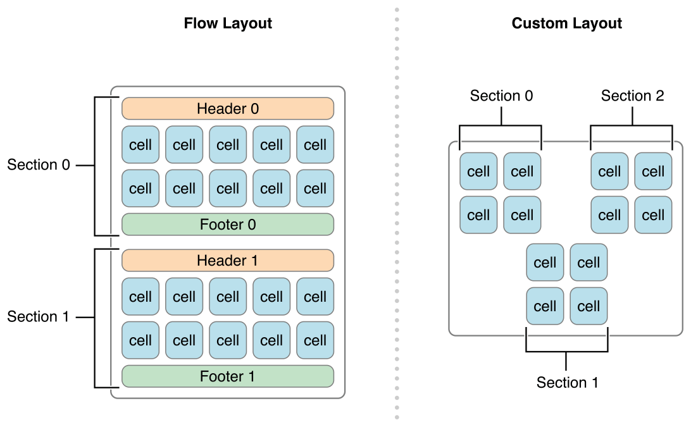
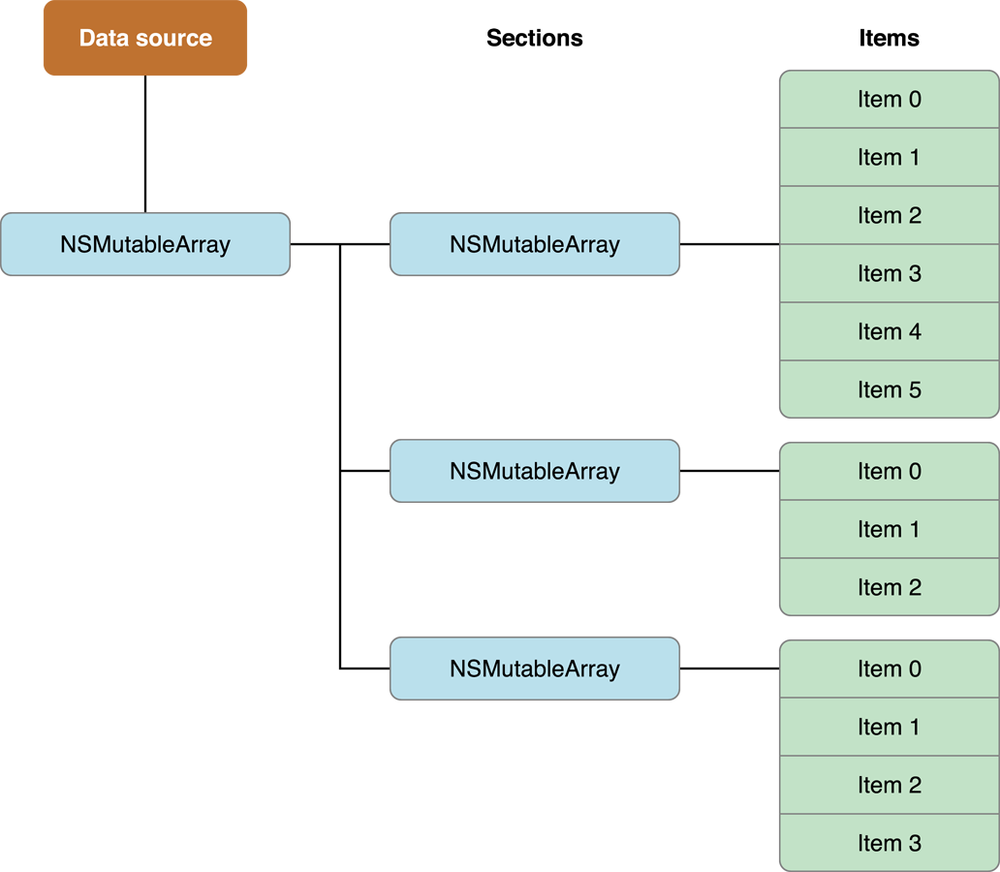
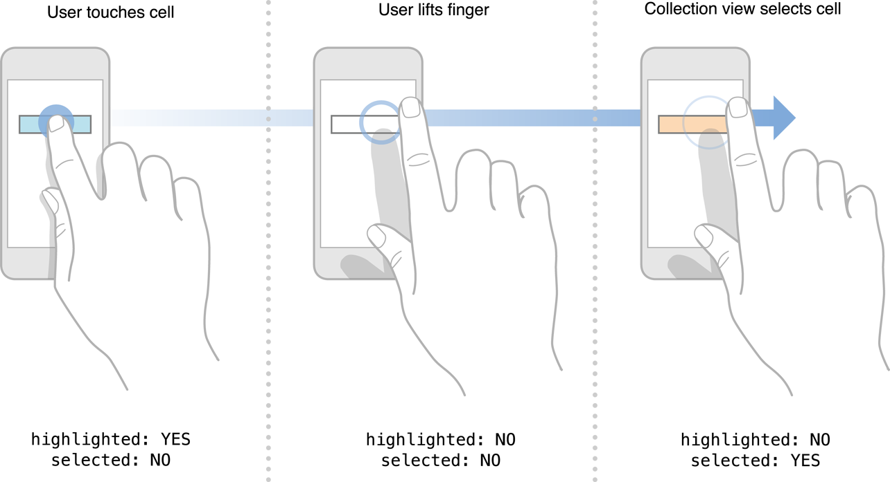

# 2 Designing Your Data Source and Delegate - 设计你的数据源和代理

原文地址：
[https://developer.apple.com/library/content/documentation/WindowsViews/Conceptual/CollectionViewPGforIOS/CreatingCellsandViews/CreatingCellsandViews.html#//apple_ref/doc/uid/TP40012334-CH7-SW1](https://developer.apple.com/library/content/documentation/WindowsViews/Conceptual/CollectionViewPGforIOS/CreatingCellsandViews/CreatingCellsandViews.html#//apple_ref/doc/uid/TP40012334-CH7-SW1)

Every collection view must have a **data source object.** The data source object is the content that your app displays. It could be an object from your app’s data model, or it could be the view controller that manages the collection view. The only requirement of the data source is that it must be able to provide information that the collection view needs, such as how many items there are and which views to use when displaying those items.

每一个 collection view 必须有一个**数据源对象**。数据源对象是你的app显示的内容。它可以是一个来自于你app的数据模型的对象，也可以是一个管理 collection view 的视图控制器。对数据源的唯一要求就是它必须能提供 collection view 需要的信息，比如有多少个项目以及当显示这些项目时使用哪个项目。

The **delegate object** is an optional (but recommended) object that manages aspects related to the presentation of and interaction with your content. Although the delegate’s main job is to manage cell highlighting and selection, it can be extended to provide additional information. For example, the flow layout extends the basic delegate behavior to customize layout metrics, such as the size of cells and the spacing between them.

**代理对象**是可选的对象（但是建议有一个），它管理了与内容的显示和交互相关的部分。尽管代理的主要工作时管理 cell 的高亮和选中，它仍可以扩展以提供更多信息。例如，流式布局扩展了基本代理行为来自定义布局矩阵，如 cell 的尺寸和它们之间的间距。

## 2.1 The Data Source Manages Your Content - 数据源管理你的内容

The data source object is the object responsible for managing the content you are presenting using a collection view. The data source object must conform to the `UICollectionViewDataSource` protocol, which defines the basic behavior and methods that you must support. The job of the data source is to provide the collection view with answers to the following questions:

数据源对象是负责管理你正用 collection view 显示的内容的对象。数据源对象必须遵从 `UICollectionViewDataSource` 协议，这个协议定义了你必须支持的基本行为和方法。数据源的工作是向 collection view 提供下面问题的答案：

- How many sections does the collection view contain?
- For a given section, how many items does a section contain?
- For a given section or item, what views should be used to display the corresponding content?
- Collection view 包含了多少个 section ？
- 对于给定的 section，每个 section 包含了多少个 item？
- 对于给定的 section 或 item，应该用哪个视图来显示正确的内容？

Sections and items are the fundamental organizing principle for collection view content. A collection view typically has at least one section and may contain more. Each section, in turn, contains zero or more items. Items represent the main content you want to present, whereas sections organize those items into logical groups. For example, a photo app might use sections to represent a single album of photos or a set of photos taken on the same day.

Section 和 item 是 collection view 内容的基本组织理论。一个 collection view 通常有至少一个 section ，也可能包含更多。每个 section，相应的，包含零个或多个 item。Item 表示你想要展示的主要内容，而 section 将那些 item 组织成逻辑分组。例如，一个照片app可能使用 section 表示一个相册的照片，或者同一天拍摄的照片的集合。

The collection view refers to the data it contains using `NSIndexPath` objects. When trying to locate an item, the collection view uses the index path information provided to it by the layout object. For items, the index path contains a section number and an item number. For supplementary and decoration views, the index path contains whichever values were provided by the layout object. The meaning of the index paths attached to supplementary and decoration views is dependent on your app, though the first index corresponds to a specific section in the data source. These views’ index paths are more about identification than meaning, identifying which view of what kind is currently being considered. So, if for example you have supplementary views that create headers and footers for your sections as seen in the flow layout, the relevant information provided by the index path is the section referenced.

Collection view 使用 `NSIndexPath` 对象给它包含的数据做参考。当尝试定位一个 item 时，collection view 就会使用由布局对象向它提供的 index path 信息。对于 supplementary 和 decoration 视图，index path 包含了由布局对象提供的每一个值。加在 supplementary 和 decoration 视图上的 index path 的意义取决于你的app，尽管第一个索引对应数据源中的特定 section。这些视图的 index path 更重要的是辨识而不是意义，标识当前考虑的是哪种视图。所以，例如，如果你有一些 supplementary 视图按照流式布局中看到的那样为你的 section 创建 header 和 footer，那么 index path 提供的有关信息就是以 section 为参考的了。 

> **Note:** Although standard index paths support multiple levels, the collection view’s cells only supports index paths that are 2-levels deep with “section” and “item” parameters, much like the index paths for the `UITableView` class. Supplementary views and decoration views can have more complex index paths if necessary. Elements whose index paths are > 1 is interpreted to correspond to the section designated by the first index in the path. Traditionally, only a second index is necessary, but supplementary and decoration views are not restricted to just two. Keep this in mind when designing your data source.
>
> **注意：**尽管标准 index path 支持多级，但是 collection view 的 cell 只支持带有 “section” 和 “item” 参数2级深度的 index path，就像 `UITableView` 类的 index path 一样。Supplementary 和 decoration 视图有更复杂的 index path，如果需要的话。Index path 大于1的元素是对 path 中第一个 index 所指定的相应 section 的解释。通常，只有第二个 index 是必须的，但是 supplementary 和 decoration 视图并不严格要求只有两个 index。当设计你的数据源时始终记住这一点。

No matter how you arrange the sections and items in your data object, the visual presentation of those sections and items is still determined by the layout object. Different layout objects could present section and item data very differently, as shown in Figure 2-1. In this figure, the flow layout object arranges the sections vertically with each successive section below the previous one. A custom layout could position the sections in a nonlinear arrangement, demonstrating again the separation of the layout from the actual data.

无论你在数据源中如何排布 section 和 item，这些 section 和 item 的视觉显示仍然由布局对象决定。不同的布局对象可以显示完全不同的 section 和 item，如图 2-1 所示。在这张图中，流式布局对象竖直的排布 section，每个 section 连续的接在前一个的下面。自定义布局可以让 section 以非线性的排布来放置，再次示范了布局与实际数据的分离。

Figure 2-1  Sections arranged according to the arrangement of layout objects - 根据布局对象的排布来排布 section



### 2.1.1 Designing Your Data Objects - 设计你的数据对象

An efficient data source uses sections and items to help organize its underlying data objects. Organizing your data into sections and items makes it much easier to implement your data source methods later. And because your data source methods are called frequently, you want to make sure that your implementations of those methods are able to retrieve data as quickly as possible.

一个高效的数据源使用 section 和 item 帮助组织它们下面的数据对象。把你的数据组织到 section 和 item 让之后实现数据源方法更加简单。并且由于你的数据源方法会被频繁调用，你要确保那些方法的实现能够尽可能快的取回数据。

One simple solution (but certainly not the only solution) is for your data source to use a set of nested arrays, as shown in Figure 2-2. In this configuration, a top-level array contains one or more arrays representing the sections of your data source. Each section array then contains the data items for that section. Finding an item in a section is a matter of retrieving its section array and then retrieving an item from that array. This type of arrangement makes it easy to manage moderately sized collections of items and retrieve individual items on demand.

一个简单的解决方案（但肯定不是唯一方案）是对你的数据源使用一组嵌套数组，如图 2-2 所示。在这个配置下，顶级数组包含一个或多个表示数据源的 section 的数组。然后每个 section 数组包含了为该 section 准备的数据 item。在一个 section 中找到一个 item 就是先取回它的 section 数组，然后从那个数组总取回 item。这种排布让管理适度大小的 item 集合和取回想要的独立 item 都变得容易。

Figure 2-2  Arranging data objects using nested arrays - 使用嵌套数组排布数据对象



When designing your data structures, you can always start with a simple set of arrays and move to a more efficient structure as needed. In general, your data objects should never be a performance bottleneck. The collection view usually accesses your data source only to calculate how many objects there are in total and to obtain views for elements that are currently onscreen. If the layout object relies only on data from your data objects, performance could be severely impacted when the data source contains thousands of objects.

当设计你的数据结构时，你可以总是从一个数组的简单集合开始，在按需调整成更高效的结构。通常，你的数据对象永远不应该称为显示瓶颈。Collection view 往往访问你的数据源只为了计算总共有多少个对象和获取当前屏幕上的元素的视图。如果布局对象只依赖于你的数据对象的数据，当数据源包含成千上万个对象时就会严重影响性能。

### 2.1.2 Telling the Collection View About Your Content - 告诉 collection view 你的内容

Among the questions asked of your data source by the collection view are how many sections it contains and how many items each section contains. The collection view asks your data source to provide this information when any of the following actions occur:

在被 collection view 向数据源问到的问题之中是包含了多少个 section 和每个 section 包含了多少个 item。当下面任意一个动作发生时，collection view 就会向你的数据源请求提供这个信息：

- The collection view is displayed for the first time.
- You assign a different data source object to the collection view.
- You explicitly call the collection view’s [reloadData](https://developer.apple.com/documentation/uikit/uicollectionview/1618078-reloaddata) method.
- The collection view delegate executes a block using [performBatchUpdates:completion:](https://developer.apple.com/documentation/uikit/uicollectionview/1618045-performbatchupdates) or any of the move, insert, or delete methods.
- Collection view 首次显示。
- 你把另一个数据源对象指派给 collection view。
- 你显式的调用 collection view 的 [reloadData](https://developer.apple.com/documentation/uikit/uicollectionview/1618078-reloaddata) 方法。
- Collection view 代理使用 [performBatchUpdates:completion:](https://developer.apple.com/documentation/uikit/uicollectionview/1618045-performbatchupdates) 或任何移动、插入或删除方法执行一个 block。

You provide the number of sections using the [numberOfSectionsInCollectionView:](https://developer.apple.com/documentation/uikit/uicollectionviewdatasource/1618023-numberofsectionsincollectionview) method, and the number of items in each section using the [collectionView:numberOfItemsInSection:](https://developer.apple.com/documentation/uikit/uicollectionviewdatasource/1618058-collectionview) method. You must implement the `collectionView:numberOfItemsInSection:` method, but if your collection view has only one section, implementing the `numberOfSectionsInCollectionView:` method is optional. Both methods return integer values with the appropriate information.

你使用 [numberOfSectionsInCollectionView:](https://developer.apple.com/documentation/uikit/uicollectionviewdatasource/1618023-numberofsectionsincollectionview) 方法提供 section 的数量，并使用 [collectionView:numberOfItemsInSection:](https://developer.apple.com/documentation/uikit/uicollectionviewdatasource/1618058-collectionview) 方法提供每个 section 中 item 的数量。你必须实现 `collectionView:numberOfItemsInSection:` 方法，但是如果你的 collection view 只有一个 section，是否实现 `numberOfSectionsInCollectionView:` 方法就是可选的了。这两个方法都是返回带有相关信息的整数值。

If you implemented your data source as shown in Figure 2-2, the implementation of your data source methods could be as simple as those shown in Listing 2-1. In this code, the `_data` variable is a custom member variable of the data source that stores the top-level array of sections. Obtaining the count of that array yields the number of sections. Obtaining the count of one of the subarrays yields the number of items in the section. (Of course, your own code should do whatever error checking is needed to ensure that the values returned are valid.)

如果你按照图 2-2 中所示实现了你的数据源，那么你的数据源的方法实现可能会像表 2-1 所示那样简单。在这个代码中，`_data` 变量是数据源的一个自定义成员变量，储存了 section 的顶级数组。获取数组的个数就得到了 section 的个数。获取一个子数组的元素个数就得到了该 section 中 item 的个数。（当然，你自己的代码可以做任何必要的错误校验，以确保返回值是可用的。）

Listing 2-1  Providing the section and item counts - 提供 section 和 item 的数量

```
- (NSInteger)numberOfSectionsInCollectionView:(UICollectionView*)collectionView {
    // _data is a class member variable that contains one array per section.
    return [_data count];
}
 
- (NSInteger)collectionView:(UICollectionView*)collectionView numberOfItemsInSection:(NSInteger)section {
    NSArray* sectionArray = [_data objectAtIndex:section];
    return [sectionArray count];
}
```

## 2.2 Configuring Cells and Supplementary Views - 配置 cell 和 supplementary 视图

Another important task of your data source is to provide the views that the collection view uses to display your content. The collection view does not track your app’s content. It simply takes the views you give it and applies the current layout information to them. Therefore, everything that is displayed by the views is your responsibility.

你的数据源的另一个重要的任务时提供 collection view 用来显示内容的视图。Collection view 不会跟踪你App的内容。它只是简单的拿着你给它的视图并将当前布局信息应用到上面。因此，这些视图显示的所有事情都是你的责任。

After your data source reports how many sections and items it manages, the collection view asks the layout object to provide layout attributes for the collection view’s content. At some point, the collection view asks the layout object to provide the list of elements in a specific rectangle (often this is the visible rectangle). The collection view uses that list to ask your data source for the corresponding cells and supplementary views. To provide those cells and supplementary views, your code must do the following:

在你的数据源报告它管理了多少个 section 和 item 之后，collection view 会让布局对象提供 collection view 的内容的布局属性。同时，collection view 让布局对象提供在特定矩形（通常是可见区域矩形）内的元素列表。Collection view 使用这个列表向你的数据源请求相应的 cell 和 supplementary 视图。要提供那些 cell 和 supplementary 视图，你的代码必须做下面这些事：

1. Embed your template cells and views in your storyboard file. (Alternatively, register a class or nib file for each type of supported cell or view.)
2. In your data source, dequeue and configure the appropriate cell or view when asked.

>

1. 将你的模板 cell 和 view 嵌入你的 storyboard 文件。（或者为每种支持的 cell 或 view 注册一个类或 nib 文件。）
2. 在你的数据源中，当被请求时取出和配置适当的 cell 或 view。

To ensure that cells and supplementary views are used in the most efficient way possible, the collection view assumes the responsibility of creating those objects for you. Each collection view maintains internal queues of currently unused cells and supplementary views. Instead of creating objects yourself, simply ask the collection view to provide you with the view you want. If one is waiting on a reuse queue, the collection view prepares it and returns it to you quickly. If one is not waiting, the collection view uses the registered class or nib file to create a new one and return it to you. Thus, every time you dequeue a cell or view, you always get a ready-to-use object.

为了确保 cell 和 supplementary view 可以按最有效的方式使用，collection view 为你承担了创建那些对象的责任。每个 collection view 都持有了当前未使用的 cell 和 supplementary view 的队列。你自己不用创建对象，只要简单的让 collection view 提供你想要的视图。如果在重用队列中已经有一个视图在等着，collection view 会准备好它并快速将它返回给你。如果没有正在等着的，collection view 会使用注册的类或 nib 文件创建一个新的视图并将它返回给你。因此，每当你从队列中取出一个 cell 或 view，你总能获得一个准备好可用的对象。

Reuse identifiers make it possible to register multiple types of cells and multiple types of supplementary views. A reuse identifier is a string that you use to distinguish between your registered cell and view types. The contents of the string are relevant only to your data source object. But when asked for a view or cell, you can use the provided index path to determine which type of view or cell you might want and then pass the appropriate reuse identifier to the dequeue method.

重用标识使得可以注册多种 cell 和多种 supplementary view。重用标识是你用来区分已注册的 cell 和 view 的类型的字符串。这个字符串的内容只与你的数据源对象有关。但是当请求一个 view 或 cell 时，你可以使用提供的 index path 决定你想要哪种 view 或 cell，然后把适当的重用标识传给 dequeue 方法。

### 2.2.1 Registering Your Cells and Supplementary Views - 注册你的 cell 和 supplementary view

You can configure the cells and views of your collection view programmatically or in your app’s storyboard file.

你可以通过编程方式或者在你的app的 storyboard 文件中配置 cell 和 view。

**Configure cells and views in your storyboard.** When configuring cells and supplementary views in a storyboard, you do so by dragging the item onto your collection view and configuring it there. This creates a relationship between the collection view and the corresponding cell or view.

**在你的 storyboard 中配置 cell 和 view。**当在 storyboard 中配置 cell 和 supplementary view 时，你要拖动 item 到你的 collection view 上面并在那里注册它。这会在 collection view 和对应的 cell 或 view 之间创建一种关系。

- For cells, drag a Collection View Cell from the object library and drop it on to your collection view. Set the custom class and the collection reusable view identifier of your cell to appropriate values.
- For supplementary views, drag a Collection Reusable View from the object library and drop it on to your collection view. Set the custom class and the collection reusable view identifier of your view to appropriate values.
- 对于 cell，从对象库中拖出一个 Collection View Cell 并将其放在你的 collection view 上面。将你的 cell 的自定义类和 collection reusable view identifier 设置为适当的值。
- 对于 supplementary view，从对象库中拖出一个 Collection Reusable View 并将其放在你的 collection view 上面。将你的 view 的自定义类和 collection reusable view identifier 设置为适当的值。

**Configure cells programmatically.** Use either the [registerClass:forCellWithReuseIdentifier:](https://developer.apple.com/documentation/uikit/uicollectionview/1618089-registerclass) or [registerNib:forCellWithReuseIdentifier:](https://developer.apple.com/documentation/uikit/uicollectionview/1618083-register) method to associate your cell with a reuse identifier. You might call these methods as part of the parent view controller’s initialization process.

**编程方式配置 cell。**使用 [registerClass:forCellWithReuseIdentifier:](https://developer.apple.com/documentation/uikit/uicollectionview/1618089-registerclass) 或 [registerNib:forCellWithReuseIdentifier:](https://developer.apple.com/documentation/uikit/uicollectionview/1618083-register) 方法将你的 cell 与重用标识进行关联。你可以调用这些方法作为其父视图控制器的初始化过程的一部分。

**Configure supplementary views programmatically.** Use either the [registerClass:forSupplementaryViewOfKind:withReuseIdentifier:](https://developer.apple.com/documentation/uikit/uicollectionview/1618103-registerclass) or [registerNib:forSupplementaryViewOfKind:withReuseIdentifier:](https://developer.apple.com/documentation/uikit/uicollectionview/1618101-register) method to associate each kind of view with a reuse identifier. You might call these methods as part of the parent view controller’s initialization process.

**编程方式配置 supplementary view。**使用 [registerClass:forSupplementaryViewOfKind:withReuseIdentifier:](https://developer.apple.com/documentation/uikit/uicollectionview/1618103-registerclass) 或 [registerNib:forSupplementaryViewOfKind:withReuseIdentifier:](https://developer.apple.com/documentation/uikit/uicollectionview/1618101-register) 方法将每种 view 与重用标识关联。你可以调用这些方法作为其父视图控制器的初始化过程的一部分。

Although you register cells using only a reuse identifier, supplementary views require that you specify an additional identifier known as a kind string. Each layout object is responsible for defining the kinds of supplementary views it supports. For example, the `UICollectionViewFlowLayout` class supports two kinds of supplementary views: a section header view and a section footer view. To identify these two types of views, it defines the string constants `UICollectionElementKindSectionHeader` and `UICollectionElementKindSectionFooter`. During layout, the layout object includes the kind string with the other layout attributes for that view type. The collection view then passes the information along to your data source. Your data source then uses both the kind string and the reuse identifier to decide which view object to dequeue and return.

虽然你只使用了重用标识注册 cell，但是 supplementary view 需要你指定一个额外的标识作为类型字符串。每个布局对象负责定义它支持的 supplementary view 的中俄李。例如，`UICollectionViewFlowLayout`类支持两种 supplementary view：section header view 和 section footer view。为了标识这两种视图，它定义了字符串常量 `UICollectionElementKindSectionHeader` 和 `UICollectionElementKindSectionFooter`。在布局，布局对象包含类型字符串和这种视图类型的其他布局属性。然后 collection view 接着传递这些信息给你的数据源。然后你的数据源使用类型字符串和重用标识一起决定要取出哪个 view 对象并返回。

> **Note:** If you implement your own custom layouts, you are responsible for defining the kinds of supplementary views your layout supports. A layout may support any number of supplementary views, each with its own kind string. For more information about defining custom layouts, see [Creating Custom Layouts](https://developer.apple.com/library/content/documentation/WindowsViews/Conceptual/CollectionViewPGforIOS/CreatingCustomLayouts/CreatingCustomLayouts.html#//apple_ref/doc/uid/TP40012334-CH5-SW1).
> 
> **注意：**如果你实现你自己的自定义布局，你要负责定义你的布局支持的 supplementary view 的类型。一个布局可以支持任意数量的 supplementary view，每一种都有它自己的类型字符串。关于定义自定义布局的更多信息，参见 [创建自定义布局](https://developer.apple.com/library/content/documentation/WindowsViews/Conceptual/CollectionViewPGforIOS/CreatingCustomLayouts/CreatingCustomLayouts.html#//apple_ref/doc/uid/TP40012334-CH5-SW1)。

Registration is a one-time event that must take place before you attempt to dequeue any cells or views. After you’ve registered, you can dequeue as many cells or views as needed without reregistering them. It’s not recommended that you change the registration information after dequeueing one or more items. It is better to register your cells and views once and be done with it.

注册是一次性的事件，必须放在你试图取出任何 cell 或 view 之前。在你已经注册之后，你可以想取出多少 cell 或 view 就取多少，都不用再注册它们。不推荐在取出一个或多个 item 之后再修改注册信息。最好一次注册好你的 cell 和 view，并完成这件事。

### 2.2.2 Dequeueing and Configuring Cells and Views - 取出和配置 cell 和 view

Your data source object is responsible for providing cells and supplementary views when asked for them by the collection view. The [UICollectionViewDataSource](https://developer.apple.com/documentation/uikit/uicollectionviewdatasource) 
protocol contains two methods for this purpose: [collectionView:cellForItemAtIndexPath:](https://developer.apple.com/documentation/uikit/uicollectionviewdatasource/1618029-collectionview) and [collectionView:viewForSupplementaryElementOfKind:atIndexPath:](https://developer.apple.com/documentation/uikit/uicollectionviewdatasource/1618037-collectionview). Because cells are a required element of a collection view, your data source must implement the `collectionView:cellForItemAtIndexPath:` method, but the `collectionView:viewForSupplementaryElementOfKind:atIndexPath:` method is optional and dependent on the type of layout in use. In both cases, your implementation of these methods follows a very simple pattern:

你的数据源对象负责在被 collection view 请求时提供 cell 和 supplementary view。[UICollectionViewDataSource](https://developer.apple.com/documentation/uikit/uicollectionviewdatasource) 协议为这个目的包含了两个方法：[collectionView:cellForItemAtIndexPath:](https://developer.apple.com/documentation/uikit/uicollectionviewdatasource/1618029-collectionview) 和 [collectionView:viewForSupplementaryElementOfKind:atIndexPath:](https://developer.apple.com/documentation/uikit/uicollectionviewdatasource/1618037-collectionview)。因为 cell 是 collection view 的必须元素，你的数据源必须实现 `collectionView:cellForItemAtIndexPath:` 方法，而 `collectionView:viewForSupplementaryElementOfKind:atIndexPath:` 方法是可选的，取决于正使用的布局的类型。在这两种情况下，你对这些方法的实现都只要遵照一个非常简单的模式：

1. Dequeue a cell or view of the appropriate type using the [dequeueReusableCellWithReuseIdentifier:forIndexPath:](https://developer.apple.com/documentation/uikit/uicollectionview/1618063-dequeuereusablecell) or [dequeueReusableSupplementaryViewOfKind:withReuseIdentifier:forIndexPath:](https://developer.apple.com/documentation/uikit/uicollectionview/1618068-dequeuereusablesupplementaryview) method.
2. Configure the view using the data at the specified index path.
3. Return the view.

>

1. 使用 [dequeueReusableCellWithReuseIdentifier:forIndexPath:](https://developer.apple.com/documentation/uikit/uicollectionview/1618063-dequeuereusablecell) 或 [dequeueReusableSupplementaryViewOfKind:withReuseIdentifier:forIndexPath:](https://developer.apple.com/documentation/uikit/uicollectionview/1618068-dequeuereusablesupplementaryview) 方法取出 cell 或适当类型的 view。
2. 使用特定 index path 上的数据配置这个 view。
3. 返回这个 view。

The dequeueing process is designed to relieve you of the responsibility of having to create a cell or view yourself. As long as you registered a cell or view previously, the dequeue methods are guaranteed to never return `nil`. If there is no cell or view of the given type on a reuse queue, the dequeue method simply creates one using your storyboard or using the class or nib file you registered.

设计 dequeue 过程是为了减轻你不得不自己创建一个 cell 或 view 的工作。只要你预先注册了 cell 或 view，dequeue 方法就能保证永远不会返回 `nil`。如果在重用队列中没有 cell 或给定类型的 view，dequeue 方法会使用你的 storyboard 或使用你注册的类或 nib 文件创建一个。

The cell returned to you from the dequeueing process should be in a pristine state and ready to be configured with new data. For a cell or view that must be created, the dequeueing process creates and initializes it using the normal processes—that is, by loading the view from a storyboard or nib file or by creating a new instance and initializing it using the [initWithFrame:](https://developer.apple.com/documentation/uikit/uiview/1622488-initwithframe) method. In contrast, an item that wasn’t created from scratch but that was instead retrieved from a reuse queue may already contain data from a previous usage. In that case, dequeue methods call the [prepareForReuse](https://developer.apple.com/documentation/uikit/uicollectionreusableview/1620141-prepareforreuse) method of the item to give it a chance to return itself to a pristine state. When you implement a custom cell or view class, you can override this method to reset properties to default values and perform any additional cleanup.

从 dequeue 过程返回给你的 cell 应该处在一个全新的状态，并准备好配置新数据。对于必须创建的 cell 或 view，dequeue 过程使用普通程序创建并初始化它——也就是说，从 storyboard 或 nib 文件加载一个 view 或创建一个新的实例，并使用 [initWithFrame:](https://developer.apple.com/documentation/uikit/uiview/1622488-initwithframe) 方法初始化它。不同之处在于，那些不是从零开始创建而是从重用队列取回的 item 可能已经包含前一次使用的数据。在这种情况下，dequeue 方法会调用 item 的 [prepareForReuse](https://developer.apple.com/documentation/uikit/uicollectionreusableview/1620141-prepareforreuse) 方法给它一次机会让它自己返回到全新的状态。当你实现一个自定义 cell 或 view 类，你可以重写这个方法把属性都重置到默认值并执行任何额外的清理。

After your data source dequeues the view, it configures the view with its new data. You can use the index path passed to your data source methods to locate the appropriate data object and then apply that object’s data to the view. After you configure the view, return it from your method and you are done. Listing 2-2 shows a simple example of how to configure a cell. After dequeueing the cell, the method sets the cell’s custom label using the information about the cell’s location and then returns the cell.

在你的数据源取出 view 之后，它会使用它的新数据配置这个 view。你可以使用传给数据源方法的 index path 定位合适的数据对象，然后把这个对象的数据应用到视图上。在你配置好 view 之后，从你的方法返回它，你就完全了全部工作。表 2-2 展示了如何配置 cell 的简单例子。在取回 cell 之后，这个方法使用关于 cell 的位置的信息设置了 cell 的自定义标签，然后返回这个 cell。 

```
Listing 2-2  Configuring a custom cell
- (UICollectionViewCell *)collectionView:(UICollectionView *)collectionView
                  cellForItemAtIndexPath:(NSIndexPath *)indexPath {
   MyCustomCell* newCell = [self.collectionView dequeueReusableCellWithReuseIdentifier:MyCellID
                                                                          forIndexPath:indexPath];
 
   newCell.cellLabel.text = [NSString stringWithFormat:@"Section:%d, Item:%d", indexPath.section, indexPath.item];
   return newCell;
}
```

> **Note:** When returning views from your data source, always return a valid view. Returning nil, even if for some reason the view that is being asked for should not be displayed, causes an assertion and your app terminates because the layout object expects valid views to be returned by these methods.
> 
> **注意：**当从你的数据源返回视图时，总要返回一个可用的视图。返回 `nil` 的话，即使由于某些原因被请求的视图不应该显示，也会导致断言并且你的app会终止，因为布局对象需要这些方法返回可用的视图。

## 2.3 Inserting, Deleting, and Moving Sections and Items - 插入、删除、移动 section 和 item

To insert, delete, or move a single section or item, follow these steps:

要插入、删除或者移动一个 section 或 item，按照这些步骤做：

1. Update the data in your data source object.
2. Call the appropriate method of the collection view to insert or delete the section or item.

>

1. 在你的数据源中更新数据。
2. 调用 collection view 的适当的方法插入或删除 section 或 item。

It is critical that you update your data source before notifying the collection view of any changes. The collection view methods assume that your data source contains the currently correct data. If it does not, the collection view might receive the wrong set of items from your data source or ask for items that are not there and crash your app.

在通知 collection view 进行任何修改之前更新你的数据源，这非常关键。Collection view 方法假定你的数据源包含了当前的正确数据。如果并不是这样，collection view 可能从你的数据源收到错误的，或者请求并不在那里的 item 而让App崩溃。

When you add, delete, or move a single item programmatically, the collection view’s methods automatically create animations to reflect the changes. If you want to animate multiple changes together, though, you must perform all insert, delete, or move calls inside a block and pass that block to the [performBatchUpdates:completion:](https://developer.apple.com/documentation/uikit/uicollectionview/1618045-performbatchupdates) method. The batch update process then animates all of your changes at the same time and you can freely mix calls to insert, delete, or move items within the same block.

当你采用编程方式添加、删除或移除一个 item 时，collection view 的方法会自动创建动画来反映变化。如果你想要让多个变化一起做动画，那么，你必须在一个 block 中执行所有的插入、删除或移动调用，并将这个 block 传给 [performBatchUpdates:completion:](https://developer.apple.com/documentation/uikit/uicollectionview/1618045-performbatchupdates) 方法。批量更新过程然后就会在同一时间给你的所有改变做动画，你可以在同一个 block 中自由的混合插入、删除或移动 item 的调用。

Listing 2-3 shows a simple example of how to perform a batch update to delete the currently selected items. The block passed to the `performBatchUpdates:completion:` method first calls a custom method to update the data source. It then tells the collection view to delete the items. Both the update block and the completion block you provide are executed synchronously.

表 2-3 展示了如何执行一个批量更新一删除当前选中的 item 的例子。传给 `performBatchUpdates:completion:` 方法的 block 首先调用了一个自定义方法更新数据源。然后它告诉 collection view 删除 item。你提供的更新 block 和完成 block 都是同步执行的。

Listing 2-3  Deleting the selected items - 删除选中的 item

```
[self.collectionView performBatchUpdates:^{
   NSArray* itemPaths = [self.collectionView indexPathsForSelectedItems];
 
   // Delete the items from the data source.
   [self deleteItemsFromDataSourceAtIndexPaths:itemPaths];
 
   // Now delete the items from the collection view.
   [self.collectionView deleteItemsAtIndexPaths:itemPaths];
} completion:nil];
```

## 2.4 Managing the Visual State for Selections and Highlights - 管理选中和高亮的视觉状态

Collection views support single-item selection by default and can be configured to support multiple-item selection or have selections disabled altogether. The collection view detects taps inside its bounds and highlights or selects the corresponding cell accordingly. For the most part, the collection view modifies only the properties of a cell to indicate that it is selected or highlighted; it does not change the visual appearance of your cells, with one exception. If a cell’s [selectedBackgroundView](https://developer.apple.com/documentation/uikit/uicollectionviewcell/1620138-selectedbackgroundview) property contains a valid view, the collection view shows that view when the cell is highlighted or selected.

Collection view 默认支持单 item 选中，并可以配置成支持多 item 选中或者完全禁止选中。Collection view 发现点击在其边界内并相应的高亮或选中相关的 cell。就绝大部分而言，collection view 只修改 cell 的属性以指示它被选中或高亮；它不会改变 cell 的视觉外观，只有一个例外。如果 cell 的 [selectedBackgroundView](https://developer.apple.com/documentation/uikit/uicollectionviewcell/1620138-selectedbackgroundview) 属性包含一个可用的视图，collection view 会在 cell 被高亮或选中时展示这个视图。

Listing 2-4 shows code that could be incorporated into your implementation of a custom collection view cell to facilitate a changing appearance for highlighted and selected states. The cell’s [backgroundView](https://developer.apple.com/documentation/uikit/uicollectionviewcell/1620131-backgroundview) property will always be the default view when the cell loads for the first time and when the cell is either not highlighted or not selected. The [selectedBackgroundView](https://developer.apple.com/documentation/uikit/uicollectionviewcell/1620138-selectedbackgroundview) property replaces the default background view whenever a cell is highlighted or selected. In this case, the cell’s background color would be changed from red to white when selected or highlighted.

表 2-4 展示了可以合并到你的自定义 collection view cell 实现的代码，以便为了突出高亮和选中状态而改变外观。Cell 的 [backgroundView](https://developer.apple.com/documentation/uikit/uicollectionviewcell/1620131-backgroundview) 属性在 cell 第一次加载时和 cell 没有被高亮或选中时总是默认视图。每当 cell 被高亮或选中时，[selectedBackgroundView](https://developer.apple.com/documentation/uikit/uicollectionviewcell/1620138-selectedbackgroundview) 属性就会替换默认的背景视图。在这个情况下，cell 在选中或高亮时的背景色也会从红色变成白色。

Listing 2-4  Setting the background views to indicate changed states - 设置背景视图以指示改变的状态

```
UIView* backgroundView = [[UIView alloc] initWithFrame:self.bounds];
backgroundView.backgroundColor = [UIColor redColor];
self.backgroundView = backgroundView;
 
UIView* selectedBGView = [[UIView alloc] initWithFrame:self.bounds];
selectedBGView.backgroundColor = [UIColor whiteColor];
self.selectedBackgroundView = selectedBGView;
```

The collection view’s delegate provides the collection view with the following methods to facilitate highlighting and selecting:

Collection view 的代理向 collection view 提供了下列方法以便高亮和选中：

- [collectionView:shouldSelectItemAtIndexPath:](https://developer.apple.com/documentation/uikit/uicollectionviewdelegate/1618095-collectionview)
- [collectionView:shouldDeselectItemAtIndexPath:](https://developer.apple.com/documentation/uikit/uicollectionviewdelegate/1618067-collectionview)
- [collectionView:didSelectItemAtIndexPath:](https://developer.apple.com/documentation/uikit/uicollectionviewdelegate/1618032-collectionview)
- [collectionView:didDeselectItemAtIndexPath:](https://developer.apple.com/documentation/uikit/uicollectionviewdelegate/1618035-collectionview)
- [collectionView:shouldHighlightItemAtIndexPath:](https://developer.apple.com/documentation/uikit/uicollectionviewdelegate/1618070-collectionview)
- [collectionView:didHighlightItemAtIndexPath:](https://developer.apple.com/documentation/uikit/uicollectionviewdelegate/1618049-collectionview)
- [collectionView:didUnhighlightItemAtIndexPath:](https://developer.apple.com/documentation/uikit/uicollectionviewdelegate/1618027-collectionview)

These methods provide you with many opportunities to tweak the highlighting/selecting bahavior of your collection view to the exact desired specifications.

这些方法向你提供了许多机会对你的 collection view 的高亮/选中行为进行微调，以准确达到所需的要求。

For example, if you prefer to draw the selection state of a cell yourself, you can leave the `selectedBackgroundView` property set to `nil` and apply any visual changes to the cell using your delegate object. You would apply the visual changes in the `collectionView:didSelectItemAtIndexPath:` method and remove them in the `collectionView:didDeselectItemAtIndexPath:` method.

例如，如果你倾向于自己绘制 cell 的选中状态，你可以把 `selectedBackgroundView` 属性设置成 `nil`，并使用你的代理对象将一些视觉变化应用到 cell 上。你可以在 `collectionView:didSelectItemAtIndexPath:` 方法中应用视觉变化，并在 `collectionView:didDeselectItemAtIndexPath:` 方法中移除它们。

If you prefer to draw the highlight state yourself, you can override the `collectionView:didHighlightItemAtIndexPath:` and `collectionView:didUnhighlightItemAtIndexPath:` delegate methods and use them to apply your highlights. If you also specified a view in the `selectedBackgroundView` property, you should make your changes to the content view of the cell to ensure your changes are visible. Listing 2-5 shows a simple way of changing the highlight using the content view’s background color.

如果你倾向于自己绘制高亮状态，你可以复写 `collectionView:didHighlightItemAtIndexPath:` 和 `collectionView:didUnhighlightItemAtIndexPath:` 代理方法，并用它们应用你的高亮状态。如果你也在 `selectedBackgroundView` 属性中指定了一个视图，你应该要把你的变化应用到 cell 的 content view 上，才能确保你的变化时可见的。表 2-5 展示了一个简单的改变高亮的方法，使用了 content view 的背景色。

Listing 2-5  Applying a temporary highlight to a cell - 应用一个临时的高亮到 cell 上

```
- (void)collectionView:(UICollectionView *)colView didHighlightItemAtIndexPath:(NSIndexPath *)indexPath {
    UICollectionViewCell* cell = [colView cellForItemAtIndexPath:indexPath];
    cell.contentView.backgroundColor = [UIColor blueColor];
}
 
- (void)collectionView:(UICollectionView *)colView didUnhighlightItemAtIndexPath:(NSIndexPath *)indexPath {
    UICollectionViewCell* cell = [colView cellForItemAtIndexPath:indexPath];
    cell.contentView.backgroundColor = nil;
}
```

There is a subtle but important distinction between a cell’s highlighted state and its selected state. The highlighted state is a transitional state that you can use to apply visible highlights to the cell while the user’s finger is still touching the device. This state is set to `YES` only while the collection view is tracking touch events over the cell. When touch events stop, the highlighted state returns to the value `NO`. By contrast, the selected state changes only after a series of touch events has ended—specifically, when those touch events indicated that the user tried to select the cell.

在 cell 的高亮状态和选中状态之间有一个微小但是重要的差别。高亮状态是一个过渡状态，你可以在用户的手指仍接触设备时应用可见的高亮到 cell 上。只有当 collection view 正跟踪到覆盖在 cell 上的触碰事件时，这个状态才会被设置成 `YES`。当触碰事件停止，高亮状态的值也返回到 `NO`。与之不同的是，选中状态只在一系列触碰事件结束之后才发生改变 —— 特别是当那些触碰事件暗示用户视图选中 cell 的时候。

Figure 2-3 illustrates the series of steps that occurs when a user touches an unselected cell. The initial touch-down event causes the collection view to change the highlighted state of the cell to `YES`, although doing so does not automatically change the appearance of the cell. If the final touch up event occurs in the cell, the highlighted state returns to `NO` and the collection view changes the selected state to `YES`. When the user changes the selected state, the collection view displays the view in the cell’s `selectedBackgroundView` property, but this is the only visual change that the collection view makes to the cell. Any other visual changes must be made by your delegate object.

图 2-3 说明了当用户触碰一个未选中的 cell 时发生的一系列步骤。初始的 touch-down 事件导致 collection view 把 cell 的高亮状态改为 `YES`，而这么做不会自动改变 cell 的外观。如果最后 touch up 事件发生在 cell 之内，高亮状态就会返回到 `NO`，并且 collection view 会把选中状态改成 `YES`。当用户改变选中状态时，collection view 会显示 cell 的 `seletedBackgroundView` 属性中的视图，但这是 collection view 对 cell 做的唯一视觉改变。任何其他的视觉改变必须由你的代理对象来完成。

Figure 2-3  Tracking touches in a cell - 跟踪 cell 中的触碰



Whether the user is selecting or deselecting a cell, the cell’s selected state is always the last thing to change. Taps in a cell always result in changes to the cell’s highlighted state first. Only after the tap sequence ends and any highlights applied during that sequence are removed, does the selected state of the cell change. When designing your cells, you should make sure that the visual appearance of your highlights and selected state do not conflict in unintended ways.

无论用户选中或取消选中一个 cell，cell 的选中状态总是最后才变的。点到 cell 里面总是会首先导致 cell 的高亮状态变化。只有在点击系列结束以后，在系列过程中应用的所有高亮状态被移除，cell 的高亮状态才会改变。当设计你的 cell 时，你应该确保你的高亮和选中状态的视觉外观不会意外的冲突。

## 2.5 Showing the Edit Menu for a Cell - 在 cell 中展示 Edit 菜单

When the user performs a long-tap gesture on a cell, the collection view attempts to display an Edit menu for that cell. The Edit menu can be used to cut, copy, and paste cells in the collection view. Several conditions must be met before the Edit menu can be displayed:

当用户在一个 cell 上做长按手势时，collection view 会尝试为这个 cell 显示一个 Edit 菜单。Edit 菜单可以用来剪切、复制和粘贴 collection view 中的 cell。在 Edit 菜单显示之前必须满足若干个条件：

- The delegate must implement all three methods related to handling actions:
	[collectionView:shouldShowMenuForItemAtIndexPath:](https://developer.apple.com/documentation/uikit/uicollectionviewdelegate/1618010-collectionview)
	[collectionView:canPerformAction:forItemAtIndexPath:withSender:](https://developer.apple.com/documentation/uikit/uicollectionviewdelegate/1618051-collectionview)
	[collectionView:performAction:forItemAtIndexPath:withSender:](https://developer.apple.com/documentation/uikit/uicollectionviewdelegate/1618073-collectionview)
- The `collectionView:shouldShowMenuForItemAtIndexPath:` method must return `YES` for the indicated cell.
- The `collectionView:canPerformAction:forItemAtIndexPath:withSender:` method must return `YES` for at least one of the desired actions. The collection view supports the following actions: `cut:`, `copy:` and `paste:`.
- 代理必须实现了关于处理动作的全部三个方法：
	[collectionView:shouldShowMenuForItemAtIndexPath:](https://developer.apple.com/documentation/uikit/uicollectionviewdelegate/1618010-collectionview)
	[collectionView:canPerformAction:forItemAtIndexPath:withSender:](https://developer.apple.com/documentation/uikit/uicollectionviewdelegate/1618051-collectionview)
	[collectionView:performAction:forItemAtIndexPath:withSender:](https://developer.apple.com/documentation/uikit/uicollectionviewdelegate/1618073-collectionview)
- `collectionView:canPerformAction:forItemAtIndexPath:withSender:` 方法必须对指示的 cell 返回 `YES`。
- `collectionView:canPerformAction:forItemAtIndexPath:withSender:` 方法必须对至少一个期望的动作返回 `YES`。Collection view 支持下列动作：`cut:`，`copy:` 和 `paste:`。

If these conditions are met and the user chooses an action from the menu, the collection view calls the delegate’s `collectionView:performAction:forItemAtIndexPath:withSender:` method to perform the action on the indicated item.

如果满足了这些条件，并且用户从菜单中选择了一个动作，collection view 就会调用代理的 `collectionView:performAction:forItemAtIndexPath:withSender:` 方法在指示的 item 上执行动作。

Listing 2-6 shows how to prevent one of the menu items from appearing. In this example, the [collectionView:canPerformAction:forItemAtIndexPath:withSender:](https://developer.apple.com/documentation/uikit/uicollectionviewdelegate/1618051-collectionview) method prevents the Cut menu item from appearing in the Edit menu. It enables the Copy and Paste items so that the user can insert content.

表 2-6 展示了如何让一个菜单项目不可见。在这个例子中，[collectionView:canPerformAction:forItemAtIndexPath:withSender:](https://developer.apple.com/documentation/uikit/uicollectionviewdelegate/1618051-collectionview) 方法让 Cut 菜单项从 Edit 菜单中消失了。它启用了 Copy 和 Paste 项目，因此用户可以插入内容。

Listing 2-6  Selectively disabling actions in the Edit menu - 选择性的禁用 Edit 菜单中的操作

```
- (BOOL)collectionView:(UICollectionView *)collectionView
        canPerformAction:(SEL)action
        forItemAtIndexPath:(NSIndexPath *)indexPath
        withSender:(id)sender {
   // Support only copying and pasting of cells.
   if ([NSStringFromSelector(action) isEqualToString:@"copy:"]
      || [NSStringFromSelector(action) isEqualToString:@"paste:"])
      return YES;
 
   // Prevent all other actions.
   return NO;
}
```

For more information on working with the pasteboard commands, see [Text Programming Guide for iOS](https://developer.apple.com/library/content/documentation/StringsTextFonts/Conceptual/TextAndWebiPhoneOS/Introduction/Introduction.html#//apple_ref/doc/uid/TP40009542).

关于剪贴板命令工作的更多信息，参见 [Text Programming Guide for iOS](https://developer.apple.com/library/content/documentation/StringsTextFonts/Conceptual/TextAndWebiPhoneOS/Introduction/Introduction.html#//apple_ref/doc/uid/TP40009542)。

## 2.6 Transitioning Between Layouts - 布局之间的过渡

The easiest way to transition between layouts is by using the [setCollectionViewLayout:animated:](https://developer.apple.com/documentation/uikit/uicollectionview/1618086-setcollectionviewlayout) method. However, if you require control of the transition or want it to be interactive, use a [UICollectionViewTransitionLayout](https://developer.apple.com/documentation/uikit/uicollectionviewtransitionlayout) object.

在布局之间过渡的最简单的方法是使用 [setCollectionViewLayout:animated:](https://developer.apple.com/documentation/uikit/uicollectionview/1618086-setcollectionviewlayout) 方法。但是，如果你需要控制这个过渡或者想要它变成可交互的，就要使用 [UICollectionViewTransitionLayout](https://developer.apple.com/documentation/uikit/uicollectionviewtransitionlayout) 对象。

The `UICollectionViewTransitionLayout` class is a special type of layout that gets installed as the collection view’s layout object when transitioning to a new layout. With a transition layout object, you can have objects follow a non linear path, use a different timing algorithm, or move according to incoming touch events. The standard class provides a linear transition to a new layout, but like the `UICollectionViewLayout` class, the `UICollectionViewTransitionLayout` class can be subclassed to create any desired effect. In doing so, you need to implement the same methods you would when creating a custom layout and allow your implementation to adapt to input from the user, most often from a gesture recognizer. For more information about creating custom layout objects, see [Creating Custom Layouts](https://developer.apple.com/library/content/documentation/WindowsViews/Conceptual/CollectionViewPGforIOS/CreatingCustomLayouts/CreatingCustomLayouts.html#//apple_ref/doc/uid/TP40012334-CH5-SW1).

`UICollectionViewTransitionLayout` 类是布局的一种特殊类型，当转换到新的布局时，它就会被安装作为 collection view 的布局对象。借助过渡布局对象，你可以有沿着非线性路径排布的对象，使用不同的定时算法，或者根据即将到达的触碰事件而移动。标准类提供了到新布局的线性过渡，而像 `UICollectionViewLayout` 类一样，`UICollectionViewTransitionLayout` 类可以被子类化以创造任何想要的效果。在这么做的时候，你需要实现与创建自定义布局时相同的方法，并让你的实现能适应来自用户的输入，最常见的是来自手势识别器的输入。关于创建自定义布局的更多信息，参见 [创建自定义布局](https://developer.apple.com/library/content/documentation/WindowsViews/Conceptual/CollectionViewPGforIOS/CreatingCustomLayouts/CreatingCustomLayouts.html#//apple_ref/doc/uid/TP40012334-CH5-SW1)。

The `UICollectionViewLayout` class provides several methods for tracking the transition between layouts. `UICollectionViewTransitionLayout` objects track the completion of a transition through the [transitionProgress](https://developer.apple.com/documentation/uikit/uicollectionviewtransitionlayout/1622191-transitionprogress) property. As the transition occurs, your code updates this property periodically to indicate the completion percentage of the transition. For example, using the `UICollectionViewTransitionLayout` class in conjunction with objects like gesture recognizers, which you can use to transition between layouts, allows you to create interactive transitions. As well, if you implement a custom transition layout object, the `UICollectionViewTransitionLayout` class provides two methods for tracking values relevant to your layout: the [updateValue:forAnimatedKey:](https://developer.apple.com/documentation/uikit/uicollectionviewtransitionlayout/1622194-updatevalue) and [valueForAnimatedKey:](https://developer.apple.com/documentation/uikit/uicollectionviewtransitionlayout/1622193-value) methods. These methods track special floating point values that you can set and change during a transition to communicate to the layout important information. For example, if you transitioned between layouts using a pinch gesture, you could use these methods to tell the transition layout object at what offset the view’s need to be from one another.

`UICollectionViewLayout` 类提供了若干方法来跟踪布局之间的过渡。`UICollectionViewTransitionLayout` 对象通过 [transitionProgress](https://developer.apple.com/documentation/uikit/uicollectionviewtransitionlayout/1622191-transitionprogress) 属性跟踪一个过渡的完成。随着过渡发生，你的代码会周期性的更新这个属性，指示过渡的完成百分比。例如，使用 `UICollectionViewTransitionLayout` 类与像 gesture recognizer 这样的对象结合，用来在布局之间过渡，让你创建可交互的过渡。另外，如果你实现了一个自定义的过渡布局对象，`UICollectionViewTransitionLayout` 类提供了两个方法跟踪与你的布局有关的值：[updateValue:forAnimatedKey:](https://developer.apple.com/documentation/uikit/uicollectionviewtransitionlayout/1622194-updatevalue) 和 [valueForAnimatedKey:](https://developer.apple.com/documentation/uikit/uicollectionviewtransitionlayout/1622193-value) 方法。这些方法会跟踪一个特殊的浮点值，你可以在过渡过程中设置和改变这个值，传递布局的重要信息。例如，如果你在使用了 pinch 手势的布局之间过渡，你可以使用这些方法让过渡布局对象处于视图之间需求的偏移处。

The steps for including a `UICollectionViewTransitionLayout` object in your app are as follows:

1. Create an instance of the standard class or your own custom class using the [initWithCurrentLayout:nextLayout:](https://developer.apple.com/documentation/uikit/uicollectionviewtransitionlayout/1622189-initwithcurrentlayout) method.
2. Communicate the progress of the transition by periodically modifying the [transitionProgress](https://developer.apple.com/documentation/uikit/uicollectionviewtransitionlayout/1622191-transitionprogress) property. Do not forget to invalidate the layout using the collection view’s [invalidateLayout](https://developer.apple.com/documentation/uikit/uicollectionviewlayout/1617728-invalidatelayout) method after changing the transition’s progress.
3. Implement the [collectionView:transitionLayoutForOldLayout:newLayout:](https://developer.apple.com/documentation/uikit/uicollectionviewdelegate/1618100-collectionview) method in your collection view’s delegate and return your transition layout object.
4. Optionally modify values for your layout using the [updateValue:forAnimatedKey:](https://developer.apple.com/documentation/uikit/uicollectionviewtransitionlayout/1622194-updatevalue) method to indicate changed values relevant to your layout object. The stable value in this case is 0.

在 App 中包含 `UICollectionViewTransitionLayout` 对象的方法如下：

1. 使用 [initWithCurrentLayout:nextLayout:](https://developer.apple.com/documentation/uikit/uicollectionviewtransitionlayout/1622189-initwithcurrentlayout) 方法创建一个标准类或你自己的自定义类的实例。
2. 通过周期性的修改 [transitionProgress](https://developer.apple.com/documentation/uikit/uicollectionviewtransitionlayout/1622191-transitionprogress) 属性与过渡过程交互。别忘了在修改过渡的进度之后使用 collection view 的 [invalidateLayout](https://developer.apple.com/documentation/uikit/uicollectionviewlayout/1617728-invalidatelayout) 方法让布局失效。
3. 在你的 collection view 的代理中实现 [collectionView:transitionLayoutForOldLayout:newLayout:](https://developer.apple.com/documentation/uikit/uicollectionviewdelegate/1618100-collectionview) 方法并返回你的过渡布局对象。
4. 选择性的对你的布局使用 [updateValue:forAnimatedKey:](https://developer.apple.com/documentation/uikit/uicollectionviewtransitionlayout/1622194-updatevalue)  方法修改值，以指示与你的布局对象相关的改变的值。在这个例子中固定的值是 0。