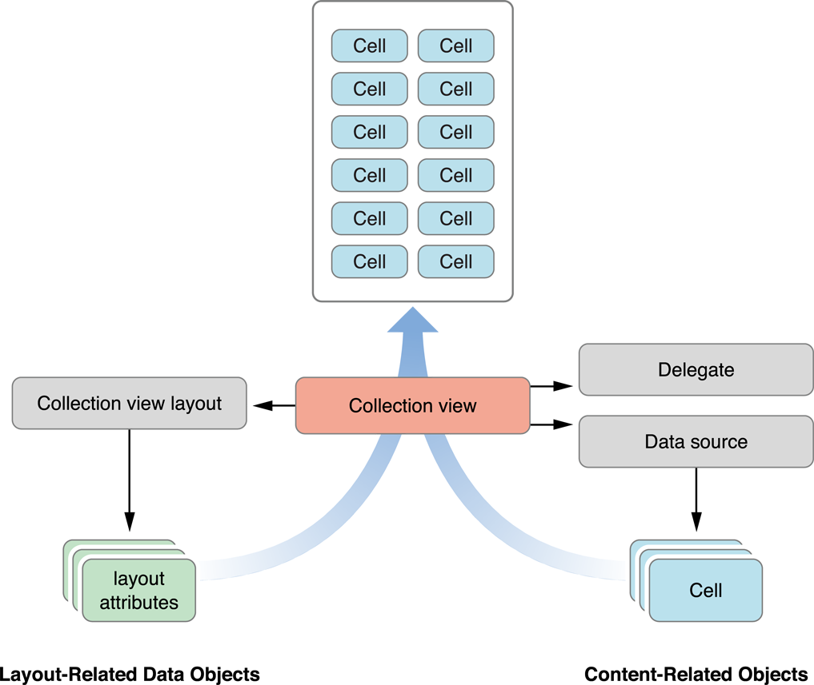

# Collection View Programming Guide for iOS (1) ---- Collection View Basics

原文地址：
[https://developer.apple.com/library/content/documentation/WindowsViews/Conceptual/CollectionViewPGforIOS/CollectionViewBasics/CollectionViewBasics.html#//apple_ref/doc/uid/TP40012334-CH2-SW1](https://developer.apple.com/library/content/documentation/WindowsViews/Conceptual/CollectionViewPGforIOS/CollectionViewBasics/CollectionViewBasics.html#//apple_ref/doc/uid/TP40012334-CH2-SW1)

# 1 Collection View Basics - Collection View 基础

To present its content onscreen, a collection view cooperates with many different objects. Some objects are custom and must be provided by your app. For example, your app must provide a data source object that tells the collection view how many items there are to display. Other objects are provided by UIKit and are part of the basic collection view design.

为了将内容展示到屏幕上，collection view 要与许多不同的对象协作。某些对象是自定义的，必须由你的app提供。例如，你的app必须提供 data source 对象，用来告知 collection view 有多少个项目要显示。其他对象由 UIKit 提供，它们是基本 collection view 设计的一部分。

Like tables, collection views are data-oriented objects whose implementation involves a collaboration with your app’s objects. Understanding what you have to do in your code requires a little background information about how a collection view does what it does.

像 table 一样，collection view 也是面向数据的对象，它的实现调用了与你的app的对象之间的协作。理解你要在代码中做什么，这需要一点关于 collection view 如何完成其工作的背景知识。

## 1.1 A Collection View Is a Collaboration of Objects - Collection View 是一些对象的协作

The design of collection views separates the data being presented from the way that data is arranged and presented onscreen. Although your app is strictly responsible for managing the data to be presented, its visual presentation is managed by many different objects. Table 1-1 lists the collection view classes in UIKit and organizes them by the roles they play in implementing a collection view interface. Most of the classes are designed to be used as is without any need for subclassing, so you can usually implement a collection view with very little code. And when you want to go beyond the provided behavior, you can subclass and provide that behavior.

Collection view 的设计将即将显示的数据和数据被排列和显示到屏幕上的方法分离开来。尽管你的app要严格对管理显示的数据负责，其可见显示仍是由许多不同的对象管理的。表 1-1 列出了 UIKit 中的 collection view 类，并通过在实现 collection view 交互中他们扮演的角色将它们组织起来。大部分类被设计成不需要任何子类化就可以使用，所以你总是可以用非常少的代码就实现一个 collection view。而当你想要超越给定的行为时，你可以子类化并提供相应的行为。

Table 1-1  The classes and protocols for implementing collection views

|Purpose|Classes/Protocols|Description|
|:-:|:-:|:-:|
|Top-level containment and management   顶级控制和管理|[UICollectionView](https://developer.apple.com/documentation/uikit/uicollectionview) [UICollectionViewController](https://developer.apple.com/documentation/uikit/uicollectionviewcontroller)|A UICollectionView object defines the visible area for your collection view’s content. This class descends from UIScrollView and can contain a large scrollable area as needed. This class also facilitates the presentation of your data based on the layout information it receives from its layout object.  UICollectionView 对象定义了你的 collection view 的内容的可见区域。这个类继承自 UIScrollView 并按需包含一个大的可滚动区域。这个类也使得基于布局信息的数据展示更加便利，布局信息则从其布局对象获取。   A UICollectionViewController object provides view controller–level management support for a collection view. Its use is optional.   UICollectionViewController 对象为 collection view 提供视图控制器级别的管理支持。其使用是可选的。|
|Content management   内容管理|[UICollectionViewDataSource](https://developer.apple.com/documentation/uikit/uicollectionviewdatasource) protocol [UICollectionViewDelegate](https://developer.apple.com/documentation/uikit/uicollectionviewdelegate) protocol|The data source object is the most important object associated with the collection view and is one that you must provide. The data source manages the content of the collection view and creates the views needed to present that content. To implement a data source object, you must create an object that conforms to the UICollectionViewDataSource protocol.  数据源对象是与 collection view 相关联的最重要的对象，也是你必须提供的对象。数据源管理了 collection view 的内容，并创建需要展示那些内容的视图。要实现数据源对象，你必须创建一个遵守 UICollectionViewDataSource 协议的对象。 The collection view delegate object lets you intercept interesting messages from the collection view and customize the view’s behavior. For example, you use a delegate object to track the selection and highlighting of items in the collection view. Unlike the data source object, the delegate object is optional.  Collection view 代理对象让你从 collection view 拦截感兴趣的消息，并自定义视图的行为。例如，你使用代理对象跟踪 collection view 中的项目的选中和高亮。与数据源对象不同，代理对象是可选的。   For information about how to implement the data source and delegate objects, see [Designing Your Data Source and Delegate](https://developer.apple.com/library/content/documentation/WindowsViews/Conceptual/CollectionViewPGforIOS/CreatingCellsandViews/CreatingCellsandViews.html#//apple_ref/doc/uid/TP40012334-CH7-SW1).   关于如何实现数据源和代理对象，参见[Designing Your Data Source and Delegate](https://developer.apple.com/library/content/documentation/WindowsViews/Conceptual/CollectionViewPGforIOS/CreatingCellsandViews/CreatingCellsandViews.html#//apple_ref/doc/uid/TP40012334-CH7-SW1)。|
|Presentation 展示|[UICollectionReusableView](https://developer.apple.com/documentation/uikit/uicollectionreusableview) [UICollectionViewCell](https://developer.apple.com/documentation/uikit/uicollectionviewcell)|All views displayed in a collection view must be instances of the UICollectionReusableView class. This class supports a recycling mechanism in use by collection views. Recycling views (instead of creating new ones) improves performance in general and especially improves it during scrolling.  在 collection view 中显示的所有视图都必须是 UICollectionReusableView 类的实例。这个类在被 collection view 使用时支持重用机制。重用视图（而不是创建一个新的）通常会提升性能，特别是在滚动时。 A UICollectionViewCell object is a specific type of reusable view that you use for your main data items.  UICollectionViewCell 对象是一种特别的重用视图，用于主要数据项目。|
|Layout 布局|[UICollectionViewLayout](https://developer.apple.com/documentation/uikit/uicollectionviewlayout) [UICollectionViewLayoutAttributes](https://developer.apple.com/documentation/uikit/uicollectionviewlayoutattributes) [UICollectionViewUpdateItem](https://developer.apple.com/documentation/uikit/uicollectionviewupdateitem)|Subclasses of UICollectionViewLayout are referred to as layout objects and are responsible for defining the location, size, and visual attributes of the cells and reusable views inside a collection view.  UICollectionViewLayout 的子类被看作是布局对象，并负责定义 collection view 中的 cell 和重用视图的位置、大小和视觉属性。 During the layout process, a layout object creates layout attribute objects (instances of the UICollectionViewLayoutAttributes class) that tell the collection view where and how to display cells and reusable views. 在布局过程中，布局对象创建布局属性对象（UICollectionViewLayoutAttributes 类的实例），告诉 collection view 在哪儿如何显示 cell 和重用视图。 The layout object receives instances of the UICollectionViewUpdateItem class whenever data items are inserted, deleted, or moved within the collection view. You never need to create instances of this class yourself. 每当数据项目被插入、删除或在 collection view 中被移动，布局对象都会接收到 UICollectionViewUpdateItem 类的实例。而你永远不要自己创建这个类的实例。 For more information about the layout object, see [The Layout Object Controls the Visual Presentation](https://developer.apple.com/library/content/documentation/WindowsViews/Conceptual/CollectionViewPGforIOS/CollectionViewBasics/CollectionViewBasics.html#//apple_ref/doc/uid/TP40012334-CH2-SW14).  关于布局对象的更多信息，参见[The Layout Object Controls the Visual Presentation](https://developer.apple.com/library/content/documentation/WindowsViews/Conceptual/CollectionViewPGforIOS/CollectionViewBasics/CollectionViewBasics.html#//apple_ref/doc/uid/TP40012334-CH2-SW14)。|
|Flow layout 流式布局|[UICollectionViewFlowLayout](https://developer.apple.com/documentation/uikit/uicollectionviewflowlayout) [UICollectionViewDelegateFlowLayout](https://developer.apple.com/documentation/uikit/uicollectionviewdelegateflowlayout) protocol|The UICollectionViewFlowLayout class is a concrete layout object that you use to implement grids or other line-based layouts. You can use the class as-is or in conjunction with the flow delegate object, which allows you to customize the layout information dynamically.  UICollectionViewFlowLayout 类是一个混合布局对象，用来实现网格或其他基于线的布局。你可以使用这个类，或与流代理对象结合，让你可以动态的自定义布局信息。|

Figure 1-1 shows the relationship between the core objects associated with a collection view. The collection view gets information about the cells to display from its data source. The data source and delegate objects are custom objects provided by your app and used to manage the content, including the selection and highlighting of cells. The layout object is responsible for deciding where those cells belong and for sending that information to the collection view in the form of one or more layout attribute objects. The collection view then merges the layout information with the actual cells (and other views) to create the final visual presentation.

图 1-1 展示了与 collection view 相关的核心对象之间的关系。Collection view 从它的数据源获得关于 cell 的信息。数据源和代理对象是由你的app提供的自定义对象，并用于管理内容，包括 cell 的选中和高亮。布局对象负责决定那些 cell 属于哪里，以及以一个或多个布局属性对象的形式发送这些信息到 collection view。然后 collection view 将这些布局信息与实际的 cell（以及其他视图）合并以创建最终的视觉显示。

Figure 1-1  Merging content and layout to create the final presentation - 合并内容和布局以创建最终的显示

When creating a collection view interface, you first add a UICollectionView object to your storyboard or nib file. Think of the collection view as the central hub, from which all other objects emanate. After adding that object, you can begin to configure any related objects, such as the data source or delegate. All configurations are centered around the collection view itself. For example, you never create a layout object without also creating a collection view object.

当创建 collection view 界面时，你首先添加一个 UICollectionView 对象到你的 storyboard 或 nib 文件。把这个 collection view 想象成一个中心枢纽，所有其他对象都从这里散发出去。在添加这个对象之后，你可以开始配置任何相关的对象，例如数据源或代理。所有的配置都以 collection view 自己为中心。例如，你永远不会创建一个布局对象而没有也创建一个 collection view 对象。

## 1.2 Reusable Views Improve Performance - 重用视图提升性能

Collection views employ a view recycling program to improve efficiency. As views move offscreen, they are removed from view and placed in a reuse queue instead of being deleted. As new content is scrolled onscreen, views are removed from the queue and repurposed with new content. To facilitate this recycling and reuse, all views displayed by the collection view must descend from the UICollectionReusableView class.

Collection view 采用一个视图回收程序提升效率。当视图移动到屏幕外时，它们就被从视图中移除，并被放到一个重用队列中，而不是被删除。当新的内容被滚动到屏幕内时，视图就从该队列中移除，并被重新赋予新的内容。为了是这中回收和重用更便利，所有由 collection view 显示的视图必须继承自 UICollectionReusableView 类。

Collection views support three distinct types of reusable views, each of which has a specific intended usage:

Collection view 支持三种不同的可重用视图，每种都有特殊的预期用途：

- _Cells_ present the main content of your collection view. The job of a cell is to present the content for a single item from your data source object. Each cell must be an instance of the UICollectionViewCell class, which you may subclass as needed to present your content. Cell objects provide inherent support for managing their own selection and highlight state. To actually apply a highlight to a cell, you must write some custom code. For information on implementing cell highlighting/selecting, see [Managing the Visual State for Selections and Highlights](https://developer.apple.com/library/content/documentation/WindowsViews/Conceptual/CollectionViewPGforIOS/CreatingCellsandViews/CreatingCellsandViews.html#//apple_ref/doc/uid/TP40012334-CH7-SW8).
- _Cells_ 显示 collection view 的主要内容。一个 cell 的工作时显示来自数据源对象的一个项目的内容。每个 cell 必须是 UICollectionViewCell 类的实例，你必须按需要子类化这个类以显示你的内容。Cell 对象为管理它们自己的选中和高亮状态提供了内在的支持。要实际的将高亮应用到一个 cell 上，你必须写一些自定义代码。关于实现 cell 高亮/选中的信息，参见 [Managing the Visual State for Selections and Highlights](https://developer.apple.com/library/content/documentation/WindowsViews/Conceptual/CollectionViewPGforIOS/CreatingCellsandViews/CreatingCellsandViews.html#//apple_ref/doc/uid/TP40012334-CH7-SW8)。
- _Supplementary_ views display information about a section. Like cells, supplementary views are data driven. Unlike cells, supplementary views are not mandatory, and their usage and placement is controlled by the layout object being used. For example, the flow layout supports headers and footers as optional supplementary views.
- _Supplementary_ 视图显示关于 section 的信息。像 cell 一样，supplementary 视图是数据驱动的。与 cell 不同的是，supplementary 视图不是强制的，并且它们的使用和放置由使用的布局对象控制。例如，流式布局支持 header 和 footer 作为可选的 supplementary 视图。
- _Decoration_ views are visual adornments that are wholly owned by the layout object and are not tied to any data in your data source object. For example, a layout object might use decoration views to implement a custom background appearance.
- _Decoration_ 视图是完全由布局对象所拥有视觉装饰物，并没有与数据源对象中的任何数据绑定。例如，布局兑现可能使用 decoration 视图实现自定义的背景显示。

Unlike table views, collection views impose no specific style on the cells and supplementary views provided by your data source. Instead, the basic reusable view classes are blank canvases for you to modify. For example, you can use them to build small view hierarchies, to display images, or even to draw content dynamically.

与 table view 不同，collection view 没有强制要求由数据源提供的 cell 和 supplementary 视图的特殊样式。相反，基本可重用视图类就是一个空白的幕布让你去修改。例如，你可以使用它们以建立小的视图层级，以显示图像，或甚至是动态的绘制内容。

Your data source object is responsible for providing the cells and supplementary views used by its associated collection view. However, the data source never creates views directly. When asked for a view, your data source dequeues a view of the desired type using the methods of the collection view. The dequeueing process always returns a valid view, either by retrieving one from a reuse queue or by using a class, nib file, or storyboard you provide to create a new view.

你的数据源对象负责提供被相关 collection view 使用的 cell 和 supplementary 视图。但是，数据源不会直接创建视图。当需要一个视图时，数据源使用 collection view 的方法，从队列中取出一个想要的类型的视图。从队列中取出的过程总是会返回一个有效的视图，可能是从一个重用队列中取出来的，也可能是使用你提供的类、nib 文件 或 storyboard 创建的新视图。

For information about how to create and configure views from your data source, see [Configuring Cells and Supplementary Views](https://developer.apple.com/library/content/documentation/WindowsViews/Conceptual/CollectionViewPGforIOS/CreatingCellsandViews/CreatingCellsandViews.html#//apple_ref/doc/uid/TP40012334-CH7-SW6).

关于如何从数据源创建和配置视图的信息，参见 [Configuring Cells and Supplementary Views](https://developer.apple.com/library/content/documentation/WindowsViews/Conceptual/CollectionViewPGforIOS/CreatingCellsandViews/CreatingCellsandViews.html#//apple_ref/doc/uid/TP40012334-CH7-SW6)。

## 1.3 The Layout Object Controls the Visual Presentation - 布局对象控制视觉显示

The layout object is solely responsible for determining the placement and visual styling of items within the collection view. Although your data source object provides the views and the actual content, the layout object determines the size, location, and other appearance-related attributes of those views. This separation of responsibilities makes it possible to change layouts dynamically without changing any of the data objects managed by your app.

布局对象完全负责决定在 collection view 中的项目的放置和视觉样式。尽管数据源对象提供了视图和实际的内容，布局对象会决定那些视图的大小、位置和其他显示相关属性。这种责任的分离让不改变app管理的任何数据对象就动态的改变布局称为可能。

The layout process used by collection views is related to, but distinct from, the layout process used by the rest of your app’s views. In other words, do not confuse what a layout object does with the `layoutSubviews` method used to reposition child views inside a parent view. A layout object never touches the views it manages directly because it does not actually own any of those views. Instead, it generates attributes that describe the location, size, and visual appearance of the cells, supplementary views, and decoration views in the collection view. It is then the job of the collection view to apply those attributes to the actual view objects.

被 collection view 使用的布局过程与你的app的其他视图使用的布局过程是相关的，但又是不同的。换句话说，不要为布局对象在用于重新放置父视图子视图的位置的 `layoutSubviews` 方法中做了什么而迷惑。布局对象永远不会直接触及它管理的视图，因为它实际上并不拥有任何视图。相反，它生成描述 collection view 中的 cell、supplementary view 和 decoration view 的位置、尺寸和视觉外观的属性。然后 collection view 负责应用这些属性到实际的视图对象上。

There are no limits to how a layout object can affect the views in a collection view. A layout object can move some views but not others. It can move views only a little bit, or it can move them randomly around the screen. It can even reposition views without any regard for the surrounding views. For example, a layout object can stack views on top of each other if it wants. The only real limitation is how the layout object affects the visual style you want your app to have.

对于布局对象如何影响 collection view 中的视图没有做限制。布局对象可以移动一些视图而不动其他的。它可以只把视图移动一点点，或者也可以在屏幕上随机的移动它们。例如，布局视图可以将视图堆叠在其他每个视图的顶上，如果它想要这么做。唯一实际存在的限制就是，布局视图如何影响你想要你的app拥有的视觉样式。

Figure 1-2 shows how a vertically scrolling flow layout arranges its cells and supplementary views. In a vertically scrolling flow layout, the width of the content area remains fixed and the height grows to accommodate the content. To compute the area, the layout object places views and cells one at a time, choosing the most appropriate location for each. In the case of the flow layout, the size of the cells and supplementary views are specified as properties, either on the layout object or by using a delegate. Computing the layout is just a matter of using those properties to place each view.

图 1-2 展示了竖直滚动的流式布局如何排列它的 cell 和 supplementary view。在竖直滚动的流式布局中，内容区域的宽度仍然是固定的，而高度则随着内容增长。为了计算区域，布局对象一次只放置一个 view 和 cell，为每个 view 和 cell 选择最合适的位置。在流式布局的情况下，cell 和 supplementary view 的尺寸被作为属性，可能在布局对象上或者通过使用代理来给出。计算布局只是使用那些属性来放置每一个视图的一部分内容。

Figure 1-2  The layout object provides layout metrics

Layout objects control more than just the size and position of their views. The layout object can specify other view-related attributes, such as its transparency, its transform in 3D space, and its visibility (if any) above or below other views. These attributes let you create more interesting layouts. For example, you might create stacks of cells by placing the views on top of one another and changing their z-ordering, or you might use a transform to rotate them on any axis.

布局对象不控制的不仅是它们的视图的尺寸和位置。布局对象可以指定其他与视图相关的属性，如它的透明度，它在3D空间的转换，以及它在其他视图上面或下面的能见度（如果有的话）。这些属性让你可以创建更有趣的布局。例如，你可以创建层层叠叠的 cell，通过把视图一个一个放在另一个的上面并改变它们的z顺序，或者你可以使用一个转换在任意轴上旋转它们。 

For detailed information about how a layout object fulfills its responsibilities to the collection view, see [Creating Custom Layouts](https://developer.apple.com/library/content/documentation/WindowsViews/Conceptual/CollectionViewPGforIOS/CreatingCustomLayouts/CreatingCustomLayouts.html#//apple_ref/doc/uid/TP40012334-CH5-SW1).

关于布局对象如何实现它对 collection view 的职责的详细信息，参见 [创建自定义布局](https://developer.apple.com/library/content/documentation/WindowsViews/Conceptual/CollectionViewPGforIOS/CreatingCustomLayouts/CreatingCustomLayouts.html#//apple_ref/doc/uid/TP40012334-CH5-SW1)。

## 1.4 Collection Views Initiate Animations Automatically - Collection View 自动开启动画

Collection views build in support for animations at a fundamental level. When you insert (or delete) items or sections, the collection view automatically animates any views impacted by the change. For example, when you insert an item, items after the insertion point are usually shifted to make room for the new item. The collection view can create these animations because it detects the current position of items and can calculate their final positions after the insertion takes place. Thus, it can animate each item from its initial position to its final position.

Collection view 建立了对基本级别动画的支持。当你插入（或删除）项目或 section 时，collection view 自动的使被这个改变影响的视图具有动画。例如，当你插入一个项目，在这个插入点之后的项目总是要挪动才能给新的项目留出空间。Collection view 可以创建这些动画，因为它可以探测到项目的当前位置，并可以计算在插入发生之后的最终位置。那么，它就可以给每一个项目添加从初始位置到最终位置的动画。

In addition to animating insertions, deletions, and move operations, you can invalidate the layout at any time and force it to recalculate its layout attributes. Invalidating the layout does not animate items directly; when you invalidate the layout, the collection view displays the items in their newly calculated positions without animating them. Instead in a custom layout, you might use this behavior to position cells at regular intervals and create an animated effect.

除了给插入、删除和移动操作增加动画，你还可以在任何时候让布局失效并强制其重新计算布局属性。使布局失效并不会直接给项目启动动画；当你式布局失效时，collection view 会在项目最近计算的位置显示它们而没有动画。相反，在自定义布局中，你可以使用这个行为以均匀的时间间隔放置 cell 来创造一个动画效果。