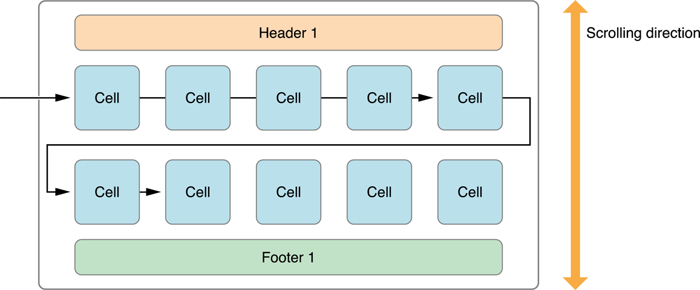
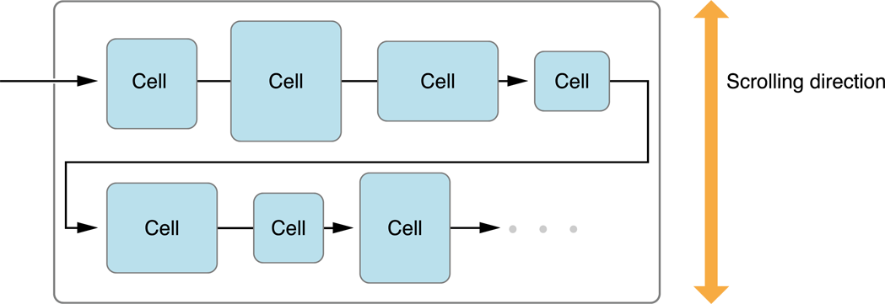
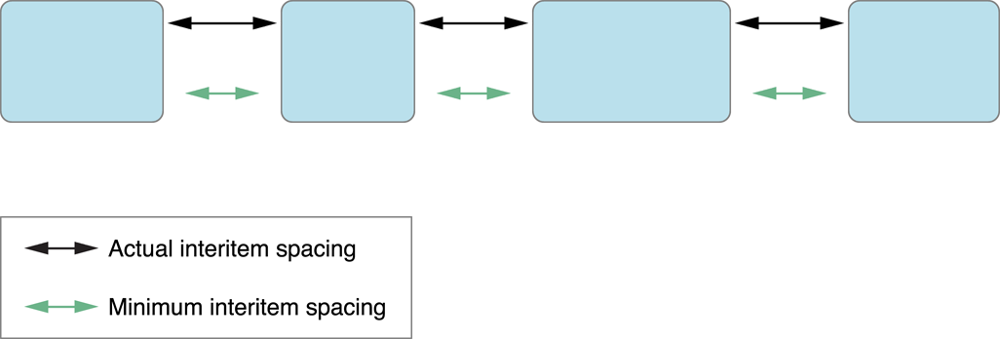
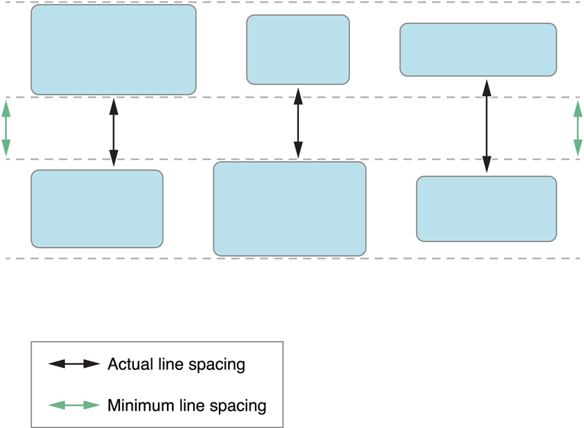
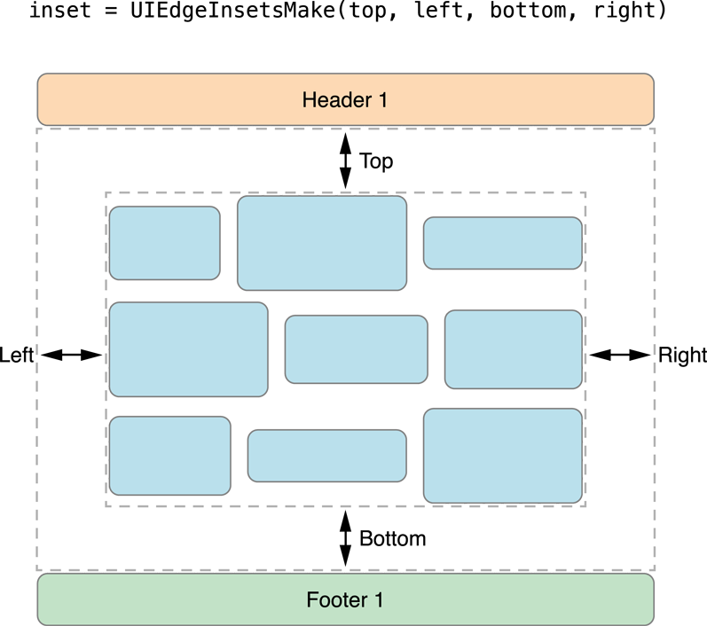

# Collection View Programming Guide for iOS (3) ---- Using the Flow Layout

原文地址：
[https://developer.apple.com/library/content/documentation/WindowsViews/Conceptual/CollectionViewPGforIOS/UsingtheFlowLayout/UsingtheFlowLayout.html#//apple_ref/doc/uid/TP40012334-CH3-SW1](https://developer.apple.com/library/content/documentation/WindowsViews/Conceptual/CollectionViewPGforIOS/UsingtheFlowLayout/UsingtheFlowLayout.html#//apple_ref/doc/uid/TP40012334-CH3-SW1)

# 3 Using the Flow Layout - 使用流式布局

You can arrange items in your collection views using a concrete layout object, the [UICollectionViewFlowLayout](https://developer.apple.com/documentation/uikit/uicollectionviewflowlayout) class. The flow layout implements a line-based breaking layout, which means that the layout object places cells on a linear path and fits as many cells along that line as it can. When the layout object runs out of room on the current line, it creates a new line and continues the layout process there. Figure 3-1 shows what this looks like for a flow layout that scrolls vertically. In this case, lines are laid out horizontally with each new line positioned below the previous line. The cells in a single section can be optionally surrounded with section header and section footer views.

你可以在你的 collection view 中使用具体的局对象，[UICollectionViewFlowLayout](https://developer.apple.com/documentation/uikit/uicollectionviewflowlayout)，来排布 item。流式布局实现了基于线的中断布局，这意味着布局对象在一条直线路径上放置 cell 并沿着这条线放入尽可能多的 cell。当布局对象用尽了当前直线上的空间，它会创建一个新的直线并在这里继续布局过程。图 3-1 展示了一个竖直滚动的流式布局看起来的样子。在这个例子中，每一行都水平的排布，每一个新行被放在前一行的下面。在单个 section 中的 cell 可以选择性的被 section header 和 section footer 视图围绕。

Figure 3-1  Laying out sections and cells using the flow layout - 使用流式布局放置 section 和 cell

You can use the flow layout to implement grids, but you can also use it for much more. The idea of a linear layout can be applied to many different designs. For example, rather than having a grid of items, you can adjust the spacing to create a single line of items along the scrolling dimension. Items can also be different sizes, which yields something more asymmetrical than a traditional grid but that still has a linear flow to it. There are many possibilities.

你可以使用流式布局实现网格，但你也可以使用它做更多的事情。线性布局的想法可以应用在许多不同的设计上。例如，你可以在滚动维度上调整空间创建一行 item，而不用拥有一个网格的 item。Item 也可以是不同的尺寸，这会产生比传统网格更不对称东西，但对于它仍然是一个线性流。有许多的可能性。

You can configure the flow layout either programmatically or using Interface Builder in Xcode. The steps for configuring the flow layout are as follows:

你可以通过编程或者使用 Xcode 中的 Interface Builder 配置流式布局。配置流式布局的步骤如下：

1. Create a flow layout object and assign it to your collection view.
2. Configure the width and height of cells.
3. Set the spacing options (as needed) for the lines and items.
4. If you want section headers or section footers, specify their size.
5. Set the scroll direction for the layout.

>

1. 创建流式布局对象并将其分配给你的 collection view。
2. 配置 cell 的宽度和高度。
3. 为行和 item 设置间隔选项（如果需要）。
4. 如果你想要有 section header 或 section footer，指定它们的尺寸。
5. 为布局设置滚动方向。

> **Important:** At a minimum, you must specify the width and height of cells. If you don’t, your items are assigned a width and height of 0 and will never be visible.
> 
> **重要：**至少，你必须指定 cell 的宽度和高度。如果你没有做，你的 item 的宽度和高度就会被设置成 0，并且永远不可见了。

## 3.1 Customizing the Flow Layout Attributes - 自定义流式布局属性

The flow layout object exposes several properties for configuring the appearance of your content. When set, these properties are applied to all items equally in the layout. For example, setting the cell size using the [itemSize](https://developer.apple.com/documentation/uikit/uicollectionviewflowlayout/1617711-itemsize) property of the flow layout object causes all cells to have the same size.

流式布局对象公开了若干属性以配置内容的显示。当设置这些属性时，会平等的应用到布局中的所有 item 上。例如，使用流式布局对象的 [itemSize](https://developer.apple.com/documentation/uikit/uicollectionviewflowlayout/1617711-itemsize) 属性设置 cell 的尺寸会导致所有的 cell 拥有相同的大小。

If you want to vary the spacing or size of items dynamically, you can do so using the methods of the [UICollectionViewDelegateFlowLayout](https://developer.apple.com/documentation/uikit/uicollectionviewdelegateflowlayout) protocol. You implement these methods on the same delegate object you assigned to the collection view itself. If a given method exists, the flow layout object calls that method instead of using the fixed value it has. Your implementation must then return appropriate values for all of the items in the collection view.

如果你想要动态的改变 item 的间隔或尺寸，你可以使用 [UICollectionViewDelegateFlowLayout](https://developer.apple.com/documentation/uikit/uicollectionviewdelegateflowlayout) 协议的方法来做到。你在指派给 collection view 自己的同一个代理对象中实现这些方法。如果一个给出的方法是存在的，流式布局对象就会调用这个方法，而不是使用固定的值。你的实现必须返回适当的值给 collection view 中的所有 item。

### 3.1.1 Specifying the Size of Items in the Flow Layout - 在流式布局中指定 item 的尺寸

If all of the items in the collection view are the same size, assign the appropriate width and height values to the [itemSize](https://developer.apple.com/documentation/uikit/uicollectionviewflowlayout/1617711-itemsize) property of the flow layout object. (Always specify the size of items in points.) This is the fastest way to configure the layout object for content whose size does not vary.

如果在 collection view 中的所有 item 是相同大小，就给流式布局对象的 [itemSize](https://developer.apple.com/documentation/uikit/uicollectionviewflowlayout/1617711-itemsize) 属性指定适当的宽度和高度值。（总是按照点数来指定 item 的大小。）这是给不会改变大小的内容配置布局对象的最快的方式。

If you want to specify different sizes for your cells, you must implement the [collectionView:layout:sizeForItemAtIndexPath:](https://developer.apple.com/documentation/uikit/uicollectionviewdelegateflowlayout/1617708-collectionview) method on the collection view delegate. You can use the provided index path information to return the size of the corresponding item. During layout, the flow layout object centers items vertically on the same line, as shown in Figure 3-2. The overall height or width of the line is then determined by the largest item in that dimension.

如果你想要对你的 cell 指定不同的尺寸，你必须在 collection view 的代理中实现 [collectionView:layout:sizeForItemAtIndexPath:](https://developer.apple.com/documentation/uikit/uicollectionviewdelegateflowlayout/1617708-collectionview) 方法。你可以使用提供的 index path 信息来返回相应 item 的尺寸。在布局过程中，流式布局对象会垂直居中同一行的 item，如图 3-2 所示。然后整个行的高度或宽度由这个维度上最大的 item 决定。

Figure 3-2  Items of different sizes in the flow layout - 在流式布局中不同尺寸的 item

> **Note:** When you specify different sizes for cells, the number of items on a single line can vary from line to line.
> 
> **注意：**当你指定 cell 的不同尺寸时，每一行中 item 的数量也可能逐行改变。

### 3.1.2 Specifying the Space Between Items and Lines - 指定在 item 和行之间的间距

Using the flow layout, you can specify the minimum spacing between items on the same line and the minimum spacing between successive lines. Keep in mind that the spacing you provide is only the minimum spacing. Because of how it lays out content, the flow layout object may increase the spacing between items to a value greater than the one you specified. The layout object may similarly increase the actual line-spacing when the items being laid out are different sizes.

使用流式布局，你可以指定同一行中的 item 的最小间距，以及连续行之间的最小间距。始终记住，你提供的间距只是最小间距。因为流式布局对象如何布局内容可能会产生影响，增加 item 之间的间距到一个比你指定的值更大的值。布局对象可能类型的增加实际的行间距，当 item 以不同的尺寸布局时。

During layout, the flow layout object adds items to the current line until there is not enough space left to fit an entire item. If the line is just big enough to fit an integral number of items with no extra space, then the space between the items would be equal to the minimum spacing. If there is extra space at the end of the line, the layout object increases the interitem spacing until the items fit evenly within the line boundaries, as shown in Figure 3-3. Increasing the spacing improves the overall look of the items and prevents large gaps at the end of each line.

在布局过程中，流式布局对象添加 item 到当前行，直到没有足够的剩余空间放下一整个 item。如果这一行刚好足够大，能放下整数个的 item 而没有额外的空间，那么 item 之间的间隔就会等于最小间隔。如果在行的末尾有额外的空间，布局对象就会增加项目间隔，直到 item 均匀的分布在行边界以内，如图 3-3 所示。增加间隔会改善 item 的整体视觉并避免在每个行的末尾出现大量空白。

Figure 3-3  Actual spacing between items may be greater than the minimum - item 之间的实际间距可能比最小间距更大

For interline spacing, the flow layout object uses the same technique that it does for inter-item spacing. If all items are the same size, the flow layout is able to respect the minimum line spacing value absolutely and all items in one line appear to be spaced evenly from the items in the next line. If the items are of different sizes, the actual spacing between individual items can vary.

对于行间距，流式布局对象使用与项目间距相同的技术。如果所有的 item 大小相同，流式布局能绝对尊重最小行间距值，并且一行中的所有 item 与下一行中的 item 都是均匀间隔的。如果 item 的大小是不同的，那么每个 item 之间的实际间隔可以改变。

Figure 3-4 demonstrates what happens with the minimum line spacing when items are of different sizes. With differently sized items, the flow layout object picks the item from each line whose dimension in the scrolling direction is the largest. For example, in a vertically scrolling layout, it looks for the item in each line with the greatest height. It then sets the spacing between those items to the minimum value. If the items are on different parts of the line, as shown in the figure, the actual line spacing appears to be greater than the minimum.

图 3-4 示范了当 item 的大小不同时最小行间距会发生什么。对于不同大小的 item，流式布局对象会从每一行挑出在滚动方向上尺寸最大的 item。例如，在一个竖直滚动的布局中，它就在每一行寻找最大高度的 item。然后它将那些item之间的间距设置成最小值。对于在行中不同部分的 item，实际行间距看起来就比最小值更大了。

Figure 3-4  Line spacing varies if items are of different sizes - 如果 item 的大小不同行间距就会改变

As with other flow layout attributes, you can use fixed spacing values or vary the values dynamically. Line and item spacing is handled on a section-by-section basis. Thus, the line and interitem spacing is the same for all of the items in a given section but may vary between sections. You set the spacing statically using the [minimumLineSpacing](https://developer.apple.com/documentation/uikit/uicollectionviewflowlayout/1617717-minimumlinespacing) and [minimumInteritemSpacing](https://developer.apple.com/documentation/uikit/uicollectionviewflowlayout/1617706-minimuminteritemspacing) properties of the flow layout object or using the [collectionView:layout:minimumLineSpacingForSectionAtIndex:](https://developer.apple.com/documentation/uikit/uicollectionviewdelegateflowlayout/1617705-collectionview) and [collectionView:layout:minimumInteritemSpacingForSectionAtIndex:](https://developer.apple.com/documentation/uikit/uicollectionviewdelegateflowlayout/1617696-collectionview) methods of your collection view delegate.

如同其他流式布局属性一样，你可以使用固定间隔值或动态改变这个值。Line 和 item 间距是一个一个 section 为基础来管理的。这样，line 和 item 间距对于给定 section 中的所有 item 都是相同的，但是 section 之间可以变化。你可以使用流式布局对象的 [minimumLineSpacing](https://developer.apple.com/documentation/uikit/uicollectionviewflowlayout/1617717-minimumlinespacing) 和 [minimumInteritemSpacing](https://developer.apple.com/documentation/uikit/uicollectionviewflowlayout/1617706-minimuminteritemspacing) 属性静态的设置间距，或者使用 collection view 代理的 [collectionView:layout:minimumLineSpacingForSectionAtIndex:](https://developer.apple.com/documentation/uikit/uicollectionviewdelegateflowlayout/1617705-collectionview) 和 [collectionView:layout:minimumInteritemSpacingForSectionAtIndex:](https://developer.apple.com/documentation/uikit/uicollectionviewdelegateflowlayout/1617696-collectionview) 方法。

### 3.1.3 Using Section Insets to Tweak the Margins of Your Content - 使用 section inset 来调整你的内容的留白

Section insets are a way to adjust the space available for laying out cells. You can use insets to insert space after a section’s header view and before its footer view. You can also use insets to insert space around the sides of the content. Figure 3-5 demonstrates how insets affect some content in a vertically scrolling flow layout.

Section inset 是调整布局 cell 的可用空间的方法。你可以使用 inset 在 section 的 header view 之后和在 footer view 之前插入间隔。你也可以使用 inset 在内容的周边插入空白。图 3-5 示范了在一个竖直滚动的流式布局中 inset 是如何影响内容的。

Figure 3-5  Section insets change the available space for laying out cells - Section inset 改变布局 cell 的可用空间

Because insets reduce the amount of space available for laying out cells, you can use them to limit the number of cells in a given line. Specifying insets in the nonscrolling direction is one way to constrict the space for each line. If you combine that information with an appropriate cell size, you can control the number of cells on each line.

因为 inset 减少了布局 cell 的可用空间，你可以使用它们限制给定行的 cell 的数量。指定不滚动方向上的 inset 是缩小每一行的空间的一个方法。如果你结合适当的 cell 尺寸信息，你就可以控制每一行的 cell 的数量。

## 3.2 Knowing When to Subclass the Flow Layout - 何时子类化流式布局

Although you can use the flow layout very effectively without subclassing, there are still times when you might need to subclass to get the behavior you need. Table 3-1 lists some of the scenarios for which subclassing [UICollectionViewFlowLayout](https://developer.apple.com/documentation/uikit/uicollectionviewflowlayout) is necessary to achieve the desired effect.

尽管你不用子类化就可以非常高效的使用流式布局，仍然有一些时候你可能需要子类化以获得你想要的行为。表 3-1 列出了一些需要子类化 [UICollectionViewFlowLayout](https://developer.apple.com/documentation/uikit/uicollectionviewflowlayout) 以达到期望的效果的场景。

Table 3-1  Scenarios for subclassing `UICollectionViewFlowLayout` - 子类化 `UICollectionViewFlowLayout` 的场景

|Scenario|Subclassing tips|
|:-:|:-:|
|||

_(表格的内容太长，无法表示，改用分点表示)_

> ### 表 3-1（1）You want to add new supplementary or decoration views to your layout
> ### 你想要添加新的 supplementary 或 decoration 视图到你的布局
> The standard flow layout class supports only section header and section footer views and no decoration views. To support additional supplementary and decoration views, you need to override the following methods at a minimum:
> 
> 标准流式布局类只支持 section header 和 section footer 视图，而不支持 decoration 视图。要支持额外的 supplementary 和 decoration 视图，你至少需要重载下面方法：
>
> - [layoutAttributesForElementsInRect:](https://developer.apple.com/documentation/uikit/uicollectionviewlayout/1617769-layoutattributesforelements) (required)
> - [layoutAttributesForItemAtIndexPath:](https://developer.apple.com/documentation/uikit/uicollectionviewlayout/1617797-layoutattributesforitem) (required)
> - [layoutAttributesForSupplementaryViewOfKind:atIndexPath:](https://developer.apple.com/documentation/uikit/uicollectionviewlayout/1617792-layoutattributesforsupplementary) (to support new supplementary views)
> - [layoutAttributesForDecorationViewOfKind:atIndexPath:](https://developer.apple.com/documentation/uikit/uicollectionviewlayout/1617809-layoutattributesfordecorationvie) (to support new decoration views)
> 
> In your `layoutAttributesForElementsInRect:` method, you can call `super` to get the layout attributes for the cells and then add the attributes for any new supplementary or decoration views that are in the specified rectangle. Use the other methods to provide attributes on demand.
> 
> 在你的 `layoutAttributesForElementsInRect:` 方法中，你可以调用 `super` 为 cell 获取布局属性，然后为指定矩形区域内的任何新 supplementary 或 decoration 视图添加属性。按需使用其他方法提供属性。
> 
> For information about providing attributes for views during layout, see [Creating Layout Attributes](https://developer.apple.com/library/content/documentation/WindowsViews/Conceptual/CollectionViewPGforIOS/CreatingCustomLayouts/CreatingCustomLayouts.html#//apple_ref/doc/uid/TP40012334-CH5-SW21) and [Providing Layout Attributes for Items in a Given Rectangle](https://developer.apple.com/library/content/documentation/WindowsViews/Conceptual/CollectionViewPGforIOS/CreatingCustomLayouts/CreatingCustomLayouts.html#//apple_ref/doc/uid/TP40012334-CH5-SW6).
> 
> 关于在布局中为视图提供属性的信息，参见 [创建布局属性](https://developer.apple.com/library/content/documentation/WindowsViews/Conceptual/CollectionViewPGforIOS/CreatingCustomLayouts/CreatingCustomLayouts.html#//apple_ref/doc/uid/TP40012334-CH5-SW21) 和 [向给定矩形区域内的 item 提供布局属性](https://developer.apple.com/library/content/documentation/WindowsViews/Conceptual/CollectionViewPGforIOS/CreatingCustomLayouts/CreatingCustomLayouts.html#//apple_ref/doc/uid/TP40012334-CH5-SW6)。
> 
> ### 表 3-1（2）You want to tweak the layout attributes being returned by the flow layout 
> 
> ### 你想要调整由流式布局返回的布局属性
> 
> Override the `layoutAttributesForElementsInRect:` method and any of the methods that return layout attributes. The implementation of your methods should call `super`, modify the attributes provided by the parent class, and then return them.
> 
> 重载 `layoutAttributesForElementsInRect:` 方法和任何返回布局属性的方法。你的方法实现应该调用 `super`，修改由父类提供的属性，然后再返回它们。
> 
> For in-depth dicussions of what these methods entail, see [Creating Layout Attributes](https://developer.apple.com/library/content/documentation/WindowsViews/Conceptual/CollectionViewPGforIOS/CreatingCustomLayouts/CreatingCustomLayouts.html#//apple_ref/doc/uid/TP40012334-CH5-SW21) and [Providing Layout Attributes for Items in a Given Rectangle](https://developer.apple.com/library/content/documentation/WindowsViews/Conceptual/CollectionViewPGforIOS/CreatingCustomLayouts/CreatingCustomLayouts.html#//apple_ref/doc/uid/TP40012334-CH5-SW6).
> 
> 关于这些方法会导致什么的深度讨论，参见 [创建布局属性](https://developer.apple.com/library/content/documentation/WindowsViews/Conceptual/CollectionViewPGforIOS/CreatingCustomLayouts/CreatingCustomLayouts.html#//apple_ref/doc/uid/TP40012334-CH5-SW21) 和 [向给定矩形区域内的 item 提供布局属性](https://developer.apple.com/library/content/documentation/WindowsViews/Conceptual/CollectionViewPGforIOS/CreatingCustomLayouts/CreatingCustomLayouts.html#//apple_ref/doc/uid/TP40012334-CH5-SW6)。
> 
> ### 表 3-1（3）You want to add new layout attributes for your cells and views
> 
> ### 你想要为你的 cell 和视图添加新的布局属性
> 
> Create a custom subclass of [UICollectionViewLayoutAttributes](https://developer.apple.com/documentation/uikit/uicollectionviewlayoutattributes) and add whatever properties you need to represent your custom layout information.
> 
> 创建 [UICollectionViewLayoutAttributes](https://developer.apple.com/documentation/uikit/uicollectionviewlayoutattributes) 的自定义子类，并添加任何你需要表达你的自定义布局信息的属性。
> 
> Subclass [UICollectionViewFlowLayout](https://developer.apple.com/documentation/uikit/uicollectionviewflowlayout) and override the [layoutAttributesClass](https://developer.apple.com/documentation/uikit/uicollectionviewlayout/1617774-layoutattributesclass) method. In your implementation of that method, return your custom subclass.
> 
> 子类化 [UICollectionViewFlowLayout](https://developer.apple.com/documentation/uikit/uicollectionviewflowlayout)，并重载 [layoutAttributesClass](https://developer.apple.com/documentation/uikit/uicollectionviewlayout/1617774-layoutattributesclass) 方法。在这个方法的实现中，返回你的自定义子类。
> 
> You should also override the `layoutAttributesForElementsInRect:` method, the `layoutAttributesForItemAtIndexPath:` method, and any other methods that return layout attributes. In your custom implementations, you should set the values for any custom attributes you defined.
> 
> 你也应该重载 `layoutAttributesForElementsInRect:` 方法，`layoutAttributesForItemAtIndexPath:` 方法，以及任何其他返回布局属性的方法。在你的自定义实现中，你应该设置为任何你定义的自定义属性设置值。
> 
> ### 表 3-1（4）You want to specify initial or final locations for items being inserted or deleted
> 
> 你想要为插入或删除的 item 指定开始或结束为止
> 
> By default, a simple fade animation is created for items being inserted or deleted. To create custom animations, you must override some or all of the following methods:
> 
> 默认情况下，item 被插入或删除都会创建一个简单的淡入淡出动画。要创建自定义动画，你必须重载下列部分或全部方法：
> 
> - [initialLayoutAttributesForAppearingItemAtIndexPath:](https://developer.apple.com/documentation/uikit/uicollectionviewlayout/1617789-initiallayoutattributesforappear)
> - [initialLayoutAttributesForAppearingSupplementaryElementOfKind:atIndexPath:](https://developer.apple.com/documentation/uikit/uicollectionviewlayout/1617737-initiallayoutattributesforappear)
> - [initialLayoutAttributesForAppearingDecorationElementOfKind:atIndexPath:](https://developer.apple.com/documentation/uikit/uicollectionviewlayout/1617726-initiallayoutattributesforappear)
> - [finalLayoutAttributesForDisappearingItemAtIndexPath:](https://developer.apple.com/documentation/uikit/uicollectionviewlayout/1617740-finallayoutattributesfordisappea)
> - [finalLayoutAttributesForDisappearingSupplementaryElementOfKind:atIndexPath:](https://developer.apple.com/documentation/uikit/uicollectionviewlayout/1617742-finallayoutattributesfordisappea)
> - [finalLayoutAttributesForDisappearingDecorationElementOfKind:atIndexPath:](https://developer.apple.com/documentation/uikit/uicollectionviewlayout/1617762-finallayoutattributesfordisappea)
> 
> In your implementations of these methods, specify the attributes you want each view to have prior to being inserted or after they are removed. The flow layout object uses the attributes you provide to animate the insertions and deletions.
> 
> 在这些方法的实现中，指定你希望每个视图拥有的属性，应该在它们被插入之前或被移除之后。流式布局对象使用你提供的属性给插入和删除添加动画。
> 
> If you override these methods, it is also recommended that you override the [prepareForCollectionViewUpdates:](https://developer.apple.com/documentation/uikit/uicollectionviewlayout/1617784-prepare) and [finalizeCollectionViewUpdates](https://developer.apple.com/documentation/uikit/uicollectionviewlayout/1617787-finalizecollectionviewupdates) methods. You can use these methods to track which items are being inserted or deleted during the current cycle.
> 
> 如果你重载这些方法，也建议你重载 [prepareForCollectionViewUpdates:](https://developer.apple.com/documentation/uikit/uicollectionviewlayout/1617784-prepare) 和 [finalizeCollectionViewUpdates](https://developer.apple.com/documentation/uikit/uicollectionviewlayout/1617787-finalizecollectionviewupdates) 方法。你可以使用这些方法在整个周期中跟踪被插入或删除的 item。
> 
> For more information about how insertions and deletions work, see [Making Insertion and Deletion Animations More Interesting](https://developer.apple.com/library/content/documentation/WindowsViews/Conceptual/CollectionViewPGforIOS/CreatingCustomLayouts/CreatingCustomLayouts.html#//apple_ref/doc/uid/TP40012334-CH5-SW13).
> 
> 关于插入和删除如何工作的更多信息，参见 [让插入和删除动画更有趣](https://developer.apple.com/library/content/documentation/WindowsViews/Conceptual/CollectionViewPGforIOS/CreatingCustomLayouts/CreatingCustomLayouts.html#//apple_ref/doc/uid/TP40012334-CH5-SW13)。

There are also instances in which the right thing to do is to create a custom layout from scratch. Before you decide to do this, take the time to consider whether or not it is really necessary. The flow layout provides a lot of customizable behavior that is appropriate for many different kinds of layouts, and because it is provided to you, it is easy to use and contains numerous optimizations to make it efficient. However, all this is not to say that you should never create a custom layout, because there are circumstances in which doing so make absolute sense. The flow layout limits the scroll direction to one direction, so if your layout contains content that stretches farther than the bounds of the screen in both directions, a custom layout makes more sense to implement. Creating a custom layout is the right decision if your layout is not a grid or a line-based breaking layout, as described above, or if the items within your layout move so frequently that subclassing the flow layout is more compicated than creating your own.

也有一些情况下，正确的做法是从头创建一个自定义布局。在你决定这么做之前，花点时间考虑着是否真的有必要。流式布局提供了大量可自定义的行为，可以适应许多不同类型的布局，并且因为是向你提供的，它非常易于使用并包含了许多使其高效的优化。然而，所有这些并不是说永远不需要创建一个自定义布局，因为在有些情况下这样做绝对有意义。流式布局限制了只能一个滚动方向，因此如果你的布局在两个方向上都包含了超出屏幕边界的内容，实现自定义布局就更有意义了。如果你的布局不是一个网格或基于行分割的布局，就如上面描述的那样，或者如果你的布局中的 item 会非常频繁的移动以致于子类化流式布局比创建自己的更复杂，那么创建一个自定义布局都是正确的选择。

For more on creating a custom layout, see [Creating Custom Layouts](https://developer.apple.com/library/content/documentation/WindowsViews/Conceptual/CollectionViewPGforIOS/CreatingCustomLayouts/CreatingCustomLayouts.html#//apple_ref/doc/uid/TP40012334-CH5-SW1).

关于创建自定义布局的更多信息，参见 [创建自定义布局](https://developer.apple.com/library/content/documentation/WindowsViews/Conceptual/CollectionViewPGforIOS/CreatingCustomLayouts/CreatingCustomLayouts.html#//apple_ref/doc/uid/TP40012334-CH5-SW1)。