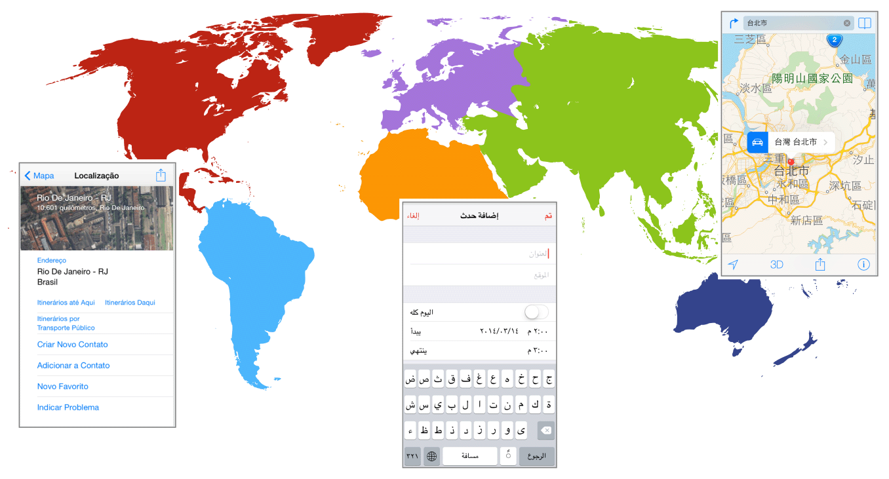
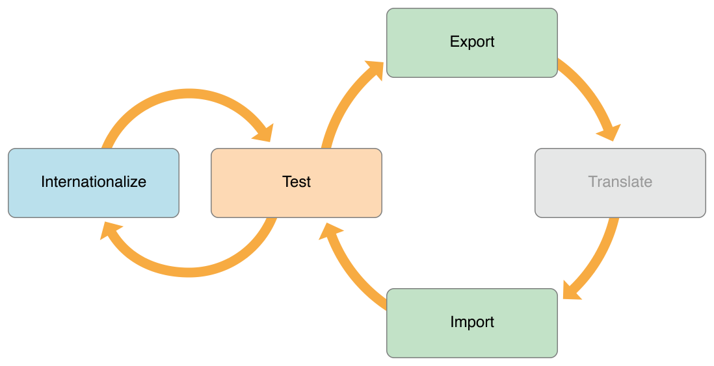

# Internationalization and Localization Guide (0) ---- About Internationalization and Localization

原文地址：
[https://developer.apple.com/library/content/documentation/MacOSX/Conceptual/BPInternational/Introduction/Introduction.html](https://developer.apple.com/library/content/documentation/MacOSX/Conceptual/BPInternational/Introduction/Introduction.html)

# 0 About Internationalization and Localization - 关于国际化和本地化

> **Note:** This document was previously titled _Internationalization Programming Topics_.
> 
> **注意：**本文以前的标题是《_Internationalization Programming Topics_》。

Localization is the process of translating your app into multiple languages. But before you can localize your app, you internationalize it. Internationalization is the process of making your app able to adapt to different languages, regions, and cultures. Because a single language can be used in multiple parts of the world, your app should adapt to the regional and cultural conventions of where a person resides. An internationalized app appears as if it is a native app in all the languages and regions it supports.

本地化就是把你的 App 翻译成多种语言的过程。但是在你本地化 App 之前，你要先将它国际化。国际化就是让你的 App 能够适配不同的语言、地域和文化的过程。因为一个语言可以在世界的多个地方使用，你的 App 应该适配人们居住地的地域和文化习俗。国际化的 App 在它支持的所有怨言和地域看起来都仿佛就是一个本地的 App。

The App Store is available in over 150 different countries, and internationalizing your app is the first step to reach this global market. Using iTunes Connect, you specify whether your app is available in all territories or specific territories. Then you customize your app for each target market that you want to support. Users in other countries want to use your app in a language they understand and see dates, times, and numbers in familiar, regional formats.

App Store 在超过 150 个不同的国家可用，国际化你的 App 是进入全球市场的第一步。使用 iTunes Connect，你指明你的 App 是在所有地方可用还是在特定地方可用。然后你为你想要支持的每个目标市场自定义你的 App。在其他国家的用户想要用他们理解的语言来使用你的 App，按照熟悉的地方格式来查看日期、时间和数字。

## 0.1 At a Glance - 概览

Xcode supports incremental localization of your project. First you internationalize your user interface and code during development. Then you test your app using pseudolocalizations and different region settings. When you are ready to localize your app, you export the localizable text using standard file formats and submit them to a localization team for translation into multiple languages. While you are waiting for these translations, you can continue developing your app and perform additional localization steps yourself—perhaps add language-specific audio and image files to your project. Then import the localizations into your project and thoroughly test your app in each supported language and region. During the next iteration of your app, you only translate changes and add additional languages.

Xcode 支持你的工程逐渐增加本地化。首先，你在开发过程中国际化你的用户界面和代码。然后使用伪本地化和不同的区域设置测试你的 App。当你准备本地化你的 App 时，你使用标准文件格式导出可本地化的文本，并提交它们到一个本地化团队，将它们翻译成多种语言。当你等待这些翻译时，你可以继续开发你的 App 并自己执行其他的本地化步骤 —— 可能是添加指定语言的音频和图像文件到你的工程中。然后将本地化导入到你的工程中，并在每个支持的语言和区域彻底的测试你的 App。在你的 App 的下一个迭代中，你只需要翻译变化和添加其他的语言即可。

### 0.1.1 Learn About Language and Region Settings - 学习关于语言和区域的设置

Start by familiarizing yourself with the language and region settings available to the user.

通过使你自己熟悉如何让语言和区域设置对用户有效开始。

> **Related Chapter:** [Reviewing Language and Region Settings](https://developer.apple.com/library/content/documentation/MacOSX/Conceptual/BPInternational/SpecifyingPreferences/SpecifyingPreferences.html#//apple_ref/doc/uid/10000171i-CH12-SW1)
> 
> **相关章节：**《[Reviewing Language and Region Settings](https://developer.apple.com/library/content/documentation/MacOSX/Conceptual/BPInternational/SpecifyingPreferences/SpecifyingPreferences.html#//apple_ref/doc/uid/10000171i-CH12-SW1)》

### 0.1.2 Internationalize Your App - 国际化你的 App

Prepare your app for localization by separating language and locale differences from the rest of your user interface and code.

通过将你的用户界面和代码的语言和区域与其他部分分开，以准备对你的 App 进行本地化。

- Use base internationalization to separate user-facing text from your `.storyboard` and `.xib` files.
- In Interface Builder, use Auto Layout so views adjust to the localized text.
- Separate other user-facing text from your code.
- Use standard APIs to handle the complexity of different writing systems and locale formats.
- Adhere to the user’s settings when formatting, sorting, searching, and parsing data.
- If the app supports right-to-left languages, mirror the user interface and change the text direction as needed.
- 使用基本国际化来分离用户面对的文本与你的 `.storyboard` 和 `.xib` 文件。
- 在 Interface Builder 中，使用 Auto Layout 让视图可以根据本地化的文本调节。
- 将其他用户面对的文本与你的代码分离。
- 使用标准 API 处理不同书写系统和区域格式的复杂问题。
- 当格式化、排序、查找和分析数据时都遵守用户的设置。
- 如果 App 支持从右到左的语言，按照需要镜像你的用户界面并改变文本方向。

> **Related Chapter:** [Internationalizing the User Interface](https://developer.apple.com/library/content/documentation/MacOSX/Conceptual/BPInternational/InternationalizingYourUserInterface/InternationalizingYourUserInterface.html#//apple_ref/doc/uid/10000171i-CH3-SW3), [Internationalizing Your Code](https://developer.apple.com/library/content/documentation/MacOSX/Conceptual/BPInternational/InternationalizingYourCode/InternationalizingYourCode.html#//apple_ref/doc/uid/10000171i-CH4-SW1), [Formatting Data Using the Locale Settings](https://developer.apple.com/library/content/documentation/MacOSX/Conceptual/BPInternational/InternationalizingLocaleData/InternationalizingLocaleData.html#//apple_ref/doc/uid/10000171i-CH13-SW1), [Supporting Right-to-Left Languages](https://developer.apple.com/library/content/documentation/MacOSX/Conceptual/BPInternational/SupportingRight-To-LeftLanguages/SupportingRight-To-LeftLanguages.html#//apple_ref/doc/uid/10000171i-CH17-SW1)
> 
> **相关章节：**《[Internationalizing the User Interface](https://developer.apple.com/library/content/documentation/MacOSX/Conceptual/BPInternational/InternationalizingYourUserInterface/InternationalizingYourUserInterface.html#//apple_ref/doc/uid/10000171i-CH3-SW3)》《[Internationalizing Your Code](https://developer.apple.com/library/content/documentation/MacOSX/Conceptual/BPInternational/InternationalizingYourCode/InternationalizingYourCode.html#//apple_ref/doc/uid/10000171i-CH4-SW1)》《[Formatting Data Using the Locale Settings](https://developer.apple.com/library/content/documentation/MacOSX/Conceptual/BPInternational/InternationalizingLocaleData/InternationalizingLocaleData.html#//apple_ref/doc/uid/10000171i-CH13-SW1)》《[Supporting Right-to-Left Languages](https://developer.apple.com/library/content/documentation/MacOSX/Conceptual/BPInternational/SupportingRight-To-LeftLanguages/SupportingRight-To-LeftLanguages.html#//apple_ref/doc/uid/10000171i-CH17-SW1)》

### 0.1.3 Localize Your App - 本地化你的 App

Export and import the localizations using standard file formats.

使用标准文件格式导出和导入本地化。

- Lock views in the user interface.
- Export the localizations.
- Submit the exported files to translators.
- Import the localization files and confirm the changes.
- Perform additional localization steps yourself.
- 在你的用户界面中锁定视图。
- 导出本地化。
- 提交导出的文件给翻译者。
- 导入本地化文件并提交改动。
- 自己完成其他的本地化步骤。

Xcode doesn’t translate text for you. For links to third-party localization vendors, see [Build Apps for the World](https://developer.apple.com/internationalization/).

Xcode 不会为你翻译文本。关于第三方本地化提供商的链接，参见《[Build Apps for the World](https://developer.apple.com/internationalization/)》。

> **Related Chapter:** [Localizing Your App](https://developer.apple.com/library/content/documentation/MacOSX/Conceptual/BPInternational/LocalizingYourApp/LocalizingYourApp.html#//apple_ref/doc/uid/10000171i-CH5-SW1)
> 
> **相关章节：**《[Localizing Your App](https://developer.apple.com/library/content/documentation/MacOSX/Conceptual/BPInternational/LocalizingYourApp/LocalizingYourApp.html#//apple_ref/doc/uid/10000171i-CH5-SW1)》

### 0.1.4 Test Your App - 本地化你的 App

Test your internationalized app, using a variety of techniques, during development and after localization.

在开发过程中，本地化之后，使用各种各样的技术测试你的国际化的 App。

Before you localize your app:

在本地化你的 App 之前：

- In Interface Builder, preview the user interface using pseudolanguages.
- Run the app using different pseudolanguages.
- 在 Interface Builder 中，预览使用伪语言的用户界面。
- 使用不同的伪语言运行你的 App。

After you import localizations:

在你导入本地化之后：

- In Interface Builder, preview the localizations.
- Run the app with options that detect non-localized text.
- Run the app using all supported languages and regions.
- Ask native-language speakers to test the app.
- 在 Interface Builder 中，预览本地化。
- 带上检测未本地化文本的设置运行 App。
- 使用所有支持的语言和区域运行 App。
- 让说本地语言的人来测试 App。 

> **Related Chapter:** [Internationalizing the User Interface](https://developer.apple.com/library/content/documentation/MacOSX/Conceptual/BPInternational/InternationalizingYourUserInterface/InternationalizingYourUserInterface.html#//apple_ref/doc/uid/10000171i-CH3-SW3), [Testing Your Internationalized App](https://developer.apple.com/library/content/documentation/MacOSX/Conceptual/BPInternational/TestingYourInternationalApp/TestingYourInternationalApp.html#//apple_ref/doc/uid/10000171i-CH7-SW1)
> 
> **相关章节：**《[Internationalizing the User Interface](https://developer.apple.com/library/content/documentation/MacOSX/Conceptual/BPInternational/InternationalizingYourUserInterface/InternationalizingYourUserInterface.html#//apple_ref/doc/uid/10000171i-CH3-SW3)》《[Testing Your Internationalized App](https://developer.apple.com/library/content/documentation/MacOSX/Conceptual/BPInternational/TestingYourInternationalApp/TestingYourInternationalApp.html#//apple_ref/doc/uid/10000171i-CH7-SW1)》

## 0.2 See Also - 其他参考

The following documents provide more information about related topics:

下面文档提供了相关主题的更多信息：

- _Xcode Overview_ describes Xcode features and contains links to other Xcode books.
- [Data Formatting Guide](https://developer.apple.com/library/content/documentation/Cocoa/Conceptual/DataFormatting/DataFormatting.html#//apple_ref/doc/uid/10000029i) describes how to present and interpret calendrical and numerical data according to the user’s region settings.
- [Date and Time Programming Guide](https://developer.apple.com/library/content/documentation/Cocoa/Conceptual/DatesAndTimes/DatesAndTimes.html#//apple_ref/doc/uid/10000039i) describes how to manage dates and times according to different calendars and time zones in use around the world.
- [Internationalization and Localization for OS X](https://developer.apple.com/library/content/samplecode/Mountains/Introduction/Intro.html#//apple_ref/doc/uid/DTS40007727) provides code samples that illustrate internationalization and localization techniques and APIs.
- 《_Xcode Overview_》 描述了 Xcode 的特性并包含了其他 Xcode 文档的链接。
- 《[Data Formatting Guide](https://developer.apple.com/library/content/documentation/Cocoa/Conceptual/DataFormatting/DataFormatting.html#//apple_ref/doc/uid/10000029i)》描述了如何根据用户的区域设置展示和理解日历的数据和数字的数据。
- 《[Date and Time Programming Guide](https://developer.apple.com/library/content/documentation/Cocoa/Conceptual/DatesAndTimes/DatesAndTimes.html#//apple_ref/doc/uid/10000039i)》描述了如何根据在世界上使用的不同的日历和时区来管理日期和时间。
- 《[Internationalization and Localization for OS X](https://developer.apple.com/library/content/samplecode/Mountains/Introduction/Intro.html#//apple_ref/doc/uid/DTS40007727)》提供了说明国际化和本地化的技术和 API 的代码示例。

Before you submit your localized app to the App Store or Mac App Store, add territories and localize your metadata using iTunes Connect:

在你提交你的本地化 App 到 App Store 或 Mac App Store 之前，使用 iTunes Connect 添加区域并本地化你的元数据：

- [Viewing and Changing Your App’s Metadata](https://developer.apple.com/library/content/documentation/LanguagesUtilities/Conceptual/iTunesConnect_Guide/Chapters/ChangingAppMetadata.html#//apple_ref/doc/uid/TP40011225-CH3) in [iTunes Connect Developer Guide](https://developer.apple.com/library/content/documentation/LanguagesUtilities/Conceptual/iTunesConnect_Guide/Chapters/About.html#//apple_ref/doc/uid/TP40011225)
- [Displaying on the Store in More Than One Language (Optional)](https://developer.apple.com/library/content/documentation/LanguagesUtilities/Conceptual/iTunesConnect_Guide/Chapters/DisplayInMoreLanguages.html#//apple_ref/doc/uid/TP40011225-CH28) in [iTunes Connect Developer Guide](https://developer.apple.com/library/content/documentation/LanguagesUtilities/Conceptual/iTunesConnect_Guide/Chapters/About.html#//apple_ref/doc/uid/TP40011225)
- 《[iTunes Connect Developer Guide](https://developer.apple.com/library/content/documentation/LanguagesUtilities/Conceptual/iTunesConnect_Guide/Chapters/About.html#//apple_ref/doc/uid/TP40011225)》中的《[Viewing and Changing Your App’s Metadata](https://developer.apple.com/library/content/documentation/LanguagesUtilities/Conceptual/iTunesConnect_Guide/Chapters/ChangingAppMetadata.html#//apple_ref/doc/uid/TP40011225-CH3)》
- 《[iTunes Connect Developer Guide](https://developer.apple.com/library/content/documentation/LanguagesUtilities/Conceptual/iTunesConnect_Guide/Chapters/About.html#//apple_ref/doc/uid/TP40011225)》中的《[Displaying on the Store in More Than One Language (Optional)](https://developer.apple.com/library/content/documentation/LanguagesUtilities/Conceptual/iTunesConnect_Guide/Chapters/DisplayInMoreLanguages.html#//apple_ref/doc/uid/TP40011225-CH28)》