# Internationalization and Localization Guide (1) ---- Reviewing Language and Region Settings

原文地址：
[https://developer.apple.com/library/content/documentation/MacOSX/Conceptual/BPInternational/SpecifyingPreferences/SpecifyingPreferences.html#//apple_ref/doc/uid/10000171i-CH12-SW1](https://developer.apple.com/library/content/documentation/MacOSX/Conceptual/BPInternational/SpecifyingPreferences/SpecifyingPreferences.html#//apple_ref/doc/uid/10000171i-CH12-SW1)

# 1 Reviewing Language and Region Settings - 查看语言和地区设置

For iOS and Mac, the language, region, and calendar are user preferences. The language setting determines which localization the app uses. The region setting determines the format of data—such as dates, times, and numbers—and also cultural conventions of the area. For Mac, you can also customize regional formats. For iOS and Mac, you can choose a different calendar that may change the era and affect other calendar calculations.

对于 iOS 和 Mac 来说，语言、地区和日历都是用户偏好。语言设置决定了 App 使用哪一个本地化。地区设置决定了数据的格式 —— 如日期、时间和数字 —— 以及该地区的文化习俗。对于 Mac，你也可以自定义地区格式。对于 iOS 和 Mac，你可以选择不同的日历，这可能会改变纪元和影响其他日历计算。

For iOS, changing the language restarts Springboard and quits running apps. So the next time you launch an iOS app, it uses the new language setting. For Mac apps, the language doesn’t change until you restart the app. To localize all apps and the entire desktop on a Mac, you log out and log in. For iOS and Mac, the region and calendar settings can be changed at any time, even when your app is running. An internationalized app respects all these user settings and takes the appropriate action when they change.

对于 iOS，改变语言会重新启动 Springboard 并退出正在运行的 App。因此你下次启动一个 iOS App 的时候，它就会使用新的语言设置。对于 Mac App，直到你重启 App 语言才会改变。在 Mac 上要本地化所有的 App 和整个桌面，你需要登出再登录。对于 iOS 和 Mac，地区和日历设置可以在任何时候改变，即使你的 App 正在运行。一个已经国际化的 App 会遵守所有这些用户设置，并在它们变化时采取适当的行动。

Before internationalizing your app, review the language, region, and calendar settings on the target device. Notice how localized apps adjust to the changes you make to these settings.

在国际化你的 App 之前，查看目标设备的语言、地区和日历设置。注意如何本地化 App 以适应你对这些设置做出的改变。

## 1.1 Reviewing Language and Region Settings on iOS Devices - 在 iOS 设备上查看语言和地区设置

The language, region, and calendar settings are in the International section of the Settings app. Experiment by changing the language, region, and calendar settings independently. For example, if your language is English and you change the region from United States to Germany, notice how the format of dates and times in Calendar changes. The day moves before the month and the time changes to a 24-hour clock. If you change the language to German, notice how all other text in Calendar changes to German.

语言、地区和日历设置在 Settings App 的 International Section 中。尝试单独改变日历、地区和日历设置。例如，如果你的语言是英语，你把地区从美国变成德国，注意 Calendar 中的日期和时间的格式是如何变化的。日移到了月之前，而时间变成了24小时形式。如果你把语言改成德语，注意在 Calendar 中的所有其他文本是如何变成德语的。

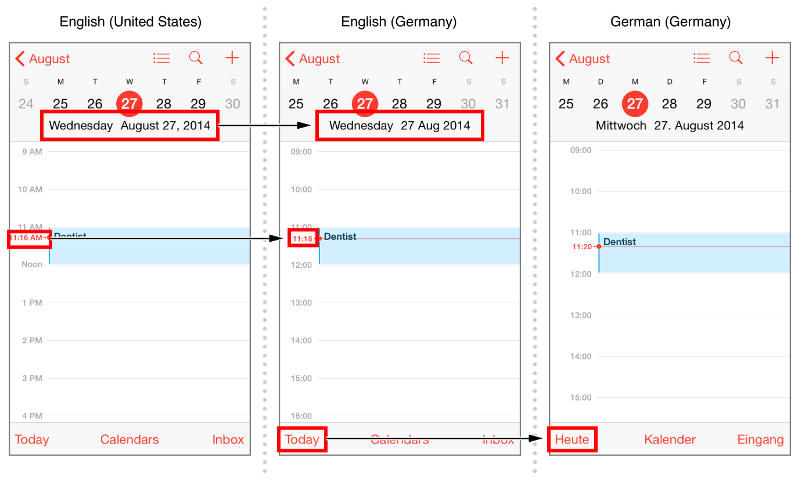

### 1.1.1 Setting the Language on iOS Devices - 在 iOS 设备上设置语言

You select the language independent of the region.

你选择语言并不依赖地区。

#### 1.1.1.1 To change the language on iOS devices - 在 iOS 设备上改变语言

1. Tap Settings > General > Language & Region.
2. Tap iPhone Language, select the language, and tap Done.
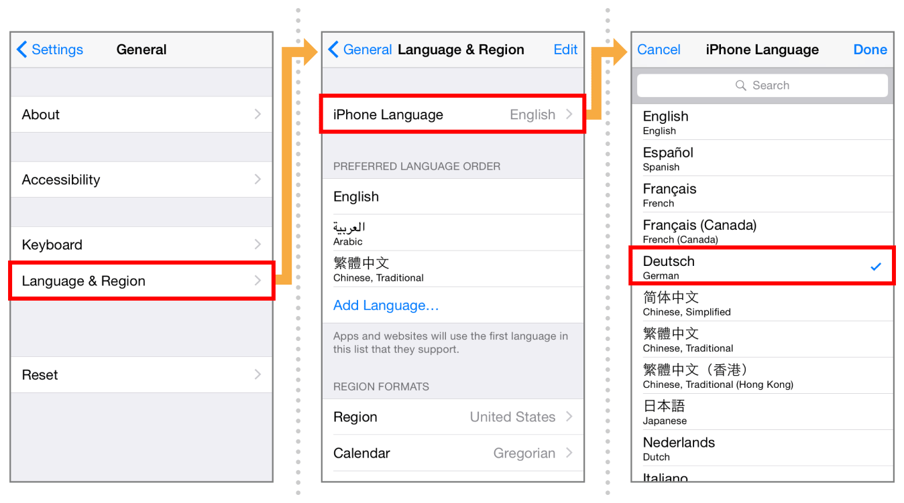
3. Tap “Change to [Language].”  Wait while iOS changes the language.

>

1. 点击 设置 > 通用 > 语言与地区。
2. 点击 iPhone 语言，选择语言，然后点击完成。
3. 点击“更改为[语言]”。
	等待 iOS 变更语言。

For example, see how Calendar localizes its views in Spanish, Chinese, and Arabic below. In Arabic, the title and location text fields are right-aligned because Arabic is a right-to-left language.

例如，看看 Calendar 如何本地化它的视图成西班牙语、汉语和阿拉伯语等。在阿拉伯语中，标题和本地文本字段是右对齐的，因为阿拉伯语是从右向左的语言。

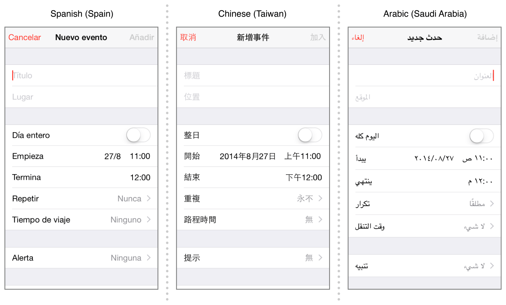

### 1.1.2 Setting the Region on iOS Devices - 在 iOS 设备上设置地区

The region setting is independent of the language setting. The region setting doesn’t automatically change when you set the language. For example, if you change the language from English (United States) to German, the region is still United States, and the month appears before the day in date formats. If you want the date and time formats to conform to the German styles, change the region to Germany. Conversely, you can change only the region to localize date and time formats.

地区设置是不依赖于语言设置的。当你设置语言时地区设置不会自动改变。例如，如果你把语言从英语（美国）改成德语，而地区仍然是美国，在日期格式上月就会在日之前。如果你想要把日期和时间格式改成德国样式，就把地区改成德国。相反的，你也可以只改变地区以本地化日期和时间格式。

#### 1.1.2.1 To set the region on iOS devices - 在 iOS 设备上设置地区

1. Tap Settings > General > Language & Region.
2. Tap Region, and select the region from the list.
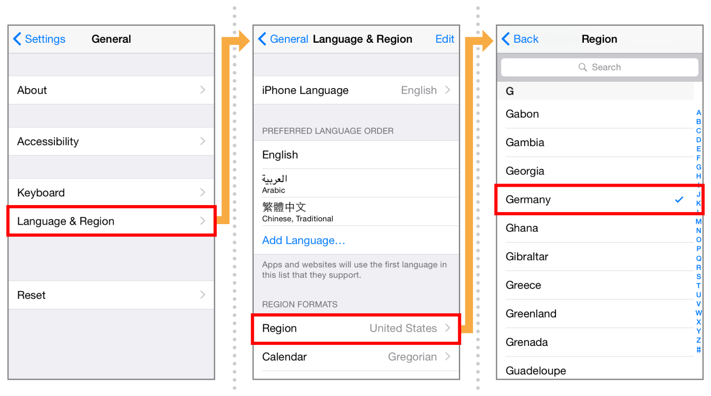
3. To return to the Language & Region settings, tap Back.

>

1. 点击 设置 > 通用 > 时间和地区。
2. 点击 地区，然后从里诶包中选择地区。
3. 要回到 时间和地区 设置，点击 返回。

### 1.1.3 Setting the Calendar on iOS Devices - 在 iOS 设备上设置日历

You can also specify the preferred calendar. For example, the era is different in the Gregorian, Buddhist, and Japanese calendars.

你也可以指定偏好的日历。例如，在公历、佛教和日本历法中都是不同的纪元。

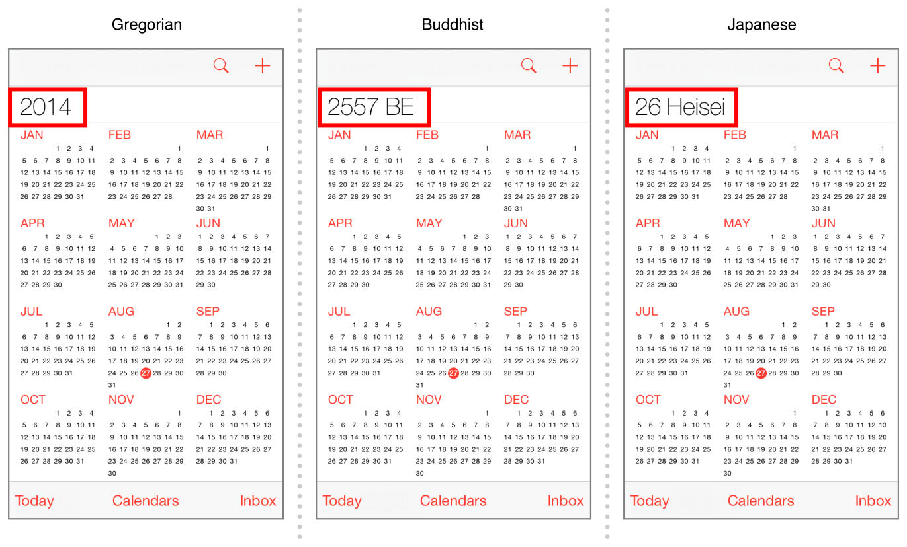

#### 1.1.3.1 To change the calendar on iOS devices - 在 iOS 设备上改变日历

1. Tap Settings > General > Language & Region.
2. Tap Calendar, and select the calendar from the list.
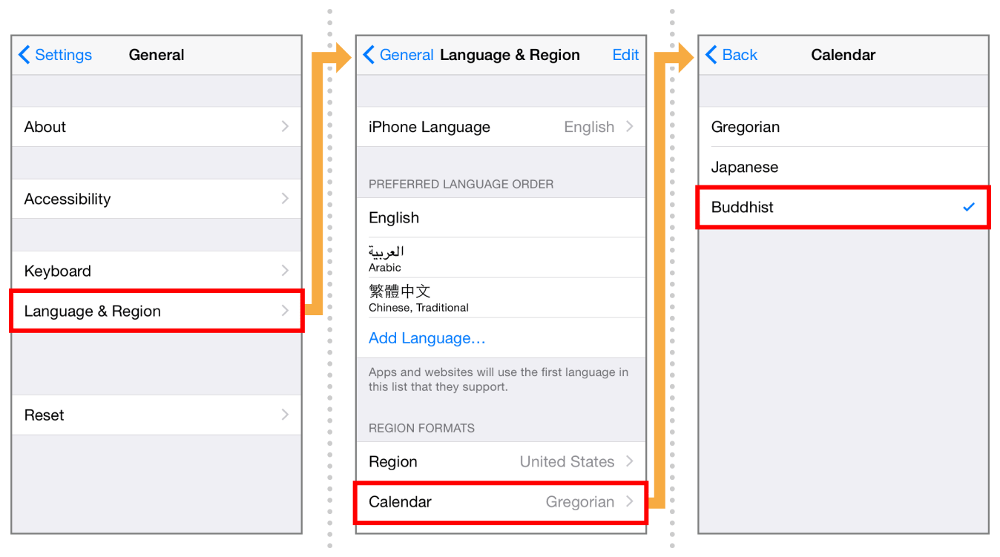
3. To return to the International settings, tap Back.

>

1. 点击 设置 > 通用 > 语言和地区。
2. 点击 日历，然后从列表中选择日历。
3. 要回到 国际化 设置，点击 返回。

## 1.2 Reviewing Language and Region Preferences on Your Mac - 在 Mac 上查看语言和地区偏好

For Mac, you can best observe language and region changes using Calendar. Notice how the date and times reformat when the region changes. Calendar also adjusts for cultural differences. For example, if you change the region from United States to France, the month view shows Monday as the first day of the week. Other text in Calendar doesn’t appear in French unless you change the language to French.

对于 Mac，你可以使用 日历 最好观察语言和地区的变化。注意当地区变化时日期和时间如何重新调整格式。日历 也为文化差异做了调整。例如，如果你把地区从美国改成法国，月视图就会把星期一放到每周的第一天。日历中的其他文本并不会显示成法语，除非你把语言改成法语。

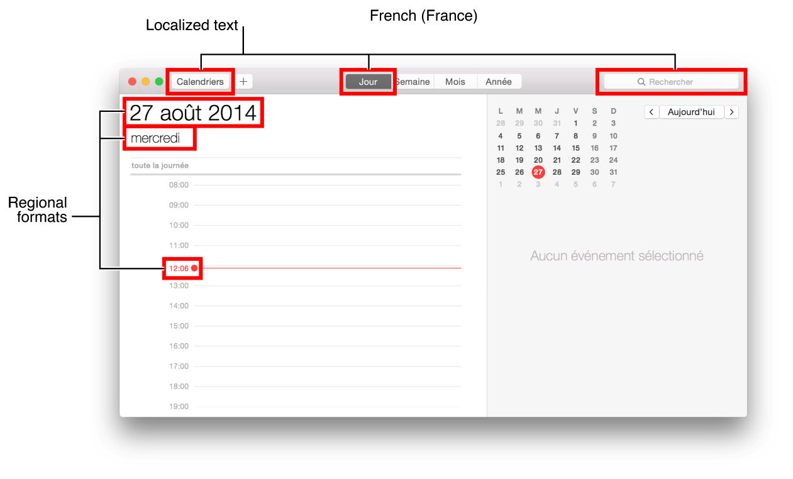

The language, region, and calendar settings are in the Language & Region pane of System Preferences. You can also create custom regional data formats on a Mac.

语言、地区和日历设置都在 系统偏好 的 语言和地区 板块。在 Mac 上你也可以创建自定义的地区数据格式。

### 1.2.1 Setting the Language on Your Mac - 在你的 Mac 上设置语言

You can add and remove languages from a list of preferred languages. The first language in the list is the primary language used for localizations.

你可以从偏好语言列表中添加和删除语言。列表中的第一个语言是用于本地化的主要语言。

#### 1.2.1.1 To change the language your Mac uses - 改变 Mac 使用的语言

1. In System Preferences, click Language & Region.
2. Either click the Add button (+) to add a language, or drag a different language to the top of the “Preferred languages” list.  
If OS X or an app supports the primary language, menus and messages are shown in that language. If it doesn’t, it uses the second language in the list, and so on.
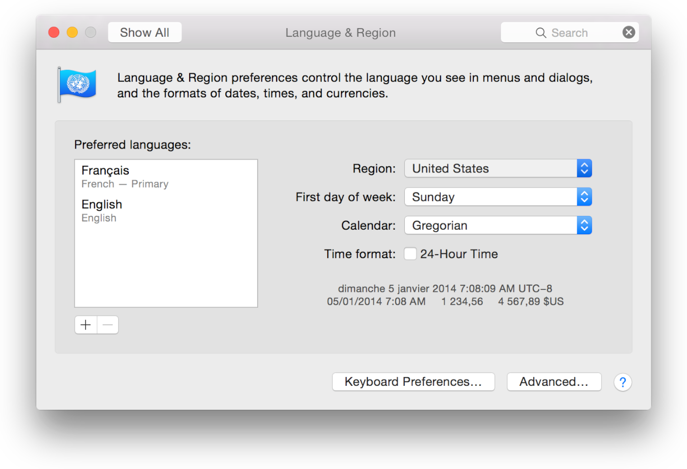
3. If you click the Add button, in the dialog that appears, select a language, and click Add. In the dialog that appears, click Use [Language] to move the language to the top of the “Preferred languages” list.
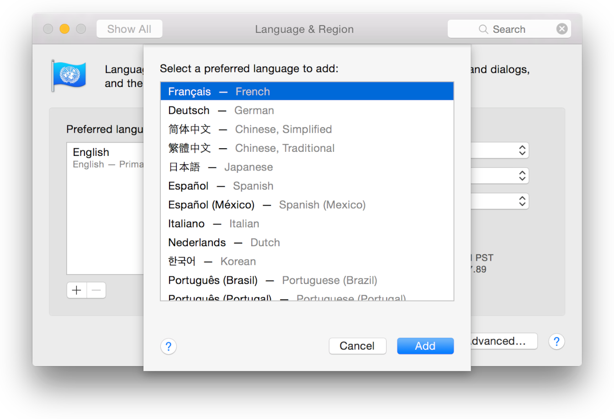

>

1. 在 系统偏好 中，点击 语言和地区。
2. 点击 添加按钮（+） 添加一个语言，或把另一个语言拖到“偏好语言”列表的顶部。  
如果 OS X 或一个 App 支持主要语言，菜单和消息都会以该语言显示。如果不支持，它就会使用列表中的第二个语言，以此类推。
3. 如果你点击 添加按钮，在看到的对话框中，选择一个语言，然后点击 添加。在出现的对话框中，点击“使用[语言]”以把该语言移到“偏好语言”列表的顶部。

### 1.2.2 Setting the Region on Your Mac - 在 Mac 上设置区域

The region you select is independent of the language you select. For example, if you live in Quebec, you can select French as the language and Canada, or United States, as the region.

你选择的区域不依赖于你选择的语言。例如，如果你在魁北克市生活，你可以选择法语作为语言，并选择加拿大或美国作为地区。

#### 1.2.2.1 To choose a region and customize formats - 选择地区和自定义格式

1. In System Preferences, click Language & Region.
2. Choose a geographic region from the Region pop-up menu.
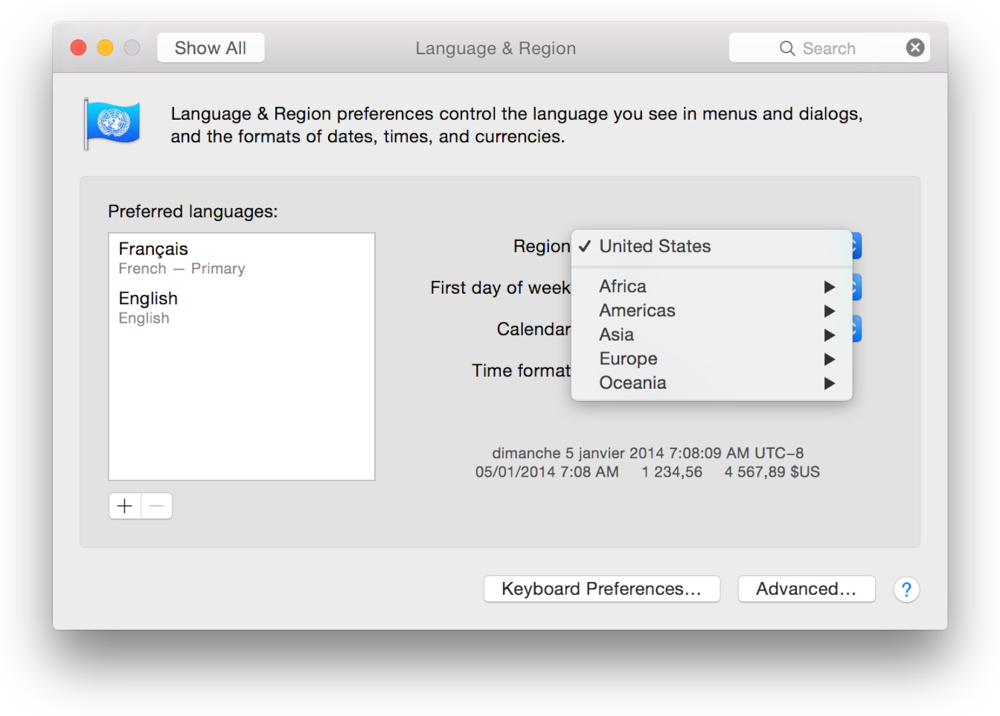
3. To customize formats, click Advanced.
4. In the General pane, choose the language to use for showing dates, times, and numbers, and set formats for numbers, currency, and measurements.
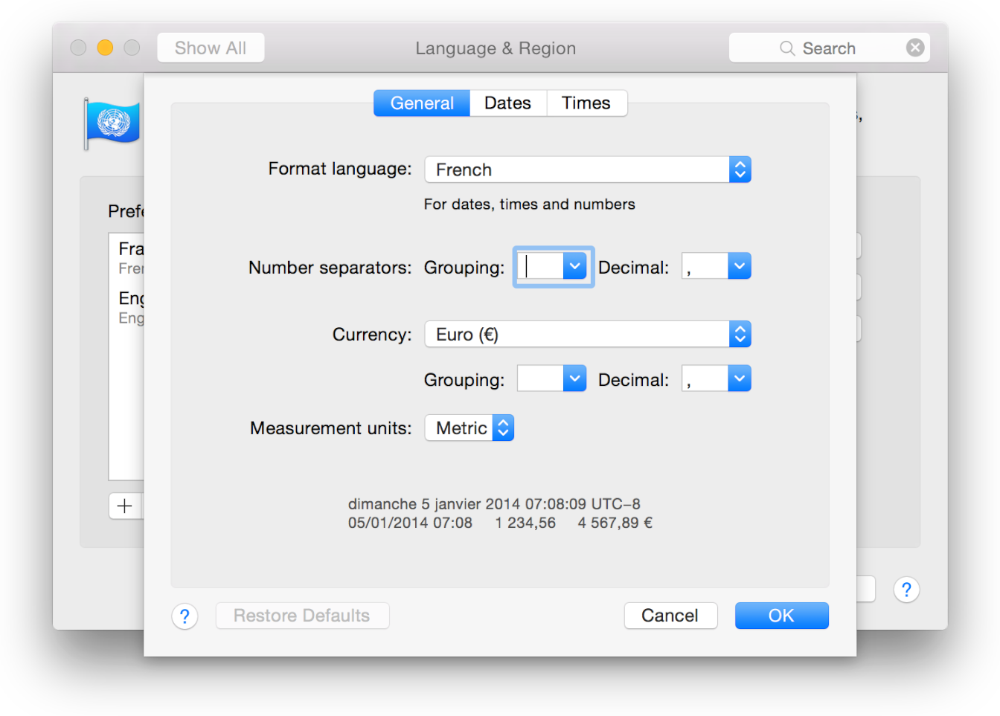
5. In the Dates and Times panes, you can create custom number and date formats by entering text and dragging elements.
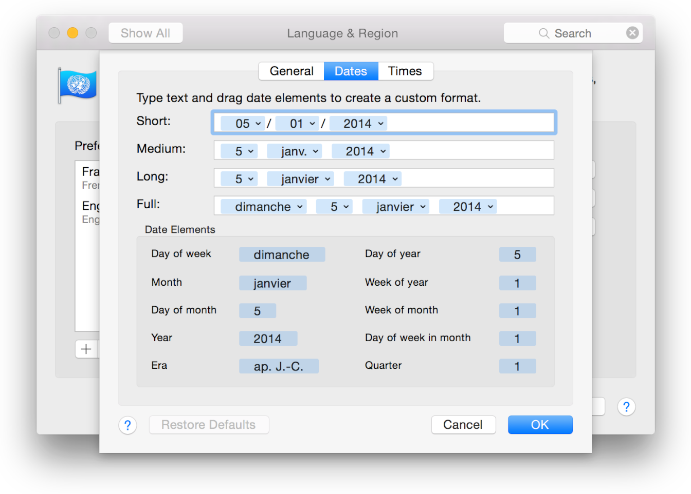
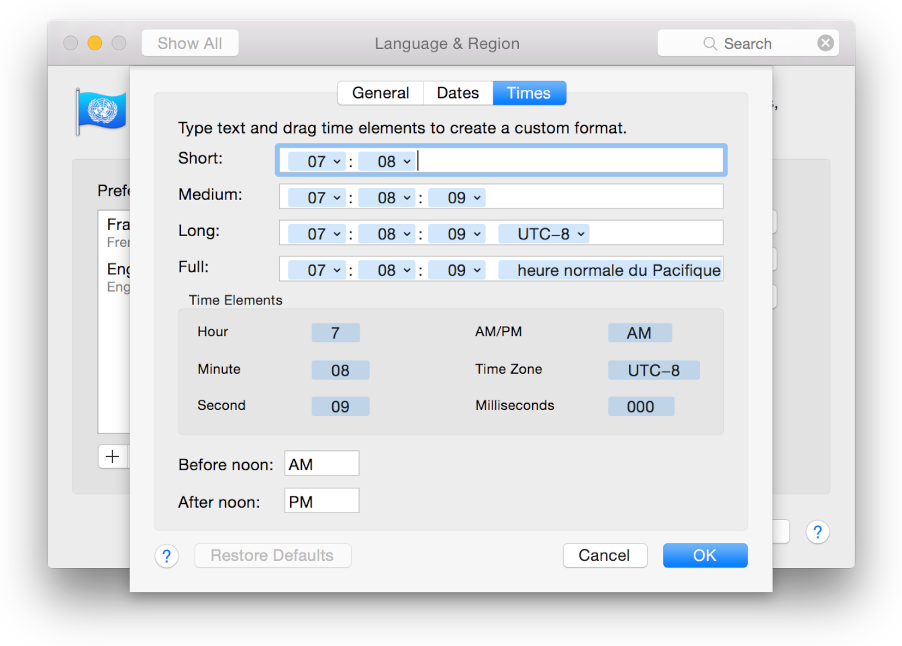

> 

1. 在 系统偏好 中，点击 语言和地区。
2. 从 地区 弹出菜单中选择一个地理区域。
3. 要自定义格式，点击 高级。
4. 在 通用 板块，选择用于展示日期、时间和数字的语言，并为数字、货币和度量设置格式。
5. 在 日期和时间 板块，你可以通过输入文本和拖动元素创建自定义的数字和日期格式。

### 1.2.3 Setting the Calendar on Your Mac - 在你的 Mac 上设置日历

You can also specify the preferred calendar. Calendar adapts to all of these user settings. For example, you can choose Russian as the language, Russia as the region, and Hebrew as the calendar. The 24-hour clock is also optional.

你也可以指定偏好的日历。日历适配了所有这些用户设置。例如，你可以选择俄语作为语言，俄国作为区域，希伯来语作为日历。24小时形式是可选的。

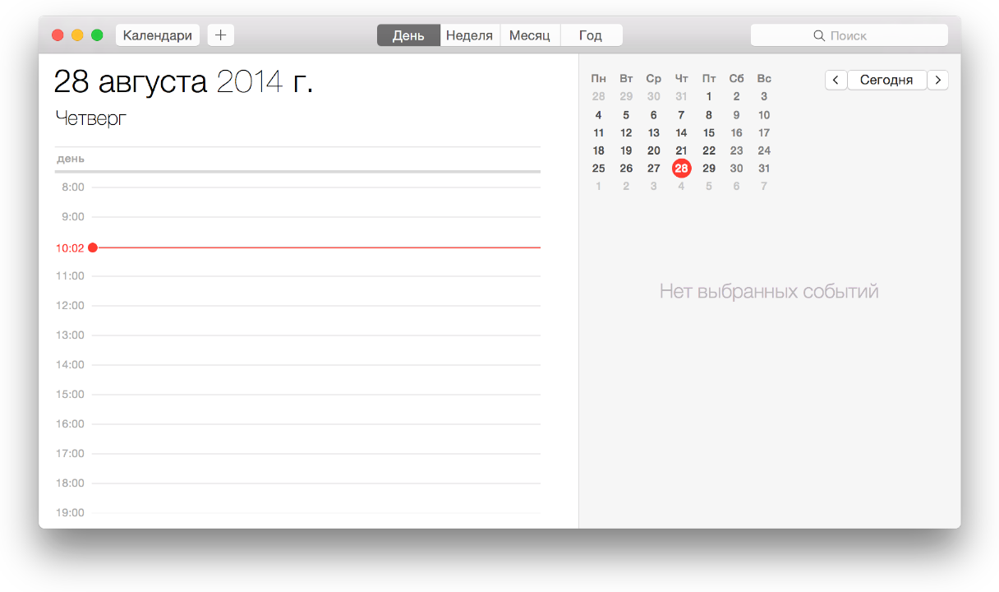

#### 1.2.3.1 To change the calendar on Mac - 在 Mac 上改变日历

1. In System Preferences, click Language & Region.
2. Choose a calendar from the Calendar pop-up menu.

>

1. 在 系统偏好 中，点击 语言和地区。
2. 从 日历 弹出菜单中选择一个日历。