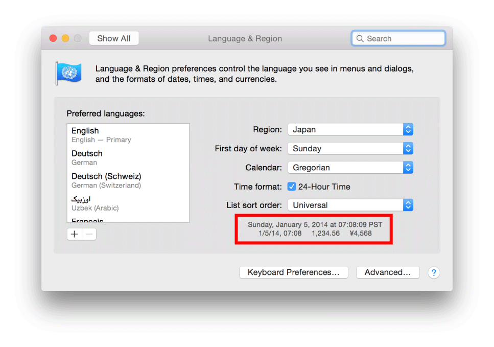

# Internationalization and Localization Guide (4) ---- Formatting Data Using the Locale Settings

原文地址：
[https://developer.apple.com/library/content/documentation/MacOSX/Conceptual/BPInternational/InternationalizingLocaleData/InternationalizingLocaleData.html](https://developer.apple.com/library/content/documentation/MacOSX/Conceptual/BPInternational/InternationalizingLocaleData/InternationalizingLocaleData.html)

# 4 Formatting Data Using the Locale Settings - 使用定位设置格式化数据

Different countries and regions have different conventions for formatting numerical and time-based information. Locale settings provide information about the formats used by the current user and must be considered when writing code that handles user-facing data types. The user sets the locale by choosing a region in Settings on iOS devices and System Preferences on a Mac. The user can also change locale settings while the app is running. Therefore, if you manipulate data objects in your code and then present them to the user, use the locale APIs to format the data correctly.

不同的国家和地区在格式化数字的和基于时间的信息上有不同的习俗。定位设置提供了关于当前用户使用的并且当撰写处理面向用户的数据类型的代码时必须考虑的格式信息。用户通过在 iOS 设备上的 Settings 应用和 Mac 上的 System Preferences 应用中选择地区来设置定位。用户也可以在 APP 运行中修改定位设置。因此，如果你在代码中操作了数据对象，然后再把它们展示给用户，要正确的使用定位 API 来格式化数据。

You do not need to know how to format data in all the different locales. You can use preset styles that automatically generate locale-sensitive formats. You can use custom formats as long as you convert them to locale-sensitive formats before presenting them to users. This chapter explains how to write locale-sensitive code.

你不需要知道在所有不同的定位是如何格式化数据的。你可以预设样式自动生成定位敏感的格式。你可以使用自定义的格式，也可以在把它们展示给用户之前把它们转换成定位敏感的格式。本章解释了如何编写定位敏感的代码。

## 4.1 About Locale Formats - 关于定位格式

Locales represent the formatting choices for a particular user, not the user’s preferred language. These are often the same but can be different. For example, a native English speaker who lives in Germany might select English as the language and Germany as the region. Text appears in English but dates, times, and numbers follow German formatting rules. The day precedes the month and a 24-hour clock represents times, as shown in Table 4-1.

定位代表了一个特定用户的格式选择，而不是用户偏好的语言。它们通常是一样的，但也可能不同。例如，一个本地的说英语的人生活在德国，他就可能选择英语作为语言而选择德国作为地区。文本就会以英语出现，但日期、时间和数字都会遵从德语格式规则。日期在月份之前，并且以24小时展示时间，如表 4-1 所示。

Table 4-1  Data formats in United States and Germany  - 美国和德国的数据格式

>|Language (Region)|Dates|Times|Numbers|
|:-:|:-:|:-:|:-:|
|English (United States)|Sunday, January 5, 2014 </br> 1/5/14|7:08:09 AM PST</br>7:08 AM|1,234.56 </br> $4,567.89|
|English (Germany)|Sunday 5 January 2014</br>05/01/14|07:08:09 PST</br>07:08|1.234,56</br>€4.567,89|

On a Mac, you can preview modified locale preferences in System Preferences. When you choose a geographic region from the Region pop-up menu, samples of the date, time, and number formats appear. This screenshot shows sample data formats when English is the language and Japan is the region:

在 Mac 上，你可以在 System Preferences 中预览修改后的定位偏好。当你从 Region 弹出菜单中选择一个地理区域，日期、时间和数字的格式示例就会出现。这个截图展示了选择语言为英语且地区为日本的示例数据格式：



Mac users can also customize the formats of dates, times, and numbers by clicking the Advanced button, as described in [Reviewing Language and Region Preferences on Your Mac](https://developer.apple.com/library/content/documentation/MacOSX/Conceptual/BPInternational/SpecifyingPreferences/SpecifyingPreferences.html#//apple_ref/doc/uid/10000171i-CH12-SW3).

Mac 用户可以自定义日期、时间和数字的格式，只要点击 Advanced 按钮，如《[Reviewing Language and Region Preferences on Your Mac](https://developer.apple.com/library/content/documentation/MacOSX/Conceptual/BPInternational/SpecifyingPreferences/SpecifyingPreferences.html#//apple_ref/doc/uid/10000171i-CH12-SW3)》中所述。

## 4.2 Using the Locale Object - 使用定位对象

An [NSLocale](https://developer.apple.com/documentation/foundation/nslocale) object encapsulates information about the formatting standards of a particular region. When you format user-facing text, you pass an [NSLocale](https://developer.apple.com/documentation/foundation/nslocale) object representing the user’s selected region. The [NSLocale](https://developer.apple.com/documentation/foundation/nslocale) class provides class methods for obtaining the user’s locale object and other information about supported locales.

[NSLocale](https://developer.apple.com/documentation/foundation/nslocale) 对象概括了关于特定地区的格式标准的信息。当你格式化面向用户的文本时，你传入一个 [NSLocale](https://developer.apple.com/documentation/foundation/nslocale) 对象表示用户选择的地区。[NSLocale](https://developer.apple.com/documentation/foundation/nslocale) 类提供了一些类方法获取用户的定位对象和关于支持的定位的其他信息。

### 4.2.1 Getting the User’s Locale - 获取用户的定位

You can obtain the user’s locale using either the [currentLocale](https://developer.apple.com/documentation/foundation/nslocale/1409990-currentlocale) or [autoupdatingCurrentLocale](https://developer.apple.com/documentation/foundation/nslocale/1414388-autoupdatingcurrentlocale) class methods in the [NSLocale](https://developer.apple.com/documentation/foundation/nslocale) class.

你可以使用 [NSLocale](https://developer.apple.com/documentation/foundation/nslocale) 类的 [currentLocale](https://developer.apple.com/documentation/foundation/nslocale/1409990-currentlocale) 或 [autoupdatingCurrentLocale](https://developer.apple.com/documentation/foundation/nslocale/1414388-autoupdatingcurrentlocale) 类方法获取用户的定位。

If you use the [currentLocale](https://developer.apple.com/documentation/foundation/nslocale/1409990-currentlocale) method, the property values of the returned object are guaranteed not to change. Therefore, use the [currentLocale](https://developer.apple.com/documentation/foundation/nslocale/1409990-currentlocale) method if you want to perform operations that need to be consistent.

如果你使用 [currentLocale](https://developer.apple.com/documentation/foundation/nslocale/1409990-currentlocale) 方法，返回的对象的属性值被生成后不能再改变。因此如果你想要执行始终如一的操作时才使用 [currentLocale](https://developer.apple.com/documentation/foundation/nslocale/1409990-currentlocale) 方法。

If you use the [autoupdatingCurrentLocale](https://developer.apple.com/documentation/foundation/nslocale/1414388-autoupdatingcurrentlocale) method, the property values can change when the user changes the region settings. However, you are not notified if the returned object changes.

如果你使用 [autoupdatingCurrentLocale](https://developer.apple.com/documentation/foundation/nslocale/1414388-autoupdatingcurrentlocale) 方法，当用户改变地区设置时属性值可以改变。但是，不会通知你返回的对象是否改变了。

To observe locale preference changes, read [Registering for Locale and Time Zone Changes](https://developer.apple.com/library/content/documentation/MacOSX/Conceptual/BPInternational/InternationalizingLocaleData/InternationalizingLocaleData.html#//apple_ref/doc/uid/10000171i-CH13-SW13).

要观察定位属性的改变，阅读《[Registering for Locale and Time Zone Changes](https://developer.apple.com/library/content/documentation/MacOSX/Conceptual/BPInternational/InternationalizingLocaleData/InternationalizingLocaleData.html#//apple_ref/doc/uid/10000171i-CH13-SW13)》。

> **Tip:** The system settings are not the same as the user’s settings. Don’t use the [systemLocale](https://developer.apple.com/documentation/foundation/nslocale/1407691-system) class method to get the user’s locale.
> 
> **提示：**系统设置与用户的设置并不相同。不要使用 [systemLocale](https://developer.apple.com/documentation/foundation/nslocale/1407691-system) 类方法获取用户的定位。

### 4.2.2 Getting Information About a Locale - 获取关于定位的信息

Use the [objectForKey:](https://developer.apple.com/documentation/foundation/nslocale/1418430-object) instance method in the [NSLocale](https://developer.apple.com/documentation/foundation/nslocale) class to access information about a locale. For example, pass the [NSLocaleUsesMetricSystem](https://developer.apple.com/documentation/foundation/nslocale.key/1410780-usesmetricsystem) key to this method to get a Boolean number that determines whether the locale uses the metric system:

使用 [NSLocale](https://developer.apple.com/documentation/foundation/nslocale) 类的 [objectForKey:](https://developer.apple.com/documentation/foundation/nslocale/1418430-object) 实例方法访问关于定位的信息。例如，把 [NSLocaleUsesMetricSystem](https://developer.apple.com/documentation/foundation/nslocale.key/1410780-usesmetricsystem) key 传到这个方法，可得到一个布尔数值，确定定位是否使用了公制系统：

```
NSNumber *metricSystem = [[NSLocale currentLocale] objectForKey:NSLocaleUsesMetricSystem];
```

Pass the [NSLocaleCurrencySymbol](https://developer.apple.com/documentation/foundation/nslocalecurrencysymbol) key to get a string representation of the locale’s currency symbol:

传入 [NSLocaleCurrencySymbol](https://developer.apple.com/documentation/foundation/nslocalecurrencysymbol) key 可以获得定位的通用符号的字符串表示：

```
NSString *currencySymbol = [[NSLocale currentLocale] objectForKey:NSLocaleCurrencySymbol];
```

For a complete list of locale property keys, see `NSLocale Component Keys`.

对于定位属性 key 的完整列表，参见 `NSLocale Component Keys`。

### 4.2.3 Getting Localized Language and Dialect Names - 获取本地化的语言和方言名称

The identifiers that specify languages and dialects in APIs and folder names—for example, `de-CH`, `en-AU`, and `pt-PT`—shouldn’t be displayed to users. To get a human-readable, localized language or dialect name, use the [displayNameForKey:value:](https://developer.apple.com/documentation/foundation/nslocale/1415931-displayname) method in the [NSLocale](https://developer.apple.com/documentation/foundation/nslocale) class, passing [NSLocaleIdentifier](https://developer.apple.com/documentation/foundation/nslocale.key/1411489-identifier) as the key parameter.

在 API 和文件夹名称中指定语言和方言的标识符 —— 例如，`de-CH`，`en-AU`，`pt-PT` —— 不应该显示给用户。要获得一个人类可阅读的，本地化的语言或方言名称，使用 [NSLocale](https://developer.apple.com/documentation/foundation/nslocale) 类的 [displayNameForKey:value:](https://developer.apple.com/documentation/foundation/nslocale/1415931-displayname) 方法，传入 [NSLocaleIdentifier](https://developer.apple.com/documentation/foundation/nslocale.key/1411489-identifier) 作为 key 参数。

#### To get the localized name for languages and dialects - 获取语言和方言的本地化名称

1. Get the language that the app is using.

	获取 APP 正使用的语言。
	
	```
	NSString *languageID = [[NSBundle mainBundle] preferredLocalizations].firstObject;
	```

	The returned string is a language ID that identifies a written language or dialect, as described in [Language and Locale IDs](https://developer.apple.com/library/content/documentation/MacOSX/Conceptual/BPInternational/LanguageandLocaleIDs/LanguageandLocaleIDs.html#//apple_ref/doc/uid/10000171i-CH15-SW1).
	
	返回的字符串是一个语言 ID，标识了书写的语言或方言，如 [Language and Locale IDs](https://developer.apple.com/library/content/documentation/MacOSX/Conceptual/BPInternational/LanguageandLocaleIDs/LanguageandLocaleIDs.html#//apple_ref/doc/uid/10000171i-CH15-SW1) 所述。
	
2. Get the associated locale object.

	获取相关联的定位对象。
	
	```
	NSLocale *locale = [NSLocale localeWithLocaleIdentifier:languageID];
	```
	
	If you pass the language ID as the locale ID parameter, a locale for the language is returned. For example, if you pass `de-CH` as the language, the Switzerland locale is returned.
	
	如果你传入语言 ID 作为 locale ID 参数，就会返回相应语言的定位。例如，如果你传入 `de-CH` 作为语言，就会返回 Switzerland 定位。
	
3. Get the localized language name.

	获取本地化的语言名称。
	
	```
	NSString *localizedString = [locale displayNameForKey:NSLocaleIdentifier value:languageID];
	```
	
The format of the string is `[Language]` (`[Dialect]`). For example, if the language ID is `de-CH`, the localized language string is “Deutsch (Schweiz).” If the language ID is `de`, the localized language string is “Deutsch.”
	
字符串的格式是 `[Language]` (`[Dialect]`)。例如，如果语言 ID 是 `de-CH`，本地化的语言字符串就是“德语（瑞士）”。如果语言 ID 是 `de`，本地化的语言字符串就是“德语”。

### 4.2.4 Getting Language-Specific Quotes - 获取特定语言的引号

Beginning and ending quotes, which vary in different languages, can be obtained from the locale object. Use the same technique, described in [Getting Localized Language and Dialect Names](https://developer.apple.com/library/content/documentation/MacOSX/Conceptual/BPInternational/InternationalizingLocaleData/InternationalizingLocaleData.html#//apple_ref/doc/uid/10000171i-CH13-SW20), to obtain the default locale for the language, and then use the locale component keys to obtain the language-specific quotes.

开始和结束引号可以从定位对象获取，虽然在不同的语言中是变化的。使用与《[Getting Localized Language and Dialect Names](https://developer.apple.com/library/content/documentation/MacOSX/Conceptual/BPInternational/InternationalizingLocaleData/InternationalizingLocaleData.html#//apple_ref/doc/uid/10000171i-CH13-SW20)》中所述相同的技术可以获取语言的默认定位，然后使用定位组件 key 获取特定语言的引号。

#### To create a string that uses locale-sensitive quotes - 创建使用定位敏感的引号的的字符串

1. Get the language that the app is using.
	
	获取 APP 正在使用的语言。

	```
	NSString *languageID = [[NSBundle mainBundle] preferredLocalizations].firstObject;
	```
	
2. Get the associated locale object.

	获取相关联的定位对象。

	```
	NSLocale *locale = [NSLocale localeWithLocaleIdentifier:languageID];
	```
	
3. Get the beginning and ending symbols for quotes from the locale object.

	从定位对象获取引号的开始和结束符号。
	
	```
	bQuote = [locale objectForKey:NSLocaleQuotationBeginDelimiterKey];
	eQuote = [locale objectForKey:NSLocaleQuotationEndDelimiterKey];
	```
	
4. Format a string using the locale-sensitive quotes.

	使用定位敏感的引号格式化字符串。

	```
	quotedString = [NSString stringWithFormat:@"%@%@%@", bQuote, myText, eQuote];
	```
	
Table 4-2 shows the results when `myText` is `“@iPhone”` for different regions.

表 4-2 展示了在不同的区域 `myText` 是 `“@iPhone”` 时的结果。

Table 4-2  Quotes in China, France, and Japan - 在中国、法国和日本的引号

|Region|quotedString = @"%@iPhone%@"|
|:-:|:-:|
|China|“iPhone”|
|France||
|Japan||

## 4.3 Formatting Strings - 格式化字符串

If available, use the alternative, locale-sensitive [NSString](https://developer.apple.com/documentation/foundation/nsstring) method for user-facing text. There are locale-sensitive methods for creating strings with formats, changing the case, obtaining ranges within a string, and comparing strings.

如果可以，使用可替代的、定位敏感的 [NSString](https://developer.apple.com/documentation/foundation/nsstring) 方法作为面向用户的文本。对于带格式创建字符串、改变大小写、获取字符串的范围、以及比较字符串，都有定位敏感的方法。

### 4.3.1 Creating Formatted Strings - 创建格式化的字符串

At a minimum, use the [localizedStringWithFormat:](https://developer.apple.com/documentation/foundation/nsstring/1497301-localizedstringwithformat) method in the [NSString](https://developer.apple.com/documentation/foundation/nsstring) class, not the [stringWithFormat:](https://developer.apple.com/documentation/foundation/nsstring/1497275-stringwithformat) method to format user-facing text. A simple fix to existing code is to replace occurrences of the [stringWithFormat:](https://developer.apple.com/documentation/foundation/nsstring/1497275-stringwithformat) method with the alternate [localizedStringWithFormat:](https://developer.apple.com/documentation/foundation/nsstring/1497301-localizedstringwithformat) method throughout your code, as in:

至少，使用 [NSString](https://developer.apple.com/documentation/foundation/nsstring) 类的 [localizedStringWithFormat:](https://developer.apple.com/documentation/foundation/nsstring/1497301-localizedstringwithformat) 方法，而不是 [stringWithFormat:](https://developer.apple.com/documentation/foundation/nsstring/1497275-stringwithformat) 方法格式化面向用户的文本。对于已存在的代码做一个简单的修改，把整个代码中所有发现 [stringWithFormat:](https://developer.apple.com/documentation/foundation/nsstring/1497275-stringwithformat) 方法的地方都替换成 [localizedStringWithFormat:](https://developer.apple.com/documentation/foundation/nsstring/1497301-localizedstringwithformat) 方法，如下：

```
NSString *localizedString = [NSString localizedStringWithFormat:@"%3.2f", myNumber];
```

This method uses the system locale. To specify the user’s locale preference, pass `[NSLocale currentLocale]` as the locale parameter to either the [initWithFormat:locale:](https://developer.apple.com/documentation/foundation/nsstring/1497317-initwithformat) or [initWithFormat:locale:arguments:](https://developer.apple.com/documentation/foundation/nsstring/1408503-init) method. For best results, use data-specific formatter objects and preset styles, described in [Formatting Dates and Times](https://developer.apple.com/library/content/documentation/MacOSX/Conceptual/BPInternational/InternationalizingLocaleData/InternationalizingLocaleData.html#//apple_ref/doc/uid/10000171i-CH13-SW5) and [Formatting Numbers](https://developer.apple.com/library/content/documentation/MacOSX/Conceptual/BPInternational/InternationalizingLocaleData/InternationalizingLocaleData.html#//apple_ref/doc/uid/10000171i-CH13-SW8).

这个方法使用系统定位。要指定用户的定位偏好，传入 `[NSLocale currentLocale]` 作为 [initWithFormat:locale:](https://developer.apple.com/documentation/foundation/nsstring/1497317-initwithformat) 或 [initWithFormat:locale:arguments:](https://developer.apple.com/documentation/foundation/nsstring/1408503-init) 方法的 locale 参数。想要最好的结果，使用特定数据的格式化对象和预设的样式，描述见《[Formatting Dates and Times](https://developer.apple.com/library/content/documentation/MacOSX/Conceptual/BPInternational/InternationalizingLocaleData/InternationalizingLocaleData.html#//apple_ref/doc/uid/10000171i-CH13-SW5)》和《[Formatting Numbers](https://developer.apple.com/library/content/documentation/MacOSX/Conceptual/BPInternational/InternationalizingLocaleData/InternationalizingLocaleData.html#//apple_ref/doc/uid/10000171i-CH13-SW8)》。

### 4.3.2 Changing the Case of Strings - 改变字符串的大小写

The process of changing the case in strings is not the same for all languages. Use these locale-sensitive [NSString](https://developer.apple.com/documentation/foundation/nsstring) methods to change the case:

改变字符串里的大小写的过程在所有的语言中并不是一样的。使用定位敏感的 [NSString](https://developer.apple.com/documentation/foundation/nsstring) 方法改变大小写：

- [uppercaseStringWithLocale:](https://developer.apple.com/documentation/foundation/nsstring/1413316-uppercasestringwithlocale)
- [lowercaseStringWithLocale:](https://developer.apple.com/documentation/foundation/nsstring/1417298-lowercasestringwithlocale)
- [capitalizedStringWithLocale:](https://developer.apple.com/documentation/foundation/nsstring/1414023-capitalized)

If you pass `nil` as the locale parameter, the system locale is used, which is incorrect. To specify the user’s locale preference, pass `[NSLocale currentLocale]` as the locale parameter.

如果你传入 `nil` 作为 locale 参数，就会使用系统定位，儿这并不正确。要指定用户的定位偏好，传入 `[NSLocale currentLocale]` 作为 locale 参数。

## 4.4 Formatting Dates and Times - 格式化日期和时间

You use the [NSDateFormatter](https://developer.apple.com/documentation/foundation/nsdateformatter) class to create localized string representations of [NSDate](https://developer.apple.com/documentation/foundation/nsdate) objects that are also locale-sensitive. [NSDateFormatter](https://developer.apple.com/documentation/foundation/nsdateformatter) objects are often attached directly to text fields in an Interface Builder file, but if you create [NSDateFormatter](https://developer.apple.com/documentation/foundation/nsdateformatter) objects programmatically, be sure to use methods that return localized string representations.

你使用 [NSDateFormatter](https://developer.apple.com/documentation/foundation/nsdateformatter) 类创建定位敏感的 [NSDate](https://developer.apple.com/documentation/foundation/nsdate) 对象的本地化字符串表示。[NSDateFormatter](https://developer.apple.com/documentation/foundation/nsdateformatter) 对象通常直接与 Interface Builder 文件中的文本字段相关联，但是如果你编程创建 [NSDateFormatter](https://developer.apple.com/documentation/foundation/nsdateformatter) 对象，必须确保使用返回本地化字符串表示的方法。

> **Note:** The [NSDateFormatter](https://developer.apple.com/documentation/foundation/nsdateformatter) class is not thread-safe. See [Threading Programming Guide](https://developer.apple.com/library/content/documentation/Cocoa/Conceptual/Multithreading/Introduction/Introduction.html#//apple_ref/doc/uid/10000057i) for details.
> 
> **注意：**[NSDateFormatter](https://developer.apple.com/documentation/foundation/nsdateformatter) 类不是线程安全的。详情参见《[Threading Programming Guide](https://developer.apple.com/library/content/documentation/Cocoa/Conceptual/Multithreading/Introduction/Introduction.html#//apple_ref/doc/uid/10000057i)》。

### 4.4.1 Using Preset Date and Time Styles - 使用预设的日期和时间样式

To obtain a localized string representation of a date and time using a preset style, use the [localizedStringFromDate:dateStyle:timeStyle:](https://developer.apple.com/documentation/foundation/dateformatter/1415241-localizedstring) class method in the [NSDateFormatter](https://developer.apple.com/documentation/foundation/nsdateformatter) class:

要获取使用预设样式的日期和时间的本地化字符串表示，使用 [NSDateFormatter](https://developer.apple.com/documentation/foundation/nsdateformatter) 类的 [localizedStringFromDate:dateStyle:timeStyle:](https://developer.apple.com/documentation/foundation/dateformatter/1415241-localizedstring) 方法：

```
NSString *localizedDateTime = [NSDateFormatter localizedStringFromDate:[NSDate date] dateStyle:NSDateFormatterMediumStyle timeStyle:NSDateFormatterShortStyle];
```

For example, specify a medium style to abbreviate text—such as “Jun 10, 2013”—by passing [NSDateFormatterMediumStyle](https://developer.apple.com/documentation/foundation/nsdateformatterstyle/nsdateformattermediumstyle) as the style parameter. Specify a short style for numerical only representations—such as “6/10/13” or “11:03 AM”—by passing [NSDateFormatterShortStyle](https://developer.apple.com/documentation/foundation/nsdateformatterstyle/nsdateformattershortstyle) as the style parameter. Table 4-3 shows the results of using preset formats when English is the language and United States is the region.

例如，指定中等样式到缩写文本 —— 如“Jun 10, 2013” —— 要传入 [NSDateFormatterMediumStyle](https://developer.apple.com/documentation/foundation/nsdateformatterstyle/nsdateformattermediumstyle) 作为 style 参数。 指定短样式到只有数字的表示 —— 如“6/10/13”或“11:03 AM” —— 要传入 [NSDateFormatterShortStyle](https://developer.apple.com/documentation/foundation/nsdateformatterstyle/nsdateformattershortstyle) 作为 style 参数。表 4-3 展示了当语言是英语且地区是美国时使用预设格式的结果。

Table 4-3  Preset date and time styles in English for the United States - 为美国用英语预设日期和时间样式

|Style|Date|Time|Description|
|:-:|:-:|:-:|:-:|
|Short|6/10/13|11:03 AM|Numeric only|
|Medium|Jun 10, 2013|11:03:15 AM|Abbreviated text|
|Long|June 10, 2013|11:03:15 AM PDT|Full text|
|Full|Friday, June 10, 2013|11:03:15 AM Pacific Daylight Time|Complete details|
|No Style|  |  |Output suppressed

Table 4-4 shows the results of passing [NSDateFormatterMediumStyle](https://developer.apple.com/documentation/foundation/nsdateformatterstyle/nsdateformattermediumstyle) for the date style and [NSDateFormatterShortStyle](https://developer.apple.com/documentation/foundation/nsdateformatterstyle/nsdateformattershortstyle) for the time style for different languages and regions.

表 4-4 展示了在不同的语言和地区，传入 [NSDateFormatterMediumStyle](https://developer.apple.com/documentation/foundation/nsdateformatterstyle/nsdateformattermediumstyle) 作为日期样式，传入 [NSDateFormatterShortStyle](https://developer.apple.com/documentation/foundation/nsdateformatterstyle/nsdateformattershortstyle)  作为时间样式的结果。

Table 4-4  Preset date and time styles in different languages and regions - 在不同的语言和地区预设日期和时间样式。

|Language (Region)|Medium style|Short style|
|:-:|:-:|:-:|:-:|
|English (United States)|Jun 6, 2013|10:14 AM|
|French (France)|6 Jun 2013|10:14|
|Chinese (China)|2013年6月6日|上午10点14.

> Video: [WWDC 2013 Making Your App World-Ready: Data Formatting > Preset Date Styles](http://devstreaming.apple.com/videos/wwdc/2013/219xax4xjor8i6b9h77lafay32/219/ref.mov#t=29:17,30:55)
> 
> **视频：**[WWDC 2013 Making Your App World-Ready: Data Formatting > Preset Date Styles](http://devstreaming.apple.com/videos/wwdc/2013/219xax4xjor8i6b9h77lafay32/219/ref.mov#t=29:17,30:55)

### 4.4.2 Using Custom Date and Time Styles - 只用自定义的日期和时间样式。

Use custom date and time styles only when the preset styles don’t meet your needs. However, convert your custom format to a locale-sensitive format before getting string representations of the date and time. The [dateFormatFromTemplate:options:locale:](https://developer.apple.com/documentation/foundation/nsdateformatter/1408112-dateformatfromtemplate) class method in the [NSDateFormatter](https://developer.apple.com/documentation/foundation/nsdateformatter) class rearranges the given template to adhere to the specified locale.

只有当预设样式无法满足你的需求时才使用自定义日期和时间样式。但是，在获得日期和时间的字符串表示之前要把你的自定义格式转换成定位敏感的格式。[NSDateFormatter](https://developer.apple.com/documentation/foundation/nsdateformatter) 类的 [dateFormatFromTemplate:options:locale:](https://developer.apple.com/documentation/foundation/nsdateformatter/1408112-dateformatfromtemplate) 类方法重新排布了给定的模板粘附到特定的定位。

#### To get a localized string representation of a date and time using a custom style - 使用自定义样式获取日期和时间的本地化字符串表示

1. Create an [NSDateFormatter](https://developer.apple.com/documentation/foundation/nsdateformatter) object.

	创建一个 [NSDateFormatter](https://developer.apple.com/documentation/foundation/nsdateformatter) 对象。

	```
	NSDateFormatter *dateFormatter = [NSDateFormatter new];
	```
2. Use the [dateFormatFromTemplate:options:locale:](https://developer.apple.com/documentation/foundation/nsdateformatter/1408112-dateformatfromtemplate) class method to get a localized format string from a template that you provide.

	使用 [dateFormatFromTemplate:options:locale:](https://developer.apple.com/documentation/foundation/nsdateformatter/1408112-dateformatfromtemplate) 类方法从你提供的模板获取本地化的格式字符串。
	
	```
	NSString *localeFormatString = [NSDateFormatter dateFormatFromTemplate:@"dMMM" options:0 locale:dateFormatter.locale];
	```
	
	The template parameter of the [dateFormatFromTemplate:options:locale:](https://developer.apple.com/documentation/foundation/nsdateformatter/1408112-dateformatfromtemplate) method should adhere to Unicode Technical Standard #35, described in [Use Format Strings to Specify Custom Formats](https://developer.apple.com/library/content/documentation/Cocoa/Conceptual/DataFormatting/Articles/dfNumberFormatting10_4.html#//apple_ref/doc/uid/TP40002368-SW5). For example, the template `@”dMMM”` specifies that the day of the month and abbreviation for the month should be in the format string. The order of the symbols and any non-symbol characters in the template are ignored.
	
	[dateFormatFromTemplate:options:locale:](https://developer.apple.com/documentation/foundation/nsdateformatter/1408112-dateformatfromtemplate) 方法的 template 参数应该遵守 Unicode Technical Standard #35，描述见《[Use Format Strings to Specify Custom Formats](https://developer.apple.com/library/content/documentation/Cocoa/Conceptual/DataFormatting/Articles/dfNumberFormatting10_4.html#//apple_ref/doc/uid/TP40002368-SW5)》。例如，模板 `@"dMMM"` 指定了月中的日期和月的缩写应该遵照的格式字符串。符号的顺序和模板中的任何无符号字符都会被忽略。

3. Set the format of the [NSDateFormatter](https://developer.apple.com/documentation/foundation/nsdateformatter) instance to the locale-sensitive format string.

	把 [NSDateFormatter](https://developer.apple.com/documentation/foundation/nsdateformatter) 实例的格式设置成定位敏感的格式字符串。
	
	```
	dateFormatter.dateFormat = localeFormatString;
	```
	
4. Use the [stringFromDate:](https://developer.apple.com/documentation/foundation/dateformatter/1415810-string) method to get a localized string representation of the date.

	使用 [stringFromDate:](https://developer.apple.com/documentation/foundation/dateformatter/1415810-string) 方法获取日期的本地化的字符串表示。
	
	```
	NSString *localizedString = [dateFormatter stringFromDate:[NSDate date]];
	```
	
For example, if you don’t convert the `@“MMM d”` string to a locale-sensitive format, the results are not localized, as shown in the second column in Table 4-5.

例如，如果你没有把 `@"MMM d"` 字符串转换成定位敏感的格式，那么结果也不是本地化的，如表 4-5 的第二列所示。

Table 4-5  Non-localized and localized date formats in different regions - 在不同地区本地化的和未本地化的日期格式

|Language (Region)|Date using format string</br>“MMM d”|Date using template</br>“dMMM”|
|:-:|:-:|:-:|
|English (United States)|Nov 13|Nov 13|
|French (France)|nov. 13|13 nov.|
|Chinese (China)|||

> **Video:** [WWDC 2013 Making Your App World-Ready: Date Formatting > Custom Date and Time Styles](http://devstreaming.apple.com/videos/wwdc/2013/219xax4xjor8i6b9h77lafay32/219/ref.mov#t=30:56,33:09)
> 
> **视屏：**[WWDC 2013 让你的 APP 准备好面向世界：日期格式 > 自定义日期和时间样式](http://devstreaming.apple.com/videos/wwdc/2013/219xax4xjor8i6b9h77lafay32/219/ref.mov#t=30:56,33:09)

### 4.4.3 Parsing Localized Date Strings - 解析本地化的日期字符串

The user enters dates using localized formats, so parse input strings accordingly. Use an [NSDateFormatter](https://developer.apple.com/documentation/foundation/nsdateformatter) object to convert a localized string to a date object. Set the date formatter’s style using one of the preset styles. (Use a template format string only if a preset style doesn’t work.) Also, allow the date formatter to use heuristics when parsing the string.

用户使用本地化的格式输入日期，所以要相应的解析输入字符串。使用 [NSDateFormatter](https://developer.apple.com/documentation/foundation/nsdateformatter) 对象把一个本地化的字符串转换成日期对象。使用其中一个预设样式设置日期格式器的样式。（只有在预设样式搞不定时才使用模板格式字符串。）另外，在解析字符串时也要允许日期格式器使用启发法。

#### To convert a localized date string to a date object - 把本地化的日期字符串转换成日期对象

1. Create a date formatter object.

	创建一个日期格式器对象。
	
	```
	NSDateFormatter *dateFormatter = [NSDateFormatter new];
	```
	
2. Set the formatter’s style to a preset style.

	把格式器的样式设置成一个预设样式。
	
	```
	dateFormatter.dateStyle = NSDateFormatterMediumStyle;
	```
	
	Replace [NSDateFormatterMediumStyle](https://developer.apple.com/documentation/foundation/nsdateformatterstyle/nsdateformattermediumstyle) with the style you expect the user to enter.
	
	把 [NSDateFormatterMediumStyle](https://developer.apple.com/documentation/foundation/nsdateformatterstyle/nsdateformattermediumstyle) 替换成你期望用户输入的样式。

3. If the input string is not expected to contain a time, set the time style to none.

	如果输入字符串预计不会包含时间，把时间样式设置成 none。

	```
	dateFormatter.timeStyle = NSDateFormatterNoStyle;
	```

4. Set the leniency to `YES` (enables the heuristics).

	把 leniency 设置成 `YES`（启用启发法）。
	
	```
	dateFormatter.lenient = YES];
	```
	
5. Convert the string to a date object.

	把字符串转换成日期对象。
	
	```
	NSDate *date = [dateFormatter dateFromString:inputString];
	```
	
For example, if the locale is United States, the input string is `9/3/14`, and the preset style is [NSDateFormatterShortStyle](https://developer.apple.com/documentation/foundation/nsdateformatterstyle/nsdateformattershortstyle), the date is interpreted as `2014-09-03 07:00:00 +0000`. However, if the locale is Germany, the date becomes `2014-03-09 08:00:00 +0000`.

例如，如果定位是美国，输入字符串是 `9/3/14`，并且预设样式是 [NSDateFormatterShortStyle](https://developer.apple.com/documentation/foundation/nsdateformatterstyle/nsdateformattershortstyle)，日期就被解释成 `2014-09-03 07:00:00 +0000`。但是，如果定位是美国，日期变成了 `2014-03-09 08:00:00 +0000`。

## 4.5 Formatting Numbers - 格式化数字

Locale settings affect the format of numbers—such as the decimal, thousands separator, currency, and percentage symbols. For example, the number `1,234.56` is formatted as `1.234,56` in Italy. So use the [NSNumberFormatter](https://developer.apple.com/documentation/foundation/nsnumberformatter) class to create localized string representations of [NSNumber](https://developer.apple.com/documentation/foundation/nsnumber) objects.

定位设置影响数字的格式 —— 例如小数点，千分隔符，货币，以及百分号。例如，数字 `1,234.56` 在意大利就会被格式化成 `1.234,56`。所以要使用 [NSNumberFormatter](https://developer.apple.com/documentation/foundation/nsnumberformatter) 类创建 [NSNumber](https://developer.apple.com/documentation/foundation/nsnumber) 对象的本地化字符串表示。

> **Note:** The [NSNumberFormatter](https://developer.apple.com/documentation/foundation/nsnumberformatter) class is not thread-safe. See [Threading Programming Guide](https://developer.apple.com/library/content/documentation/Cocoa/Conceptual/Multithreading/Introduction/Introduction.html#//apple_ref/doc/uid/10000057i) for details.
> 
> **注意：**[NSNumberFormatter](https://developer.apple.com/documentation/foundation/nsnumberformatter) 类并不是数据安全的。详情参见《[Threading Programming Guide](https://developer.apple.com/library/content/documentation/Cocoa/Conceptual/Multithreading/Introduction/Introduction.html#//apple_ref/doc/uid/10000057i)》。

### 4.5.1 Using Preset Number Styles - 使用预设的数字样式

To obtain a localized string representation of a number using a preset style, use the [localizedStringFromNumber:numberStyle:](https://developer.apple.com/documentation/foundation/nsnumberformatter/1416418-localizedstringfromnumber) class method in the [NSNumberFormatter](https://developer.apple.com/documentation/foundation/nsnumberformatter) class:

使用预设样式获取数字的本地化字符串表示，使用 [NSNumberFormatter](https://developer.apple.com/documentation/foundation/nsnumberformatter) 类的 [localizedStringFromNumber:numberStyle:](https://developer.apple.com/documentation/foundation/nsnumberformatter/1416418-localizedstringfromnumber) 方法：

```
NSString *localizedString = [NSNumberFormatter localizedStringFromNumber:myNumber numberStyle:NSNumberFormatterDecimalStyle];
```

Table 4-6 lists the preset styles available and compares United States preset formats to other regions.

表 4-6 列出了可用的预设样式，并将美国的预设格式与其他地区比较。

Table 4-6  Preset number styles in different languages and regions - 在不同语言和地区的预设数字样式

|Style|Formatted string,</br>English (United States)|Formatted string,</br>Language (Region)|
|:-:|:-:|:-:|
|Decimal|1,234.56|1.234,56</br>Italian (Italy)|
|Currency|$1,234.56|</br>Chinese (China)|
|Percent|123,456%|</br>Arabic (Egypt)|
|Scientific|1.23456E+03|1,23456E3</br>Italian (Italy)|
|Spell Out|one thousand two hundred thirty-four point five six|</br>Chinese (China)|

> **Video:** [WWDC 2013 Making Your App World-Ready: Number Formatting](http://devstreaming.apple.com/videos/wwdc/2013/219xax4xjor8i6b9h77lafay32/219/ref.mov#t=33:10,35:33)
> 
> **视频：**[WWDC 2013 让你的 APP 准备好面向世界：数字格式化](http://devstreaming.apple.com/videos/wwdc/2013/219xax4xjor8i6b9h77lafay32/219/ref.mov#t=33:10,35:33)

### 4.5.2 Parsing Localized Number Strings - 解析本地化的数字字符串

The user may enter numbers using localized formats, so parse these input strings accordingly. Use an [NSNumberFormatter](https://developer.apple.com/documentation/foundation/nsnumberformatter) object to convert a string to a number object. Set the number formatter’s style using one of the preset styles. Also, allow the number formatter to use heuristics when parsing the string.

用户可能使用本地化的格式输入数字，因此要相应的解析这些输入字符串。使用 [NSNumberFormatter](https://developer.apple.com/documentation/foundation/nsnumberformatter) 对象把字符串转换成数字对象。使用其中一个预设的样式设置数字格式器。另外，当解析字符串时也要允许数字格式器使用启发法。

#### To convert a localized number string to a number object - 把格式化的数字字符串转换成数字对象

1. Create a number formatter object.

	创建一个数字格式器对象。
	
	```
	NSNumberFormatter *numberFormatter = [NSNumberFormatter new];
	```

2. Set the formatter’s style to a preset style.

	把格式器的样式设置成一个预设样式。
	
	```
	numberFormatter.numberStyle = NSNumberFormatterDecimalStyle;
	```
	
	Replace [NSNumberFormatterDecimalStyle](https://developer.apple.com/documentation/foundation/nsnumberformatterstyle/nsnumberformatterdecimalstyle) with the style you expect the user to enter.
	
	把 [NSNumberFormatterDecimalStyle](https://developer.apple.com/documentation/foundation/nsnumberformatterstyle/nsnumberformatterdecimalstyle) 替换成你期望用户输入的样式。
	
3. Set the leniency to `YES` (enables the heuristics).

	把 leniency 设置成 `YES`（启用启发法）。
	
	```
	numberFormatter.lenient = YES;
	```
	
4. Convert the string to a number object.

	把字符串转换成数字对象。
	
	```
	NSNumber *number = [numberFormatter numberFromString:inputString];
	```
	
## 4.6 Computing Dates Using Calendars - 使用日历计算日期

The [NSCalendar](https://developer.apple.com/documentation/foundation/nscalendar) class encapsulates all the regional differences and complexities of calendars, shown in Table 4-7. The era changes more frequently in some calendars than others—for example, the era in the Japanese calendar changes with each new emperor. The number of months per year can be 12 or 13. The length of a month can vary from year to year. Even in the Gregorian calendar, the first day of the week can be Saturday, Sunday, or Monday. [NSCalendar](https://developer.apple.com/documentation/foundation/nscalendar) objects know about time zones and which regions observe daylight savings time. Calendar calculations—such as the third Tuesday of the month—depend on the user’s calendar and region.

[NSCalendar](https://developer.apple.com/documentation/foundation/nscalendar) 类包括了所有地区的日历的不同和复杂，如表 4-7 所示。在某些日历中纪元会比其他的变化更加频繁 —— 例如，在日本历法中纪元会随着每个新天皇变化。每年可能是 12 或 13 个月。一个月的长度也会一年一年变化。即使在公历中，一周的第一天也可以是周六、周日或周一。[NSCalendar](https://developer.apple.com/documentation/foundation/nscalendar) 对象知道时区以及哪些地区遵守夏令时。日历计算 —— 比如一个月的第三个周二 —— 取决于用户的日历和地区。

Table 4-7  Variations in regional calendars - 在地区的日历中的变化

|Calendar unit|Possible values|
|:-:|:-:|
|Year|2011, 1432, 2554, 5771|
|Era|AD, Heisei|
|Number of months per year|12, 13, variable|
|Lengths of months|From 5 to 31 days|
|First day of week|Saturday, Sunday, Monday|
|When years change||

Therefore, use the [NSCalendar](https://developer.apple.com/documentation/foundation/nscalendar) class for all calendrical calculations such as computing the number of days in a month, computing delta values, and getting components of a date. You can use an [NSDate](https://developer.apple.com/documentation/foundation/nsdate) object for internal calculations but use an [NSCalendar](https://developer.apple.com/documentation/foundation/nscalendar) object for computations of user-facing dates.

因此，使用 [NSCalendar](https://developer.apple.com/documentation/foundation/nscalendar) 类进行所有的日历相关的计算，例如计算一个月的天数、计算 delta 值、以及获取日期的组成。你可以使用 [NSDate](https://developer.apple.com/documentation/foundation/nsdate) 对象进行内部计算，但是要使用 [NSCalendar](https://developer.apple.com/documentation/foundation/nscalendar) 对象进行面向用户的日期的计算。

To get the calendar for the user’s locale, use the [currentCalendar](https://developer.apple.com/documentation/foundation/nscalendar/1408501-currentcalendar) class method in [NSCalendar](https://developer.apple.com/documentation/foundation/nscalendar) class:

要为用户的定位获取日历，使用 [NSCalendar](https://developer.apple.com/documentation/foundation/nscalendar) 类的 [currentCalendar](https://developer.apple.com/documentation/foundation/nscalendar/1408501-currentcalendar) 类方法：

```
NSCalendar *currentCalendar = [NSCalendar currentCalendar];
```

Use an [NSDateComponents](https://developer.apple.com/documentation/foundation/nsdatecomponents) object to access the calendar units of a date.

使用 [NSDateComponents](https://developer.apple.com/documentation/foundation/nsdatecomponents) 对象方位一个日期的日历单元。

#### To get the components of a date - 获取日期的组件

1. Create an [NSDateComponents](https://developer.apple.com/documentation/foundation/nsdatecomponents) object.

	创建一个 [NSDateComponents](https://developer.apple.com/documentation/foundation/nsdatecomponents) 对象。
	
	```
	NSDateComponents *components = [[NSCalendar currentCalendar] components:NSDayCalendarUnit | NSMonthCalendarUnit | NSYearCalendarUnit | NSEraCalendarUnit fromDate:[NSDate date]];
   ```

2. Access the values for day, month, year, and era.

	访问年、月、日和纪元的值。
	
	```
	NSInteger day = [components day];
	NSInteger month = [components month];
	NSInteger year = [components year];
	NSInteger era = [components era];
	```

> **Tip:** Any time you fetch or set the year, also fetch or set the era. Era is not required for the Gregorian calendar, but it is for several other calendars.
> 
> **提示：**任何时候你都可以获取或设置年份，你也可以获取或设置纪元。纪元对于公历不是必须的，但是对于其他若干日历是必须的。

For more information on using the [NSCalendar](https://developer.apple.com/documentation/foundation/nscalendar) and [NSDateComponents](https://developer.apple.com/documentation/foundation/nsdatecomponents) classes, read [Date and Time Programming Guide](https://developer.apple.com/library/content/documentation/Cocoa/Conceptual/DatesAndTimes/DatesAndTimes.html#//apple_ref/doc/uid/10000039i) or watch _WWDC 2013: Solutions to Common Date and Time Challenges_.

关于使用 [NSCalendar](https://developer.apple.com/documentation/foundation/nscalendar) 和 [NSDateComponents](https://developer.apple.com/documentation/foundation/nsdatecomponents) 类的更多信息，阅读《[Date and Time Programming Guide](https://developer.apple.com/library/content/documentation/Cocoa/Conceptual/DatesAndTimes/DatesAndTimes.html#//apple_ref/doc/uid/10000039i)》或观看“_WWDC 2013: Solutions to Common Date and Time Challenges_”。

## 4.7 Registering for Locale and Time Zone Changes - 注册定位和时区的变化

To receive notification of locale changes, add your object as an observer of the [NSCurrentLocaleDidChangeNotification](https://developer.apple.com/documentation/foundation/nslocale/1418141-currentlocaledidchangenotificati) notification:

要收到定位变化的通知，把你的对象添加为 [NSCurrentLocaleDidChangeNotification](https://developer.apple.com/documentation/foundation/nslocale/1418141-currentlocaledidchangenotificati) 通知的观察者：

```
[[NSNotificationCenter defaultCenter] addObserver:self selector:@selector(localeDidChange:) name:NSCurrentLocaleDidChangeNotification object:nil];
```

To receive notification of time zone changes, observe the [NSSystemTimeZoneDidChangeNotification](https://developer.apple.com/documentation/foundation/nssystemtimezonedidchangenotification) notification. For example, if the user is traveling, the time zone might change while your app is running. A long time may elapse since the last time your app was active.

要收到时区变化的通知，观察 [NSSystemTimeZoneDidChangeNotification](https://developer.apple.com/documentation/foundation/nssystemtimezonedidchangenotification) 通知。例如，如果用户正在旅行，时区可能在你的 APP 正在运行时发生改变。从上次你的 APP 被激活也可能过去了很长时间。

Implement the change notification method to reformat and display all user-facing dates, times, and numbers using the user’s new locale settings.

实现改变通知方法以重新格式化和显示所有面向用户的日期、时间和数字，使用用户的新的定位设置。