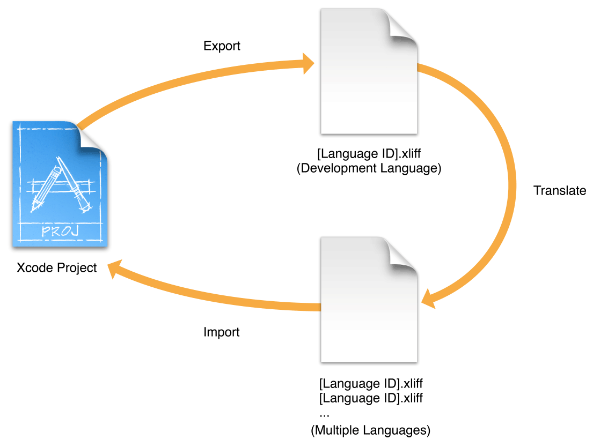

# Internationalization and Localization Guide (6) ---- Localizing Your App

原文地址：
[https://developer.apple.com/library/content/documentation/MacOSX/Conceptual/BPInternational/LocalizingYourApp/LocalizingYourApp.html#//apple_ref/doc/uid/10000171i-CH5-SW1](https://developer.apple.com/library/content/documentation/MacOSX/Conceptual/BPInternational/LocalizingYourApp/LocalizingYourApp.html#//apple_ref/doc/uid/10000171i-CH5-SW1)

# 6 Localizing Your App - 本地化你的 APP

When you are done internationalizing the app’s user interface and code, begin the localization process. Export all the development language strings files that contain user-facing text to a standard XML Localization Interchange File Format (XLIFF). Submit the XLIFF file to a localization team for translation into multiple languages. Continue developing your app while waiting for the translations. Import the XLIFF translations into the project and test the app in each language you added. Repeat the process as needed, translating just the changes between each app revision. As necessary, perform additional localization steps yourself.

当你已经完成了对 APP 的用户界面和代码的国际化，开始本地化进程。导出包含面向用户的文本的所有开发语言字符串文件到一个标准的 XML Localization Interchange File Format (XLIFF)。把 XLIFF 文件提交给一个本地化团队，翻译成多种语言。继续开发你的 APP 同时等待翻译。导入 XLIFF 翻译到工程，并用你添加的每个语言测试 APP。如果有必要就重复这个过程，只翻译每个 APP 版本之间的修改。如果有必要，再执行你自己的其他本地化步骤。

## 5.1 Choosing Languages - 选择语言

You can choose from more than 100 different languages and dialects designated by regions to localize your app. However, the more general you make your localized resources, the more regions you can support with a single set of resources. This can save a lot of space in your app bundle and help reduce localization costs. For example, if you don’t need to distinguish between different regions that use the English language, you can add English to support users in the United States, United Kingdom, and Australia. Even if you provide region-specific resources always provide a complete set of language-specific resources for all the languages you support.

你可以从由地区指定的超过100种不同的语言和方言中选择以本地化你的 APP。不过，你让你的本地化资源越通用，单个资源就能支持越多的地区。这可以节省你的 APP bundle 中的量空间，并有助于减少本地化开销。例如，如果你不需要在不同的使用英语的地区之间做区分，你可以只添加英语就能支持美国、英国和澳大利亚的用户。即使你只提供特定地区的资源，也总会为你所支持的所有语言提供特定语言资源的完整集合。

When searching for resources, the bundle APIs try to find the best match between the languages the app supports and the user’s language and region settings. The region-specific resource folders are searched before the language-specific resource folders. For example, if you add English (United States), English (United Kingdom), and English (Australia) to your project, the bundle APIs search the appropriate region-specific folders first, followed by the English language folder. For more information about how the bundle APIs find localized resources, read The Bundle Search Pattern in Bundle Programming Guide.

If you are unsure about what languages to add, consider the primary languages used in the App Store territories you choose in iTunes Connect to market your app. The App Store territories are listed in App Store Territories in iTunes Connect Developer Guide.

Locking Views
In Interface Builder, lock views you don’t want to accidentally change while waiting for translations. When a view is locked, you can’t change some or all of its properties in the inspector or the project editor. You specify the set of properties to lock by choosing a locking level (see Table 6-1).

Table 6-1  Locking levels
Locking level

Description

Nothing

You can edit all properties of the view.

All properties

You can’t edit any properties of the view.

Localizable properties

You can’t change any user-visible strings and can’t change a limited set of other attributes, such as the view’s size. You can make other changes; for example, you can change the enabled state of a control or cell.

Non-localizable properties

You can change user-visible strings and attributes—such as the size of the view—but can’t change any other attributes of the view.

You can set the lock attribute for a single view or the entire nib file. By default, views inherit their lock attribute from their parent view and top-level views inherit their lock attribute from the .storyboard or .xib file. If you set a view’s lock attribute, it sets the lock attribute for all its descendant views.

To change the locking level of a view

In Interface Builder, select the view you want to lock.
In the Identity inspector (under the Document section), choose a locking level from the Lock pop-up menu.
Refer to Table 6-1 for a description of the locking choices in this menu.

To obtain the lock value from its parent view, choose Inherited.

For example, choose Localizable Properties to continue developing your app while waiting for a nib or strings file to be localized. Choose Non-localizable Properties if you are incorporating translations into a nib file and don’t want to make other changes inadvertently.

To change the locking level of the nib file

In project navigator, select a .storyboard or .xib file.
Choose a locking level from the Editor > Localization Locking menu.
Refer to Table 6-1 for a description of the locking choices in this menu.

To unlock all the views in the file, choose Reset Locking Controls.

For example, to prevent any edits to the nib file that would impact localized strings files, choose Reset Locking Controls followed by Localizable Properties.

Exporting Localizations
Export the development language resources to an XLIFF file and submit it to a localization team for translation into multiple languages.

The first time you export localizations, only the base internationalization—the .storyboard and .xib resource files—exist in the project folder. Xcode generates the strings files from your project files and includes them in the exported .xliff file. Xcode doesn’t add the strings files to the project until you import localizations later. The exported [Language ID].xliff file encodes the strings files in the standard XML Localization Interchange File Format (XLIFF). (Most third-party localization tools support this XLIFF file format.) For example, if the development language is English, the en.xliff file contains base internationalization strings files (one for each .storyboard and .xib file), a Localizable.strings file, and an InfoPlist.strings file. The source text in the strings files is in English.

Translators should return a separate .xliff file for each language. The files should use the language ID as the prefix. For example, if you request en.xliff for English be translated into German and Russian, the returned files should be named de.xliff for German and ru.xliff for Russian. The individual .xliff files contain the actual translations.

../Art/export_details_2x.png
The first step to localize your app is to export the development language or base localization for translation. Before doing this, verify that the development language copyright notice in the Info.plist file is correct. Xcode includes the human-readable copyright notice in the XLIFF file. For a complete list of the localizable Info.plist keys, read Locking Views.

To export the development language translation

In the Xcode project editor, select the project or target.
Choose Editor > Export For Localization.
In the sheet that appears, enter a location in the Save As field and click Save.
Xcode saves the file to the location you specified with a .xliff extension. Xcode creates the folder (if it doesn’t exist) and places a file named [Language ID].xliff in the folder where Language ID is the identifier for the development language. For example, if the development language is English, the filename is en.xliff.

If you never added a language to your project, the export dialog appears similar to this screenshot:

../Art/export_base_localization_2x.png
The next time you export localizations, optionally export the development language resources, specific language resources, or all language resources.

To export multiple localizations for translation

In the Xcode project editor, select the project or target.
Choose Editor > Export For Localization.
In the sheet that appears, enter a location in the Save As field.
If you added a language to your project, the export dialog appears similar to this screenshot:

../Art/export_multiple_localizations_2x.png
From the Include pop-up menu, choose Existing Translations or Development Language Only.
To export all or specific language resources, choose Existing Translations and then deselect the languages that you don’t want to include in the export in the Languages section below. To export the development language resources, choose Development Language Only.

Click Save.
For each language you select, Xcode saves an XLIFF file (a file with a language ID prefix and .xliff extension) to the location you specified in the Save As field. For example, if you select German and French from the language list, Xcode adds a de.xliff and fr.xliff file to the folder.

Importing Localizations
When you import localizations, Xcode adds the language and a set of localized strings files for the language to the project. For example, if you import ru.xliff in the standard XML Localization Interchange File Format (XLIFF) that includes the target language attribute, the Russian language is added to the project. The first time you import localizations, the base internationalization files change to a group containing the strings files in the project navigator. Xcode stores the language-specific strings files in language folders. For example, Xcode creates a ru.lproj folder in the project folder and adds a localized copy of the Localizable.strings and InfoPlist.strings files to the ru.lproj folder. The localized strings files are extracted from the corresponding [Language ID].xliff file. The next time you import localizations, the strings files are merged with your existing project files.

../Art/import_details_2x.png
To import localizations from translators

In the Xcode project editor, select the project or target.
Choose Editor > Import Localizations.
In the sheet that appears, select a file with a .xliff extension and click Open.
A sheet appears showing the differences between the imported XLIFF file and the existing resources in the project folder.

../Art/import_localizations_2x.png
Click Import.
Xcode decodes the localized strings files from the XLIFF file and adds them to the project folder. Xcode replaces existing strings files.

Verifying Your Steps
After you import localizations, Xcode updates the project navigator to show the new language-specific resources. Localized .storyboard and .xib files now appear as groups in the project navigator. Click the disclosure triangle next to a .storyboard or .xib file to reveal the base resource and language-specific strings files.

../Art/localized_nib_2x.png
Select a strings file to view and optionally, edit the contents. The strings file contains key-value pairs that Xcode automatically generates from the text it finds in the corresponding .storyboard or .xib file. If you use NSLocalizedString macros in your code, as described in Separating User-Facing Text from Your Code, a Localizable.strings group also appears in the project navigator.

../Art/localized_strings_2x.png
Another kind of strings file is InfoPlist.strings, which you use for localizing app properties that are visible to users (such as the app’s name). For the keys you can localize in an InfoPlist.strings file, read Locking Views.

Exporting and Importing Localizations Using Command-Line Utilities
Alternatively, you can use the xcodebuild command-line utility to export and import localizations.

To export localizations, enter this command in Terminal, replacing the <dirpath> and <projectname> arguments:

xcodebuild -exportLocalizations -localizationPath <dirpath> -project <projectname> [[-exportLanguage <targetlanguage>]]
The exported XLIFF files are placed in <dirpath>. Optionally, use the exportLanguage argument to export other localizations.

To import localizations, enter this command in Terminal, replacing the <filepath> and <projectname> arguments:

xcodebuild -importLocalizations -localizationPath <filepath> -project <projectname>
where <filepath> refers to a single XLIFF file.

Adding Additional Resources You Want to Localize
You can explicitly add language-specific resource files to your project. For example, you may want to use different sets of image and audio files for different languages and dialects because of cultural differences. At runtime, the app searches the language-specific folder before the base folder to find a resource file, so you can add a resource to the Base.lproj folder and then specific language folders as needed.

Note: If the language doesn’t appear in the Localizations section in the Info pane of your project, add the language before following these steps, as described in Using Base Internationalization.

To localize a resource

In the project navigator, select a resource you want to localize.
If necessary, open the File inspector.
In the Localization section, click the Localize button.
../Art/localize_resource_1_2x.png
In the dialog that appears, choose a language from the pop-up menu and click the Localize button.
For example, choose Base if you want to use the resource file for all languages.

../Art/localize_resource_2_2x.png
After localizing a resource, you can add it to additional languages using the File inspector.

To add localizations to a resource

In the project navigator with the File inspector open, select the resource.
In the Localization section, choose the additional languages you want to add.
Xcode duplicates the file in the corresponding language folder and it appears in the project navigator.

../Art/localize_resource_3_2x.png
Handling Noun Plurals and Units of Measurement
If a string contains a noun plural or units of measurement, provide alternate strings for languages that have different plural rules. To specify language plural rules that can’t be represented by key-value pairs in a strings file, use a .stringsdict file, an XML property list with a .stringsdict file extension. Languages vary in how they handle plurals of nouns or units of measurement. Some languages have a single form, some have two categories, and others have three or more categories to represent quantities. If you display a formatted string containing a variable quantity, you can use one string in your code that is localized using plural rules specified in a .stringsdict file.

Similar to how you retrieve localized text from strings files, use NSLocalizedString macros in your code to retrieve the format string for different plural forms from a .stringsdict file. Next, provide a localized .stringsdict file for all the supported languages that have different plural rules. The NSLocalizedString macros search an existing .stringsdict file before the associated strings file that has the same filename prefix. For example, the macros search the Localizable.stringsdict file for the %d file(s) remaining key first. If it is not found, the macros search the Localizable.strings file for the key. Therefore, only add .stringsdict files for languages that have different plural rules.

To create language plural rules

In your code, use a NSLocalizedString macro, passing a formatted string to retrieve a plural phrase.
For example, to display a variable number of files as text:

localizedString = [NSString localizedStringWithFormat:NSLocalizedString(@"%d file(s) remaining", @"Message shown for remaining files"), count];
Pass a format string as the key parameter to the NSLocalizedString macro.
To create the Localizable.strings file for each language, export and import localizations, as described in Exporting Localizations and Importing Localizations.
Xcode generates a Localizable.strings file from the NSLocalizedString macros in your code. For example, this key-value pair appears in the development language Localizable.strings from the previous code fragment:

/* Message shown for remaining files */
"%d file(s) remaining" = "%d file(s) remaining";
Alternatively, you can create the development language Localizable.strings file yourself, as described in Creating Strings Files for User-Facing Text in Your Code.
Create a .stringsdict property list file and localize it for each language that has different plural rules.
Add a property list file to the project (choose File > New > File and select Property List from the sheet). In the project navigator, change the filename to Localizable.stringsdict and localize it in selected languages, as described in Adding Additional Resources You Want to Localize.

Add the language-specific plural rules to each .stringsdict file.
The .stringsdict file contains a collection of plural rules for each phrase. The top-level key is the same key you pass to an NSLocalizedString macro in your code. The value for this key is a dictionary that specifies the plural rule details. The dictionary contains the text to use for each number category. The types of categories and meaning vary depending on the language.

For example, the English .stringsdict file for the %d file(s) remaining key is:

<plist version="1.0">
    <dict>
        <key>%d file(s) remaining</key>
        <dict>
            <key>NSStringLocalizedFormatKey</key>
            <string>%#@files@</string>
            <key>files</key>
            <dict>
                <key>NSStringFormatSpecTypeKey</key>
                <string>NSStringPluralRuleType</string>
                <key>NSStringFormatValueTypeKey</key>
                <string>d</string>
                <key>one</key>
                <string>%d file remaining</string>
                <key>other</key>
                <string>%d files remaining</string>
            </dict>
        </dict>
    </dict>
</plist>
In English, the one category is used for the number 1, and the other category is used for all other numbers in English.
The Russian .stringsdict file for the %d file(s) remaining key is:

<plist version="1.0">
    <dict>
       <key>%d file(s) remaining</key>
         <dict>
            <key>NSStringLocalizedFormatKey</key>
            <string>%#@files@</string>
            <key>files</key>
            <dict>
                <key>NSStringFormatSpecTypeKey</key>
                <string>NSStringPluralRuleType</string>
                <key>NSStringFormatValueTypeKey</key>
                <string>d</string>
                <key>one</key>
                <string>Остался %d файл</string>
                <key>many</key>
                <string>Осталось %d файлов</string>
                <key>other</key>
                <string>Осталось %d файла</string>
            </dict>
        </dict>
    </dict>
</plist>
Test the plural rules in multiple languages.
Follow the steps in Testing Specific Languages and Regions to run the app in Xcode using different language settings.

For example, the above English plural rules for the %d file(s) remaining key should result in the following localized strings:

Category

Example numbers

Localized string

one

1

1 file remaining

other

0, 2, 3, …

2 files remaining

3 files remaining

For Russian, there are three possible categories with different formats:
Category

Example numbers

Localized string

one

1, 21, 31, 41, 51, 61, …

Остался 1 файл

Остался 21 файл

many

0, 5–20, 25–30, 35–40, …

Осталось 0 файлов

Осталось 20 файлов

other

2–4, 22–24, 32–34, …

Осталось 2 файла

Осталось 22 файла

For a complete description of the .stringsdict file properties, read Stringsdict File Format. For the plural categories and rules for each language, see CLDR Language Plural Rules.

Video: WWDC 2013 Making Your App World-Ready: Localization > Using stringsdict

Localizing the Information Property List Files
When you export localizations, Xcode includes an InfoPlist.strings file for translation. However, this file contains properties about your app and company, so you may want to verify or translate this file yourself. This strings file allows you to optionally localize some property values in the information property list, such as the app name (bundle display name) and copyright notice.

Xcode automatically adds these keys to the InfoPlist.strings file:

CFBundleDisplayName
CFBundleName
CFBundleShortVersionString
NSHumanReadableCopyright
For a complete description of the information property list, read Information Property List Key Reference.

Localizing the App Name and Copyright Notice
To localize the app name and copyright notice, add values for the CFBundleDisplayName and NSHumanReadableCopyright keys to the InfoPlist.strings file. For example, add these lines to the InfoPlist.strings (French) file in the project navigator:

CFBundleDisplayName = "Maisons";
NSHumanReadableCopyright = "Copyright © 2014 My Great Company Tous droits réservés.";
Getting the Localized App Name
If you localize the app name, use it in menu items and elsewhere in the user interface. You can get the localized app name programmatically with the CFBundleDisplayName key:

NSString *appName = [[[NSBundle mainBundle] localizedInfoDictionary] objectForKey:@"CFBundleDisplayName"];
For Mac apps, the user can rename the app in the Finder, so use the NSFileManager class to get the app name:

NSString *bundlePath = [[NSBundle mainBundle] bundlePath];
NSString *appName = [[NSFileManager defaultManager] displayNameAtPath:bundlePath];
Adding Languages
Add languages to your project if you want to add language-specific resources, as described in Adding Additional Resources You Want to Localize, before importing localizations. (Xcode automatically adds languages to your project when importing localizations.) For example, add language-specific image and audio files to your project or test language-specific plural rules before you begin localizing all the strings files.

When Xcode adds a language to your project, it creates a separate language folder to store the language-specific resources. Xcode adds a strings file for each .storyboard and .xib file in the Base.lproj folder to the language folder. The strings file has the same name as the .storyboard or .xib file but with the strings extension. For example, if you have a storyboard named MyStoryboard.storyboard, the generated strings file is named MyStoryboard.strings.

To add a language to a project

In the project navigator, select the project (not a target) and click Info.
In the Localizations section, click the Add button (+) under the Language column and choose the language you want to add from the pop-up menu.
../Art/add_language_1_2x.png
The menu items contain the language name followed by the language ID in parentheses, as in German (de), Japanese (ja), and Arabic (ar). Menu items for scripts or dialects contain the region in parentheses, as in German (Switzerland). The language ID for scripts or dialects uses subtags, as in pt-PT where pt is the code for Portuguese and PT is the code for Portugal. For example, use pt as the language ID for Portuguese as it is used in Brazil and pt-PT as the language ID for Portuguese as it is used in Portugal. The Other submenu (at the bottom of the list) contains more languages and dialects.
These same language IDs are used in the names of the corresponding .lproj language folders, described in Choosing Languages.

In the dialog that appears, deselect the resource files you don’t want to localize for this language.
For the file type Localizable Strings, Xcode creates a strings file for that resource. If you prefer to maintain a separate .storyboard or .xib file for the language, choose the type of resource file from the File Types pop-up menu instead—for example, choose Interface Builder Cocoa Touch Storyboard for a Mac storyboard file.

../Art/add_language_3_2x.png
Click the Finish button.