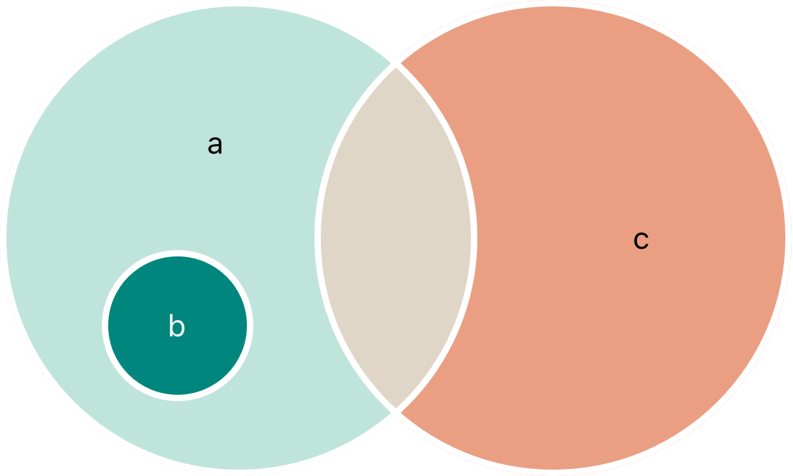

# Collection Types 集合类型

> Organize data using arrays, sets, and dictionaries.
> 
> 使用数组、集合和字典管理数据。

原文地址：[https://docs.swift.org/swift-book/documentation/the-swift-programming-language/collectiontypes/](https://docs.swift.org/swift-book/documentation/the-swift-programming-language/collectiontypes/)

Swift provides three primary _collection types_, known as arrays, sets, and dictionaries, for storing collections of values. Arrays are ordered collections of values. Sets are unordered collections of unique values. Dictionaries are unordered collections of key-value associations.

Swift 提供了三种主要的 **集合类型** 用于存储值的集合，分别称为数组、集合和字典。**数组**是有序的值集合。 **集合**是无序的唯一值集合。**字典**是无序的键值对关联集合。  


Arrays, sets, and dictionaries in Swift are always clear about the types of values and keys that they can store. This means that you can’t insert a value of the wrong type into a collection by mistake. It also means you can be confident about the type of values you will retrieve from a collection.

在 Swift 中，数组、集合和字典始终明确其可存储的值和键的类型。这意味着您不会误将错误类型的值插入集合中，也意味着您可以确信从集合中检索到的值的类型。  

> **Note**
>
> Swift’s array, set, and dictionary types are implemented as _generic collections_. For more about generic types and collections, see [Generics](https://docs.swift.org/swift-book/documentation/the-swift-programming-language/generics).
> 
> **注意**  
> Swift 的数组、集合和字典类型是作为 **泛型集合** 实现的。有关泛型类型和集合的更多信息，请参阅《[泛型](https://docs.swift.org/swift-book/documentation/the-swift-programming-language/generics)》。

## 1 Mutability of Collections 集合的可变性

If you create an array, a set, or a dictionary, and assign it to a variable, the collection that’s created will be mutable. This means that you can change (or mutate) the collection after it’s created by adding, removing, or changing items in the collection. If you assign an array, a set, or a dictionary to a constant, that collection is immutable, and its size and contents can’t be changed.

如果创建一个数组、集合或字典并将其赋值给变量，那么创建的集合是可变的。这意味着可以在创建集合后通过添加、删除或更改集合中的元素来修改（或改变）该集合。如果将数组、集合或字典赋值给常量，则该集合是不可变的，其大小和内容均无法更改。

> **Note**
>
> It’s good practice to create immutable collections in all cases where the collection doesn’t need to change. Doing so makes it easier for you to reason about your code and enables the Swift compiler to optimize the performance of the collections you create.
> 
> **注意**
> 
> 在集合无需更改的所有情况下，创建不可变集合是一种良好实践。这样做不仅有助于更轻松地理解代码逻辑，还能让 Swift 编译器优化所创建集合的性能。

## 2 Arrays 数组

An array stores values of the same type in an ordered list. The same value can appear in an array multiple times at different positions.

数组在有序列表中存储相同类型的值。同一个值可以在数组的不同位置多次出现。

> **Note**
>
> Swift’s Array type is bridged to Foundation’s NSArray class.
>
> For more information about using Array with Foundation and Cocoa, see [Bridging Between Array and NSArray](https://developer.apple.com/documentation/swift/array#2846730).
> 
> **注意**
> 
> Swift 的 Array 类型与 Foundation 框架的 NSArray 类相互桥接。
>
> 有关结合 Foundation 和 Cocoa 使用 Array 的更多信息，请参阅 “Array 与 NSArray 之间的桥接”。

### 2.1 Array Type Shorthand Syntax 数组类型的简写语法

The type of a Swift array is written in full as `Array<Element>`, where `Element` is the type of values the array is allowed to store. You can also write the type of an array in shorthand form as `[Element]`. Although the two forms are functionally identical, the shorthand form is preferred and is used throughout this guide when referring to the type of an array.

Swift 数组的完整类型写法是 `Array<Element>`，其中 `Element` 是数组允许存储的值的类型。你也可以将数组类型简写为 `[Element]`。尽管这两种形式在功能上完全相同，但简写形式更受青睐，并且在本指南中提及数组类型时都会使用这种形式。

### 2.2 Creating an Empty Array 创建空数组 

You can create an empty array in Swift using two approaches. If the context already provides type information, such as a function argument or an already typed variable or constant, you can use an empty array literal, which is written as `[]` (an empty pair of square brackets):

在 Swift 中，有两种创建空数组的方法。如果上下文已提供类型信息（例如函数参数、已声明类型的变量或常量），可以使用空数组字面量，其写法为 `[]`（一对空方括号）：  

```
var someInts: [Int] = []
print("someInts is of type [Int] with \(someInts.count) items.")
// Prints "someInts is of type [Int] with 0 items."
// 输出："someInts 是 [Int] 类型，包含 0 个元素。"
```

Alternatively, you can create an empty array of a certain type using explicit initializer syntax, by writing the element type in square brackets followed by parentheses — for example, `[Int]()` in the following:

另外，也可以使用显式初始化语法创建特定类型的空数组，即在方括号中写入元素类型后接圆括号——例如以下代码中的 `[Int]()`： 

```
var someInts = [Int]()
print("someInts is of type [Int] with \(someInts.count) items.")
// Prints "someInts is of type [Int] with 0 items."
// 输出："someInts 是 [Int] 类型，包含 0 个元素。"
```

Both approaches produce the same result. However, an empty array literal is shorter and usually easier to read.

这两种方法的结果相同。不过，空数组字面量更简洁，通常也更易读。  

In both cases, you can use the empty array literal (`[]`) to reassign an empty array to an existing variable:

在上述两种情况下，都可以使用空数组字面量 `[]` 向现有变量重新赋值一个空数组：  

```
someInts.append(3)
// someInts now contains 1 value of type Int
// someInts 现在包含 1 个 Int 类型的值
someInts = []
// someInts is now an empty array, but is still of type [Int]
// someInts 现在是一个空数组，但仍然是 [Int] 类型
```

### 2.3 Creating an Array with a Default Value 使用默认值创建数组

Swift’s Array type also provides an initializer for creating an array of a certain size with all of its values set to the same default value. You pass this initializer a default value of the appropriate type (called `repeating`): and the number of times that value is repeated in the new array (called `count`):

Swift 的 Array 类型还提供了一个初始化器，用于创建指定大小且所有值都设置为相同默认值的数组。你需要向这个初始化器传递一个适当类型的默认值（称为 `repeating`）和该值在新数组中重复的次数（称为 `count`）：

```
var threeDoubles = Array(repeating: 0.0, count: 3)
// threeDoubles is of type [Double], and equals [0.0, 0.0, 0.0]
// threeDoubles 的类型为 [Double]，值为 [0.0, 0.0, 0.0]
```

### 2.4 Creating an Array by Adding Two Arrays Together 通过相加两个数组创建新数组

You can create a new array by adding together two existing arrays with compatible types with the addition operator (`+`). The new array’s type is inferred from the type of the two arrays you add together:

你可以使用加法运算符（`+`）将两个类型兼容的现有数组合并，从而创建一个新数组。新数组的类型会从相加的两个数组的类型中推断出来：

```
var anotherThreeDoubles = Array(repeating: 2.5, count: 3)
// anotherThreeDoubles is of type [Double], and equals [2.5, 2.5, 2.5]
// anotherThreeDoubles 的类型为 [Double]，值为 [2.5, 2.5, 2.5]

var sixDoubles = threeDoubles + anotherThreeDoubles
// sixDoubles is inferred as [Double], and equals [0.0, 0.0, 0.0, 2.5, 2.5, 2.5]
// sixDoubles 推断为 [Double] 类型，值为 [0.0, 0.0, 0.0, 2.5, 2.5, 2.5]
```

### 2.5 Creating an Array with an Array Literal 使用数组字面量创建数组

You can also initialize an array with an array literal, which is a shorthand way to write one or more values as an array collection. An array literal is written as a list of values, separated by commas, surrounded by a pair of square brackets:

你还可以使用数组字面量初始化数组，这是一种将一个或多个值编写为数组集合的简写方式。数组字面量写作由逗号分隔的值列表，并用一对方括号括起来：

```
[<#value 1#>, <#value 2#>, <#value 3#>]
```

The example below creates an array called `shoppingList` to store `String` values:

下面的示例创建了一个名为 `shoppingList` 的数组，用于存储 `String` 值：

```
var shoppingList: [String] = ["Eggs", "Milk"]
// shoppingList has been initialized with two initial items
// shoppingList 已使用两个初始项初始化
```

The `shoppingList` variable is declared as “an array of string values”, written as `[String]`. Because this particular array has specified a value type of `String`, it’s allowed to store `String` values only. Here, the `shoppingList` array is initialized with two `String` values (`"Eggs"` and `"Milk"`), written within an array literal.

`shoppingList` 变量被声明为 “字符串值的数组”，写作 `[String]`。由于这个特定数组指定了值的类型是 `String`，因此它只能存储 `String` 值。在这里，`shoppingList` 数组使用两个 `String` 值（`"Eggs"` 和 `"Milk"`）进行初始化，这些值写在数组字面量中。

> **Note** **注意**
>
> The `shoppingList` array is declared as a variable (with the `var` introducer) and not a constant (with the `let` introducer) because more items are added to the shopping list in the examples below.
> 
> `shoppingList` 数组被声明为变量（使用 `var` 关键字）而非常量（使用 `let` 关键字），因为在下面的示例中会向购物清单中添加更多项目。

In this case, the array literal contains two `String` values and nothing else. This matches the type of the `shoppingList` variable’s declaration (an array that can only contain `String` values), and so the assignment of the array literal is permitted as a way to initialize `shoppingList` with two initial items.

在这种情况下，数组字面量只包含两个 `String` 值，没有其他内容。这与 `shoppingList` 变量声明的类型（只能包含 `String` 值的数组）匹配，因此允许将数组字面量赋值作为用两个初始项初始化 `shoppingList` 的方式。

Thanks to Swift’s type inference, you don’t have to write the type of the array if you’re initializing it with an array literal containing values of the same type. The initialization of shoppingList could have been written in a shorter form instead:

得益于 Swift 的类型推断，如果使用包含相同类型值的数组字面量初始化数组，则不必编写数组的类型。`shoppingList` 的初始化可以用更简短的形式编写：

```
var shoppingList = ["Eggs", "Milk"]
```

Because all values in the array literal are of the same type, Swift can infer that `[String]` is the correct type to use for the `shoppingList` variable.

因为数组字面量中的所有值都属于同一类型，Swift 可以推断 `[String]` 是 `shoppingList` 变量应使用的正确类型。

### 2.6 Accessing and Modifying an Array 访问和修改数组

You access and modify an array through its methods and properties, or by using subscript syntax.

你可以通过数组的方法和属性，或使用下标语法来访问和修改数组。

To find out the number of items in an array, check its read-only `count` property:

要查看数组中的项目数量，请检查其只读属性 `count`：

```
print("The shopping list contains \(shoppingList.count) items.")
// Prints "The shopping list contains 2 items."
// 输出 "The shopping list contains 2 items."
```

Use the Boolean `isEmpty` property as a shortcut for checking whether the `count` property is equal to `0`:

使用布尔值属性 `isEmpty` 作为检查 `count` 属性是否等于 `0` 的快捷方式：

```
if shoppingList.isEmpty {
    print("The shopping list is empty.")
} else {
    print("The shopping list isn't empty.")
}
// Prints "The shopping list isn't empty."
// 输出 "The shopping list isn't empty."
```

You can add a new item to the end of an array by calling the array’s `append(_:)` method:

你可以通过调用数组的 `append(_:)` 方法将新项添加到数组末尾：

```
shoppingList.append("Flour")
// shoppingList now contains 3 items, and someone is making pancakes
// shoppingList 现在包含3个项目，有人要做煎饼啦（作者幽默的解释为何购物清单里多了“面粉”这个物品，加入面粉是因为要做煎饼，与代码逻辑无关）
```

Alternatively, append an array of one or more compatible items with the addition assignment operator (`+=`):

或者，使用加法赋值运算符（`+=`）追加一个或多个兼容类型的项目组成的数组：

```
shoppingList += ["Baking Powder"]
// shoppingList now contains 4 items
// shoppingList 现在包含4个项目
shoppingList += ["Chocolate Spread", "Cheese", "Butter"]
// shoppingList now contains 7 items
// shoppingList 现在包含7个项目
```

Retrieve a value from the array by using _subscript syntax_, passing the index of the value you want to retrieve within square brackets immediately after the name of the array:

通过**下标语法**从数组中检索值，在数组名称后立即使用方括号传递要检索的值的索引：

```
var firstItem = shoppingList[0]
// firstItem is equal to "Eggs"
// firstItem 等于 "Eggs"
```

> **Note** **注意**
>
> The first item in the array has an index of `0`, not `1`. Arrays in Swift are always zero-indexed.
> 
> 数组中的第一个项目索引为 `0`，而不是 `1`。在 Swift 中，数组始终使用零索引。

You can use subscript syntax to change an existing value at a given index:

你可以使用下标语法更改给定索引处的现有值：

```
shoppingList[0] = "Six eggs"
// the first item in the list is now equal to "Six eggs" rather than "Eggs"
// 列表中的第一个项目现在等于 "Six eggs" 而不是 "Eggs"
```

When you use subscript syntax, the index you specify needs to be valid. For example, writing `shoppingList[shoppingList.count] = "Salt"` to try to append an item to the end of the array results in a runtime error.

使用下标语法时，指定的索引需要有效。例如，采用 `shoppingList [shoppingList.count] = "Salt"` 的写法尝试向数组末尾追加项目会导致运行时错误。

You can also use subscript syntax to change a range of values at once, even if the replacement set of values has a different length than the range you are replacing. The following example replaces `"Chocolate Spread"`, `"Cheese"`, and `"Butter"` with `"Bananas"` and `"Apples"`:

你还可以使用下标语法一次更改一系列值，即使替换的一组值的长度与要替换的范围不同。以下示例将 `"Chocolate Spread"`、`"Cheese"` 和 `"Butter"` 替换为 `"Bananas"` 和 `"Apples"`：

```
shoppingList[4...6] = ["Bananas", "Apples"]
// shoppingList now contains 6 items
// shoppingList 现在包含6个项目
```

To insert an item into the array at a specified index, call the array’s `insert(_:at:)` method:

要在数组的指定索引处插入项目，请调用数组的 `insert(_:at:)` 方法：

```
shoppingList.insert("Maple Syrup", at: 0)
// shoppingList now contains 7 items
// "Maple Syrup" is now the first item in the list
// shoppingList 现在包含7个项目
// "Maple Syrup" 现在是列表中的第一个项目
```

This call to the `insert(_:at:)` method inserts a new item with a value of `"Maple Syrup"` at the very beginning of the shopping list, indicated by an index of `0`.

此处调用 `insert(_:at:)` 方法在购物清单的最开头（索引 `0` 处）插入一个值为 `"Maple Syrup"` 的新项。

Similarly, you remove an item from the array with the `remove(at:)` method. This method removes the item at the specified index and returns the removed item (although you can ignore the returned value if you don’t need it):

同样，使用 `remove(at:)` 方法从数组中移除项目。此方法会移除指定索引处的项目并返回被移除的项目（如果不需要，可忽略返回值）：

```
let mapleSyrup = shoppingList.remove(at: 0)
// the item that was at index 0 has just been removed
// shoppingList now contains 6 items, and no Maple Syrup
// the mapleSyrup constant is now equal to the removed "Maple Syrup" string
// 索引0处的项目已被移除
// shoppingList 现在包含6个项目，且没有Maple Syrup
// mapleSyrup 常量现在等于被移除的 "Maple Syrup" 字符串
```

> **Note** **注意**
>
> If you try to access or modify a value for an index that’s outside of an array’s existing bounds, you will trigger a runtime error. You can check that an index is valid before using it by comparing it to the array’s `count` property. The largest valid index in an array is `count - 1` because arrays are indexed from zero — however, when `count` is `0` (meaning the array is empty), there are no valid indexes.
> 
> 如果尝试访问或修改数组现有边界之外的索引处的值，将触发运行时错误。你可以通过将索引与数组的 `count` 属性进行比较来检查索引是否有效。数组中最大的有效索引是 `count - 1`，因为数组从 0 开始索引；但是，当 `count` 为 `0` 时（意味着数组为空），没有有效索引。

Any gaps in an array are closed when an item is removed, and so the value at index `0` is once again equal to "Six eggs":

移除项目后，数组中的任何空位都会被闭合，因此索引 `0` 处的值会再次等于 `"Six eggs"`：

```
firstItem = shoppingList[0]
// firstItem is now equal to "Six eggs"
// firstItem 现在等于 "Six eggs"
```

If you want to remove the final item from an array, use the `removeLast()` method rather than the `remove(at:)` method to avoid the need to query the array’s `count` property. Like the `remove(at:)` method, `removeLast()` returns the removed item:

如果要从数组中移除最后一个项目，可以使用 `removeLast()` 方法，而不是 `remove(at:)` 方法，以避免查询数组的 `count` 属性。与 `remove(at:)` 方法一样，`removeLast()` 会返回被移除的项目：

```
let apples = shoppingList.removeLast()
// the last item in the array has just been removed
// shoppingList now contains 5 items, and no apples
// the apples constant is now equal to the removed "Apples" string
// 数组中的最后一个项目已被移除
// shoppingList 现在包含5个项目，且没有apples
// apples 常量现在等于被移除的 "Apples" 字符串
```

### 2.7 Iterating Over an Array 遍历数组

You can iterate over the entire set of values in an array with the `for-in` loop:

你可以使用 `for-in` 循环遍历数组中的所有值：

```
for item in shoppingList {
    print(item)
}
// Six eggs
// Milk
// Flour
// Baking Powder
// Bananas
```

If you need the integer index of each item as well as its value, use the `enumerated()` method to iterate over the array instead. For each item in the array, the `enumerated()` method returns a tuple composed of an integer and the item. The integers start at zero and count up by one for each item; if you enumerate over a whole array, these integers match the items’ indices. You can decompose the tuple into temporary constants or variables as part of the iteration:

如果需要每个项目的整数索引及其值，可以改用 `enumerated()` 方法遍历数组。对于数组中的每个项目，`enumerated()` 方法会返回一个由整数和项目组成的元组。整数从 0 开始，每个项目递增 1；如果遍历整个数组，这些整数与项目的索引匹配。你可以在迭代过程中将元组分解为临时常量或变量：

```
for (index, value) in shoppingList.enumerated() {
    print("Item \(index + 1): \(value)")
}
// Item 1: Six eggs
// Item 2: Milk
// Item 3: Flour
// Item 4: Baking Powder
// Item 5: Bananas
```

For more about the `for-in` loop, see [For-In](https://docs.swift.org/swift-book/documentation/the-swift-programming-language/controlflow#For-In-Loops) Loops.

有关 `for-in` 循环的更多信息，请参阅《[For-In 循环](https://docs.swift.org/swift-book/documentation/the-swift-programming-language/controlflow#For-In-Loops)》。

## 3 Set 集合

A _set_ stores distinct values of the same type in a collection with no defined ordering. You can use a set instead of an array when the order of items isn’t important, or when you need to ensure that an item only appears once.

**集合**是一种存储相同类型不同值的集合，其中的值没有定义顺序。当元素的顺序不重要，或者你需要确保一个元素只出现一次时，可以使用集合而不是数组。

> **Note** **注意**
>
> Swift’s `Set` type is bridged to Foundation’s `NSSet` class.
> 
> Swift 的 `Set` 类型与 Foundation 的 `NSSet` 类相关联。
>
> For more information about using Set with Foundation and Cocoa, see [Bridging Between Set and NSSet](https://developer.apple.com/documentation/swift/set#2845530).
> 
> 有关将 Set 与 Foundation 和 Cocoa 配合使用的更多信息，请参阅《[Set 与 NSSet 之间的桥接](https://developer.apple.com/documentation/swift/set#2845530)》。


### 3.1 Hash Values for Set Types 集合类型的哈希值

A type must be hashable in order to be stored in a set — that is, the type must provide a way to compute a hash value for itself. A hash value is an `Int` value that’s the same for all objects that compare equally, such that if `a == b`, the hash value of `a` is equal to the hash value of `b`.

要存储在集合中，类型必须是可哈希的 —— 也就是说，该类型必须能为自身计算出一个哈希值。哈希值是一个 `Int` 值 —— 对于所有比较结果相等的对象，它们的哈希值都相同 —— 如果 `a == b`，那么 `a` 的哈希值等于 `b` 的哈希值。

All of Swift’s basic types (such as String, Int, Double, and Bool) are hashable by default, and can be used as set value types or dictionary key types. Enumeration case values without associated values (as described in [Enumerations](https://docs.swift.org/swift-book/documentation/the-swift-programming-language/enumerations)) are also hashable by default.

Swift 的所有基本类型（如 String、Int、Double 和 Bool）默认都是可哈希的，可以作为集合的值类型或字典的键类型使用。没有关联值的枚举值（如《[枚举](https://docs.swift.org/swift-book/documentation/the-swift-programming-language/enumerations)》章节所述），默认也是可哈希的。

> **Note** **注意**
>
> You can use your own custom types as set value types or dictionary key types by making them conform to the Hashable protocol from the Swift standard library. For information about implementing the required `hash(into:)` method, see [Hashable](https://developer.apple.com/documentation/swift/hashable). For information about conforming to protocols, see [Protocols](https://docs.swift.org/swift-book/documentation/the-swift-programming-language/protocols).
> 
> 你可以使用自定义类型作为集合的值类型或字典的键类型，只要让它遵循 Swift 标准库中的 Hashable 协议即可。有关实现必需的 `hash (into:)` 方法的信息，请参阅《[可哈希](https://developer.apple.com/documentation/swift/hashable)》；有关协议遵循的信息，请参阅《[协议](https://docs.swift.org/swift-book/documentation/the-swift-programming-language/protocols)》。

### 3.2 Set Type Syntax 集合类型语法

The type of a Swift set is written as `Set<Element>`, where `Element` is the type that the set is allowed to store. Unlike arrays, sets don’t have an equivalent shorthand form.

Swift 中集合的类型表示为 `Set<Element>`，其中 `Element` 是该集合允许存储的元素类型。与数组不同，集合没有对应的简写形式。

### 3.3 Creating and Initializing an Empty Set 创建和初始化空集合

You can create an empty set of a certain type using initializer syntax:

你可以使用初始化器语法创建特定类型的空集合：

```
var letters = Set<Character>()
print("letters is of type Set<Character> with \(letters.count) items.")
// Prints "letters is of type Set<Character> with 0 items."
// 输出 "letters 是 Set<Character> 类型，包含 0 个元素。"
```

> **Note** **注意**
>
> The type of the `letters` variable is inferred to be `Set<Character>`, from the type of the initializer.
> 
> 从初始化器的类型推断得到 `letters` 变量的类型是 `Set<Character>`。

Alternatively, if the context already provides type information, such as a function argument or an already typed variable or constant, you can create an empty set with an empty array literal:

另外，如果上下文已经提供了类型信息（例如函数参数或已指定类型的变量/常量），你可以使用空数组字面量创建空集合：

```
letters.insert("a")
// letters now contains 1 value of type Character
// letters 现在包含 1 个 Character 类型的值
letters = []
// letters is now an empty set, but is still of type Set<Character>
// letters 现在是空集合，但仍然是 Set<Character> 类型
```

### 3.4 Creating a Set with an Array Literal 用数组字面量创建集合

You can also initialize a set with an array literal, as a shorthand way to write one or more values as a set collection.

你也可以使用数组字面量来初始化集合，这是一种简写方式，用于将一个或多个值编写为集合。

The example below creates a set called `favoriteGenres` to store `String` values:

下面的示例创建了一个名为 `favoriteGenres` 的集合，用于存储 `String` 类型的值：

```
var favoriteGenres: Set<String> = ["Rock", "Classical", "Hip hop"]
// favoriteGenres has been initialized with three initial items
// favoriteGenres 已用三个初始元素完成初始化
```

The `favoriteGenres` variable is declared as “a set of `String` values”, written as `Set<String>`. Because this particular set has specified a value type of String, it’s only allowed to store `String` values. Here, the `favoriteGenres` set is initialized with three `String` values (`"Rock"`, `"Classical"`, and `"Hip hop"`), written within an array literal.

`favoriteGenres` 变量被声明为 “一组 `String` 类型的值”，写法为 `Set<String>`。由于这个特定的集合指定了值类型为 `String`，因此它只允许存储 `String` 类型的值。此处，`favoriteGenres` 集合通过三个 `String` 类型的值（`"Rock"`、`"Classical"` 和 `"Hip hop"`）进行初始化，这些值被写在数组字面量（array literal）中。

> **Note** **说明**
>
> The `favoriteGenres` set is declared as a variable (with the `var` introducer) and not a constant (with the `let` introducer) because items are added and removed in the examples below.
> 
> `favoriteGenres` 集合被声明为变量（使用 `var` 关键字），而非常量（使用 `let` 关键字），这是因为在下方的示例中需要向该集合添加和移除元素。

A set type can’t be inferred from an array literal alone, so the type `Set` must be explicitly declared. However, because of Swift’s type inference, you don’t have to write the type of the set’s elements if you’re initializing it with an array literal that contains values of just one type. The initialization of `favoriteGenres` could have been written in a shorter form instead:

仅通过数组字面量无法推断出集合类型，因此必须显式声明其类型为 `Set`。不过，得益于 Swift 的类型推断机制，若使用仅包含单一类型值的数组字面量为集合初始化，则无需编写集合元素的类型。`favoriteGenres` 的初始化代码也可采用更简洁的形式编写：

```
var favoriteGenres: Set = ["Rock", "Classical", "Hip hop"]
```

Because all values in the array literal are of the same type, Swift can infer that `Set<String>` is the correct type to use for the `favoriteGenres` variable.

由于数组字面量中的所有值均为同一类型，Swift 能够推断出 `favoriteGenres` 变量应使用 `Set<String>` 作为正确类型。

### 3.5 Accessing and Modifying a Set 访问和修改集合

You access and modify a set through its methods and properties.

你可以通过集合的方法和属性来访问并修改它。

To find out the number of items in a set, check its read-only `count` property:

要查看集合中元素的数量，可访问其只读的 `count` 属性：

```
print("I have \(favoriteGenres.count) favorite music genres.")
// Prints "I have 3 favorite music genres."
// 输出："我有 3 种喜欢的音乐类型。"
```

Use the Boolean `isEmpty` property as a shortcut for checking whether the `count` property is equal to `0`:

可使用布尔类型的 `isEmpty` 属性作为快捷方式，判断 `count` 属性是否等于 `0`（即集合是否为空）：

```
if favoriteGenres.isEmpty {
    print("As far as music goes, I'm not picky.")
} else {
    print("I have particular music preferences.")
}
// Prints "I have particular music preferences."
// 输出："我有特定的音乐偏好。"
```

You can add a new item into a set by calling the set’s `insert(_:)` method:

调用集合的 `insert(_:)` 方法，可以向集合中添加新元素：

```
favoriteGenres.insert("Jazz")
// favoriteGenres now contains 4 items
// 此时 favoriteGenres 包含 4 个元素
```

You can remove an item from a set by calling the set’s `remove(_:)` method, which removes the item if it’s a member of the set, and returns the removed value, or returns `nil` if the set didn’t contain it. Alternatively, all items in a set can be removed with its `removeAll()` method.

可以通过调用集合的 `remove(_:)` 方法从集合中移除一个元素：如果该元素是集合的成员，此方法会将其移除并返回被移除的元素；如果集合中不包含该元素，则返回 `nil`。此外，你也可以使用集合的 `removeAll()` 方法移除集合中的所有元素。

```
if let removedGenre = favoriteGenres.remove("Rock") {
    print("\(removedGenre)? I'm over it.")
} else {
    print("I never much cared for that.")
}
// Prints "Rock? I'm over it."
// 输出："Rock? 我已经不喜欢了。"
```

To check whether a set contains a particular item, use the `contains(_:)` method.

使用 `contains(_:)` 方法，可判断集合中是否存在某个特定元素：

```
if favoriteGenres.contains("Funk") {
    print("I get up on the good foot.")
} else {
    print("It's too funky in here.")
}
// Prints "It's too funky in here."
// 输出："这里的音乐太放克了（我不太喜欢）。"
```

### 3.6 Iterating Over a Set 遍历集合

You can iterate over the values in a set with a `for-in` loop.

你可以使用 `for-in` 循环遍历集合中的所有元素。

```
for genre in favoriteGenres {
    print("\(genre)")
}
// Classical（古典乐）
// Jazz（爵士乐）
// Hip hop（嘻哈乐）
```

For more about the `for-in` loop, see [For-In Loops](https://docs.swift.org/swift-book/documentation/the-swift-programming-language/controlflow#For-In-Loops).

关于 `for-in` 循环的更多用法，可参考《[For-In 循环](https://docs.swift.org/swift-book/documentation/the-swift-programming-language/controlflow#For-In-Loops)》章节。

Swift’s `Set` type doesn’t have a defined ordering. To iterate over the values of a set in a specific order, use the `sorted()` method, which returns the set’s elements as an array sorted using the `<` operator.

Swift 中的 `Set` 类型没有默认的元素顺序。若要按特定顺序遍历集合元素，可使用 `sorted()` 方法 —— 该方法会将集合元素按 `<` 运算符的规则排序，并以数组形式返回排序后的结果。

```
for genre in favoriteGenres.sorted() {
    print("\(genre)")
}
// Classical（古典乐）
// Hip hop（嘻哈乐）
// Jazz（爵士乐）
```

## 5 Performing Set Operations 执行集合操作

You can efficiently perform fundamental set operations, such as combining two sets together, determining which values two sets have in common, or determining whether two sets contain all, some, or none of the same values.

你可以高效地执行基本的集合操作，例如：将两个集合合并、确定两个集合的共有元素，或者判断两个集合是否包含全部、部分相同的元素，抑或是完全没有相同元素。

### 5.1 Fundamental Set Operations 基本集合操作

The illustration below depicts two sets — `a` and `b` — with the results of various set operations represented by the shaded regions.

下图展示了两个集合 `a` 和 `b`，其中阴影部分代表各种集合操作的结果。


- Use the `intersection(_:)` method to create a new set with only the values common to both sets.
- Use the `symmetricDifference(_:)` method to create a new set with values in either set, but not both.
- Use the `union(_:)` method to create a new set with all of the values in both sets.
- Use the `subtracting(_:)` method to create a new set with values not in the specified set.
- 使用 `intersection(_:)` 方法创建一个新集合，该集合仅包含两个集合的共有元素。
- 使用 `symmetricDifference(_:)` 方法创建一个新集合，该集合包含仅在其中一个集合中出现的元素。
- 使用 `union(_:)` 方法创建一个新集合，该集合包含两个集合的所有元素。
- 使用 `subtracting(_:)` 方法创建一个新集合，该集合包含原集合中不存在于指定集合中的元素。

```
let oddDigits: Set = [1, 3, 5, 7, 9]
let evenDigits: Set = [0, 2, 4, 6, 8]
let singleDigitPrimeNumbers: Set = [2, 3, 5, 7]

oddDigits.union(evenDigits).sorted()
// [0, 1, 2, 3, 4, 5, 6, 7, 8, 9]
oddDigits.intersection(evenDigits).sorted()
// []
oddDigits.subtracting(singleDigitPrimeNumbers).sorted()
// [1, 9]
oddDigits.symmetricDifference(singleDigitPrimeNumbers).sorted()
// [1, 2, 9]
```

### 5.2 Set Membership and Equality - 集合的包含关系与相等性

The illustration below depicts three sets — `a`, `b` and `c` — with overlapping regions representing elements shared among sets. Set `a` is a _superset_ of set `b`, because `a` contains all elements in `b`. Conversely, set `b` is a _subset_ of set `a`, because all elements in `b` are also contained by `a`. Set `b` and set `c` are _disjoint_ with one another, because they share no elements in common.

下图展示了三个集合 ——`a`、`b` 和 `c`——其中重叠区域代表集合之间共有的元素。集合 `a` 是集合 `b` 的 *超集*，因为 `a` 包含了 `b` 中的所有元素。反过来，集合 `b` 是集合 `a` 的 *子集*，因为 `b` 中的所有元素也都被 `a` 包含。集合 `b` 和集合 `c` *互不相交*，因为它们没有任何共同的元素。



- Use the “is equal” operator (`==`) to determine whether two sets contain all of the same values.
- Use the `isSubset(of:)` method to determine whether all of the values of a set are contained in the specified set.
- Use the `isSuperset(of:)` method to determine whether a set contains all of the values in a specified set.
- Use the `isStrictSubset(of:)` or `isStrictSuperset(of:)` methods to determine whether a set is a subset or superset, but not equal to, a specified set.
- Use the `isDisjoint(with:)` method to determine whether two sets have no values in common.

- 使用 “相等” 运算符（`==`）判断两个集合是否包含完全相同的元素。
- 使用 `isSubset(of:)` 方法判断一个集合的所有元素是否都包含在指定集合中（即是否为指定集合的子集）。
- 使用 `isSuperset(of:)` 方法判断一个集合是否包含指定集合的所有元素（即是否为指定集合的超集）。
- 使用 `isStrictSubset(of:)` 或 `isStrictSuperset(of:)` 方法判断一个集合是否为指定集合的子集或超集，但两个集合不相等（即 “严格子集” 或 “严格超集”）。
- 使用 `isDisjoint(with:)` 方法判断两个集合是否没有任何共有元素（即是否不相交）。

```
let houseAnimals: Set = ["🐶", "🐱"]
let farmAnimals: Set = ["🐮", "🐔", "🐑", "🐶", "🐱"]
let cityAnimals: Set = ["🐦", "🐭"]

houseAnimals.isSubset(of: farmAnimals)
// true
farmAnimals.isSuperset(of: houseAnimals)
// true
farmAnimals.isDisjoint(with: cityAnimals)
// true
```

## 6 Dictionaries 字典

A _dictionary_ stores associations between keys of the same type and values of the same type in a collection with no defined ordering. Each value is associated with a unique key, which acts as an identifier for that value within the dictionary. Unlike items in an array, items in a dictionary don’t have a specified order. You use a dictionary when you need to look up values based on their identifier, in much the same way that a real-world dictionary is used to look up the definition for a particular word.

*字典* 是一种存储着相同类型键（Key）与相同类型值（Value）的关联关系的无序集合。每个值都与唯一的键绑定，键作为该值在字典中的标识。与数组元素不同，字典元素没有固定顺序。当你需要通过标识查找值时，类似用真实字典查询特定单词的释义，使用字典最为合适。

> **Note** **注意**
>
> Swift’s `Dictionary` type is bridged to Foundation’s `NSDictionary` class.
> 
> Swift 的 `Dictionary` 类型与 Foundation 的 `NSDictionary` 类是桥接的。
>
> For more information about using `Dictionary` with Foundation and Cocoa, see [Bridging Between Dictionary and NSDictionary](https://developer.apple.com/documentation/swift/dictionary#2846239).
> 
> 关于在 Foundation 和 Cocoa 之间的 `Dictionary` 配合使用，可参考《[Dictionary 与 NSDictionary 之间的桥接](https://developer.apple.com/documentation/swift/dictionary#2846239)》。

## 6.1 Dictionary Type Shorthand Syntax 字典类型的简写语法

The type of a Swift dictionary is written in full as `Dictionary<Key, Value>`, where `Key` is the type of value that can be used as a dictionary key, and `Value` is the type of value that the dictionary stores for those keys.

Swift 字典的完整类型写法是 `Dictionary<Key, Value>`，其中 `Key` 是可作为字典键的类型，`Value` 是字典为这些键存储的值的类型。

> **Note** **注意**
>
> A dictionary `Key` type must conform to the `Hashable` protocol, like a set’s value type.
> 
> 字典的 `Key` 类型必须遵循 `Hashable` 协议，这一点与集合的元素类型要求一致。

You can also write the type of a dictionary in shorthand form as `[Key: Value]`. Although the two forms are functionally identical, the shorthand form is preferred and is used throughout this guide when referring to the type of a dictionary.

你也可以用简写形式 `[Key: Value]` 表示字典类型。两种写法功能完全相同，但简写形式更常用，本指南中提及字典类型时均采用这种方式。

## 6.2 Creating an Empty Dictionary 创建空字典

As with arrays, you can create an empty `Dictionary` of a certain type by using initializer syntax:

和数组类似，你可以使用初始化语法创建指定类型的空字典：

```
var namesOfIntegers: [Int: String] = [:]
// namesOfIntegers is an empty [Int: String] dictionary
// namesOfIntegers 是一个空的 [Int: String] 字典
```

This example creates an empty dictionary of type `[Int: String]` to store human-readable names of integer values. Its keys are of type `Int`, and its values are of type `String`.

这个示例创建了一个 `[Int: String]` 类型的空字典，用于存储整数的可读名称，其键为 `Int` 类型，值为 `String` 类型。

If the context already provides type information, you can create an empty dictionary with an empty dictionary literal, which is written as `[:]` (a colon inside a pair of square brackets):

如果上下文已提供类型信息，你可以用空字典字面量 `[:]`（方括号内加冒号）创建空字典：

```
namesOfIntegers[16] = "sixteen"
// namesOfIntegers now contains 1 key-value pair
namesOfIntegers = [:]
// namesOfIntegers is once again an empty dictionary of type [Int: String]
```

## 6.3 Creating a Dictionary with a Dictionary Literal 用字典字面量创建字典

You can also initialize a dictionary with a dictionary literal, which has a similar syntax to the array literal seen earlier. A dictionary literal is a shorthand way to write one or more key-value pairs as a Dictionary collection.

你也可以通过字典字面量初始化字典，语法类似之前的数组字面量。字典字面量是一种简写方式，用于直接编写一个或多个键值对作为字典集合。

A key-value pair is a combination of a key and a value. In a dictionary literal, the key and value in each key-value pair are separated by a colon. The key-value pairs are written as a list, separated by commas, surrounded by a pair of square brackets:

键值对由键和值组成，在字典字面量中，每个键值对的键和值用冒号分隔，多个键值对以逗号隔开，整体包裹在方括号内：

```
[<#key 1#>: <#value 1#>, <#key 2#>: <#value 2#>, <#key 3#>: <#value 3#>]
```

The example below creates a dictionary to store the names of international airports. In this dictionary, the keys are three-letter International Air Transport Association codes, and the values are airport names:

以下示例创建了一个存储国际机场名称的字典，键是国际航空运输协会（IATA）的三字代码，值是机场名称：

```
var airports: [String: String] = ["YYZ": "Toronto Pearson", "DUB": "Dublin"]
```

The airports dictionary is declared as having a type of `[String: String]`, which means “a `Dictionary` whose keys are of type `String`, and whose values are also of type `String`”.

该字典被声明为 `[String: String]` 类型，意为 “键为 `String` 类型、值也为 `String` 类型的字典”。

> **Note** **说明**
>
> The `airports` dictionary is declared as a variable (with the `var` introducer), and not a constant (with the `let` introducer), because more airports are added to the dictionary in the examples below.
> 
> `airports` 字典用 `var` 声明为变量（而非 `let` 声明的常量），因为后续示例中会向该字典添加更多机场信息。

The airports dictionary is initialized with a dictionary literal containing two key-value pairs. The first pair has a key of "YYZ" and a value of "Toronto Pearson". The second pair has a key of "DUB" and a value of "Dublin".

这个字典通过包含两个键值对的字面量初始化：第一个键值对的键是 "YYZ"、值是 "多伦多皮尔逊机场"，第二个的键是 "DUB"、值是 "都柏林机场"。

This dictionary literal contains two `String: String` pairs. This key-value type matches the type of the `airports` variable declaration (a dictionary with only `String` keys, and only `String` values), and so the assignment of the dictionary literal is permitted as a way to initialize the `airports` dictionary with two initial items.

这个字典字面量包含两个 `String: String` 类型的键值对。这种键值类型与 `airports` 变量的声明类型完全匹配 —— 该字典仅接受 `String` 类型的键，且仅存储 `String` 类型的值。因此，允许通过这种字典字面量赋值的方式，为 `airports` 字典初始化两个初始元素。

As with arrays, you don’t have to write the type of the dictionary if you’re initializing it with a dictionary literal whose keys and values have consistent types. The initialization of `airports` could have been written in a shorter form instead:

和数组一样，如果用的字典字面量中所有键的类型一致、所有值的类型也一致，你就不用显式声明字典的类型。`airports` 的初始化语句可以简化成这样：

```
var airports = ["YYZ": "Toronto Pearson", "DUB": "Dublin"]
```

Because all keys in the literal are of the same type as each other, and likewise all values are of the same type as each other, Swift can infer that `[String: String]` is the correct type to use for the `airports` dictionary.

因为该字面量中所有键的类型都相同，所有值的类型也同样相同，所以 Swift 能够推断出 `[String: String]` 是 `airports` 字典应使用的正确类型。

### 6.4 Accessing and Modifying a Dictionary 访问和修改字典

You access and modify a dictionary through its methods and properties, or by using subscript syntax.

你可以通过字典的方法、属性，或使用下标语法来访问和修改字典。

As with an array, you find out the number of items in a Dictionary by checking its read-only `count` property:

与数组类似，通过查看字典的只读属性 `count`，可获知字典中键值对的数量：

```
print("The airports dictionary contains \(airports.count) items.")
// Prints "The airports dictionary contains 2 items."
// 输出："airports 字典包含 2 个键值对。"
```

Use the Boolean `isEmpty` property as a shortcut for checking whether the `count` property is equal to `0`:

可使用布尔类型的 `isEmpty` 属性作为快捷方式，判断 `count` 属性是否等于 `0`（即字典是否为空）：

```
if airports.isEmpty {
    print("The airports dictionary is empty.")
} else {
    print("The airports dictionary isn't empty.")
}
// Prints "The airports dictionary isn't empty."
// 输出："airports 字典不是空的。"
```

You can add a new item to a dictionary with subscript syntax. Use a new key of the appropriate type as the subscript index, and assign a new value of the appropriate type:

通过下标语法可向字典添加新键值对。使用符合类型要求的新键作为下标索引，并为其赋值符合类型要求的新值：

```
airports["LHR"] = "London"
// the airports dictionary now contains 3 items
// airports 字典现在包含 3 个键值对
```

You can also use subscript syntax to change the value associated with a particular key:

也可通过下标语法修改指定键关联的值：

```
airports["LHR"] = "London Heathrow"
// the value for "LHR" has been changed to "London Heathrow"
// "LHR" 对应的 值已更新为 "London Heathrow"
```

As an alternative to subscripting, use a dictionary’s `updateValue(_:forKey:)` method to set or update the value for a particular key. Like the subscript examples above, the `updateValue(_:forKey:)` method sets a value for a key if none exists, or updates the value if that key already exists. Unlike a subscript, however, the `updateValue(_:forKey:)` method returns the old value after performing an update. This enables you to check whether or not an update took place.

除下标语法外，还可使用字典的 `updateValue(_:forKey:)` 方法设置或更新指定键的值。与上述下标示例类似，若该键不存在，`updateValue(_:forKey:)` 方法会为其设置一个值；若该键已存在则会更新其对应的值。但与下标不同的是，`updateValue(_:forKey:)` 方法在执行更新后会返回旧值。这能让你验证是否确实发生了更新。

The `updateValue(_:forKey:)` method returns an optional value of the dictionary’s value type. For a dictionary that stores `String` values, for example, the method returns a value of type `String?`, or “optional String”. This optional value contains the old value for that key if one existed before the update, or `nil` if no value existed:

`updateValue(_:forKey:)` 方法返回的是字典值类型的可选值。例如，对于存储 `String` 类型值的字典，该方法返回 `String?`（即 “可选 String”）。若更新前键已存在，返回的可选值会包含该键的旧值；若不存在，返回 `nil`。

```
if let oldValue = airports.updateValue("Dublin Airport", forKey: "DUB") {
    print("The old value for DUB was \(oldValue).")
}
// Prints "The old value for DUB was Dublin."
// 输出："DUB 对应的旧值是 Dublin（都柏林）。"
```

You can also use subscript syntax to retrieve a value from the dictionary for a particular key. Because it’s possible to request a key for which no value exists, a dictionary’s subscript returns an optional value of the dictionary’s value type. If the dictionary contains a value for the requested key, the subscript returns an optional value containing the existing value for that key. Otherwise, the subscript returns `nil`:

通过下标语法可获取字典中指定键对应的值。由于可能查询到不存在的键，字典下标返回的是值类型的可选值。若字典包含查询的键，下标返回包含对应值的可选值。否则，下标返回 `nil`。

```
if let airportName = airports["DUB"] {
    print("The name of the airport is \(airportName).")
} else {
    print("That airport isn't in the airports dictionary.")
}
// Prints "The name of the airport is Dublin Airport."
// 输出："机场名称是 Dublin Airport（都柏林机场）。"
```

You can use subscript syntax to remove a key-value pair from a dictionary by assigning a value of `nil` for that key:

通过使用下标语法将指定键赋值 `nil`，可以从字典中删除该键值对：

```
airports["APL"] = "Apple International"
// "Apple International" isn't the real airport for APL, so delete it
// "Apple International" 并非 APL 对应的真实机场，因此删除它
airports["APL"] = nil
// APL has now been removed from the dictionary
// APL 现已从字典中移除
```

Alternatively, remove a key-value pair from a dictionary with the `removeValue(forKey:)` method. This method removes the key-value pair if it exists and returns the removed value, or returns `nil` if no value existed:

此外，还可通过 `removeValue(forKey:)` 方法从字典中删除键值对。若键存在，该方法会删除对应的键值对并返回被删除的值；若键不存在，该方法返回 `nil`。

```
if let removedValue = airports.removeValue(forKey: "DUB") {
    print("The removed airport's name is \(removedValue).")
} else {
    print("The airports dictionary doesn't contain a value for DUB.")
}
// Prints "The removed airport's name is Dublin Airport."
// 输出："被删除的机场名称是 Dublin Airport（都柏林机场）。"
```

### 6.5 Iterating Over a Dictionary 遍历字典

You can iterate over the key-value pairs in a dictionary with a `for-in` loop. Each item in the dictionary is returned as a `(key, value)` tuple, and you can decompose the tuple’s members into temporary constants or variables as part of the iteration:

你可以使用 `for-in` 循环遍历字典中的键值对。字典中的每个元素会以 `(key, value)` 元组的形式返回，在遍历过程中，你可以将元组的成员分解为临时常量或变量：

```
for (airportCode, airportName) in airports {
    print("\(airportCode): \(airportName)")
}
// LHR: London Heathrow
// YYZ: Toronto Pearson
```

For more about the `for-in loop`, see [For-In Loops](https://docs.swift.org/swift-book/documentation/the-swift-programming-language/controlflow#For-In-Loops).

有关 `for-in` 循环的更多信息，请参阅《[For-In 循环](https://docs.swift.org/swift-book/documentation/the-swift-programming-language/controlflow#For-In-Loops)》章节。

You can also retrieve an iterable collection of a dictionary’s keys or values by accessing its `keys` and `values` properties:

通过访问字典的 `keys` 或 `values` 属性，你还可以获取键或值的可遍历集合：

```
for airportCode in airports.keys {
    print("Airport code: \(airportCode)")
}
// Airport code: LHR
// Airport code: YYZ

for airportName in airports.values {
    print("Airport name: \(airportName)")
}
// Airport name: London Heathrow
// Airport name: Toronto Pearson
```

If you need to use a dictionary’s keys or values with an API that takes an `Array` instance, initialize a new array with the `keys` or `values` property:

如果你需要将字典的键或值用于要求接收 `Array` 实例的 API，可以通过 `keys` 或 `values` 属性初始化一个新数组：

```
let airportCodes = [String](airports.keys)
// airportCodes is ["LHR", "YYZ"]

let airportNames = [String](airports.values)
// airportNames is ["London Heathrow", "Toronto Pearson"]
```

Swift’s `Dictionary` type doesn’t have a defined ordering. To iterate over the keys or values of a dictionary in a specific order, use the `sorted()` method on its `keys` or `values` property.

Swift 中的 `Dictionary` 类型没有固定的元素顺序。若要按特定顺序遍历字典的键或值，可对其 `keys` 或 `values` 属性使用 `sorted()` 方法（该方法会按默认规则排序并返回数组）。