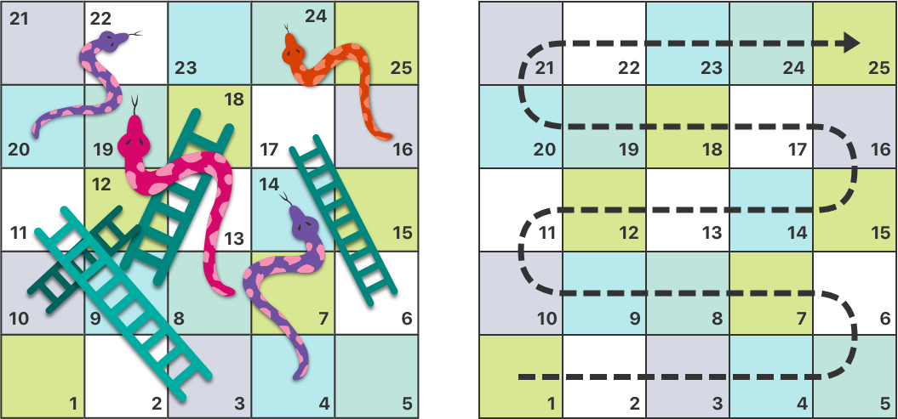
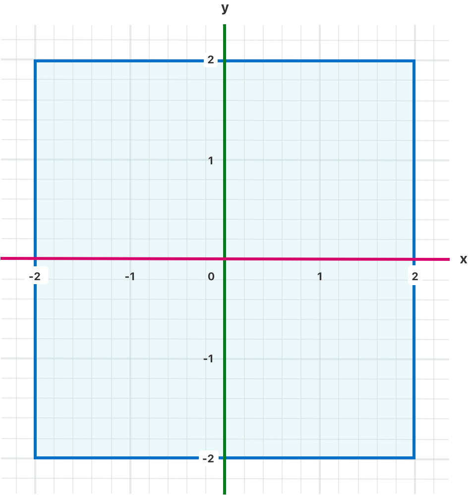
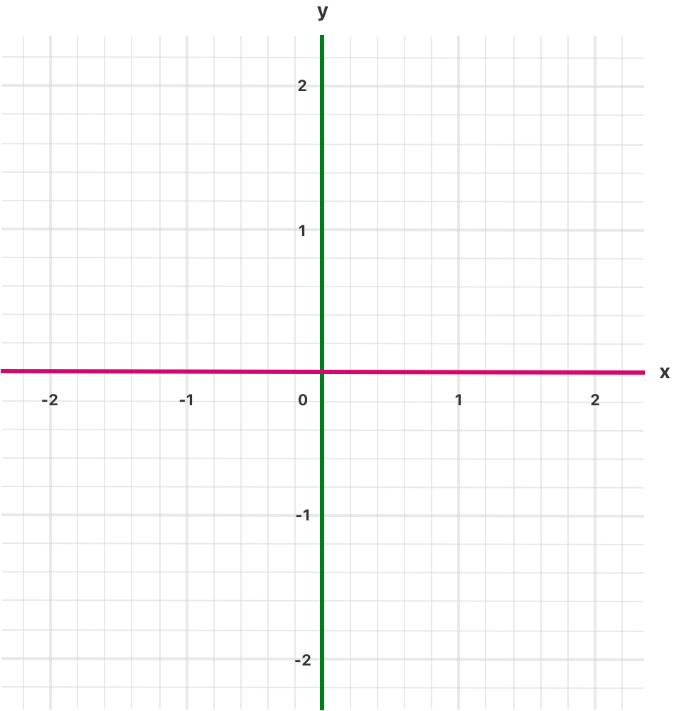
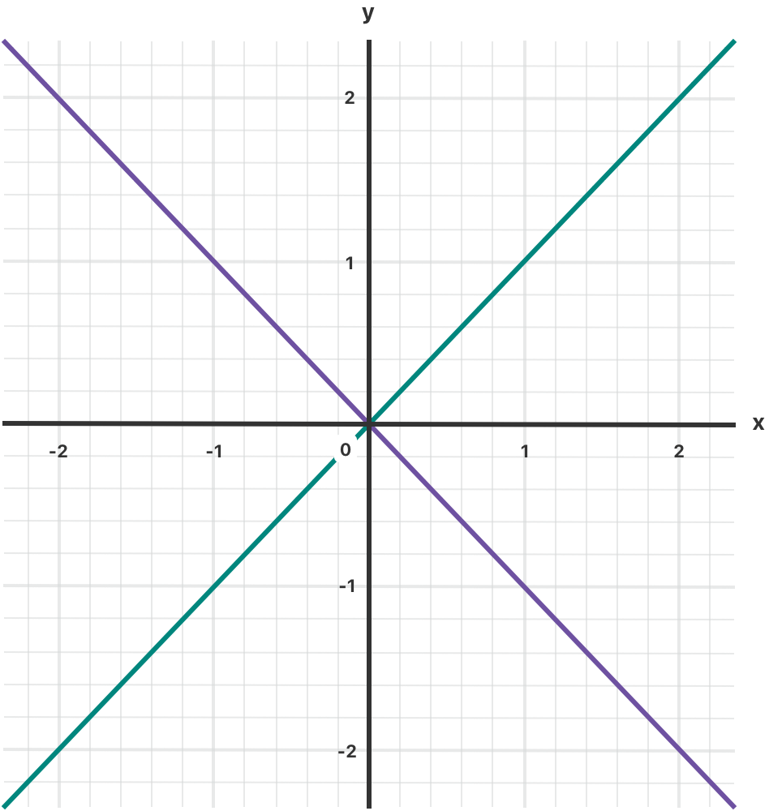

# Control Flow 控制流

> Structure code with branches, loops, and early exits.
> 
> 带有分支、循环和提前退出的结构代码。

原文地址：[https://docs.swift.org/swift-book/documentation/the-swift-programming-language/controlflow](https://docs.swift.org/swift-book/documentation/the-swift-programming-language/controlflow)

Swift provides a variety of control flow statements. These include `while` loops to perform a task multiple times; `if`, `guard`, and `switch` statements to execute different branches of code based on certain conditions; and statements such as `break` and `continue` to transfer the flow of execution to another point in your code. Swift provides a `for-in` loop that makes it easy to iterate over arrays, dictionaries, ranges, strings, and other sequences. Swift also provides `defer` statements, which wrap code to be executed when leaving the current scope.

Swift 提供了多种控制流语句。其中包括用于多次执行某项任务的 `while` 循环；用于根据特定条件执行不同代码分支的 `if`、`guard` 和 `switch` 语句；以及用于将程序执行流程转移到代码中其他位置的 `break`、`continue` 等语句。Swift 中的 `for-in` 循环能轻松遍历数组、字典、区间、字符串及其他序列。此外，Swift 还提供了 `defer` 语句，该语句可包裹一段代码，使其在离开当前作用域时执行。

Swift’s `switch` statement is considerably more powerful than its counterpart in many C-like languages. Cases can match many different patterns, including interval matches, tuples, and casts to a specific type. Matched values in a `switch` case can be bound to temporary constants or variables for use within the case’s body, and complex matching conditions can be expressed with a `where` clause for each case.

Swift 中的 `switch` 语句比许多类 C 语言中的同类语句功能强大得多。它的分支可以匹配多种不同的模式，包括区间匹配、元组匹配以及向特定类型的强制转换（类型强转匹配）。`switch` 分支中匹配到的值，可绑定为临时常量或变量，供该分支的代码块内部使用；并且每个分支都可以通过 `where` 子句来表达复杂的匹配条件。

## 1 For-In Loops - For-In 循环

You use the `for-in` loop to iterate over a sequence, such as items in an array, ranges of numbers, or characters in a string.

你可以使用 `for-in` 循环遍历一个序列，例如数组中的元素、数字区间或字符串中的字符。

This example uses a `for-in` loop to iterate over the items in an array:

以下示例使用 `for-in` 循环遍历数组中的元素：

```
let names = ["Anna", "Alex", "Brian", "Jack"]
for name in names {
    print("Hello, \(name)!")
}
// Hello, Anna!
// Hello, Alex!
// Hello, Brian!
// Hello, Jack!
```

You can also iterate over a dictionary to access its key-value pairs. Each item in the dictionary is returned as a `(key, value)` tuple when the dictionary is iterated, and you can decompose the `(key, value)` tuple’s members as explicitly named constants for use within the body of the `for-in` loop. In the code example below, the dictionary’s keys are decomposed into a constant called `animalName`, and the dictionary’s values are decomposed into a constant called `legCount`.

你也可以使用 `for-in` 循环遍历字典，以访问其键值对。遍历字典时，每个元素会以 `(key, value)` 元组的形式返回；你可以将 `(key, value)` 元组的成员分解为指定名称的常量，供 `for-in` 循环的代码块内部使用。在下面的代码示例中，字典的键被分解为名为 `animalName` 的常量，字典的值被分解为名为 `legCount` 的常量：

```
let numberOfLegs = ["spider": 8, "ant": 6, "cat": 4]
for (animalName, legCount) in numberOfLegs {
    print("\(animalName)s have \(legCount) legs")
}
// cats have 4 legs 
// ants have 6 legs
// spiders have 8 legs
// 猫有4条腿
// 蚂蚁有6条腿
// 蜘蛛有8条腿
```

The contents of a `Dictionary` are inherently unordered, and iterating over them doesn’t guarantee the order in which they will be retrieved. In particular, the order you insert items into a Dictionary doesn’t define the order they’re iterated. For more about arrays and dictionaries, see [Collection Types](https://docs.swift.org/swift-book/documentation/the-swift-programming-language/collectiontypes).

字典的内容本质上是无序的，遍历字典无法保证获取元素的顺序。尤其是，你向字典中插入元素的顺序，并不决定遍历它们的顺序。关于数组和字典的更多内容，请参阅《[集合类型](https://docs.swift.org/swift-book/documentation/the-swift-programming-language/collectiontypes)》。

You can also use `for-in` loops with numeric ranges. This example prints the first few entries in a five-times table:

你还可以使用 `for-in` 循环遍历数字区间。以下示例打印 “5 的乘法表” 的前几项：

```
for index in 1...5 {
    print("\(index) times 5 is \(index * 5)")
}
// 1 times 5 is 5
// 2 times 5 is 10
// 3 times 5 is 15
// 4 times 5 is 20
// 5 times 5 is 25
// 1乘5等于5
// 2乘5等于10
// 3乘5等于15
// 4乘5等于20
// 5乘5等于25
```

The sequence being iterated over is a range of numbers from `1` to `5`, inclusive, as indicated by the use of the closed range operator (`...`). The value of `index` is set to the first number in the range (`1`), and the statements inside the loop are executed. In this case, the loop contains only one statement, which prints an entry from the five-times table for the current value of index. After the statement is executed, the value of index is updated to contain the second value in the range (`2`), and the `print(_:separator:terminator:)` function is called again. This process continues until the end of the range is reached.

这里遍历的序列是 “从 1 到 5 的闭区间”（包含 `1` 和 `5`），由闭区间运算符 `...` 标识。循环开始时，`index` 被赋值为区间的第一个数字（`1`），随后执行循环内部的语句。在这个例子中，循环仅包含一条语句，输出当前 `index` 对应的 5 的乘法表项。语句执行完成后，`index` 更新为区间的下一个数字（`2`），再次调用 `print(_:separator:terminator:)` 函数。这个过程会持续到遍历完区间的最后一个数字。

In the example above, `index` is a constant whose value is automatically set at the start of each iteration of the loop. As such, `index` doesn’t have to be declared before it’s used. It’s implicitly declared simply by its inclusion in the loop declaration, without the need for a `let` declaration keyword.

在上面的示例中，`index` 是一个常量，其值会在每次循环迭代开始时自动设置。因此，`index` 无需在使用前声明。它只需包含在循环声明中即可被隐式声明，不需要使用 `let` 声明关键字。

If you don’t need each value from a sequence, you can ignore the values by using an underscore in place of a variable name.

如果不需要序列中的每个值，可以用下划线代替变量名来忽略这些值。

```
let base = 3
let power = 10
var answer = 1
for _ in 1...power {
    answer *= base
}
print("\(base) to the power of \(power) is \(answer)")
// Prints "3 to the power of 10 is 59049"
// 输出："3 的 10 次方是 59049"
```

The example above calculates the value of one number to the power of another (in this case, `3` to the power of `10`). It multiplies a starting value of `1` (that is, `3` to the power of `0`) by `3`, ten times, using a closed range that starts with `1` and ends with `10`. For this calculation, the individual counter values each time through the loop are unnecessary — the code simply executes the loop the correct number of times. The underscore character (`_`) used in place of a loop variable causes the individual values to be ignored and doesn’t provide access to the current value during each iteration of the loop.

上面的示例计算一个数的另一个数次幂（这里是 `3` 的 `10` 次方）。它使用从 `1` 到 `10` 的闭区间，将初始值 `1`（即 `3` 的 `0` 次方）乘以 `3`，共乘 `10` 次。对于这个计算，循环中每次的计数器具体值并不重要 —— 代码只需执行正确的循环次数即可。用下划线（`_`）代替循环变量会忽略各个具体值，且在每次循环迭代时无法访问当前值。

In some situations, you might not want to use closed ranges, which include both endpoints. Consider drawing the tick marks for every minute on a watch face. You want to draw 60 tick marks, starting with the 0 minute. Use the half-open range operator (`..<`) to include the lower bound but not the upper bound. For more about ranges, see [Range Operators](https://docs.swift.org/swift-book/documentation/the-swift-programming-language/basicoperators#Range-Operators).

在某些情况下，你可能不想使用包含两个端点的闭区间。例如，给表盘上的每分钟绘制刻度线时，需要绘制 60 个刻度，从 0 分钟开始。这时可以使用半开区间运算符（`..<`），它包含下界但不包含上界。有关区间的更多信息，请参见《[区间运算符](https://docs.swift.org/swift-book/documentation/the-swift-programming-language/basicoperators#Range-Operators)》。

```
let minutes = 60
for tickMark in 0..<minutes {
    // render the tick mark each minute (60 times)
    // 每分钟绘制一个刻度线（共 60 次）
}
```

Some users might want fewer tick marks in their UI. They could prefer one mark every `5` minutes instead. Use the `stride(from:to:by:)` function to skip the unwanted marks.

有些用户可能希望界面中的刻度线更少，比如每 `5` 分钟一个刻度。可以使用 `stride(from:to:by:)` 函数跳过不需要的刻度。

```
let minuteInterval = 5
for tickMark in stride(from: 0, to: minutes, by: minuteInterval) {
    // render the tick mark every 5 minutes (0, 5, 10, 15 ... 45, 50, 55)
    // 每 5 分钟绘制一个刻度线（0、5、10、15……45、50、55）
}
```

Closed ranges are also available, by using `stride(from:through:by:)` instead:

也可以使用 `stride(from:through:by:)` 来创建闭区间：

```
let hours = 12
let hourInterval = 3
for tickMark in stride(from: 3, through: hours, by: hourInterval) {
    // render the tick mark every 3 hours (3, 6, 9, 12)
    // 每 3 小时绘制一个刻度线（3、6、9、12）
}
```

The examples above use a `for-in` loop to iterate ranges, arrays, dictionaries, and strings. However, you can use this syntax to iterate any collection, including your own classes and collection types, as long as those types conform to the [Sequence](https://developer.apple.com/documentation/swift/sequence) protocol.

上面的示例使用 `for-in` 循环来遍历区间、数组、字典和字符串。不过，只要遵循 [Sequence](https://developer.apple.com/documentation/swift/sequence) 协议，这种语法也可用于遍历任何集合，包括你自己定义的类和集合类型。

## 2 While Loops - While 循环

A `while` loop performs a set of statements until a condition becomes `false`. These kinds of loops are best used when the number of iterations isn’t known before the first iteration begins. Swift provides two kinds of `while` loops:

`while` 循环会执行一系列语句，直到条件变为 `false` 为止。这种类型的循环最适合在第一次迭代开始前未知迭代次数的场景。Swift 提供了两种 `while` 循环：

- `while` evaluates its condition at the start of each pass through the loop.
- `repeat-while` evaluates its condition at the end of each pass through the loop.

- `while` 在每次循环迭代开始时评估其条件。
- `repeat-while` 在每次循环迭代结束时评估其条件。

### 2.1 While

A `while` loop starts by evaluating a single condition. If the condition is `true`, a set of statements is repeated until the condition becomes `false`.

`while` 循环首先评估单个条件。如果条件为 `true`，则重复执行一系列语句，直到条件变为 `false`。

Here’s the general form of a `while` loop:

`while` 循环的一般形式如下：

```
while <#condition#> {
   <#statements#>
}
```

This example plays a simple game of Snakes and Ladders (also known as Chutes and Ladders):

下面的示例演示了一个简单的 “蛇梯棋”（也称为 “滑梯与梯子”）游戏：



The rules of the game are as follows:

- The board has 25 squares, and the aim is to land on or beyond square 25.
- The player’s starting square is “square zero”, which is just off the bottom-left corner of the board.
- Each turn, you roll a six-sided dice and move by that number of squares, following the horizontal path indicated by the dotted arrow above.
- If your turn ends at the bottom of a ladder, you move up that ladder.
- If your turn ends at the head of a snake, you move down that snake.

游戏规则如下：

- 棋盘有 25 个方格，目标是落在第 25 个方格上或超过它。
- 玩家的起始位置是 “第 0 格”，位于棋盘左下角外侧。
- 每一轮，玩家掷一个六面骰子，并按照上方虚线箭头指示的水平路径移动相应的方格数。
- 如果回合结束时落在梯子底部，则沿梯子上移。
- 如果回合结束时落在蛇头，则沿蛇下移。

The game board is represented by an array of `Int` values. Its size is based on a constant called `finalSquare`, which is used to initialize the array and also to check for a win condition later in the example. Because the players start off the board, on “square zero”, the board is initialized with 26 zero Int values, not 25.

棋盘由一个 `Int` 类型的数组表示。其大小取决于一个名为 `finalSquare` 的常量，该常量用于初始化数组，稍后也用于检查获胜条件。由于玩家从棋盘外的 “第 0 格” 开始，因此数组初始化时包含 26 个 0（而非 25 个）。

```
let finalSquare = 25
var board = [Int](repeating: 0, count: finalSquare + 1)
```

Some squares are then set to have more specific values for the snakes and ladders. Squares with a ladder base have a positive number to move you up the board, whereas squares with a snake head have a negative number to move you back down the board.

然后为一些方格设置特定值以表示蛇和梯子。梯子底部所在的方格用正数表示上移的方格数，而蛇头所在的方格用负数表示下移的方格数。

```
board[03] = +08; board[06] = +11; board[09] = +09; board[10] = +02
board[14] = -10; board[19] = -11; board[22] = -02; board[24] = -08
```

Square 3 contains the bottom of a ladder that moves you up to square 11. To represent this, `board[03]` is equal to `+08`, which is equivalent to an integer value of `8` (the difference between `3` and `11`). To align the values and statements, the unary plus operator (`+i`) is explicitly used with the unary minus operator (`-i`) and numbers lower than `10` are padded with zeros. (Neither stylistic technique is strictly necessary, but they lead to neater code.)

第 3 格是一个梯子的底部，可将玩家移至第 11 格。为表示这一点，`board[03]` 被设为 `+08`，相当于整数 `8`（即 `3` 到 `11` 的差值）。为了使数值和语句对齐，对正数显式使用了一元加号运算符（`+i`），与一元减号运算符（`-i`）对应，且小于 `10` 的数字前补了 `0`。（这两种风格技巧并非必需，但能让代码更整洁。）

```
var square = 0
var diceRoll = 0
while square < finalSquare {
    // roll the dice
    // 掷骰子
    diceRoll += 1
    if diceRoll == 7 { diceRoll = 1 }
    // move by the rolled amount
    // 按掷出的点数移动
    square += diceRoll
    if square < board.count {
        // if we're still on the board, move up or down for a snake or a ladder
        // 如果仍在棋盘上，根据蛇或梯子上下移动
        square += board[square]
    }
}
print("Game over!")
```

The example above uses a very simple approach to dice rolling. Instead of generating a random number, it starts with a `diceRoll` value of `0`. Each time through the `while` loop, diceRoll is incremented by one and is then checked to see whether it has become too large. Whenever this return value equals `7`, the dice roll has become too large and is reset to a value of `1`. The result is a sequence of `diceRoll` values that’s always `1`, `2`, `3`, `4`, `5`, `6`, `1`, `2` and so on.

上面的示例使用了一种非常简单的掷骰子方式。它没有生成随机数，而是从 `diceRoll` 为 `0` 开始。每次进入 `while` 循环时，`diceRoll` 加 `1`，然后检查是否过大。当 `diceRoll` 等于 `7` 时，说明掷出的点数过大，重置为 `1`。结果是 `diceRoll` 的值序列始终为 `1`、`2`、`3`、`4`、`5`、`6`、`1`、`2`，依此类推。

After rolling the dice, the player moves forward by `diceRoll` squares. It’s possible that the dice roll may have moved the player beyond square 25, in which case the game is over. To cope with this scenario, the code checks that `square` is less than the `board` array’s `count` property. If `square` is valid, the value stored in `board[square]` is added to the current square value to move the player up or down any ladders or snakes.

掷完骰子后，玩家向前移动 `diceRoll` 个方格。有可能骰子的点数使玩家超过了第 25 格，这种情况下游戏结束。为应对这种情况，代码会检查 `square` 是否小于 `board` 数组的 `count` 属性。如果 `square` 有效，则将 `board[square]` 中存储的值加到当前 `square` 上，使玩家沿梯子上移或沿蛇下移。

> **Note**
>
> If this check isn’t performed, `board[square]` might try to access a value outside the bounds of the `board` array, which would trigger a runtime error.
> 
> 注意：如果不执行此检查，`board[square]` 可能会尝试访问 `board` 数组边界外的值，从而触发运行时错误。

The current `while` loop execution then ends, and the loop’s condition is checked to see if the loop should be executed again. If the player has moved on or beyond square number `25`, the loop’s condition evaluates to `false` and the game ends.

随后当前 `while` 循环执行结束，并检查循环条件以确定是否应再次执行循环。如果玩家已移动到第 25 格或超过它，循环条件的评估结果为 `false`，游戏结束。

A `while` loop is appropriate in this case, because the length of the game isn’t clear at the start of the `while` loop. Instead, the loop is executed until a particular condition is satisfied.

在这种情况下使用 `while` 循环是合适的，因为游戏的时长在 `while` 循环开始时并不明确。相反，循环会一直执行，直到满足特定条件。

### 2.2 Repeat-While

The other variation of the `while` loop, known as the `repeat-while` loop, performs a single pass through the loop block first, before considering the loop’s condition. It then continues to repeat the loop until the condition is `false`.

`while` 循环的另一种变体是 `repeat-while` 循环，它先执行一次循环块，然后再考虑循环条件。之后继续重复循环，直到条件为 `false`。

> **Note**
>
> The `repeat-while` loop in Swift is analogous to a `do-while` loop in other languages.
> 
> 注意：Swift 中的 `repeat-while` 循环类似于其他语言中的 `do-while` 循环。

Here’s the general form of a `repeat-while` loop:

`repeat-while` 循环的一般形式如下：

```
repeat {
   <#statements#>
} while <#condition#>
```

Here’s the Snakes and Ladders example again, written as a `repeat-while` loop rather than a `while` loop. The values of `finalSquare`, `board`, `square`, and `diceRoll` are initialized in exactly the same way as with a `while` loop.

下面再次给出 “蛇梯棋” 示例，这次使用 `repeat-while` 循环而非 `while` 循环。`finalSquare`、`board`、`square` 和 `diceRoll` 的初始化方式与 `while` 循环版本完全相同。

```
let finalSquare = 25
var board = [Int](repeating: 0, count: finalSquare + 1)
board[03] = +08; board[06] = +11; board[09] = +09; board[10] = +02
board[14] = -10; board[19] = -11; board[22] = -02; board[24] = -08
var square = 0
var diceRoll = 0
```

In this version of the game, the first action in the loop is to check for a ladder or a snake. No ladder on the board takes the player straight to square 25, and so it isn’t possible to win the game by moving up a ladder. Therefore, it’s safe to check for a snake or a ladder as the first action in the loop.

在这个版本的游戏中，循环中的第一个操作是检查梯子或蛇。棋盘上没有能让玩家直接到达第 25 格的梯子，因此不可能通过上移梯子获胜。因此，在循环中首先检查蛇或梯子是安全的。

At the start of the game, the player is on “square zero”. `board[0]` always equals `0` and has no effect.

游戏开始时，玩家在 “第 0 格”。`board[0]` 始终为 `0`，没有任何影响。

```
repeat {
    // move up or down for a snake or ladder
    // 根据蛇或梯子上下移动
    square += board[square]
    // roll the dice
    // 掷骰子
    diceRoll += 1
    if diceRoll == 7 { diceRoll = 1 }
    // move by the rolled amount
    // 按掷出的点数移动
    square += diceRoll
} while square < finalSquare
print("Game over!")
```

After the code checks for snakes and ladders, the dice is rolled and the player is moved forward by `diceRoll` squares. The current loop execution then ends.

代码检查完蛇和梯子后，掷骰子并让玩家向前移动 `diceRoll` 个方格。随后当前循环执行结束。

The loop’s condition (`while square < finalSquare`) is the same as before, but this time it’s not evaluated until the end of the first run through the loop. The structure of the `repeat-while` loop is better suited to this game than the `while` loop in the previous example. In the `repeat-while` loop above, `square += board[square]` is always executed _immediately_ after the loop’s while condition confirms that `square` is still on the board. This behavior removes the need for the array bounds check seen in the `while` loop version of the game described earlier.

循环条件（`while square <finalSquare`）与之前相同，但这次直到第一次循环执行完毕后才会评估。`repeat-while` 循环的结构比前例中的 `while` 循环更适合这个游戏。在上面的 `repeat-while` 循环中，`square += board[square]` 总是在循环的 `while` 条件确认 `square` 仍在棋盘上之后 _立即_ 执行。这种行为消除了前文中 `while` 循环版本中对数组边界检查的需求。

## 3 Conditional Statements 条件语句

It’s often useful to execute different pieces of code based on certain conditions. You might want to run an extra piece of code when an error occurs, or to display a message when a value becomes too high or too low. To do this, you make parts of your code conditional.

在编程中，根据特定条件执行不同的代码块往往非常有用。例如，你可能希望在发生错误时运行一段额外的代码，或者在某个值过高或过低时显示一条提示信息。要实现这一点，你需要让代码的某些部分具备条件执行的特性。

Swift provides two ways to add conditional branches to your code: the `if` statement and the `switch` statement. Typically, you use the `if` statement to evaluate simple conditions with only a few possible outcomes. The `switch` statement is better suited to more complex conditions with multiple possible permutations and is useful in situations where pattern matching can help select an appropriate code branch to execute.

Swift 提供了两种为代码添加条件分支的方式：`if` 语句和 `switch` 语句。通常，`if` 语句适用于评估结果较少的简单条件；而 `switch` 语句更适合处理具有多种可能组合的复杂条件，尤其在可以通过模式匹配来选择合适代码分支执行的场景中表现更佳。

### 3.1 If

In its simplest form, the `if` statement has a single `if` condition. It executes a set of statements only if that condition is `true`.

`if` 语句最基础的形式只包含一个 `if` 条件，只有当该条件为真时，才会执行对应的代码块。

```
var temperatureInFahrenheit = 30
if temperatureInFahrenheit <= 32 {
    print("It's very cold. Consider wearing a scarf.")
}
// Prints "It's very cold. Consider wearing a scarf."
// 输出："天气非常冷。建议戴上围巾。"
```

The example above checks whether the temperature is less than or equal to 32 degrees Fahrenheit (the freezing point of water). If it is, a message is printed. Otherwise, no message is printed, and code execution continues after the if statement’s closing brace.

上述示例检查温度是否小于或等于 32 华氏度（水的冰点）。如果满足条件，就会打印提示信息；否则，不会打印任何信息，代码会在 `if` 语句的闭合大括号后继续执行。

The `if` statement can provide an alternative set of statements, known as an `else` clause, for situations when the `if` condition is `false`. These statements are indicated by the `else` keyword.

`if` 语句可以提供一个备选代码块（称为 `else` 子句），用于处理 `if` 条件为假的情况。这些代码块由 `else` 关键字标识。

```
temperatureInFahrenheit = 40
if temperatureInFahrenheit <= 32 {
    print("It's very cold. Consider wearing a scarf.")
} else {
    print("It's not that cold. Wear a T-shirt.")
}
// Prints "It's not that cold. Wear a T-shirt."
// 输出："没那么冷。穿件 T 恤就可以了。"
```

One of these two branches is always executed. Because the temperature has increased to 40 degrees Fahrenheit, it’s no longer cold enough to advise wearing a scarf and so the `else` branch is triggered instead.

这两个分支中总有一个会被执行。由于温度升高到了 40 华氏度，已经不需要建议戴围巾了，因此会触发 `else` 分支。

You can chain multiple `if` statements together to consider additional clauses.

你可以将多个 `if` 语句链接起来，以处理更多条件分支。

```
temperatureInFahrenheit = 90
if temperatureInFahrenheit <= 32 {
    print("It's very cold. Consider wearing a scarf.")
} else if temperatureInFahrenheit >= 86 {
    print("It's really warm. Don't forget to wear sunscreen.")
} else {
    print("It's not that cold. Wear a T-shirt.")
}
// Prints "It's really warm. Don't forget to wear sunscreen."
// 输出："天气非常热。别忘了涂防晒霜。"
```

Here, an additional `if` statement was added to respond to particularly warm temperatures. The final `else` clause remains, and it prints a response for any temperatures that aren’t too warm or too cold.

这里新增了一个 `if` 语句来响应特别炎热的温度。最后的 `else` 子句依然保留，用于处理既不太热也不太冷的温度情况。

The final `else` clause is optional, however, and can be excluded if the set of conditions doesn’t need to be complete.

不过，最后的 `else` 子句是可选的，如果条件集合不需要覆盖所有情况，可以省略它。

```
temperatureInFahrenheit = 72
if temperatureInFahrenheit <= 32 {
    print("It's very cold. Consider wearing a scarf.")
} else if temperatureInFahrenheit >= 86 {
    print("It's really warm. Don't forget to wear sunscreen.")
}
```

Because the temperature isn’t cold enough to trigger the `if` condition or warm enough to trigger the `else if` condition, no message is printed.

由于温度既不足以触发 `if` 条件，也不足以触发 `else if` 条件，因此不会打印任何信息。

Swift provides a shorthand spelling of if that you can use when setting values. For example, consider the following code:

Swift 提供了一种简写形式的 `if` 语句，可用于赋值场景。例如，考虑以下代码：

```
let temperatureInCelsius = 25
let weatherAdvice: String

if temperatureInCelsius <= 0 {
    weatherAdvice = "It's very cold. Consider wearing a scarf."
} else if temperatureInCelsius >= 30 {
    weatherAdvice = "It's really warm. Don't forget to wear sunscreen."
} else {
    weatherAdvice = "It's not that cold. Wear a T-shirt."
}

print(weatherAdvice)
// Prints "It's not that cold. Wear a T-shirt."
// 输出："没那么冷。穿件 T 恤就可以了。"
```

Here, each of the branches sets a value for the `weatherAdvice` constant, which is printed after the `if` statement.

在这段代码中，每个分支都会为 `weatherAdvice` 常量赋值，赋值完成后在 `if` 语句外打印该常量。

Using the alternate syntax, known as an `if` expression, you can write this code more concisely:

使用替代语法（称为 `if` 表达式）可以更简洁地编写这段代码：

```
let weatherAdvice = if temperatureInCelsius <= 0 {
    "It's very cold. Consider wearing a scarf."
} else if temperatureInCelsius >= 30 {
    "It's really warm. Don't forget to wear sunscreen."
} else {
    "It's not that cold. Wear a T-shirt."
}

print(weatherAdvice)
// Prints "It's not that cold. Wear a T-shirt."
// 输出："没那么冷。穿件 T 恤就可以了。"
```

In this `if` expression version, each branch contains a single value. If a branch’s condition is `true`, then that branch’s value is used as the value for the whole `if` expression in the assignment of `weatherAdvice`. Every `if` branch has a corresponding `else if` branch or `else` branch, ensuring that one of the branches always matches and that the `if` expression always produces a value, regardless of which conditions are `true`.

在这个 `if` 表达式版本中，每个分支只包含一个值。如果某个分支的条件为真，该分支的值就会作为整个 `if` 表达式的值，赋值给 `weatherAdvice`。每个 `if` 分支都有对应的 `else if` 或 `else` 分支，确保无论条件如何，总有一个分支会匹配，且 `if` 表达式总能生成一个值。

Because the syntax for the assignment starts outside the `if` expression, there’s no need to repeat `weatherAdvice =` inside each branch. Instead, each branch of the `if` expression produces one of the three possible values for `weatherAdvice`, and the assignment uses that value.

由于赋值操作的语法写在 `if` 表达式外部，因此无需在每个分支中重复写 `weatherAdvice =`。相反，`if` 表达式的每个分支会生成 `weatherAdvice` 的三个可能值之一，赋值语句直接使用该值即可。

All of the branches of an `if` expression need to contain values of the same type. Because Swift checks the type of each branch separately, values like `nil` that can be used with more than one type prevent Swift from determining the `if` expression’s type automatically. Instead, you need to specify the type explicitly — for example:

`if` 表达式的所有分支必须包含相同类型的值。由于 Swift 会单独检查每个分支的类型，像 `nil` 这种可用于多种类型的值会导致 Swift 无法自动推断 `if` 表达式的类型，此时你需要显式指定类型。例如：

```
let freezeWarning: String? = if temperatureInCelsius <= 0 {
    "It's below freezing. Watch for ice!"
} else {
    nil
}
```

In the code above, one branch of the `if` expression has a string value and the other branch has a `nil` value. The `nil` value could be used as a value for any optional type, so you have to explicitly write that `freezeWarning` is an optional string, as described in [Type Annotations](https://docs.swift.org/swift-book/documentation/the-swift-programming-language/thebasics#Type-Annotations).

在上述代码中，`if` 表达式的一个分支是字符串值，另一个分支是 `nil` 值。`nil` 可作为任意可选类型的值，因此你必须显式声明 `freezeWarning` 是可选字符串类型（相关内容可参考《[类型注解](https://docs.swift.org/swift-book/documentation/the-swift-programming-language/thebasics#Type-Annotations)》）。

An alternate way to provide this type information is to provide an explicit type for `nil`, instead of providing an explicit type for `freezeWarning`:

另一种提供类型信息的方式是为 `nil` 指定显式类型，而非为 `freezeWarning` 指定：

```
let freezeWarning = if temperatureInCelsius <= 0 {
    "It's below freezing. Watch for ice!"
} else {
    nil as String?
}
```

An `if` expression can respond to unexpected failures by throwing an error or calling a function like `fatalError(_:file:line:)` that never returns. For example:

`if` 表达式可以通过抛出错误或调用 `fatalError(_:file:line:)` 这类永不返回的函数来处理意外失败。例如：

```
let weatherAdvice = if temperatureInCelsius > 100 {
    throw TemperatureError.boiling
} else {
    "It's a reasonable temperature."
}
```

In this example, the `if` expression checks whether the forecast temperature is hotter than 100° C — the boiling point of water. A temperature this hot causes the `if` expression to throw a `.boiling` error instead of returning a textual summary. Even though this `if` expression can throw an error, you don’t write `try` before it. For information about working with errors, see [Error Handling](https://docs.swift.org/swift-book/documentation/the-swift-programming-language/errorhandling).

在这个示例中，`if` 表达式检查预测温度是否超过 100 摄氏度（水的沸点）。如果温度达到该值，`if` 表达式会抛出 `.boiling` 错误，而非返回文本描述。即便该 `if` 表达式可能抛出错误，你也无需在它前面写 `try`。有关错误处理的更多信息，请参考《[错误处理](https://docs.swift.org/swift-book/documentation/the-swift-programming-language/errorhandling)》章节。

In addition to using `if` expressions on the right-hand side of an assignment, as shown in the examples above, you can also use them as the value that a function or closure returns.

除了像上述示例中那样，在赋值语句的右侧使用 `if` 表达式外，你还可以将其用作函数或闭包的返回值。

### 3.2 Switch

A `switch` statement considers a value and compares it against several possible matching patterns. It then executes an appropriate block of code, based on the first pattern that matches successfully. A `switch` statement provides an alternative to the `if` statement for responding to multiple potential states.

`switch` 语句会判断一个值，并将其与多个可能的匹配模式进行比较。随后，它会根据第一个匹配成功的模式，执行相应的代码块。对于需要响应多种潜在状态的场景，`switch` 语句是 `if` 语句的一种替代方案。

In its simplest form, a `switch` statement compares a value against one or more values of the same type.

在最简单的形式下，`switch` 语句会将一个值与一个或多个同类型的值进行比较。

```
switch <#some value to consider#> {
case <#value 1#>:
    <#respond to value 1#>
case <#value 2#>,
    <#value 3#>:
    <#respond to value 2 or 3#>
default:
    <#otherwise, do something else#>
}
```

```
switch <#需要判断的值#> {
case <#值 1#>:
    <#响应值 1 的逻辑#>
case <#值 2#>,
    <#值 3#>:
    <#响应值 2 或值 3 的逻辑#>
default:
    <#其他情况的处理逻辑#>
}
```

Every `switch` statement consists of multiple possible _cases_, each of which begins with the `case` keyword. In addition to comparing against specific values, Swift provides several ways for each case to specify more complex matching patterns. These options are described later in this chapter.

每个 switch 语句都包含多个可能的 _分支_ ，每个分支均以 `case` 关键字开头。除了与具体值进行比较外，Swift 还为每个分支提供了多种方式来指定更复杂的匹配模式。这些用法会在本章后续内容中介绍。

Like the body of an `if` statement, each `case` is a separate branch of code execution. The `switch` statement determines which branch should be selected. This procedure is known as switching on the value that’s being considered.

与 `if` 语句的执行体类似，每个 `case` 都是代码执行的一个独立分支。switch 语句会确定应选择哪个分支执行，这个过程被称为 “对所判断的值进行匹配分支（switching on）”。

Every `switch` statement must be `exhaustive`. That is, every possible value of the type being considered must be matched by one of the `switch` cases. If it’s not appropriate to provide a case for every possible value, you can define a default case to cover any values that aren’t addressed explicitly. This default case is indicated by the `default` keyword, and must always appear last.

每个 `switch` 语句都必须是 _穷尽的_。也就是说，被匹配类型的每一个可能值都必须能被某个 `switch` 分支匹配到。如果不适宜为每一个可能值都提供对应的分支，你可以定义一个默认分支来涵盖所有未被显式处理的值。这个默认分支由 `default` 关键字标识，且必须始终出现在最后。

This example uses a `switch` statement to consider a single lowercase character called `someCharacter`:

以下示例使用 `switch` 语句匹配一个名为 `someCharacter` 的小写字符：

```
let someCharacter: Character = "z"
switch someCharacter {
case "a":
    print("The first letter of the Latin alphabet")
case "z":
    print("The last letter of the Latin alphabet")
default:
    print("Some other character")
}
// Prints "The last letter of the Latin alphabet".
// 打印输出："拉丁字母表的最后一个字母"。
```

The `switch` statement’s first case matches the first letter of the English alphabet, `a`, and its second case matches the last letter, `z`. Because the `switch` must have a case for every possible character, not just every alphabetic character, this switch statement uses a default case to match all characters other than `a` and `z`. This provision ensures that the `switch` statement is exhaustive.

该 `switch` 语句的第一个分支匹配英语字母表的第一个字母 `a`，第二个分支匹配最后一个字母 `z`。由于 `switch` 必须匹配所有可能的字符，而非仅字母字符，因此这个 switch 语句通过默认分支来匹配除 `a` 和 `z` 之外的所有字符。这一设置确保了 `switch` 语句的穷尽性。

Like `if` statements, `switch` statements also have an expression form:

与 `if` 语句类似，`switch` 语句也有表达式形式：

```
let anotherCharacter: Character = "a"
let message = switch anotherCharacter {
case "a":
    "The first letter of the Latin alphabet"
case "z":
    "The last letter of the Latin alphabet"
default:
    "Some other character"
}


print(message)
// Prints "The first letter of the Latin alphabet".
// 打印输出："拉丁字母表的第一个字母"。
```

In this example, each case in the `switch` expression contains the value for `message` to be used when that case matches `anotherCharacter`. Because `switch` is always exhaustive, there is always a value to assign.

在这个示例中，`switch` 表达式的每个分支都包含了 `message` 变量在该分支匹配 `anotherCharacter` 时要使用的值。由于 `switch` 始终是穷尽的，因此总能为 `message` 分配到一个值。

As with `if` expressions, you can throw an error or call a function like `fatalError(_:file:line:)` that never returns instead of providing a value for a given case. You can use `switch` expressions on the right-hand side of an assignment, as shown in the example above, and as the value that a function or closure returns.

和 `if` 表达式一样，对于某个分支，你也可以抛出错误或调用 `fatalError(_:file:line:)` 这类不会返回的函数，而非为该分支提供具体值。你可以像上面的示例那样，将 `switch` 表达式用在赋值语句的右侧，也可以用它作为函数或闭包的返回值。

#### 3.2.1 No Implicit Fallthrough 无隐式贯穿

In contrast with `switch` statements in C and Objective-C, `switch` statements in Swift don’t fall through the bottom of each case and into the next one by default. Instead, the entire `switch` statement finishes its execution as soon as the first matching `switch` case is completed, without requiring an explicit `break` statement. This makes the `switch` statement safer and easier to use than the one in C and avoids executing more than one `switch` case by mistake.

与 C 和 Objective-C 中的 `switch` 语句不同，Swift 中的 `switch` 语句默认不会在每个分支结束后贯穿到下一个分支。相反，一旦第一个匹配的 `switch` 分支执行完毕，整个 `switch` 语句就会结束执行，无需显式的 `break` 语句。这使得 Swift 的 `switch` 语句比 C 语言的更安全、更易用，避免了误执行多个 `switch` 分支的情况。

> **Note** **注意**
>
> Although `break` isn’t required in Swift, you can use a `break` statement to match and ignore a particular case or to break out of a matched case before that case has completed its execution. For details, see [Break in a Switch Statement](https://docs.swift.org/swift-book/documentation/the-swift-programming-language/controlflow#Break-in-a-Switch-Statement).
> 
> 尽管 Swift 中不需要 `break`，但你仍可使用 `break` 语句来匹配并忽略某个特定分支，或在匹配分支执行完毕前跳出该分支。详情请参见《[Switch 语句中的 Break](https://docs.swift.org/swift-book/documentation/the-swift-programming-language/controlflow#Break-in-a-Switch-Statement)》。

The body of each case _must_ contain at least one executable statement. It isn’t valid to write the following code, because the first case is empty:

每个 case 分支的执行体 _必须_ 包含至少一条可执行语句。编写以下代码是无效的，因为第一个分支为空：

```
let anotherCharacter: Character = "a"
switch anotherCharacter {
case "a": // Invalid, the case has an empty body 无效，该 case 分支的执行体为空
case "A":
    print("The letter A")
default:
    print("Not the letter A")
}
// This will report a compile-time error.
// 这会报编译时错误。
```

Unlike a `switch` statement in C, this `switch` statement doesn’t match both `"a"` and `"A"`. Rather, it reports a compile-time error that `case "a"`: doesn’t contain any executable statements. This approach avoids accidental fallthrough from one case to another and makes for safer code that’s clearer in its intent.

与 C 语言中的 `switch` 语句不同，这个 `switch` 语句不会同时匹配 `"a"` 和 `"A"`。相反，它会报编译时错误，提示 `case "a"`: 未包含任何可执行语句。这种设计可以避免从一个分支意外 “贯穿” 到另一个分支，让代码的意图更清晰，安全性也更高。

To make a `switch` with a single case that matches both `"a"` and `"A"`, combine the two values into a compound case, separating the values with commas.

若要编写一个能同时匹配 `"a"` 和 `"A"` 的单个 case 分支，可将这两个值合并为一个复合分支，并用逗号分隔多个值：

```
let anotherCharacter: Character = "a"
switch anotherCharacter {
case "a", "A":
    print("The letter A")
default:
    print("Not the letter A")
}
// Prints "The letter A".
// 输出 "字母 A"。
```

For readability, a compound case can also be written over multiple lines. For more information about compound cases, see [Compound Cases](https://docs.swift.org/swift-book/documentation/the-swift-programming-language/controlflow#Compound-Cases).

为了提升可读性，复合分支也可以分多行书写。有关复合分支的更多信息，请参见《[复合分支](https://docs.swift.org/swift-book/documentation/the-swift-programming-language/controlflow#Compound-Cases)》章节。

> **Note** **注意**
>
> To explicitly fall through at the end of a particular `switch` case, use the `fallthrough` keyword, as described in [Fallthrough](https://docs.swift.org/swift-book/documentation/the-swift-programming-language/controlflow#Fallthrough).
> 
> 如需在某个 `switch` 分支的末尾显式执行 “贯穿” 操作，请使用 `fallthrough` 关键字，具体说明参见《[贯穿](https://docs.swift.org/swift-book/documentation/the-swift-programming-language/controlflow#Fallthrough)》章节。

#### 3.2.2 Interval Matching 区间匹配

Values in `switch` cases can be checked for their inclusion in an interval. This example uses number intervals to provide a natural-language count for numbers of any size:

`switch` 语句的分支中，可检查值是否包含在某个区间内。以下示例利用数值区间，为任意大小的数字提供符合自然语言习惯的数量描述：

```
let approximateCount = 62
let countedThings = "moons orbiting Saturn"
let naturalCount: String
switch approximateCount {
case 0:
    naturalCount = "no"
case 1..<5:
    naturalCount = "a few"
case 5..<12:
    naturalCount = "several"
case 12..<100:
    naturalCount = "dozens of"
case 100..<1000:
    naturalCount = "hundreds of"
default:
    naturalCount = "many"
}
print("There are \(naturalCount) \(countedThings).")
// Prints "There are dozens of moons orbiting Saturn."
// 输出 "土星的卫星有几十个。”"
```

In the above example, `approximateCount` is evaluated in a `switch` statement. Each case compares that value to a number or interval. Because the value of `approximateCount` falls between 12 and 100, `naturalCount` is assigned the value `"dozens of"`, and execution is transferred out of the `switch` statement.

在上述示例中，`approximateCount` 的值会在 `switch` 语句中进行匹配判断。每个分支都会将该值与某个数字或区间做比较。由于 `approximateCount` 的值落在 12 到 100 之间，`naturalCount` 被赋值为 `"dozens of"`（中文对应 “几十”），随后程序执行流程跳出 `switch` 语句。

#### 3.2.3 Tuples 元组

You can use tuples to test multiple values in the same `switch` statement. Each element of the tuple can be tested against a different value or interval of values. Alternatively, use the underscore character (`_`), also known as the wildcard pattern, to match any possible value.

你可以在同一个 `switch` 语句中使用元组来匹配多个值。元组中的每个元素可以分别与不同的值或值区间进行匹配。此外，你还可以使用下划线字符（`_`，也称为通配符模式）来匹配任意可能的值。

The example below takes an (x, y) point, expressed as a simple tuple of type (Int, Int), and categorizes it on the graph that follows the example.

以下示例接收一个 `(x, y)` 坐标点（以 `(Int, Int)` 类型的简单元组表示），并根据该点在坐标系中的位置对其进行分类：

```
let somePoint = (1, 1)
switch somePoint {
case (0, 0):
    print("\(somePoint) is at the origin")
case (_, 0):
    print("\(somePoint) is on the x-axis")
case (0, _):
    print("\(somePoint) is on the y-axis")
case (-2...2, -2...2):
    print("\(somePoint) is inside the box")
default:
    print("\(somePoint) is outside of the box")
}
// Prints "(1, 1) is inside the box".
// 输出："(1, 1) 在方框内部"。
```



The `switch` statement determines whether the point is at the origin `(0, 0)`, on the red x-axis, on the green y-axis, inside the blue 4-by-4 box centered on the origin, or outside of the box.

这个 `switch` 语句会依次判断该坐标点是否位于原点 `(0, 0)`、红色的 x 轴上、绿色的 y 轴上、以原点为中心的 4×4 蓝色方框内，或是在方框外部。

Unlike C, Swift allows multiple `switch` cases to consider the same value or values. In fact, the point `(0, 0)` could match all four of the cases in this example. However, if multiple matches are possible, the first matching case is always used. The point `(0, 0)` would match `case (0, 0)` first, and so all other matching cases would be ignored.

与 C 语言不同，Swift 允许多个 `switch` 分支匹配同一个（或同一组）值。事实上，坐标点 `(0, 0)` 本可以匹配这个示例中的全部四个分支。但如果存在多个匹配可能，程序始终只会执行第一个匹配成功的分支。因此 `(0, 0)` 会优先匹配 `case (0, 0)`，其余所有可匹配的分支都会被忽略。

#### 3.2.4 Value Bindings 值绑定

A `switch` case can name the value or values it matches to temporary constants or variables, for use in the body of the case. This behavior is known as _value binding_, because the values are bound to temporary constants or variables within the case’s body.

`switch` 分支可以将其匹配到的一个或多个值命名为临时常量或变量，以便在该分支的执行体中使用。这种行为被称为 _值绑定_ ，因为这些值会被绑定到该分支执行体内的临时常量或变量上。

The example below takes an `(x, y)` point, expressed as a tuple of type `(Int, Int)`, and categorizes it on the graph that follows:

以下示例接收一个以 `(Int, Int)` 类型元组表示的 `(x, y)` 坐标点，并根据其在坐标系中的位置进行分类：

```
let anotherPoint = (2, 0)
switch anotherPoint {
case (let x, 0):
    print("on the x-axis with an x value of \(x)")
case (0, let y):
    print("on the y-axis with a y value of \(y)")
case let (x, y):
    print("somewhere else at (\(x), \(y))")
}
// Prints "on the x-axis with an x value of 2".
// 输出："在 x 轴上，x 值为 2"。
```



The `switch` statement determines whether the point is on the red x-axis, on the green y-axis, or elsewhere (on neither axis).

这个 `switch` 语句会判断该坐标点是位于红色的 x 轴上、绿色的 y 轴上，还是位于其他位置（既不在 x 轴也不在 y 轴上）。

The three switch cases declare placeholder constants `x` and `y`, which temporarily take on one or both tuple values from `anotherPoint`. The first case, `case (let x, 0)`, matches any point with a `y` value of `0` and assigns the point’s `x` value to the temporary constant `x`. Similarly, the second case, `case (0, let y)`, matches any point with an `x` value of `0` and assigns the point’s `y` value to the temporary constant `y`.

三个 `switch` 分支分别声明了占位常量 `x` 和 `y`，这些常量会临时接收 `anotherPoint` 元组中的一个或两个值。第一个分支 `case (let x, 0)` 匹配所有 `y` 值为 `0` 的坐标点，并将该点的 `x` 值赋值给临时常量 `x`；类似的，第二个分支 `case (0, let y)` 匹配所有 `x` 值为 `0` 的坐标点，并将该点的 `y` 值赋值给临时常量 `y`。

After the temporary constants are declared, they can be used within the case’s code block. Here, they’re used to print the categorization of the point.

临时常量声明完成后，即可在分支的代码块中使用。本示例中，这些常量被用于打印坐标点的分类信息。

This `switch` statement doesn’t have a default case. The final case, `case let (x, y)`, declares a tuple of two placeholder constants that can match any value. Because `anotherPoint` is always a tuple of two values, this case matches all possible remaining values, and a default case isn’t needed to make the `switch` statement exhaustive.

该 `switch` 语句没有 `default` 分支。最后一个分支 `case let (x, y)` 声明了一个包含两个占位常量的元组，能够匹配任意值。由于 `anotherPoint` 始终是一个包含两个值的元组，这个分支会匹配所有剩余的可能值，因此无需通过 `default` 分支就能让 `switch` 语句满足 “穷尽性” 要求。

#### 3.2.5 Where 

A `switch` case can use a `where` clause to check for additional conditions.

`switch` 分支可以使用 `where` 子句来检查额外的条件。

The example below categorizes an `(x, y)` point on the following graph:

以下示例根据坐标系位置，对一个 (x, y) 坐标点进行分类：

```
let yetAnotherPoint = (1, -1)
switch yetAnotherPoint {
case let (x, y) where x == y:
    print("(\(x), \(y)) is on the line x == y")
case let (x, y) where x == -y:
    print("(\(x), \(y)) is on the line x == -y")
case let (x, y):
    print("(\(x), \(y)) is just some arbitrary point")
}
// Prints "(1, -1) is on the line x == -y".
```



The `switch` statement determines whether the point is on the green diagonal line where `x == y`, on the purple diagonal line where `x == -y`, or neither.

该 `switch` 语句会判断该坐标点是位于绿色的对角线 `x == y` 上、紫色的对角线 `x == -y` 上，还是两者都不是。

The three `switch` cases declare placeholder constants `x` and `y`, which temporarily take on the two tuple values from `yetAnotherPoint`. These constants are used as part of a `where` clause, to create a dynamic filter. The `switch` case matches the current value of point only if the `where` clause’s condition evaluates to `true` for that value.

三个 `switch` 分支都声明了占位常量 `x` 和 `y`，它们会临时接收 `yetAnotherPoint` 元组中的两个值。这些常量被用于 `where` 子句中，以创建一个动态过滤条件。只有当该值使 `where` 子句的条件判断结果为 `true` 时，这个 `switch` 分支才会匹配当前的坐标点。

As in the previous example, the final case matches all possible remaining values, and so a default case isn’t needed to make the `switch` statement exhaustive.

与前一个示例相同，最后一个分支会匹配所有剩余的可能值，因此无需 `default` 分支，即可保证该 `switch` 语句的穷尽性。

Compound Cases
Multiple switch cases that share the same body can be combined by writing several patterns after case, with a comma between each of the patterns. If any of the patterns match, then the case is considered to match. The patterns can be written over multiple lines if the list is long. For example:

let someCharacter: Character = "e"
switch someCharacter {
case "a", "e", "i", "o", "u":
    print("\(someCharacter) is a vowel")
case "b", "c", "d", "f", "g", "h", "j", "k", "l", "m",
    "n", "p", "q", "r", "s", "t", "v", "w", "x", "y", "z":
    print("\(someCharacter) is a consonant")
default:
    print("\(someCharacter) isn't a vowel or a consonant")
}
// Prints "e is a vowel".
The switch statement’s first case matches all five lowercase vowels in the English language. Similarly, its second case matches all lowercase English consonants. Finally, the default case matches any other character.

Compound cases can also include value bindings. All of the patterns of a compound case have to include the same set of value bindings, and each binding has to get a value of the same type from all of the patterns in the compound case. This ensures that, no matter which part of the compound case matched, the code in the body of the case can always access a value for the bindings and that the value always has the same type.

let stillAnotherPoint = (9, 0)
switch stillAnotherPoint {
case (let distance, 0), (0, let distance):
    print("On an axis, \(distance) from the origin")
default:
    print("Not on an axis")
}
// Prints "On an axis, 9 from the origin".
The case above has two patterns: (let distance, 0) matches points on the x-axis and (0, let distance) matches points on the y-axis. Both patterns include a binding for distance and distance is an integer in both patterns — which means that the code in the body of the case can always access a value for distance.

